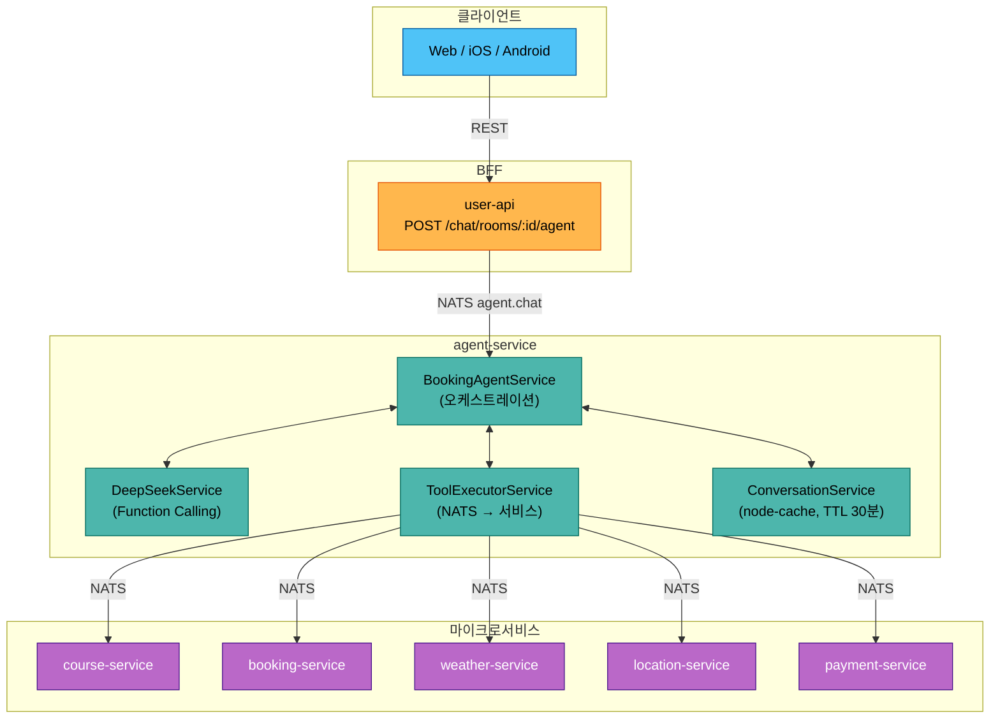
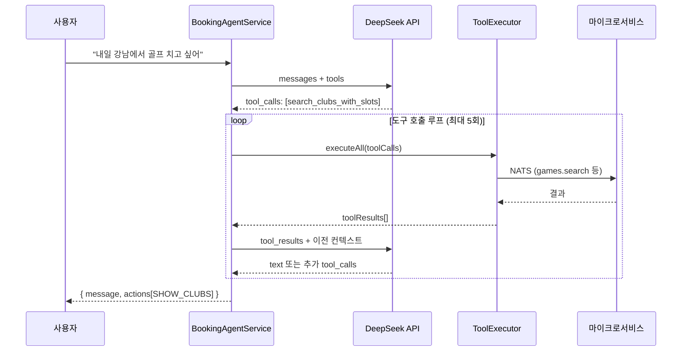
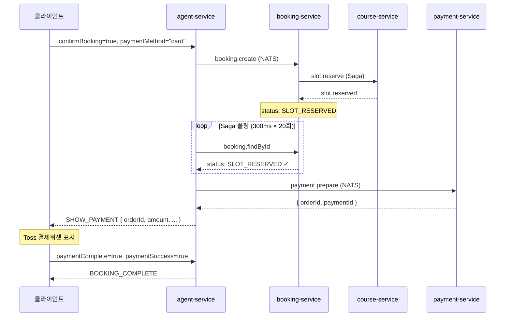
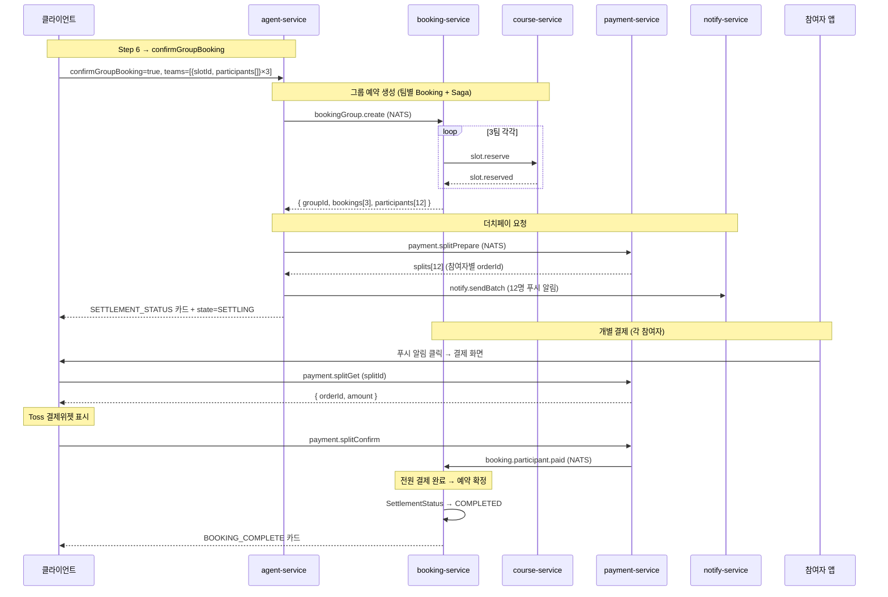

# AI 예약 에이전트 워크플로우

## 1. 개요

사용자가 자연어로 골프장 검색 → 슬롯 선택 → 예약 → 결제까지 진행할 수 있는 AI 어시스턴트.

**핵심 설계**: Direct Handling + LLM 하이브리드

| 경로 | 설명 | 지연시간 |
|------|------|---------|
| **Direct** | UI 카드 클릭 → LLM 없이 즉시 처리 | ~100ms |
| **LLM** | 자연어 입력 → DeepSeek Function Calling | 2~5s |

```
사용자 입력
  ├─ UI 카드 클릭? → Direct Handler (5종) → 즉시 응답
  └─ 자연어 텍스트? → DeepSeek → Tool 실행 → 응답
```

---

## 2. 아키텍처



---

## 3. 대화 상태 머신

```
IDLE → COLLECTING → CONFIRMING → BOOKING → COMPLETED
                        ↓                      ↑
                    CANCELLED ─────────→ COLLECTING
```

| 상태 | 의미 | 전이 조건 |
|------|------|----------|
| IDLE | 초기 상태 | 첫 메시지 수신 → COLLECTING |
| COLLECTING | 정보 수집 중 (골프장 검색, 카드 표시) | 슬롯 표시 → CONFIRMING |
| CONFIRMING | 예약 확인 대기 (슬롯 선택, 확인 카드) | 확인 클릭 → BOOKING |
| BOOKING | 예약 처리 중 (Saga 진행) | 성공 → COMPLETED |
| COMPLETED | 예약 완료 | 종료 |
| CANCELLED | 사용자 취소 | 자동 → COLLECTING |

---

## 4. Direct Handlers (LLM 우회)

UI 카드 클릭 시 LLM을 거치지 않고 즉시 처리. `BookingAgentService.chat()` 진입 시 최우선 검사.

```typescript
if (request.paymentComplete) → handlePaymentComplete()
if (request.confirmBooking)  → handleDirectBooking()
if (request.cancelBooking)   → handleCancelBooking()
if (request.selectedSlotId)  → handleDirectSlotSelect()
if (request.selectedClubId)  → handleDirectClubSelect()
// 위 모두 해당 없으면 → processWithLLM()
```

### 4.1 handleDirectClubSelect

```
골프장 카드 클릭 → slots에 clubId 저장
  → get_available_slots (NATS: games.search)
  → 슬롯 있으면: SHOW_SLOTS 카드 + state=CONFIRMING
  → 슬롯 없으면: 안내 메시지 + state=COLLECTING
```

### 4.2 handleDirectSlotSelect

```
슬롯 카드 클릭 → slots에 slotId/time 저장
  → 가격 계산 (slotPrice × playerCount)
  → CONFIRM_BOOKING 카드 + state=CONFIRMING
  (NATS 호출 없음, 동기 처리)
```

### 4.3 handleDirectBooking

```
확인 버튼 클릭 → state=BOOKING
  → create_booking (NATS: booking.create)
  → Saga 폴링 (300ms × 20회, 최대 6초)
  ┌─ CONFIRMED (현장결제): BOOKING_COMPLETE 카드 + state=COMPLETED
  ├─ SLOT_RESERVED (카드결제): payment.prepare → SHOW_PAYMENT 카드 (orderId 포함)
  └─ PENDING (타임아웃): BOOKING_COMPLETE 카드 + "처리 중" 메시지
```

### 4.4 handlePaymentComplete

```
결제 완료 콜백 (paymentSuccess: true/false)
  → 성공: BOOKING_COMPLETE 카드 + state=COMPLETED
  → 실패: 재시도 안내 + state=CONFIRMING
  (NATS 호출 없음, 동기 처리)
```

### 4.5 handleCancelBooking

```
취소 버튼 클릭 → slots 초기화
  → state=COLLECTING, 안내 메시지
  (NATS 호출 없음, 동기 처리)
```

---

## 5. LLM 처리 (processWithLLM)

자연어 메시지가 Direct Handler에 해당하지 않을 때 실행.



### 도구 호출 루프

1. DeepSeek에 메시지 + 대화 히스토리 전송
2. `tool_calls` 반환 시 → `ToolExecutorService.executeAll()` (병렬 실행)
3. 도구 결과로 UI 카드(actions) 생성 + slots 업데이트
4. 도구 결과를 DeepSeek에 전달하여 다음 응답 요청
5. 텍스트 응답이 나올 때까지 반복 (최대 5회)

---

## 6. Function Calling Tools

| 도구 | 매개변수 | NATS 패턴 | 대상 서비스 |
|------|---------|-----------|-----------|
| `search_clubs` | location, name? | `club.search` | course |
| `search_clubs_with_slots` | location, date, name?, timePreference?, playerCount? | `games.search` | course |
| `get_club_info` | clubId | `clubs.get` | course |
| `get_weather` | clubId, date | `weather.forecast` | weather |
| `get_weather_by_location` | location, date, latitude?, longitude? | `weather.forecast` | weather |
| `get_available_slots` | clubId, date, timePreference? | `games.search` | course |
| `create_booking` | gameTimeSlotId, playerCount | `booking.create` | booking |
| `get_booking_policy` | clubId, policyType? | `policy.*.resolve` | booking |
| `search_address` | address | `location.search.address` | location |
| `get_nearby_clubs` | latitude, longitude, radius? | `club.findNearby` | course |

---

## 7. UI 카드 시스템

### 응답 형식

```typescript
{
  conversationId: string
  message: string                // AI 텍스트 메시지
  state: ConversationState       // 현재 상태
  actions?: ChatAction[]         // UI 카드 배열 (없으면 텍스트만)
}

interface ChatAction {
  type: ActionType
  data: unknown                  // 카드 타입별 페이로드
}
```

### 카드 타입

| ActionType | 용도 | 트리거 |
|------------|------|--------|
| `SHOW_CLUBS` | 골프장 목록 카드 | search_clubs, search_clubs_with_slots |
| `SHOW_SLOTS` | 타임슬롯 목록 카드 | get_available_slots, handleDirectClubSelect |
| `SHOW_WEATHER` | 날씨 정보 카드 | get_weather |
| `CONFIRM_BOOKING` | 예약 확인 카드 (확인/취소 버튼) | handleDirectSlotSelect |
| `SHOW_PAYMENT` | 결제 모달 트리거 (orderId 포함) | handleDirectBooking (카드결제) |
| `BOOKING_COMPLETE` | 예약 완료 카드 | handleDirectBooking, handlePaymentComplete |

### 카드 데이터 예시

**SHOW_CLUBS**:
```json
{ "found": 3, "clubs": [{ "id": 1, "name": "한밭파크골프장", "address": "대전시...", "region": "대전" }] }
```

**SHOW_SLOTS** (라운드 그룹핑 + 골프장 정보):
```json
{
  "clubName": "한밭파크골프장",
  "clubAddress": "대전광역시 유성구...",
  "date": "2026-02-26",
  "availableCount": 8,
  "rounds": [
    {
      "gameId": 1,
      "name": "A코스 오전",
      "price": 15000,
      "slots": [
        { "id": 1, "time": "09:00", "endTime": "10:30", "availableSpots": 4, "price": 15000 },
        { "id": 2, "time": "09:30", "endTime": "11:00", "availableSpots": 3, "price": 15000 }
      ]
    },
    {
      "gameId": 2,
      "name": "B코스 오후",
      "price": 20000,
      "slots": [
        { "id": 5, "time": "14:00", "endTime": "15:30", "availableSpots": 4, "price": 20000 }
      ]
    }
  ],
  "slots": [...]
}
```
> `rounds`: 게임 라운드별 그룹핑 (프론트엔드 카드 렌더링용)
> `slots`: 하위 호환용 flat 목록 (LLM 컨텍스트 / 레거시 클라이언트)

**CONFIRM_BOOKING**: `{ clubName, date, time, playerCount, price }`

**SHOW_PAYMENT**: `{ bookingId, orderId, amount, orderName, clubName, date, time, playerCount }`

**BOOKING_COMPLETE**: `{ success, bookingId, bookingNumber, status, message, details: { date, time, playerCount, totalPrice } }`

---

## 8. 프론트엔드 UI 카드 렌더링

agent-service가 반환한 `actions[]`를 프론트엔드가 채팅 버블 안에 카드로 렌더링.

### 8.1 렌더링 흐름

```
agent-service 응답
  → { message, actions: [{ type, data }] }
  → 채팅 메시지 목록에 AI 메시지 추가
  → actions[]을 messageId에 매핑하여 저장
  → AiMessageBubble 렌더링 시 action.type별 카드 컴포넌트 분기
```

```
AiMessageBubble
  ├─ 텍스트 메시지 (message)
  └─ actions.forEach { action →
       when (action.type)
         SHOW_CLUBS      → ClubCard
         SHOW_SLOTS      → SlotCard
         SHOW_WEATHER    → WeatherCard
         CONFIRM_BOOKING → ConfirmBookingCard
         SHOW_PAYMENT    → PaymentCard
         BOOKING_COMPLETE → BookingCompleteCard
     }
```

### 8.2 카드별 UI 구조

#### ClubCard (SHOW_CLUBS)

골프장 목록을 수직 스택으로 표시. 각 카드에 "선택" 버튼.

```
┌──────────────────────────────────────┐
│ 한밭파크골프장                [선택] │
│ 📍 대전광역시 유성구 한밭로 123      │
├──────────────────────────────────────┤
│ 강남파크골프                 [선택] │
│ 📍 서울특별시 강남구 ...            │
└──────────────────────────────────────┘
```

- 선택 시: 선택된 카드에 체크 아이콘, 나머지 비활성화 (alpha=0.5)
- 클릭 → 구조화 요청: `{ selectedClubId, selectedClubName }` (Direct Handler)

#### SlotCard (SHOW_SLOTS)

골프장 정보 헤더 + 게임 라운드별 그룹 + 타임슬롯 칩.

```
┌──────────────────────────────────────┐
│ ⛳ 한밭파크골프장                     │
│ 📍 대전광역시 유성구 한밭로 123       │
│ 📅 2026년 2월 26일 (목)              │
├──────────────────────────────────────┤
│ A코스 오전                  ₩15,000 │
│ ┌──────────┐ ┌──────────┐           │
│ │ 09:00 4명│ │ 09:30 3명│           │
│ └──────────┘ └──────────┘           │
├╌╌╌╌╌╌╌╌╌╌╌╌╌╌╌╌╌╌╌╌╌╌╌╌╌╌╌╌╌╌╌╌╌╌╌╌┤
│ B코스 오후                  ₩20,000 │
│ ┌──────────┐ ┌──────────┐           │
│ │ 14:00 4명│ │ 14:30 4명│           │
│ └──────────┘ └──────────┘           │
└──────────────────────────────────────┘
```

- 라운드 헤더: 라운드명 (좌) + 이용금액 (우)
- 타임슬롯 칩: 시간 + 예약가능 인원 (FlowRow 배치)
- 선택 시: 체크 아이콘 + 하이라이트, 나머지 비활성화
- 클릭 → 구조화 요청: `{ selectedSlotId, selectedSlotTime, selectedSlotPrice }` (Direct Handler)
- `rounds` 없으면 하위 호환 flat `slots` 2열 그리드로 폴백

#### WeatherCard (SHOW_WEATHER)

```
┌──────────────────────────────────────┐
│ ☀️ 18°C 맑음                         │
│ 골프 치기 좋은 날씨예요!              │
└──────────────────────────────────────┘
```

- 날씨 아이콘 (비/맑음/흐림) + 기온 + 추천 메시지

#### ConfirmBookingCard (CONFIRM_BOOKING)

예약 정보 확인 + 결제방법 선택 + 확인/취소 버튼.

```
┌──────────────────────────────────────┐
│ 예약 정보 확인                        │
│ 📍 한밭파크골프장                     │
│ 📅 2026-02-26 (목)                   │
│ 🕐 09:00                             │
│ 👥 2명                               │
│ 💳 ₩30,000                           │
│                                      │
│ 결제방법                              │
│ ┌──────────┐ ┌──────────┐           │
│ │ 🏪 현장결제│ │ 💳 카드결제│           │
│ └──────────┘ └──────────┘           │
│                                      │
│ ┌──────┐ ┌──────────┐               │
│ │ 취소  │ │ 예약 확인  │               │
│ └──────┘ └──────────┘               │
└──────────────────────────────────────┘
```

- 무료(price=0)일 때 결제방법 UI 숨김, 자동으로 `onsite` 전달
- 확인 클릭 → `onConfirm(paymentMethod)` → 구조화 요청: `{ confirmBooking: true, paymentMethod }`
- 취소 클릭 → `onCancel()` → 구조화 요청: `{ cancelBooking: true }`

#### PaymentCard (SHOW_PAYMENT)

카드결제 시 표시되는 결제 카드. 10분 타이머 포함.

```
┌──────────────────────────────────────┐
│ 💳 카드결제                           │
│ 📍 한밭파크골프장                     │
│ 📅 2026-02-26 (목) 09:00             │
│ 👥 2명                               │
│ 💰 ₩30,000                           │
│                                      │
│ ┌────────────────────────────┐      │
│ │ ⏱ 결제 제한시간: 09:45 남음 │      │
│ └────────────────────────────┘      │
│                                      │
│ ┌──────┐ ┌──────────┐               │
│ │예약취소│ │ 결제하기  │               │
│ └──────┘ └──────────┘               │
└──────────────────────────────────────┘
```

- 10분 카운트다운 (1분 미만 시 노란색, 만료 시 빨간색)
- 만료 시 → `onPaymentComplete(false)` 자동 호출
- 결제하기 클릭 → Toss Payments SDK 호출 → `onPaymentComplete(true/false)`
- 예약취소 클릭 → `onPaymentComplete(false)`

#### BookingCompleteCard (BOOKING_COMPLETE)

```
┌──────────────────────────────────────┐
│ ✅ 예약 완료                          │
│ 🏷️ 예약번호  PG-20260226-001         │
│ 📅 2026.02.26  09:00                 │
│ 👥 4명                               │
│ 💳 ₩60,000                           │
└──────────────────────────────────────┘
```

- 예약 확인 정보 (번호, 날짜, 시간, 인원, 금액)

### 8.3 카드 인터랙션 → 백엔드 연동

| 사용자 액션 | 구조화 요청 필드 | 백엔드 경로 |
|-------------|----------------|------------|
| ClubCard 클릭 | `selectedClubId`, `selectedClubName` | Direct: handleDirectClubSelect |
| SlotCard 칩 클릭 | `selectedSlotId`, `selectedSlotTime`, `selectedSlotPrice` | Direct: handleDirectSlotSelect |
| 예약 확인 버튼 | `confirmBooking=true`, `paymentMethod` | Direct: handleDirectBooking |
| 예약 취소 버튼 | `cancelBooking=true` | Direct: handleCancelBooking |
| 결제 완료 콜백 | `paymentComplete=true`, `paymentSuccess` | Direct: handlePaymentComplete |

> 모든 카드 인터랙션은 구조화 필드를 포함하여 **Direct Handler**로 즉시 처리 (~100ms).
> LLM 경로는 자연어 텍스트 입력에만 사용.

### 8.4 컴포넌트 파일 위치

| 플랫폼 | 경로 |
|--------|------|
| Web | `apps/user-app-web/src/components/features/chat/cards/{ClubCard,SlotCard,WeatherCard,ConfirmBookingCard,PaymentCard,BookingCompleteCard}.tsx` |
| Web | `apps/user-app-web/src/components/features/chat/AiMessageBubble.tsx` (카드 분기) |
| Web | `apps/user-app-web/src/pages/ChatRoomPage.tsx` (콜백 연결) |
| Web | `apps/user-app-web/src/hooks/useAiChat.ts` (구조화 요청 전송) |
| Android | `apps/user-app-android/.../chat/components/cards/{ClubCard,SlotCard,WeatherCard,ConfirmBookingCard,PaymentCard,BookingCompleteCard}.kt` |
| Android | `apps/user-app-android/.../chat/components/AiMessageBubble.kt` (카드 분기) |
| Android | `apps/user-app-android/.../chat/ChatViewModel.kt` (상태 관리 + sendAiFollowUp) |
| Android | `apps/user-app-android/.../chat/ChatRoomScreen.kt` (콜백 연결) |

---

## 9. 결제 원샷 플로우

카드결제 시 Agent가 `booking.create` → Saga 폴링 → `payment.prepare`를 한 번에 처리하여, 프론트엔드는 orderId가 포함된 SHOW_PAYMENT 카드만 받으면 바로 Toss 결제위젯을 띄울 수 있음.



`payment.prepare` 실패 시 `orderId: null`로 graceful degradation (프론트엔드 fallback).

---

## 10. NATS 메시지 패턴

### Inbound (agent-service가 수신)

| 패턴 | 설명 |
|------|------|
| `agent.chat` | 메인 대화 처리 (Direct + LLM) |
| `agent.reset` | 대화 초기화, 환영 메시지 반환 |
| `agent.status` | 대화 상태 조회 (state, slots, messageCount) |
| `agent.stats` | 캐시 통계 (keys, hits, misses) |

### Outbound (agent-service가 발신)

| 패턴 | 대상 서비스 | 도구 |
|------|-----------|------|
| `club.search` | course-service | search_clubs |
| `games.search` | course-service | search_clubs_with_slots, get_available_slots |
| `clubs.get` | course-service | get_club_info |
| `club.findNearby` | course-service | get_nearby_clubs |
| `booking.create` | booking-service | create_booking |
| `booking.findById` | booking-service | Saga 폴링 |
| `policy.*.resolve` | booking-service | get_booking_policy |
| `payment.prepare` | payment-service | 원샷 결제 준비 |
| `weather.forecast` | weather-service | get_weather |
| `location.search.address` | location-service | search_address |

---

## 11. 세션 관리

| 항목 | 값 |
|------|-----|
| 저장소 | node-cache (인메모리) |
| TTL | 30분 (CONVERSATION_TTL 환경변수) |
| 히스토리 | 최근 10턴 (MAX_HISTORY_TURNS 환경변수) |
| 캐시 키 | `conv:{userId}:{conversationId}` |

### ConversationContext

```typescript
{
  conversationId: string       // UUID v4
  userId: number
  state: ConversationState
  messages: { role, content, timestamp }[]
  slots: {
    location?, clubName?, clubId?, date?, time?,
    slotId?, playerCount?, confirmed?,
    latitude?, longitude?, bookingId?
  }
  createdAt: Date
  updatedAt: Date
}
```

---

## 12. 전체 예약 플로우 (요약)

```
① 사용자: "내일 강남 근처 골프장 알려줘"
   → LLM: search_clubs_with_slots → SHOW_CLUBS 카드

② 사용자: [골프장 카드 클릭]
   → Direct: handleDirectClubSelect → SHOW_SLOTS 카드

③ 사용자: [슬롯 카드 클릭]
   → Direct: handleDirectSlotSelect → CONFIRM_BOOKING 카드

④ 사용자: [확인 버튼 클릭 + paymentMethod=card]
   → Direct: handleDirectBooking → Saga → payment.prepare → SHOW_PAYMENT 카드

⑤ 사용자: [Toss 결제 완료]
   → Direct: handlePaymentComplete → BOOKING_COMPLETE 카드
```

> 대부분의 인터랙션은 **Direct Handler**(②~⑤)로 처리되어 LLM 지연 없이 즉시 응답.
> LLM은 자연어 해석이 필요한 **최초 검색**(①)과 **추가 질문**에만 사용.

---

## 13. 그룹 예약 + 더치페이

### 13.1 개요

채팅방의 AI 예약 모드에서 그룹 예약 + 더치페이를 진행하는 워크플로우. 채팅방에 14명이 있더라도 2팀(8명)만 예약하거나, 3팀(12명)으로 예약하는 등 **사용자가 팀 수와 참여자를 자유롭게 결정**한다.

**핵심 원칙: 슬롯 선택 개수 = 팀 수**
- 슬롯 1개 선택 → 1팀 (4명 이하)
- 슬롯 2개 선택 → 2팀
- 슬롯 3개 선택 → 3팀
- AI는 인원수 기반으로 슬롯 수를 "추천"만 하고 강제하지 않음

**진입 경로**:

| 사용자 입력 | AI 동작 |
|-----------|---------|
| "내일 천안 예약해줘" | 인원 미정 → 슬롯 단일 선택 모드 (기존 플로우) |
| "내일 천안 8명 예약해줘" | 5명+ → 슬롯 복수 선택 모드 (추천 2팀) |
| "내일 천안 12명 예약해줘" | 5명+ → 슬롯 복수 선택 모드 (추천 3팀) |
| 기존 예약 플로우 중 "더치페이" 선택 | 참여자 선택 진입 |

> 인원 미지정 + 슬롯 1개 선택 → 기존 단독 예약 플로우 (섹션 12)
> 인원 미지정 + 슬롯 1개 + 더치페이 → 참여자 선택 (1팀 더치페이)
> 인원 지정 또는 슬롯 복수 선택 → 그룹 예약 플로우 (본 섹션)

**설계 원칙**:
- 예약자(booker) = 대표자, `BookingGroup`으로 N개 `Booking`을 묶음
- 팀당 1개 `Booking` + 1개 `GameTimeSlot` (4명 이하)
- 참여자 전원에게 개별 결제 요청 (비동기, 각자 타이밍에 결제)
- 전원 결제 완료 시 예약 확정, 미결제 시 리마인더
- 1팀(4명 이하) + 더치페이 = `BookingGroup` 없이 단일 `Booking`으로 처리
- 현장결제 선택 시 더치페이 없이 기존 플로우 유지 (섹션 9)

### 13.2 상태 머신

```
기존:
IDLE → COLLECTING → CONFIRMING → BOOKING → COMPLETED

그룹 예약 확장:
IDLE → COLLECTING → CONFIRMING → SELECTING_PARTICIPANTS → BOOKING → SETTLING → COMPLETED
                                        ↓                                ↑
                                    CANCELLED ───────────────→ COLLECTING
```

| 추가 상태 | 의미 | 전이 조건 |
|----------|------|----------|
| SELECTING_PARTICIPANTS | 슬롯 복수 선택 + 참여자/팀 편성 중 | 확정 → BOOKING |
| SETTLING | 더치페이 정산 진행 중 | 전원 결제 완료 → COMPLETED |

### 13.3 DB 스키마

#### booking-service

```prisma
// ── 예약 그룹 (멀티팀 묶음) ──
model BookingGroup {
  id               Int               @id @default(autoincrement())
  groupNumber      String            @unique  // GRP-20260227-001
  chatRoomId       String                     // 채팅방 ID
  bookerId         Int                        // 대표자 userId
  bookerName       String
  bookerEmail      String
  clubId           Int
  clubName         String
  date             String                     // YYYY-MM-DD
  teamCount        Int                        // 팀 수
  totalParticipants Int                       // 전체 참여 인원
  totalPrice       Int                        // 전체 금액 (원)
  pricePerPerson   Int                        // 1인당 금액
  settlementStatus SettlementStatus  @default(PENDING)
  expiredAt        DateTime                   // 결제 기한
  createdAt        DateTime          @default(now())
  updatedAt        DateTime          @updatedAt

  bookings         Booking[]

  @@index([bookerId])
  @@index([chatRoomId])
  @@index([settlementStatus])
}

enum SettlementStatus {
  PENDING       // 정산 대기 (일부 미결제)
  PARTIAL       // 부분 결제 완료
  COMPLETED     // 전원 결제 완료
  CANCELLED     // 정산 취소
}

// ── Booking 모델 확장 ──
model Booking {
  // ... 기존 필드
  bookingGroupId  Int?              // 그룹 예약 시
  teamNumber      Int?              // 팀 번호 (1, 2, 3...)

  bookingGroup    BookingGroup?     @relation(fields: [bookingGroupId], references: [id])
  participants    BookingParticipant[]
  // ... 기존 관계 (payments, histories)

  @@index([bookingGroupId])
}

// ── 예약 참여자 ──
model BookingParticipant {
  id          Int               @id @default(autoincrement())
  bookingId   Int
  userId      Int
  userName    String
  userEmail   String
  role        ParticipantRole   @default(MEMBER)
  status      ParticipantStatus @default(PENDING)
  amount      Int                              // 1인 부담 금액 (원)
  paidAt      DateTime?
  createdAt   DateTime          @default(now())
  updatedAt   DateTime          @updatedAt

  booking     Booking           @relation(fields: [bookingId], references: [id])

  @@unique([bookingId, userId])
  @@index([userId, status])
}

enum ParticipantRole {
  BOOKER    // 예약 대표자
  MEMBER    // 일반 참여자
}

enum ParticipantStatus {
  PENDING    // 결제 대기
  PAID       // 결제 완료
  CANCELLED  // 참여 취소
  REFUNDED   // 환불 완료
}
```

#### payment-service

```prisma
model PaymentSplit {
  id              Int          @id @default(autoincrement())
  paymentId       Int?         // Toss 결제 완료 시 생성되는 Payment ID
  bookingGroupId  Int?         // 멀티팀일 때 그룹 ID
  bookingId       Int          // 소속 Booking
  userId          Int
  userName        String
  userEmail       String
  amount          Int          // 분담 금액 (원)
  status          SplitStatus  @default(PENDING)
  orderId         String       @unique  // Toss 주문 ID (개별)
  paidAt          DateTime?
  expiredAt       DateTime?    // 결제 기한
  createdAt       DateTime     @default(now())
  updatedAt       DateTime     @updatedAt

  payment         Payment?     @relation(fields: [paymentId], references: [id])

  @@index([bookingGroupId, status])
  @@index([bookingId])
  @@index([userId, status])
}

enum SplitStatus {
  PENDING     // 결제 대기
  PAID        // 결제 완료
  EXPIRED     // 기한 만료
  CANCELLED   // 취소
  REFUNDED    // 환불
}
```

### 13.4 팀 편성 상세 단계

14명 채팅방에서 2팀 또는 3팀으로 예약하는 시나리오 기준.

```
Step 1         Step 2            Step 3           Step 4          Step 5           Step 6
슬롯 검색 →  슬롯 선택        → 결제방법 선택  →  멤버 조회    →  팀 편성 조정  →  최종 확인
 (LLM)     (SHOW_SLOTS)     (CONFIRM_GROUP)     (NATS)      (SELECT_PARTICIPANTS)  (Direct)
           ↑ 1개=단독예약     ↑ 현장=즉시예약    ↑ 자동편성
           ↑ N개=그룹예약     ↑ 더치페이=팀편성   ↑ 선택개수=팀수
```

---

#### Step 1: 슬롯 검색

사용자의 자연어 입력에 따라 LLM이 슬롯을 검색한다. **인원 언급은 선택사항**이며, 언급하면 추천 팀 수를 계산한다.

```
입력 A: "내일 천안 예약해줘"        → playerCount 미지정, 추천 팀 수 없음
입력 B: "내일 천안 8명 예약해줘"    → playerCount=8, 추천 2팀
입력 C: "내일 천안 12명 예약해줘"   → playerCount=12, 추천 3팀
```

`search_clubs_with_slots` 응답에 `multiSelect` 힌트를 추가한다.

```typescript
// agent-service: createActionsFromToolResults
case 'search_clubs_with_slots':
  const playerCount = toolCall.args.playerCount as number || 0;
  const requiredTeams = playerCount > 4 ? Math.ceil(playerCount / 4) : 0;

  actions.push({
    type: 'SHOW_SLOTS',
    data: {
      ...slotData,
      multiSelect: true,          // 항상 복수 선택 허용
      requiredTeams,              // 0이면 추천 없음 (자유 선택)
      playerCount,
    },
  });
```

| playerCount | requiredTeams | AI 응답 |
|-------------|---------------|---------|
| 0 (미지정) | 0 | "시간대를 선택해 주세요. 여러 팀이면 슬롯을 여러 개 선택하세요!" |
| 8 | 2 | "8명이시면 2팀 추천이에요. 시간대 2개를 선택해 주세요!" |
| 12 | 3 | "12명이시면 3팀 추천이에요. 시간대 3개를 선택해 주세요!" |

---

#### Step 2: 슬롯 선택 (단일 또는 복수)

SlotCard는 항상 복수 선택 가능하되, 1개만 선택하면 기존 단독 예약 플로우로 진행한다.

```
┌──────────────────────────────────────────┐
│ ⛳ 한밭파크골프장                          │
│ 📍 천안시 서북구 ... | 📅 2026-02-28     │
│ 🏌️ 시간대를 선택해 주세요 (2팀 추천)      │
├──────────────────────────────────────────┤
│ A코스 오전                     ₩15,000  │
│ ┌──────────┐ ┌──────────┐ ┌──────────┐ │
│ │ 09:00 4명 │ │ 09:30 4명 │ │ 10:00 4명│ │
│ │    ☑      │ │    ☑      │ │          │ │
│ └──────────┘ └──────────┘ └──────────┘ │
├╌╌╌╌╌╌╌╌╌╌╌╌╌╌╌╌╌╌╌╌╌╌╌╌╌╌╌╌╌╌╌╌╌╌╌╌╌╌╌╌┤
│ B코스 오후                     ₩15,000  │
│ ┌──────────┐ ┌──────────┐ ┌──────────┐ │
│ │ 14:00 4명 │ │ 14:30 4명 │ │ 15:00 3명│ │
│ │           │ │           │ │          │ │
│ └──────────┘ └──────────┘ └──────────┘ │
├──────────────────────────────────────────┤
│ 선택: 2개 슬롯 (2팀)                     │
│ 09:00 A코스, 09:30 A코스                │
│                                          │
│ ┌──────────────────────┐                │
│ │     슬롯 선택 완료     │                │
│ └──────────────────────┘                │
└──────────────────────────────────────────┘
```

**슬롯 선택 → 분기 규칙**:

| 선택 개수 | 동작 |
|----------|------|
| 1개 | 기존 단독 예약 플로우 (섹션 12 ②~⑤) → `CONFIRM_BOOKING` 카드 |
| 2개 이상 | 그룹 예약 플로우 → Step 3 `CONFIRM_GROUP` 카드 |

**multiSelect 동작 규칙**:

| 항목 | 동작 |
|------|------|
| 최소 선택 | 1개 이상이면 "슬롯 선택 완료" 활성화 |
| 추천 뱃지 | `requiredTeams > 0`이면 "N팀 추천" 표시 (강제 아님) |
| 코스 혼합 | 서로 다른 코스/라운드의 슬롯 선택 가능 |
| 시간 순서 | 선택 순서와 무관하게 시간순으로 자동 정렬 |
| 상한 없음 | 제한 없이 원하는 만큼 선택 가능 |

**구조화 요청** (슬롯 선택 완료 클릭 시):
```typescript
// 2개 이상 선택 → 그룹 예약 플로우
{
  message: "슬롯 2개 선택",
  selectedSlots: [
    { slotId: "101", slotTime: "09:00", slotPrice: 15000, courseName: "A코스 오전" },
    { slotId: "102", slotTime: "09:30", slotPrice: 15000, courseName: "A코스 오전" },
  ],
  selectedClubId: "1",
  selectedClubName: "한밭파크골프장",
}

// 1개 선택 → 기존 플로우 (selectedSlotId 단일)
{
  message: "09:00 선택",
  selectedSlotId: "101",
  selectedSlotTime: "09:00",
  selectedSlotPrice: 15000,
}
```

---

#### Step 3: 결제방법 선택 (CONFIRM_GROUP 카드)

슬롯 2개 이상 선택 시 그룹 예약 확인 카드를 표시한다. **팀 수 = 선택한 슬롯 수**로 확정.

```
┌──────────────────────────────────────────┐
│ 📋 그룹 예약 확인                         │
│ 📍 한밭파크골프장                         │
│ 📅 2026-02-28 (금)                       │
│                                          │
│ 🕐 1팀 09:00 A코스  |  4명  |  ₩60,000  │
│ 🕐 2팀 09:30 A코스  |  4명  |  ₩60,000  │
│                                          │
│ 👥 총 8명  |  💳 총 ₩120,000             │
│                                          │
│ 결제방법                                  │
│ ┌──────────┐ ┌──────────┐              │
│ │ 🏪 현장결제 │ │ 💰 더치페이 │              │
│ └──────────┘ └──────────┘              │
│                                          │
│ ┌────────┐ ┌──────────┐                │
│ │  취소   │ │  다음 단계  │                │
│ └────────┘ └──────────┘                │
└──────────────────────────────────────────┘
```

| 결제방법 선택 | 동작 |
|-------------|------|
| 현장결제 | 팀 편성 생략 → 바로 `bookingGroup.create` → 전원 CONFIRMED |
| 더치페이 | Step 4로 진행 → 채팅방 멤버 조회 → 팀 편성 |

**구조화 요청** (더치페이 + 다음 단계):
```typescript
{
  message: "더치페이 선택",
  paymentMethod: "dutchpay",
  confirmGroupSlots: true,   // Step 4 진입 트리거
}
```

> 현장결제 시: `{ confirmGroupBooking: true, paymentMethod: "onsite", teams: [...] }`
> → 참여자 선택 없이 booker 단독으로 예약 생성 (기존 Saga N회 반복)

---

#### Step 4: 채팅방 멤버 조회 + 자동 팀 편성

`handleConfirmGroupSlots` Direct Handler가 채팅방 멤버를 조회하고, **선택된 슬롯 수(= 팀 수)에 맞게** 자동으로 팀을 편성한다.

```
handleConfirmGroupSlots:
  ① chat.room.getMembers (NATS) → 채팅방 멤버 N명 조회
  ② 팀 수 = 선택된 슬롯 수 (Step 2에서 결정됨)
  ③ 자동 편성 알고리즘: 멤버를 팀에 순차 배정, 초과분은 미배정
  ④ SELECT_PARTICIPANTS 카드 반환 + state=SELECTING_PARTICIPANTS
```

**자동 편성 알고리즘**:

```typescript
function autoAssignTeams(
  members: Member[],      // 채팅방 멤버 전원 (14명)
  slots: SelectedSlot[],  // 선택된 슬롯 (2개 = 2팀)
  bookerId: number,       // 예약 대표자 ID
): { teams: Team[]; unassigned: Member[] } {

  // 1. 예약자를 1팀 첫 번째로 고정
  const booker = members.find(m => m.userId === bookerId);
  const others = members.filter(m => m.userId !== bookerId);

  // 2. 팀 초기화 (슬롯별 1팀)
  const teams: Team[] = slots.map((slot, i) => ({
    teamNumber: i + 1,
    slotId: slot.slotId,
    slotTime: slot.slotTime,
    courseName: slot.courseName,
    maxPlayers: slot.availableSpots,  // 보통 4
    members: [],
  }));

  // 3. 예약자를 1팀에 배정
  teams[0].members.push({ ...booker, isBooker: true });

  // 4. 나머지 멤버를 순차 배정 (1팀부터 채우기)
  let teamIdx = 0;
  for (const member of others) {
    while (teamIdx < teams.length &&
           teams[teamIdx].members.length >= teams[teamIdx].maxPlayers) {
      teamIdx++;
    }
    if (teamIdx >= teams.length) break;  // 모든 팀 가득 참 → 나머지는 미배정

    teams[teamIdx].members.push({ ...member, isBooker: false });
  }

  // 5. 미배정 멤버 (팀 용량 초과분)
  const assignedIds = new Set(teams.flatMap(t => t.members.map(m => m.userId)));
  const unassigned = members.filter(m => !assignedIds.has(m.userId));

  return { teams, unassigned };
}
```

**편성 결과 예시**:

| 시나리오 | 채팅방 | 슬롯 선택 | 편성 결과 | 미배정 |
|---------|-------|----------|----------|-------|
| 14명, 2팀 | 14명 | 2개 (09:00, 09:30) | 4+4 = 8명 | 6명 |
| 14명, 3팀 | 14명 | 3개 (09:00, 09:30, 10:00) | 4+4+4 = 12명 | 2명 |
| 14명, 4팀 | 14명 | 4개 | 4+4+4+2 = 14명 | 0명 |
| 8명, 2팀 | 8명 | 2개 | 4+4 = 8명 | 0명 |
| 10명, 3팀 | 10명 | 3개 | 4+4+2 = 10명 | 0명 |

> **핵심**: 14명 채팅방에서 슬롯 2개만 선택하면 → 2팀(8명)만 배정, 나머지 6명은 미배정
> 사용자가 Step 5에서 미배정 멤버를 팀으로 옮기거나, 배정된 멤버를 미배정으로 빼서 조정

---

#### Step 5: 팀 편성 수동 조정 (SELECT_PARTICIPANTS 카드)

자동 편성 결과를 보여주고, **드래그 앤 드롭**으로 멤버를 팀 간 이동할 수 있다.

```
┌──────────────────────────────────────────┐
│ 👥 팀 편성                                │
│ 📍 한밭파크골프장 | 📅 2026-02-28        │
│ 💳 1인당 ₩15,000                        │
│                                          │
│ ── 🏌️ 1팀: 09:00 A코스 오전 (4/4) ──    │
│ ┌────────┐ ┌────────┐ ┌────────┐ ┌────────┐
│ │ 김민수 🔒│ │ 박지영 ≡│ │ 이준호 ≡│ │ 최서연 ≡│
│ │  (나)   │ │        │ │        │ │        │
│ └────────┘ └────────┘ └────────┘ └────────┘
│                                          │
│ ── 🏌️ 2팀: 09:30 A코스 오전 (4/4) [✕] ──│
│ ┌────────┐ ┌────────┐ ┌────────┐ ┌────────┐
│ │ 정우진 ≡│ │ 한소희 ≡│ │ 류진우 ≡│ │ 강다영 ≡│
│ └────────┘ └────────┘ └────────┘ └────────┘
│                                          │
│ ┌──────────────────────────────────────┐ │
│ │          ＋ 팀 추가                   │ │
│ └──────────────────────────────────────┘ │
│                                          │
│ ── 미배정 (6명) ──                        │
│ ┌────────┐ ┌────────┐ ┌────────┐        │
│ │ 윤재호 ≡│ │ 송미라 ≡│ │ 임태현 ≡│ ...   │
│ └────────┘ └────────┘ └────────┘        │
│                                          │
│ 참여: 8/14명 | 2팀 | 합계: ₩120,000     │
│                                          │
│ ┌────────┐ ┌────────┐ ┌──────────┐     │
│ │ 자동편성 │ │  취소   │ │  예약확인  │     │
│ └────────┘ └────────┘ └──────────┘     │
└──────────────────────────────────────────┘
```

> `≡` = 드래그 핸들, `🔒` = 예약자 고정 (드래그 불가), `[✕]` = 팀 삭제, `＋ 팀 추가` = 슬롯 선택 후 팀 생성

---

**팀 삭제**:

팀 헤더의 `[✕]` 버튼으로 팀을 제거할 수 있다. 해당 팀의 멤버는 모두 미배정으로 이동한다.

```
[✕] 클릭 → 확인 다이얼로그: "2팀을 삭제하시겠습니까? 멤버 4명이 미배정으로 이동합니다."
  → 확인: 팀 삭제, 멤버 → 미배정, 합계 재계산
  → 취소: 아무 동작 없음
```

| 규칙 | 내용 |
|------|------|
| 최소 팀 수 | 1팀은 반드시 유지 (마지막 팀의 `[✕]` 버튼 비활성) |
| 예약자 팀 삭제 | 예약자(🔒)가 속한 팀 삭제 시 → 예약자를 남은 첫 번째 팀으로 자동 이동 후 삭제 |
| 1팀으로 축소 시 | 그룹 예약 → 단일 예약 더치페이로 전환 (BookingGroup 불필요) |

**팀 추가**:

`＋ 팀 추가` 버튼 클릭 시, 아직 사용하지 않은 슬롯 목록을 BottomSheet로 표시한다.

```
＋ 팀 추가 클릭
  ┌──────────────────────────────────┐
  │ 슬롯 선택 (팀 추가)               │
  ├──────────────────────────────────┤
  │ A코스 오전                        │
  │ ┌──────────┐ ┌──────────┐       │
  │ │ 10:00 4명 │ │ 10:30 4명 │       │  ← 아직 미사용 슬롯만 표시
  │ └──────────┘ └──────────┘       │
  │ B코스 오후                        │
  │ ┌──────────┐ ┌──────────┐       │
  │ │ 14:00 4명 │ │ 14:30 4명 │       │
  │ └──────────┘ └──────────┘       │
  └──────────────────────────────────┘
  → 슬롯 선택 시: 빈 팀 생성 → 미배정 멤버를 드래그/탭으로 배정
```

| 규칙 | 내용 |
|------|------|
| 사용 가능 슬롯 | 이미 팀에 배정된 슬롯은 목록에서 제외 |
| 슬롯 없음 | 사용 가능한 슬롯이 없으면 "추가 가능한 시간대가 없습니다" 토스트 |
| 팀 생성 | 빈 팀(멤버 0명)으로 생성, 자동편성 또는 드래그로 멤버 배정 |
| 팀 번호 | 기존 팀 번호 이후 순번 (예: 1팀, 2팀 있으면 → 3팀) |

> `SELECT_PARTICIPANTS` 카드 데이터에 `availableSlots[]`를 포함하여, 팀 추가 시 프론트엔드가 슬롯 목록을 표시할 수 있도록 한다 (13.7 데이터 구조 참조).

---

**팀 삭제/추가 후 상태 예시**:

3팀 → 팀 삭제 2회 → 1팀 → 팀 추가 → 2팀:

```
┌──────────────────────────────────────────┐
│ 👥 팀 편성                                │
│ 📍 한밭파크골프장 | 📅 2026-02-28        │
│ 💳 1인당 ₩15,000                        │
│                                          │
│ ── 🏌️ 1팀: 09:00 A코스 오전 (4/4) ──    │
│ ┌────────┐ ┌────────┐ ┌────────┐ ┌────────┐
│ │ 김민수 🔒│ │ 박지영 ≡│ │ 이준호 ≡│ │ 최서연 ≡│
│ │  (나)   │ │        │ │        │ │        │
│ └────────┘ └────────┘ └────────┘ └────────┘
│                                          │
│ ── 🏌️ 2팀: 14:00 B코스 오후 (0/4) [✕] ──│
│   (빈 팀 — 미배정에서 드래그하세요)        │
│                                          │
│ ┌──────────────────────────────────────┐ │
│ │          ＋ 팀 추가                   │ │
│ └──────────────────────────────────────┘ │
│                                          │
│ ── 미배정 (10명) ──                       │
│ ┌────────┐ ┌────────┐ ┌────────┐        │
│ │ 정우진 ≡│ │ 한소희 ≡│ │ 류진우 ≡│ ...   │
│ └────────┘ └────────┘ └────────┘        │
│                                          │
│ 참여: 4/14명 | 1팀 | 합계: ₩60,000      │
│                                          │
│ ┌────────┐ ┌────────┐ ┌──────────┐     │
│ │ 자동편성 │ │  취소   │ │  예약확인  │     │
│ └────────┘ └────────┘ └──────────┘     │
└──────────────────────────────────────────┘
```

> 빈 팀(0명)은 "예약확인" 시 자동 제외되므로, 멤버를 배정하지 않으면 해당 슬롯은 예약되지 않음.

---

**드래그 앤 드롭 인터랙션**:

```
드래그 시작 (≡ 핸들 잡기)
  → 멤버 카드가 반투명 + 확대(1.05x)되며 손가락 따라 이동
  → 채팅 스크롤 비활성화 (드래그 중 스크롤 방지)
  → 드롭 가능한 팀 영역에 점선 하이라이트 표시

드롭 (팀 영역에 놓기)
  → 대상 팀에 빈자리 있으면: 즉시 이동 + 합계 재계산
  → 대상 팀이 꽉 찼으면: 빨간 하이라이트 + 바운스백 (원위치)
  → 미배정 영역에 놓으면: 팀에서 제거
```

```
┌─────────────────────────────────────────────────────┐
│ 드래그 중 UI                                          │
│                                                      │
│ ── 🏌️ 1팀: 09:00 (3/4) ──                           │
│ ┌────────┐ ┌────────┐ ┌────────┐ ┌╌╌╌╌╌╌╌╌┐       │
│ │ 김민수 🔒│ │ 박지영  │ │ 최서연  │ ┊ 여기에   ┊       │
│ └────────┘ └────────┘ └────────┘ ┊ 놓으세요 ┊       │
│                                   └╌╌╌╌╌╌╌╌┘       │
│ ── 🏌️ 2팀: 09:30 (4/4 꽉참) ──  ← 빨간 테두리       │
│ ...                                                  │
│                                                      │
│           ┌──────────┐  ← 드래그 중인 카드            │
│           │ 👤 이준호  │     (반투명, 확대)             │
│           │    ≡      │                               │
│           └──────────┘                               │
│                                                      │
│ ── 미배정 ──  ← 초록 점선 (드롭 가능)                  │
│ ...                                                  │
└─────────────────────────────────────────────────────┘
```

**플랫폼별 구현**:

| 플랫폼 | 드래그 진입 | 라이브러리 | 스크롤 충돌 처리 |
|--------|-----------|-----------|---------------|
| **Web** | `≡` 핸들 마우스다운/터치 | `@dnd-kit/core` + `@dnd-kit/sortable` | `dnd-kit`이 자동 관리 (포인터 캡처) |
| **Android** | `≡` 핸들 롱프레스 (200ms) | `Modifier.pointerInput` + `detectDragGesturesAfterLongPress` | 드래그 시작 시 `parent.requestDisallowInterceptTouchEvent(true)` |
| **iOS** | `≡` 핸들 롱프레스 (200ms) | `.draggable()` + `.dropDestination()` (iOS 16+) | `simultaneousGesture`로 스크롤과 분리 |

> **핵심**: 드래그는 반드시 `≡` 핸들에서만 시작. 카드 본체 탭/스와이프는 스크롤로 동작.
> 이로써 채팅 리스트 스크롤과 드래그 제스처가 충돌하지 않음.

**폴백 (드래그 어려운 상황)**:

멤버 카드 탭 시 BottomSheet로 팀 이동 메뉴를 표시한다 (드래그의 보조 수단).

```
┌──────────────────┐
│ 👤 이준호         │
├──────────────────┤
│ → 1팀 (09:00)    │  (현재 팀이면 비활성)
│ → 2팀 (09:30)    │
├──────────────────┤
│ ✕ 미배정으로 빼기  │
└──────────────────┘
```

| 인터랙션 | 트리거 | 동작 |
|---------|--------|------|
| **드래그** (1차) | `≡` 핸들 잡기 (Web: 즉시, Mobile: 롱프레스) | 팀 간/미배정 영역으로 드래그 이동 |
| **탭 메뉴** (폴백) | 카드 본체 탭 | BottomSheet에서 이동할 팀 선택 |
| **팀 추가** | `＋ 팀 추가` 버튼 탭 | 미사용 슬롯 BottomSheet → 선택 시 빈 팀 생성 |
| **팀 삭제** | 팀 헤더 `[✕]` 탭 | 확인 후 팀 제거, 멤버 전원 미배정 이동 |
| 미배정 멤버 탭 | 미배정 영역 카드 탭 | 빈자리 있는 팀 목록 → 선택 시 즉시 배정 |
| 자동편성 버튼 | 버튼 탭 | 미배정 멤버를 빈자리에 순차 배정 |

**편성 규칙 (프론트엔드 검증)**:

| 규칙 | 내용 |
|------|------|
| 예약자 고정 | 예약자(booker)는 1팀 고정, 드래그/이동/제거 불가 (🔒 표시) |
| 팀당 최대 인원 | `maxPlayers` (슬롯의 `availableSpots`, 보통 4명) 초과 불가 |
| 팀당 최소 인원 | 1명 이상 (0명인 팀은 예약 대상에서 제외) |
| 미배정 허용 | 전원 참여하지 않아도 됨 (미배정 = 비참여 = 결제 대상 아님) |
| 빈 팀 처리 | 멤버 0명인 팀은 "예약확인" 시 자동 제외 (해당 슬롯 예약 안 함) |
| 팀 삭제 | `[✕]`로 팀 제거 가능, 최소 1팀 유지, 멤버는 미배정 이동 |
| 팀 추가 | `＋ 팀 추가`로 미사용 슬롯에 빈 팀 생성, 슬롯 없으면 비활성 |
| 1팀 전환 | 팀 삭제로 1팀만 남으면 단일 예약 더치페이로 전환 (BookingGroup 불필요) |
| 금액 재계산 | 멤버/팀 변경 시 합계 실시간 갱신: `참여인원 × pricePerPerson` |
| 드롭 거부 | 꽉 찬 팀에 드롭 시 빨간 하이라이트 + 바운스백, 토스트 "팀에 빈자리가 없습니다" |

---

#### Step 6: 최종 확인 + 예약 요청

"예약확인" 버튼 클릭 시, 프론트엔드가 현재 팀 편성 상태를 구조화 요청으로 전송한다.

**프론트엔드 검증** (예약확인 클릭 시):
```
✓ 유효 팀(멤버 1명+)이 1개 이상인가
✓ 팀당 maxPlayers 초과하지 않는가
✓ 참여 인원이 1명 이상인가
→ 빈 팀(0명)은 자동 제외 후 검증
→ 1팀만 남으면 단일 예약 더치페이로 전환
→ 실패 시: 해당 항목 하이라이트 + 토스트 메시지
```

**구조화 요청**:
```typescript
{
  message: "팀 편성 완료",
  confirmGroupBooking: true,
  paymentMethod: "dutchpay",
  teams: [
    {
      teamNumber: 1,
      slotId: "101",
      slotTime: "09:00",
      participants: [
        { userId: 1, userName: "김민수", userEmail: "kim@email.com" },
        { userId: 2, userName: "박지영", userEmail: "park@email.com" },
        { userId: 3, userName: "이준호", userEmail: "lee@email.com" },
        { userId: 4, userName: "최서연", userEmail: "choi@email.com" },
      ],
    },
    {
      teamNumber: 2,
      slotId: "102",
      slotTime: "09:30",
      participants: [
        { userId: 5, userName: "정우진", userEmail: "jung@email.com" },
        { userId: 6, userName: "한소희", userEmail: "han@email.com" },
        { userId: 7, userName: "류진우", userEmail: "ryu@email.com" },
        { userId: 8, userName: "강다영", userEmail: "kang@email.com" },
      ],
    },
    {
      teamNumber: 3,
      slotId: "201",
      slotTime: "14:00",
      participants: [
        { userId: 9, userName: "윤재호", userEmail: "yoon@email.com" },
        { userId: 10, userName: "송미라", userEmail: "song@email.com" },
        { userId: 11, userName: "임태현", userEmail: "lim@email.com" },
        { userId: 12, userName: "배수진", userEmail: "bae@email.com" },
      ],
    },
  ],
}
```

→ `handleConfirmGroupBooking` Direct Handler → `bookingGroup.create` (NATS) → 이후 더치페이 플로우 (13.5)

---

#### 단일 팀 더치페이 (슬롯 1개 선택 → 기존 플로우에서 분기)

슬롯 1개만 선택한 경우 기존 `CONFIRM_BOOKING` 카드가 표시된다.
여기서 **"더치페이"를 결제방법으로 선택**하면 그룹 예약 플로우로 합류한다.

```
슬롯 1개 선택 → CONFIRM_BOOKING 카드 (기존 플로우)
  → 결제방법 "더치페이" 선택 + 확인
  → chat.room.getMembers → 멤버 체크박스 (팀 편성 없이 참여자만 선택)
  → confirmGroupBooking (teams: 1팀만)
  → 이하 동일 (더치페이 결제 요청 → 정산)
```

> 이 경우 SELECT_PARTICIPANTS 카드에 팀 구분 UI 없이 **참여자 체크리스트만** 표시

### 13.5 그룹 예약 생성 + 더치페이 + 정산 플로우

팀 편성 확정(Step 6) 이후의 백엔드 처리.



### 13.6 Direct Handlers

```typescript
// 기존 체인에 추가
if (request.confirmGroupBooking)  → handleConfirmGroupBooking()
if (request.confirmGroupSlots)    → handleConfirmGroupSlots()
if (request.selectedSlots)        → handleMultiSlotSelect()
if (request.sendReminder)         → handleSendReminder()
```

| Handler | 트리거 | 동작 |
|---------|--------|------|
| `handleMultiSlotSelect` | 슬롯 복수 선택 완료 | `CONFIRM_GROUP` 카드 반환 |
| `handleConfirmGroupSlots` | 결제방법 "dutchpay" 선택 | `chat.room.getMembers` → 자동 팀 편성 → `SELECT_PARTICIPANTS` 카드 |
| `handleConfirmGroupBooking` | 팀 편성 확정 | `bookingGroup.create` → Saga(팀별) → `payment.splitPrepare` → 푸시 알림 → `SETTLEMENT_STATUS` 카드 + state=SETTLING |
| `handleSendReminder` | 리마인더 버튼 | 미결제 참여자에게 `notify.sendBatch` |

### 13.7 UI 카드

| ActionType | 용도 | 트리거 |
|------------|------|--------|
| `CONFIRM_GROUP` | 그룹 예약 요약 + 결제방법 선택 | handleMultiSlotSelect |
| `SELECT_PARTICIPANTS` | 참여자 선택 + 팀 편성 | handleConfirmGroupSlots |
| `SETTLEMENT_STATUS` | 더치페이 정산 현황 | handleConfirmGroupBooking / 결제 상태 변경 |
| `SPLIT_PAYMENT` | 참여자 개별 결제 | 푸시 알림 → 결제 화면 |

#### CONFIRM_GROUP 데이터

```json
{
  "clubId": 1,
  "clubName": "한밭파크골프장",
  "date": "2026-02-28",
  "pricePerPerson": 15000,
  "playerCount": 12,
  "teams": [
    { "teamNumber": 1, "slotId": "101", "slotTime": "09:00", "courseName": "A코스 오전", "maxPlayers": 4 },
    { "teamNumber": 2, "slotId": "102", "slotTime": "09:30", "courseName": "A코스 오전", "maxPlayers": 4 },
    { "teamNumber": 3, "slotId": "201", "slotTime": "14:00", "courseName": "B코스 오후", "maxPlayers": 4 }
  ],
  "totalPrice": 180000
}
```

#### SELECT_PARTICIPANTS 데이터

```json
{
  "clubId": 1,
  "clubName": "한밭파크골프장",
  "date": "2026-02-28",
  "pricePerPerson": 15000,
  "teams": [
    {
      "teamNumber": 1,
      "slotId": "101",
      "slotTime": "09:00",
      "courseName": "A코스 오전",
      "maxPlayers": 4,
      "members": [
        { "userId": 1, "userName": "김민수", "userEmail": "kim@email.com", "isBooker": true },
        { "userId": 2, "userName": "박지영", "userEmail": "park@email.com", "isBooker": false },
        { "userId": 3, "userName": "이준호", "userEmail": "lee@email.com", "isBooker": false },
        { "userId": 4, "userName": "최서연", "userEmail": "choi@email.com", "isBooker": false }
      ]
    },
    { "teamNumber": 2, "slotId": "102", "slotTime": "09:30", "courseName": "A코스 오전", "maxPlayers": 4, "members": [...] }
  ],
  "unassigned": [
    { "userId": 9, "userName": "윤재호", "userEmail": "yoon@email.com" },
    { "userId": 10, "userName": "송미라", "userEmail": "song@email.com" }
  ],
  "availableSlots": [
    { "slotId": "103", "slotTime": "10:00", "courseName": "A코스 오전", "maxPlayers": 4 },
    { "slotId": "104", "slotTime": "10:30", "courseName": "A코스 오전", "maxPlayers": 4 },
    { "slotId": "201", "slotTime": "14:00", "courseName": "B코스 오후", "maxPlayers": 4 },
    { "slotId": "202", "slotTime": "14:30", "courseName": "B코스 오후", "maxPlayers": 4 }
  ]
}
```

#### SETTLEMENT_STATUS (정산 현황 — 팀별 그룹핑)

```
┌──────────────────────────────────────────┐
│ 💰 더치페이 현황                          │
│ 📍 한밭파크골프장 | 📅 2026-02-27        │
│ 💳 총 ₩150,000 (1인당 ₩15,000)         │
│                                          │
│ ── 1팀 09:00 ──                          │
│ ✅ 김민수 (나)      ₩15,000  결제완료    │
│ ✅ 박지영           ₩15,000  결제완료    │
│ ⏳ 이준호           ₩15,000  대기중      │
│                                          │
│ ── 2팀 09:30 ──                          │
│ ✅ 최서연           ₩15,000  결제완료    │
│ ⏳ 정우진           ₩15,000  대기중      │
│ ⏳ 한소희           ₩15,000  대기중      │
│ ✅ 류진우           ₩15,000  결제완료    │
│                                          │
│ ── 3팀 10:00 ──                          │
│ ... (동일 구조)                           │
│                                          │
│ 결제 완료: 4/10명  |  ⏱ 22분 남음        │
│                                          │
│ ┌──────────────┐                        │
│ │ 리마인더 보내기 │                        │
│ └──────────────┘                        │
└──────────────────────────────────────────┘
```

**데이터 구조**:
```json
{
  "groupId": 1,
  "groupNumber": "GRP-20260227-001",
  "clubName": "한밭파크골프장",
  "date": "2026-02-27",
  "totalPrice": 150000,
  "pricePerPerson": 15000,
  "expiredAt": "2026-02-27T09:30:00Z",
  "teams": [
    {
      "teamNumber": 1,
      "bookingId": 101,
      "slotTime": "09:00",
      "participants": [
        { "userId": 1, "userName": "김민수", "amount": 15000, "status": "PAID", "paidAt": "..." },
        { "userId": 2, "userName": "박지영", "amount": 15000, "status": "PENDING" }
      ]
    }
  ]
}
```

#### SPLIT_PAYMENT (참여자 개별 결제 화면)

```
┌──────────────────────────────────────┐
│ 💳 결제 요청                          │
│ 김민수님이 더치페이를 요청했어요       │
│                                      │
│ 📍 한밭파크골프장                     │
│ 📅 2026-02-27 (목) 09:30  2팀       │
│ 👥 4명 (내 팀)                       │
│ 💰 ₩15,000                          │
│                                      │
│ ⏱ 결제 기한: 25분 남음               │
│                                      │
│ ┌──────────────────────┐            │
│ │       결제하기         │            │
│ └──────────────────────┘            │
└──────────────────────────────────────┘
```

**데이터 구조**:
```json
{
  "splitId": 456,
  "bookingId": 101,
  "groupNumber": "GRP-20260227-001",
  "orderId": "SPLIT-20260227-001-U2",
  "bookerName": "김민수",
  "clubName": "한밭파크골프장",
  "date": "2026-02-27",
  "slotTime": "09:30",
  "teamNumber": 2,
  "amount": 15000,
  "expiredAt": "2026-02-27T09:30:00Z"
}
```

### 13.8 NATS 패턴

| 패턴 | 방향 | 대상 서비스 | 설명 |
|------|------|-----------|------|
| `bookingGroup.create` | agent → booking | booking-service | BookingGroup + N개 Booking + 참여자 생성 + 팀별 Saga |
| `bookingGroup.get` | agent → booking | booking-service | 그룹 정산 현황 조회 |
| `booking.participant.paid` | payment → booking | booking-service | 참여자 결제 완료 → 정산 상태 갱신 |
| `payment.splitPrepare` | agent → payment | payment-service | 참여자별 orderId 일괄 발급 |
| `payment.splitGet` | client → payment | payment-service | 개별 결제 정보 조회 |
| `payment.splitConfirm` | client → payment | payment-service | Toss 결제 완료 처리 |
| `chat.room.getMembers` | agent → chat | chat-service | 채팅방 멤버 목록 조회 |
| `notify.sendBatch` | agent → notify | notify-service | 참여자 일괄 푸시 알림 |

`bookingGroup.create` 페이로드:
```typescript
{
  idempotencyKey: string;
  chatRoomId: string;
  bookerId: number;
  bookerName: string;
  bookerEmail: string;
  clubId: number;
  clubName: string;
  date: string;                          // YYYY-MM-DD
  pricePerPerson: number;
  teams: Array<{
    teamNumber: number;
    gameTimeSlotId: number;
    participants: Array<{
      userId: number;
      userName: string;
      userEmail: string;
    }>;
  }>;
}
```

`payment.splitPrepare` 페이로드:
```typescript
{
  bookingGroupId?: number;               // 멀티팀
  bookingId?: number;                    // 단일팀
  participants: Array<{
    userId: number;
    userName: string;
    userEmail: string;
    bookingId: number;
    amount: number;
  }>;
  expiredAt: string;                     // ISO 8601
}
```

### 13.9 결제 기한 + 만료 처리

| 시점 | 동작 |
|------|------|
| 그룹 예약 생성 시 | `expiredAt` = 현재 + 30분 |
| 만료 10분 전 | 미결제 참여자에게 리마인더 자동 발송 (job-service) |
| 만료 시 | 미결제 PaymentSplit → `EXPIRED`, 참여자 → `CANCELLED` |
| 만료 후 | 전원 미결제 → 예약 자동 취소 (slot.release), 일부 결제 → 예약자에게 선택지 (인원 축소 / 전체 취소+환불) |

> 만료 처리는 `job-service`에서 Bull Queue delayed job으로 실행

### 13.10 구현 우선순위

| 순서 | 작업 | 영향 범위 |
|------|------|----------|
| 1 | DB 스키마: BookingGroup, BookingParticipant, PaymentSplit | booking-service, payment-service |
| 2 | `bookingGroup.create` — 멀티팀 Saga 오케스트레이션 | booking-service |
| 3 | `payment.splitPrepare` / `splitConfirm` | payment-service |
| 4 | `chat.room.getMembers` NATS 핸들러 | chat-service |
| 5 | agent-service: 멀티슬롯 선택 + 팀 편성 + 그룹 예약 플로우 | agent-service |
| 6 | Web: SELECT_PARTICIPANTS, SETTLEMENT_STATUS, SPLIT_PAYMENT 카드 | user-app-web |
| 7 | Android: 동일 카드 구현 | user-app-android |
| 8 | 푸시 알림 + 참여자 결제 딥링크 | notify-service, 클라이언트 |
| 9 | job-service: 결제 기한 만료 스케줄러 | job-service |
| 10 | iOS: 동일 카드 구현 | user-app-ios |

---

**Last Updated**: 2026-02-26
