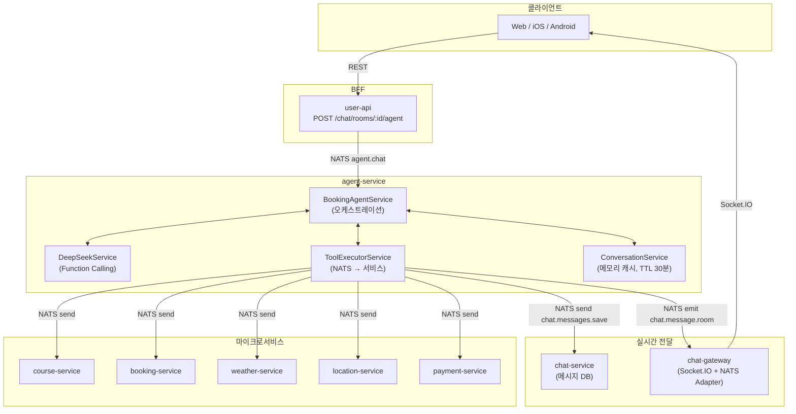
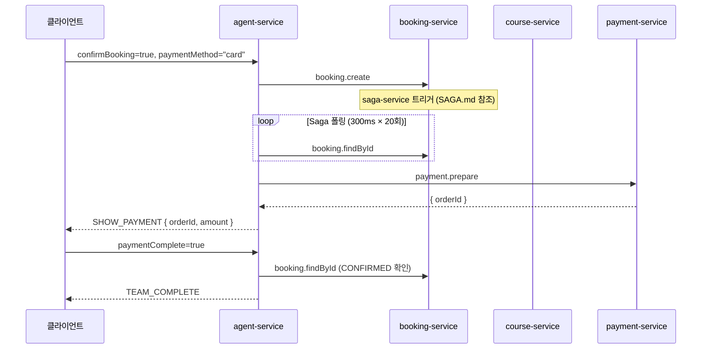
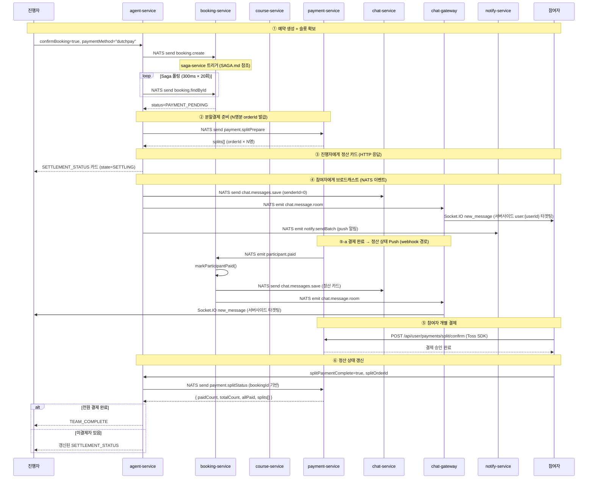

# AI 예약 에이전트 워크플로우

## 1. 개요

사용자가 자연어로 골프장 검색 → 멤버 선택 → 슬롯 선택 → 예약 → 결제까지 진행할 수 있는 AI 어시스턴트.

모든 예약은 **팀 단위 순차 처리**로 통일. 1인 예약도, 10인 그룹 예약도 동일한 플로우를 따른다.

| 경로 | 설명 | 지연시간 |
|------|------|---------|
| **Direct** | UI 카드 클릭 → LLM 없이 즉시 처리 | ~100ms |
| **LLM** | 자연어 입력 → DeepSeek Function Calling | 2~5s |

```
사용자 입력
  ├─ UI 카드 클릭? → Direct Handler → 즉시 응답
  └─ 자연어 텍스트? → DeepSeek → Tool 실행 → 응답
```

---

## 2. 아키텍처



---

## 3. 대화 컨텍스트

### 3.1 영속화

대화 컨텍스트를 메모리 캐시(NodeCache)에 저장. `userId + conversationId` 기반.

```
ConversationService (NodeCache, TTL=30분, MAX_HISTORY_TURNS=10)
  ├─ create(userId) → uuid 기반 conversationId 발급
  ├─ getOrCreate(userId, conversationId?) → 기존 복원 or 신규 생성
  ├─ update(context) → 캐시 갱신
  ├─ addUserMessage / addAssistantMessage → 히스토리 추가
  ├─ setState(context, state) → 상태 전이
  ├─ updateSlots(context, slots) → 슬롯 정보 갱신
  └─ clearSlots(context) → 슬롯 초기화
```

- **키**: `conv:{userId}:{conversationId}`
- **저장소**: NodeCache (읽기/쓰기 캐시, TTL 30분)
- **만료**: TTL 경과 시 자동 삭제 → 프론트엔드가 새 conversationId 발급받아야 함

### 3.2 ConversationContext

```typescript
{
  conversationId: string
  userId: number
  state: ConversationState
  messages: { role: 'user' | 'assistant', content: string, timestamp: Date }[]
  slots: {
    location?, clubName?, clubId?, date?, time?,
    slotId?, slotPrice?, playerCount?, confirmed?,
    latitude?, longitude?, bookingId?, bookingNumber?,
    totalPrice?,
    // 팀 예약 (모든 예약에 적용)
    groupMode: boolean           // 멤버 선택 후 true
    currentTeamNumber: number    // 기본값 1
    completedTeams?: Array<{
      teamNumber: number; bookingId: number;
      slotId: string; slotTime: string; courseName: string;
      members: Array<{ userId: number; userName: string }>
    }>
    currentTeamMembers?: Array<{ userId: number; userName: string; userEmail: string }>
    chatRoomId?: string
    bookerId?: number
    paymentMethod?: string
  }
  createdAt: Date
  updatedAt: Date
}
```

### 3.3 대화 복원 (페이지 재진입)

```
채팅방 진입 → 메시지 로드
  → 최근 AI_ASSISTANT 메시지의 metadata.state 확인
  ├─ IDLE / COMPLETED → 복원 불필요
  └─ 그 외 → AI 모드 자동 ON → agent-service가 캐시에서 컨텍스트 복원
```

| 역할 | 복원 방식 |
|------|---------|
| 진행자 | conversationId로 캐시에서 컨텍스트 복원 → 마지막 상태 카드 재표시 |
| 참여자 | 채팅방에서 브로드캐스트 메시지 수신 (metadata.targetUserIds 기반) |

---

## 4. 대화 상태 머신

모든 예약은 동일한 상태 머신을 따른다. 1인 예약도 멤버 선택 단계를 거친다.

```
IDLE → COLLECTING → SELECTING_MEMBERS → CONFIRMING → BOOKING → COMPLETED
                                                        ↓
                                                  (더치페이 시)
                                                     SETTLING → TEAM_COMPLETE
                                                                     ↓
                                                          "다음 팀" → SELECTING_MEMBERS
                                                          "종료"   → COMPLETED
```

| 상태 | 의미 | 전이 |
|------|------|------|
| IDLE | 초기 상태 | 첫 메시지 → COLLECTING |
| COLLECTING | 정보 수집 (클럽 검색, 카드 표시) | 클럽 선택 → SELECTING_MEMBERS |
| SELECTING_MEMBERS | 팀 멤버 선택 중 | 멤버 확정 → CONFIRMING (슬롯 검색) |
| CONFIRMING | 예약 확인 대기 (슬롯 선택 후) | 확인 → BOOKING |
| BOOKING | 예약 처리 중 ([Saga](./SAGA.md)) | 성공 → COMPLETED / SETTLING |
| SETTLING | 더치페이 정산 중 | 전원 결제 → TEAM_COMPLETE |
| TEAM_COMPLETE | 1팀 예약 완료 | 다음 팀 → SELECTING_MEMBERS / 종료 → COMPLETED |
| COMPLETED | 예약 완료 | 종료 |
| CANCELLED | 사용자 취소 | → COLLECTING |

---

## 5. Direct Handlers

UI 카드 클릭 시 LLM 없이 즉시 처리. `BookingAgentService.chat()` 진입 시 최우선 검사.

```typescript
// 우선순위 순서
if (request.sendReminder)         → handleSendReminder()
if (request.finishGroup)          → handleFinishGroup()
if (request.nextTeam)             → handleNextTeam()
if (request.teamMembers)          → handleTeamMemberSelect()
if (request.splitPaymentComplete) → handleSplitPaymentComplete()
if (request.paymentComplete)      → handlePaymentComplete()
if (request.confirmBooking)       → handleDirectBooking()
if (request.cancelBooking)        → handleCancelBooking()
if (request.selectedSlotId)       → handleDirectSlotSelect()
if (request.selectedClubId)       → handleDirectClubSelect()
// 위 모두 해당 없으면
→ processWithLLM()
```

| Handler | 트리거 | 동작 |
|---------|--------|------|
| `handleDirectClubSelect` | 골프장 카드 클릭 | slots에 clubId 저장 → 채팅방 멤버 조회 → **SELECT_MEMBERS 카드** |
| `handleTeamMemberSelect` | 멤버 확정 클릭 | groupMode=true, 멤버 저장 → 슬롯 조회 → **SHOW_SLOTS 카드** |
| `handleDirectSlotSelect` | 슬롯 칩 클릭 | slots에 slotId 저장 → **CONFIRM_BOOKING 카드** (결제방법 3가지) |
| `handleDirectBooking` | 예약 확인 클릭 | booking.create → [Saga](./SAGA.md) 폴링 → 결제방법에 따라 분기 |
| `handlePaymentComplete` | 카드결제 완료 | booking CONFIRMED 확인 후 **TEAM_COMPLETE** 또는 **BOOKING_COMPLETE** 카드 |
| `handleCancelBooking` | 취소 클릭 | slots 초기화 → COLLECTING |
| `handleNextTeam` | "다음 팀" 클릭 | teamNumber++ → **SELECT_MEMBERS** (이전 팀 멤버 제외) |
| `handleFinishGroup` | "종료" 클릭 | **BOOKING_COMPLETE** (전체 요약) + 채팅방 SYSTEM 메시지 |
| `handleSplitPaymentComplete` | 참여자 결제 완료 | `booking.settlementStatus`로 allPaid 확인 → 전원 완료 시 **TEAM_COMPLETE** |
| `handleSendReminder` | 리마인더 버튼 | 미결제 참여자에게 push 알림 |

---

## 6. LLM 처리 (processWithLLM)

자연어 메시지가 Direct Handler에 해당하지 않을 때 실행.

1. DeepSeek에 메시지 + 대화 히스토리 전송
2. `tool_calls` 반환 시 → `ToolExecutorService.executeAll()` (병렬 실행)
3. 도구 결과로 UI 카드(actions) 생성 + slots 업데이트
4. 도구 결과를 DeepSeek에 전달하여 다음 응답 요청
5. 텍스트 응답이 나올 때까지 반복 (최대 5회)

### Function Calling Tools

| 도구 | NATS 패턴 | 대상 |
|------|-----------|------|
| `search_clubs` | `club.search` | course |
| `search_clubs_with_slots` | `games.search` | course |
| `get_club_info` | `clubs.get` | course |
| `get_available_slots` | `games.search` | course |
| `get_nearby_clubs` | `club.findNearby` | course |
| `get_weather` / `get_weather_by_location` | `weather.forecast` | weather |
| `create_booking` | `booking.create` | booking |
| `get_booking_policy` | `policy.*.resolve` | booking |
| `search_address` | `location.search.address` | location |

---

## 7. UI 카드

### 응답 형식

```typescript
{
  message: string
  state: ConversationState
  actions?: Array<{ type: ActionType, data: unknown }>
}
```

### 카드 목록

| ActionType | 용도 | 트리거 |
|------------|------|--------|
| `SHOW_CLUBS` | 골프장 목록 | 클릭 → handleDirectClubSelect |
| `SELECT_MEMBERS` | 팀 멤버 선택 | 클릭 → handleTeamMemberSelect |
| `SHOW_SLOTS` | 타임슬롯 목록 | 클릭 → handleDirectSlotSelect |
| `SHOW_WEATHER` | 날씨 정보 | 정보 표시만 |
| `CONFIRM_BOOKING` | 예약 확인 + 결제방법 선택 | 확인 → handleDirectBooking |
| `SHOW_PAYMENT` | 카드결제 (Toss SDK) | 10분 타이머 |
| `SETTLEMENT_STATUS` | 더치페이 정산 현황 | 리마인더/새로고침 버튼 |
| `TEAM_COMPLETE` | 팀 예약 완료 | 다음 팀/종료 버튼 |
| `BOOKING_COMPLETE` | 예약 완료 (전체 요약) | 종료 시 표시 |

### 카드 데이터

**SHOW_CLUBS**: `{ found, clubs: [{ id, name, address, region }] }`

**SELECT_MEMBERS**:
```json
{
  "teamNumber": 1, "clubName": "한밭파크골프장", "date": "2026-02-28",
  "maxPlayers": 4,
  "assignedTeams": [],
  "availableMembers": [
    { "userId": 1, "userName": "김민수", "userEmail": "kim@email.com" },
    { "userId": 2, "userName": "박지영", "userEmail": "park@email.com" }
  ]
}
```
- 1팀: `assignedTeams` 비어있음
- 2팀 이후: 이전 팀 배정 정보 포함

**SHOW_SLOTS**:
```json
{
  "clubName": "한밭파크골프장", "clubAddress": "...", "date": "2026-02-28",
  "rounds": [{ "gameId": 1, "name": "A코스 오전", "price": 15000,
    "slots": [{ "id": 1, "time": "09:00", "availableSpots": 4, "price": 15000 }]
  }]
}
```

**CONFIRM_BOOKING**:
```json
{
  "clubName": "한밭파크골프장", "date": "2026-02-28", "time": "09:00",
  "playerCount": 4, "price": 60000, "courseName": "A코스 오전",
  "groupMode": true, "teamNumber": 1,
  "members": [
    { "userId": 1, "userName": "김민수" },
    { "userId": 2, "userName": "박지영" }
  ],
  "pricePerPerson": 15000
}
```
- 결제방법: 현장결제 / 카드결제 / 더치페이 (2명 이상일 때만 더치페이 표시)

**SHOW_PAYMENT**: `{ bookingId, orderId, amount, orderName, clubName, date, time, playerCount }`

**SETTLEMENT_STATUS**: `{ teamNumber, bookerId, clubName, date, slotTime, totalPrice, pricePerPerson, expiredAt, participants: [{ userId, userName, orderId, amount, status, expiredAt }] }`

**TEAM_COMPLETE**: `{ teamNumber, bookingId, bookingNumber, clubName, date, slotTime, courseName, participants, totalPrice, paymentMethod, hasMoreTeams }`

**BOOKING_COMPLETE**: `{ success, bookingId, bookingNumber, details: { date, time, playerCount, totalPrice } }`

### 카드 인터랙션

| 사용자 액션 | 구조화 요청 필드 |
|-------------|----------------|
| 골프장 선택 | `selectedClubId`, `selectedClubName` |
| 멤버 확정 | `teamMembers: [{ userId, userName, userEmail }]` |
| 슬롯 선택 | `selectedSlotId`, `selectedSlotTime`, `selectedSlotPrice` |
| 예약 확인 | `confirmBooking=true`, `paymentMethod` |
| 예약 취소 | `cancelBooking=true` |
| 결제 완료 | `paymentComplete=true`, `paymentSuccess` |
| 더치페이 결제 완료 | `splitPaymentComplete=true`, `splitOrderId` |
| 다음 팀 | `nextTeam=true` |
| 종료 | `finishGroup=true` |
| 리마인더 | `sendReminder=true` |

---

## 8. 결제

### 8.1 결제방법 분기

| 결제방법 | 조건 | 동작 |
|---------|------|------|
| 현장결제 (`onsite`) | 항상 가능 | 예약 생성 → 즉시 TEAM_COMPLETE |
| 카드결제 (`card`) | 항상 가능 | 예약 생성 → SHOW_PAYMENT → Toss 결제 → TEAM_COMPLETE |
| 더치페이 (`dutchpay`) | 멤버 2명 이상 | 예약 생성 → SETTLEMENT_STATUS → 전원 결제 → TEAM_COMPLETE |

### 8.2 카드결제 플로우



### 8.3 더치페이 플로우

더치페이는 **진행자(Booker)** 와 **참여자(Participant)** 두 경로가 존재한다.

#### 전체 시퀀스



#### 단계별 상세

**① 예약 생성**: 일반 예약과 동일. [Saga](./SAGA.md) 폴링으로 `PAYMENT_PENDING` 상태 확인.

**② 분할결제 준비** (`payment.splitPrepare`):

```typescript
// agent-service → payment-service
NATS send 'payment.splitPrepare' {
  bookingId: number,
  participants: [
    { userId: number, userName: string, userEmail: string, amount: number }
  ],
  expiredAt: string  // 현재 + 30분
}
// → PaymentSplit 레코드 N개 생성, 각각 고유 orderId 발급
```

**③ 진행자 응답**: HTTP 응답으로 `SETTLEMENT_STATUS` 카드 반환. 진행자만 보는 개인 AI 메시지.

**④ 참여자 브로드캐스트** (2단계 저장+전달):

```typescript
// Step 1: DB 저장 (chat-service)
NATS send 'chat.messages.save' {
  id: uuid,
  roomId: string,
  senderId: 0,              // ← 브로드캐스트 마커
  senderName: 'AI 예약 도우미',
  content: '더치페이 결제 요청이 도착했습니다.',
  messageType: 'AI_ASSISTANT',  // ← chat-service가 DB type 컬럼으로 매핑
  metadata: JSON.stringify({
    conversationId: null,
    state: 'SETTLING',
    actions: [{ type: 'SETTLEMENT_STATUS', data: settlementData }],
    targetUserIds: [2, 3, 4]  // ← chat-gateway 서버사이드 타겟팅 키
  })
}

// Step 2: 실시간 전달 (chat-gateway → Socket.IO)
NATS emit 'chat.message.room' {
  roomId: string,
  message: { ...위와 동일 }  // ← messageType 필드 포함
}
```

**⑤ 참여자 결제**: 클라이언트에서 Toss SDK 호출 → `POST /api/user/payments/split/confirm`

**⑥ 정산 갱신**: `handleSplitPaymentComplete`에서 `booking.settlementStatus`로 allPaid 확인 (SSOT) → 전원 완료 시 `TEAM_COMPLETE` (fallback: `payment.splitStatus` 기반 계산)

#### 더치페이 타임라인

| 시점 | 동작 |
|------|------|
| 슬롯 확보 시 | `expiredAt` = 현재 + 30분 |
| 만료 10분 전 | 미결제 참여자에게 리마인더 (job-service) |
| 만료 시 | PaymentSplit → EXPIRED, slot.release |

---

## 9. 실시간 메시지 전달 체계

### 9.1 전달 경로 비교

| 메시지 유형 | 전달 경로 | 대상 |
|------------|----------|------|
| 진행자 AI 응답 | REST HTTP 응답 | 진행자 본인만 |
| 참여자 정산 카드 | NATS → chat-gateway → Socket.IO | 타겟 사용자만 (서버사이드 타겟팅) |
| 정산 상태 갱신 카드 | booking-service → chat-service/chat-gateway → Socket.IO | 부커만 (서버사이드 타겟팅) |
| SYSTEM 메시지 | NATS → chat-gateway → Socket.IO | 채팅방 전체 |
| 일반 채팅 | Socket.IO → chat-gateway → NATS Adapter | 채팅방 전체 |

### 9.2 브로드캐스트 패턴 (senderId=0)

agent-service 또는 booking-service가 참여자에게 직접 메시지를 보내야 할 때 사용하는 패턴.

```
agent-service / booking-service
  │
  ├── NATS send 'chat.messages.save'     → chat-service (DB 영속화)
  │                                          └── senderId=0으로 저장
  │
  └── NATS emit 'chat.message.room'      → chat-gateway (실시간 전달)
                                              └── extractTargetUserIds(message.metadata)
                                                   ├── targetUserIds 있음 → user:{userId} 룸으로 타겟 전달
                                                   └── targetUserIds 없음 → server.to(roomId) 전체 전달
```

**핵심 규칙:**

| 규칙 | 설명 |
|------|------|
| `senderId=0` | AI 브로드캐스트 메시지 마커. DB 조회 시 모든 사용자에게 노출 |
| `targetUserIds` | metadata 내 배열. chat-gateway가 `user:{userId}` 룸에만 전달. 클라이언트 필터링 불필요 |
| 1메시지 N대상 | 개별 메시지(N개) 대신 1개 메시지 + 서버사이드 타겟팅 (디버깅 용이) |

### 9.3 chat-gateway NATS 수신

```typescript
// chat-gateway/src/nats/nats.service.ts
// Raw NATS 구독 (NestJS @EventPattern이 아닌 직접 구독)
async subscribeToRoomMessages(handler) {
  const sub = this.nc.subscribe('chat.message.room');
  for await (const msg of sub) {
    const raw = JSON.parse(decode(msg.data));
    // NestJS ClientProxy emit() 봉투 처리
    const event = (raw.data !== undefined && raw.pattern) ? raw.data : raw;
    handler(event);
  }
}

// chat-gateway/src/gateway/chat.gateway.ts
private deliverRoomMessage(event: RoomMessageEvent) {
  const { roomId, message } = event;
  if (!roomId || !message) {
    this.logger.warn('Invalid room message event received');
    return;
  }
  const targetUserIds = this.extractTargetUserIds(message.metadata);
  if (targetUserIds && targetUserIds.length > 0) {
    for (const userId of targetUserIds) {
      this.server.to(`user:${userId}`).emit('new_message', message);
    }
  } else {
    this.server.to(roomId).emit('new_message', message);
  }
}

private extractTargetUserIds(metadata?: string): number[] | null {
  if (!metadata) return null;
  try {
    const meta = JSON.parse(metadata);
    if (Array.isArray(meta?.targetUserIds) && meta.targetUserIds.length > 0) {
      return meta.targetUserIds;
    }
  } catch { /* ignore */ }
  return null;
}
```

> **NestJS emit() 봉투**: `ClientProxy.emit('pattern', data)` 는 `{ pattern, data }` 형태로 전송.
> Raw NATS 구독자는 이 봉투를 벗겨야 실제 데이터에 접근할 수 있다.

### 9.4 클라이언트 처리

**Socket.IO 수신 시** (실시간):
```
new_message 이벤트 수신
  → 서버에서 이미 targetUserIds 기반 타겟팅 완료
  → metadata.actions 파싱 → 카드 렌더링
```

**API 메시지 로드 시** (히스토리):
```
GET /chat/{roomId}/messages
  → chat-service: senderId=0 + AI_ASSISTANT → 전체 노출 (aiFilter)
  → Web 렌더 필터: metadata.targetUserIds 확인 (DB에서 로드한 과거 메시지 보호)
  → actions 파싱
```

**메시지 actions 조회 우선순위** (Android/iOS):
1. In-memory 캐시 (AI HTTP 응답에서 저장된 actions)
2. metadata JSON fallback (브로드캐스트 메시지의 metadata에서 파싱)

---

## 10. 메시지 타입과 가시성

> **`messageType` 필드 규칙**: DB(Prisma)에서는 컬럼명 `type`을 사용하고, 그 외 모든 계층(NATS 페이로드, Socket.IO 이벤트, REST API, 프론트엔드)에서는 `messageType`을 사용한다.
> chat-service가 경계 역할: 저장 시 `messageType` → Prisma `type` 매핑, 조회 시 Prisma `type` → `messageType` 매핑 (`toMessageResponse()`).

### 10.1 메시지 타입

| DB 타입 | 용도 | senderId | 누가 보는가 |
|---------|------|----------|-----------|
| TEXT | 일반 채팅 | 사용자 ID | 채팅방 전체 |
| IMAGE | 이미지 | 사용자 ID | 채팅방 전체 |
| SYSTEM | 입장/퇴장/예약완료 안내 | 사용자 ID | 채팅방 전체 |
| AI_USER | AI 모드 사용자 메시지 | 사용자 ID | **본인만** (senderId 필터) |
| AI_ASSISTANT | AI 응답 (개인) | 사용자 ID | **본인만** (senderId 필터) |
| AI_ASSISTANT | AI 브로드캐스트 | **0** | **타겟 사용자** (chat-gateway 서버사이드 타겟팅) |

### 10.2 AI 메시지 필터링 (chat-service)

```typescript
// DB 조회 시 (chat.messages.list)
const aiFilter = userId ? {
  OR: [
    // 일반 메시지: 전부 보임
    { type: { notIn: ['AI_USER', 'AI_ASSISTANT'] } },
    // AI 개인 메시지: 본인 것만
    { type: { in: ['AI_USER', 'AI_ASSISTANT'] }, senderId: userId },
    // AI 브로드캐스트: 전부 보임 (실시간은 서버사이드 타겟팅, DB 조회는 전체 노출)
    { type: 'AI_ASSISTANT', senderId: 0 },
  ],
} : {};
```

### 10.3 metadata 구조

AI_ASSISTANT 메시지의 `metadata` 필드에 JSON 문자열로 저장:

```json
{
  "conversationId": "uuid-or-null",
  "state": "SETTLING",
  "actions": [
    {
      "type": "SETTLEMENT_STATUS",
      "data": { "teamNumber": 1, "clubName": "...", "participants": [...] }
    }
  ],
  "targetUserIds": [2, 3, 4]
}
```

- **conversationId**: 해당 대화 세션 ID (브로드캐스트는 null)
- **state**: 대화 상태 (새로고침 후 복원용)
- **actions**: UI 카드 배열 (새로고침 후에도 카드 복원)
- **targetUserIds**: 이 메시지를 표시할 대상 사용자 ID 배열 (없으면 전체 표시)

---

## 11. NATS 패턴

### 11.1 Inbound (agent-service 수신)

| 패턴 | 타입 | 설명 |
|------|------|------|
| `agent.chat` | `@MessagePattern` | 메인 대화 처리 |
| `agent.reset` | `@MessagePattern` | 대화 초기화 |
| `agent.status` | `@MessagePattern` | 대화 상태 조회 |

### 11.2 Outbound — Request/Response (`send`)

> `send`는 응답을 기다리는 동기 호출. `firstValueFrom` + `timeout` + `catchError` 패턴 사용.

| 패턴 | NATS Client | 대상 서비스 | 용도 |
|------|-------------|-----------|------|
| `club.search` | COURSE_SERVICE | course-service | 골프장 검색 |
| `games.search` | COURSE_SERVICE | course-service | 슬롯 검색 |
| `clubs.get` | COURSE_SERVICE | course-service | 골프장 상세 |
| `club.findNearby` | COURSE_SERVICE | course-service | 근처 골프장 |
| `booking.create` | BOOKING_SERVICE | booking-service | 예약 생성 → [saga-service](./SAGA.md) 트리거 |
| `booking.findById` | BOOKING_SERVICE | booking-service | Saga 폴링 |
| `booking.settlementStatus` | BOOKING_SERVICE | booking-service | 정산 상태 조회 (allPaid SSOT) |
| `policy.*.resolve` | BOOKING_SERVICE | booking-service | 예약 정책 조회 |
| `payment.prepare` | PAYMENT_SERVICE | payment-service | 카드결제 준비 |
| `payment.splitPrepare` | PAYMENT_SERVICE | payment-service | 더치페이 준비 (N명 orderId 발급) |
| `payment.splitStatus` | PAYMENT_SERVICE | payment-service | 분할결제 상태 조회 |
| `weather.forecast` | WEATHER_SERVICE | weather-service | 날씨 조회 |
| `location.search.address` | LOCATION_SERVICE | location-service | 주소 검색 |
| `chat.room.getMembers` | CHAT_SERVICE | chat-service | 채팅방 멤버 조회 |
| `chat.messages.save` | CHAT_SERVICE | chat-service | 메시지 DB 저장 |

### 11.3 Outbound — Fire-and-Forget (`emit`)

> `emit`는 응답을 기다리지 않는 비동기 이벤트. NestJS `ClientProxy.emit()` 사용.

| 패턴 | NATS Client | 대상 서비스 | 용도 |
|------|-------------|-----------|------|
| `chat.message.room` | NOTIFY_SERVICE | **chat-gateway** | 실시간 Socket.IO 브로드캐스트 |
| `notify.sendBatch` | NOTIFY_SERVICE | notify-service | push 알림 전송 |

### 11.4 NATS Client 구성

agent-service는 7개의 Named NATS Client를 사용:

| Client 이름 | 대상 |
|-------------|------|
| `COURSE_SERVICE` | course-service |
| `BOOKING_SERVICE` | booking-service |
| `WEATHER_SERVICE` | weather-service |
| `LOCATION_SERVICE` | location-service |
| `PAYMENT_SERVICE` | payment-service |
| `CHAT_SERVICE` | chat-service |
| `NOTIFY_SERVICE` | notify-service / chat-gateway |

> **NOTIFY_SERVICE**는 notify-service 전용이 아님.
> `chat.message.room` 이벤트도 이 클라이언트로 발행하며, chat-gateway가 raw NATS 구독으로 수신.

---

## 12. 예약 플로우

모든 예약(1인~다수)이 동일한 플로우를 따른다. 팀 단위로 순차 처리하며, 1팀 완료 후 다음 팀을 진행한다.

### 12.1 플로우 요약

```
① 클럽 검색    → SHOW_CLUBS          (LLM)
② 멤버 선택    → SELECT_MEMBERS      (Direct: handleDirectClubSelect)
③ 슬롯 선택    → SHOW_SLOTS          (Direct: handleTeamMemberSelect)
④ 예약 확인    → CONFIRM_BOOKING     (Direct: handleDirectSlotSelect)
⑤ 결제 처리    → 결제방법에 따라 분기  (Direct: handleDirectBooking)
⑥ 팀 완료      → TEAM_COMPLETE       (다음 팀 / 종료)
⑦ 종료         → BOOKING_COMPLETE    (전체 요약 + SYSTEM 메시지)
```

### 12.2 상세 플로우

```
① "내일 강남 근처 골프장 알려줘"
   → LLM: search_clubs_with_slots → SHOW_CLUBS 카드

② [골프장 카드 클릭]
   → Direct: handleDirectClubSelect
   → 채팅방 멤버 조회 (chat.room.getMembers)
   → SELECT_MEMBERS 카드 (1팀 멤버 선택)

③ [멤버 확정 클릭]
   → Direct: handleTeamMemberSelect
   → groupMode=true, 멤버 저장
   → 슬롯 조회 → SHOW_SLOTS 카드

④ [슬롯 칩 클릭]
   → Direct: handleDirectSlotSelect
   → CONFIRM_BOOKING 카드 (결제방법 선택)
   → 2명 이상: 현장결제 / 카드결제 / 더치페이
   → 1명: 현장결제 / 카드결제

⑤ [예약 확인 + 결제방법]
   → Direct: handleDirectBooking → booking.create (Saga)
   ├─ 현장결제  → 즉시 TEAM_COMPLETE
   ├─ 카드결제  → SHOW_PAYMENT → Toss 결제 → TEAM_COMPLETE
   └─ 더치페이  → splitPrepare → 참여자 브로드캐스트 → SETTLEMENT_STATUS
                → 전원 결제 완료 → TEAM_COMPLETE

⑥ TEAM_COMPLETE 카드
   ├─ "다음 팀 예약" → handleNextTeam → SELECT_MEMBERS (②로 복귀)
   └─ "종료"        → handleFinishGroup → BOOKING_COMPLETE + SYSTEM 메시지
```

### 12.3 UI 카드 흐름

```
진행자 채팅 화면 (AI 모드)
─────────────────────────────────────────

① SHOW_CLUBS 카드
┌──────────────────────────────────────┐
│ 검색 결과 3개의 골프장을 찾았어요      │
│                                      │
│ ┌─────────────────────────────────┐  │
│ │ ⛳ 한밭파크골프장                │  │
│ │ 📍 천안시 동남구...             │  │
│ └─────────────────────────────────┘  │
│ ┌─────────────────────────────────┐  │
│ │ ⛳ 대전파크골프장                │  │
│ │ 📍 대전시 유성구...             │  │
│ └─────────────────────────────────┘  │
└──────────────────────────────────────┘
         ↓ 골프장 카드 클릭

② SELECT_MEMBERS 카드
┌──────────────────────────────────────┐
│ 👥 1팀 멤버 선택 (최대 4명)           │
│                                      │
│ ☑ 김민수 (나) 🔒                     │
│ ☑ 박지영                            │
│ ☑ 이준호                            │
│ ☑ 최서연                            │
│ ☐ 정우진                            │
│ ☐ 한소희  ...                       │
│                                      │
│ 선택: 4/4명                          │
│ [취소] [멤버 확정]                    │
└──────────────────────────────────────┘
         ↓ 멤버 확정 클릭

③ SHOW_SLOTS 카드
┌──────────────────────────────────────┐
│ ⛳ 한밭파크골프장                     │
│ 📍 천안시 ... | 📅 2026-02-28       │
│ 🏌️ 1팀 시간대를 선택해 주세요        │
│──────────────────────────────────────│
│ A코스 오전               ₩15,000    │
│ [09:00 4명] [09:30 4명] [10:00 4명] │
│──────────────────────────────────────│
│ B코스 오후               ₩15,000    │
│ [14:00 4명] [14:30 4명]             │
└──────────────────────────────────────┘
         ↓ 슬롯 선택

④ CONFIRM_BOOKING 카드
┌──────────────────────────────────────┐
│ 1팀 예약 확인                        │
│ 📍 한밭파크골프장                     │
│ 📅 2026-02-28 (금) 09:00            │
│ 👥 4명: 김민수, 박지영, 이준호, 최서연 │
│ 💳 ₩60,000 (1인당 ₩15,000)         │
│                                      │
│ 결제방법                              │
│ [🏪 현장결제] [💳 카드결제] [💰 더치페이] │
│                                      │
│ [취소] [예약 확인]                    │
└──────────────────────────────────────┘
         ↓ 더치페이 + 예약 확인

⑤ SETTLEMENT_STATUS 카드 (진행자에게 표시)
┌──────────────────────────────────────┐
│ 💰 1팀 더치페이 현황                  │
│ 📍 한밭파크골프장 | 📅 02-28 09:00   │
│ 💳 ₩60,000 (1인당 ₩15,000)         │
│                                      │
│ ✅ 김민수 (나)   ₩15,000  결제완료   │
│ ✅ 박지영        ₩15,000  결제완료   │
│ ⏳ 이준호        ₩15,000  대기중     │
│ ⏳ 최서연        ₩15,000  대기중     │
│                                      │
│ 결제 완료: 2/4명  |  ⏱ 25분 남음    │
│ [리마인더 보내기] [현황 새로고침]      │
└──────────────────────────────────────┘

⑤-1 SETTLEMENT_STATUS 카드 (참여자에게 브로드캐스트)
┌──────────────────────────────────────┐
│ 💳 결제 요청                          │
│ 📍 한밭파크골프장                     │
│ 📅 2026-02-28 (금) 09:00            │
│ 👥 4명 (1팀)                         │
│ 💰 ₩15,000                          │
│ ⏱ 결제 기한: 25분 남음               │
│                                      │
│ [결제하기]                            │
└──────────────────────────────────────┘
  전달 방식: senderId=0 브로드캐스트
  NATS: chat.messages.save + chat.message.room
  타겟팅: chat-gateway가 metadata.targetUserIds로 서버사이드 전달
         ↓ 전원 결제 완료

⑥ TEAM_COMPLETE 카드
┌──────────────────────────────────────┐
│ ✅ 1팀 예약 완료!                     │
│ 📍 한밭파크골프장                     │
│ 📅 2026-02-28 (금) 09:00            │
│ 👥 김민수, 박지영, 이준호, 최서연      │
│ 💳 ₩60,000 (더치페이 완료)           │
│ 🏷️ 예약번호 PG-20260228-001        │
│                                      │
│ [🏌️ 다음 팀 예약] [종료]             │
└──────────────────────────────────────┘
         ↓ "다음 팀" 클릭

② SELECT_MEMBERS 카드 (2팀 — 이전 팀 배정 표시)
┌──────────────────────────────────────┐
│ 👥 2팀 멤버 선택 (최대 4명)           │
│                                      │
│ ── 1팀 배정완료 ──────────────────── │
│ ✅ 김민수 (09:00 A코스)       1팀   │
│ ✅ 박지영 (09:00 A코스)       1팀   │
│ ✅ 이준호 (09:00 A코스)       1팀   │
│ ✅ 최서연 (09:00 A코스)       1팀   │
│ ── 미배정 ──────────────────────── │
│ ☑ 정우진                            │
│ ☑ 한소희                            │
│ ☑ 강태우                            │
│ ☑ 윤지민                            │
│ ☐ 오서준                            │
│ ☐ 류현아                            │
│                                      │
│ 선택: 4/4명                          │
│ [취소] [멤버 확정]                    │
└──────────────────────────────────────┘
         ↓ (③ ~ ⑥ 반복)

⑦ 종료 → 채팅방 전체 SYSTEM 메시지
┌──────────────────────────────────────┐
│ 🎉 그룹 예약이 완료되었습니다!         │
│ 📍 한밭파크골프장 | 📅 2026-02-28    │
│                                      │
│ 🏌️ 1팀 09:00 A코스 (4명)            │
│    김민수, 박지영, 이준호, 최서연      │
│ 🏌️ 2팀 09:30 A코스 (4명)            │
│    정우진, 한소희, 강태우, 윤지민      │
│                                      │
│ 💳 총 ₩120,000 | 🏷️ 2팀 8명        │
└──────────────────────────────────────┘
```

### 12.4 멤버 선택 규칙

| 규칙 | 내용 |
|------|------|
| 진행자 고정 | 1팀에 자동 선택 (🔒), 2팀 이후는 선택 가능 |
| 이전 팀 표시 | ✅ + 팀번호/슬롯 정보와 함께 비활성 (중복 방지) |
| 섹션 구분 | "N팀 배정완료" / "미배정" 섹션으로 분리 |
| 인원 | 최소 1명, 최대 4명 (availableSpots) |
| 더치페이 조건 | 선택된 멤버가 2명 이상일 때만 더치페이 옵션 표시 |
| 1인 채팅방 | SELECT_MEMBERS에 본인만 표시, 확인 후 진행 |

### 12.5 카드 컴포넌트

| 카드 | 컴포넌트 | 비고 |
|------|---------|------|
| SELECT_MEMBERS | `SelectMembersCard` | 이전 팀 배정 현황 + 미배정 체크박스 |
| SHOW_SLOTS | `SlotCard` | 기존 재사용, 이전 팀 슬롯 비활성 |
| CONFIRM_BOOKING | `ConfirmBookingCard` | 결제방법 3가지 (1인이면 2가지) |
| SHOW_PAYMENT | `PaymentCard` | Toss SDK, 10분 타이머 |
| SETTLEMENT_STATUS | `SettlementStatusCard` | 진행자: 대시보드 + 본인 결제 / 참여자: 결제 |
| TEAM_COMPLETE | `TeamCompleteCard` | 다음 팀/종료 버튼 |

#### SelectMembersCard

```typescript
interface SelectMembersCardProps {
  data: {
    teamNumber: number;
    clubName: string;
    date: string;
    maxPlayers: number;
    assignedTeams: Array<{
      teamNumber: number;
      slotTime: string;
      courseName: string;
      members: Array<{ userId: number; userName: string }>;
    }>;
    availableMembers: Array<{
      userId: number;
      userName: string;
      userEmail: string;
    }>;
  };
  onConfirm: (members: Array<{ userId: number; userName: string; userEmail: string }>) => void;
  onCancel: () => void;
}
```

#### SettlementStatusCard

진행자(Booker)가 동시에 참여자인 경우(더치페이 대상), **대시보드 + 본인 결제 카드**를 함께 표시한다.

```typescript
// 뷰 분기 로직
if (currentUserId === data.bookerId) {
  // 1. 항상 BookerDashboardView 표시 (리마인더/새로고침)
  // 2. 본인이 참여자이고 PENDING이면 ParticipantPaymentView 추가 표시
  // 3. 본인이 참여자이고 PAID이면 ParticipantPaidView 추가 표시
} else {
  // 일반 참여자: ParticipantPaymentView 또는 ParticipantPaidView
}
```

```typescript
interface SettlementStatusCardProps {
  data: {
    teamNumber: number;
    bookerId: number;
    clubName: string;
    date: string;
    slotTime: string;
    totalPrice: number;
    pricePerPerson: number;
    expiredAt: string;
    participants: Array<{
      userId: number;
      userName: string;
      orderId: string;
      amount: number;
      status: 'PENDING' | 'PAID' | 'CANCELLED';
      expiredAt: string;
    }>;
  };
  currentUserId: number;  // 진행자/참여자 뷰 분기용
  onRefresh: () => void;
  onSendReminder: () => void;
  onRequestSplitPayment: (orderId: string, amount: number) => void;
  onSplitPaymentComplete: (success: boolean, orderId: string) => void;
}
```

#### TeamCompleteCard

```typescript
interface TeamCompleteCardProps {
  data: {
    teamNumber: number;
    bookingId: number;
    bookingNumber: string;
    clubName: string;
    date: string;
    slotTime: string;
    courseName: string;
    participants: Array<{ userId: number; userName: string }>;
    totalPrice: number;
    paymentMethod: string;
    hasMoreTeams: boolean;
  };
  onNextTeam: () => void;
  onFinish: () => void;
}
```

### 12.6 DB 스키마

**booking-service**:
```prisma
model Booking {
  // ... 기존 필드
  teamLabel       String?              // "1팀", "2팀"
  chatRoomId      String?              // 채팅방 ID (팀 추적용)
  participants    BookingParticipant[]
}

model BookingParticipant {
  id          Int               @id @default(autoincrement())
  bookingId   Int
  userId      Int
  userName    String
  userEmail   String
  role        ParticipantRole   @default(MEMBER)  // BOOKER | MEMBER
  status      ParticipantStatus @default(PENDING) // PENDING | PAID | CANCELLED | REFUNDED
  amount      Int
  paidAt      DateTime?
  createdAt   DateTime          @default(now())
  updatedAt   DateTime          @updatedAt

  booking     Booking           @relation(fields: [bookingId], references: [id])
  @@unique([bookingId, userId])
}
```

**payment-service**:
```prisma
model PaymentSplit {
  id          Int         @id @default(autoincrement())
  bookingId   Int
  userId      Int
  userName    String
  userEmail   String
  amount      Int
  status      SplitStatus @default(PENDING) // PENDING | PAID | EXPIRED | CANCELLED | REFUNDED
  orderId     String      @unique
  paidAt      DateTime?
  expiredAt   DateTime?
  createdAt   DateTime    @default(now())
  updatedAt   DateTime    @updatedAt

  @@index([bookingId, status])
}
```

**chat-service**:
```prisma
enum MessageType {
  TEXT
  IMAGE
  SYSTEM
  AI_USER       // AI 모드 사용자 메시지
  AI_ASSISTANT  // AI 응답 (senderId=0 → 브로드캐스트)
}

model ChatMessage {
  id         String      @id @default(uuid())
  roomId     String
  senderId   Int         // 0 = AI 브로드캐스트, >0 = 일반 사용자
  senderName String
  content    String
  type       MessageType @default(TEXT)
  metadata   String?     // AI 액션 JSON (AI_ASSISTANT 메시지용)
  createdAt  DateTime    @default(now())
  deletedAt  DateTime?

  @@index([roomId, deletedAt, createdAt])
  @@index([senderId])
}
```

---

## 13. 컴포넌트 파일 위치

| 플랫폼 | 경로 |
|--------|------|
| Web 카드 | `apps/user-app-web/src/components/features/chat/cards/*.tsx` |
| Web 버블 | `apps/user-app-web/src/components/features/chat/AiMessageBubble.tsx` |
| Web 페이지 | `apps/user-app-web/src/pages/ChatRoomPage.tsx` |
| Web 훅 | `apps/user-app-web/src/hooks/useAiChat.ts` |
| Android 카드 | `apps/user-app-android/.../chat/components/cards/*.kt` |
| Android VM | `apps/user-app-android/.../chat/ChatViewModel.kt` |
| iOS 카드 | `apps/user-app-ios/Sources/Features/Chat/Components/Cards/*.swift` |
| iOS VM | `apps/user-app-ios/Sources/Features/Chat/AiChatViewModel.swift` |
| agent-service | `services/agent-service/src/booking-agent/` |
| chat-gateway | `services/chat-gateway/src/gateway/chat.gateway.ts` |
| chat-service | `services/chat-service/src/chat/chat.service.ts` |
| payment-service | `services/payment-service/src/payment/service/payment-split.service.ts` |

---

**Last Updated**: 2026-03-09
