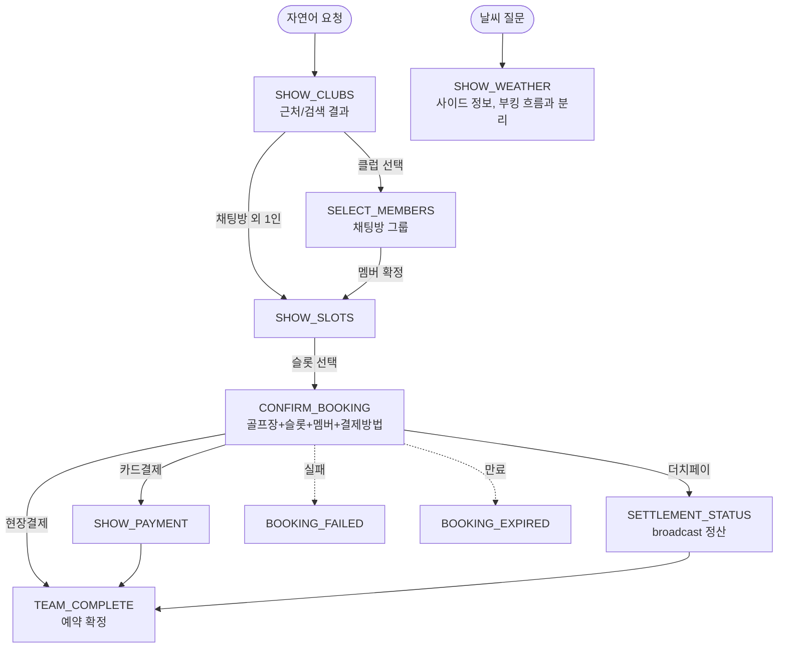

# AI 응답 카드 흐름 표준

> 최종 수정: 2026-05-24
> **연계 문서**: 에이전트 전체 플로우는 [`AGENT.md`](./AGENT.md), 부킹 상태/멱등성은 [`BOOKING.md`](./BOOKING.md) 참조.

## 1. 원칙

> 카드는 (1) 사용자 행동을 유도하거나 (2) 데이터 시각화 가치가 있을 때만 표시한다. **진행 안내는 텍스트로.**

- LLM 텍스트 메시지와 카드 내용이 **중복되지 않도록** 한다.
- 카드가 표시되는 정보(클럽 목록, 슬롯 시간, 날씨 등)는 텍스트로 다시 풀어쓰지 않고 한 줄 안내만 한다.
  - 클럽 카드 → "근처 3곳 찾았어요!" (X: "강남탄천(서울), 잠실(서울)…")
  - 슬롯 카드 → "예약 가능 시간이에요!" (X: "9시 4,000원, 10시 4,000원…")
  - 날씨 카드 → "내일 골프 치기 좋은 날씨예요!" (X: "맑음 22도 습도 50%…")

## 2. 카드 진행 흐름

부킹 카드 순서는 **골프장 → 멤버(채팅방 그룹) → 슬롯 → 결제**다. 채팅방 그룹 예약은 멤버 확정 후 인원수 기반으로 슬롯을 조회한다 (UNI-21). `SHOW_WEATHER`는 부킹 흐름과 분리된 사이드 정보다.

## 3. 카드 분류

| 분류 | 카드 | 책임 |
| -- | -- | -- |
| **정보 결과** | `SHOW_CLUBS`, `SHOW_SLOTS`, `SHOW_WEATHER` | 결과 시각화 |
| **액션 유도** | `SELECT_MEMBERS`, `CONFIRM_BOOKING`, `SHOW_PAYMENT` | 사용자 선택/확정 |
| **결과/상태** | `TEAM_COMPLETE`, `BOOKING_FAILED`, `BOOKING_EXPIRED`, `SETTLEMENT_STATUS` | 종료 + broadcast |
| **제거됨** | ~~`TASK_PREVIEW`~~ | 진행 안내 — 텍스트로 대체 (UNI-26) |

## 4. 구현 위치

| 영역 | 위치 |
| -- | -- |
| 카드 push (액션 조립) | `agent-service/src/booking-agent/service/booking-agent.service.ts` |
| 카드 데이터 생성 | `agent-service/src/booking-agent/service/ui-card.helper.ts` |
| 텍스트 중복 금지 규칙 | `agent-service/src/booking-agent/service/deepseek.service.ts` (system prompt) |
| ActionType 정의 | `agent-service/src/booking-agent/dto/chat.dto.ts` |
| 렌더링 (web) | `apps/user-app-web/src/components/features/chat/AiMessageBubble.tsx` |
| 렌더링 (iOS) | `apps/user-app-ios/Sources/Features/Chat/Components/AiMessageBubble.swift` |
| 렌더링 (Android) | `apps/user-app-android/.../presentation/feature/chat/components/AiMessageBubble.kt` |

카드는 `metadata` JSON으로 영속화되며, 클라이언트는 히스토리 로드 시 알 수 없는 `ActionType`을 안전하게 스킵한다 (iOS `compactMap`+`init?(rawValue:)`, Android `ActionType.fromValue() ?: continue`). 따라서 백엔드에서 카드를 제거하면 모든 플랫폼에 자동 반영된다.
