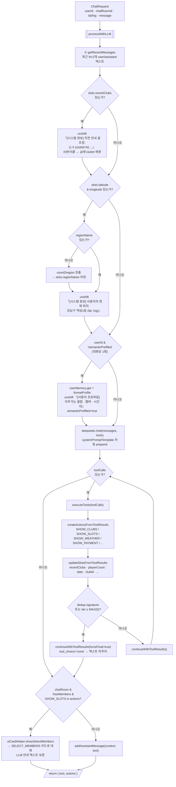
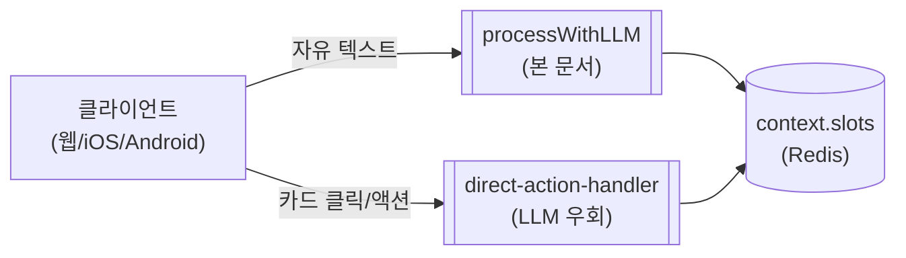
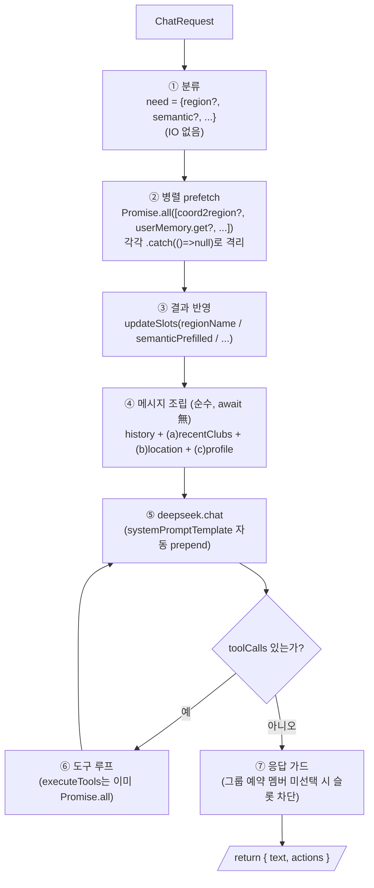

# AGENT_CONTEXT — 에이전트 컨텍스트 조립 & 통합

DeepSeek LLM에 전달되는 메시지 배열은 **턴마다 동적으로 조립**된다.
시스템 프롬프트 + 조건부 컨텍스트(3종) + 대화 히스토리 + 현재 사용자 메시지가 한 배열로 합쳐져 호출되며, 응답 후엔 도구 결과로 `context.slots`를 갱신해 다음 턴까지 캐리한다.

본 문서는 `llm-orchestrator.processWithLLM` 흐름과 `context.slots` 캐리 매트릭스를 정리한다.

> **연계 문서**: 에이전트 전체 워크플로우 [`AGENT.md`](./AGENT.md) · UI SSOT [`AGENT_UI.md`](./AGENT_UI.md) · 결제(현장·카드·더치페이) [`AGENT_PAY.md`](./AGENT_PAY.md) · 장기 메모리/userMemory [`AGENT_MEMORY.md`](./AGENT_MEMORY.md)

---

## 1. 턴별 컨텍스트 조립 워크플로우



---

## 2. 조건부 주입 — 무엇을, 언제, 왜

| 주입 | 트리거 조건 | 페이로드 | 목적 |
|---|---|---|---|
| **(a) recentClubs** | `slots.recentClubs.length > 0` | `[시스템 정보] 직전 안내 골프장: 1) 천안 유관순 (clubId=129), 2) ...` | "N번"/이름 지칭 → **실제 clubId** 매핑 (순번 오용·환각 방지) |
| **(b) location** | `slots.latitude && longitude` | `[시스템 정보] 사용자의 현재 위치: 강남구 역삼1동 (lat, lng)` | 근처/날씨 도구에 좌표 전달, 위치 발화 자연화 |
| **(c) semantic profile** | `userId && !slots.semanticPrefilled` (대화당 1회) | `[사용자 프로파일] 자주 가는 클럽 / 함께하는 멤버 / 선호 시간대` | 부킹 추천·기본값 prefill (Hermes Phase 3) |

> 세 주입 모두 **`role: 'user'`** + `"이 메시지에 대해 직접 응답하지 마세요."` 꼬리표를 붙인 의사-system 형태.
> `unshift` 역순으로 들어가므로 최종 배열 순서는 **(c) → (b) → (a) → history → current**.

---

## 3. 최종 LLM 입력 배열 (모든 주입이 발동한 경우)

```
role        content
─────────   ───────────────────────────────────────────────────
system      systemPromptTemplate (역할/응답/도구 규칙 일체)         ← deepseek.service 자동 prepend
user        [사용자 프로파일] 자주가는 클럽 · 멤버 · 시간대 ...        ← (c) semantic profile
user        [시스템 정보] 사용자의 현재 위치: 강남구 역삼1동 ...        ← (b) location
user        [시스템 정보] 직전에 안내한 골프장 목록: 1)...(clubId=N) ← (a) recentClubs
user        ...과거 사용자 메시지
assistant   ...과거 어시스턴트 응답
...
user        <현재 사용자 메시지>
```

---

## 4. `context.slots` 캐리 매트릭스 (다음 턴까지 보존)

`updateSlotsFromToolResults` 가 도구 결과를 보고 `slots`에 기록 → `conversation.service`가 Redis(working memory)에 영속 → 다음 턴 `getRecentMessages` 호출 시 컨텍스트 조립에 재사용.

| 필드 | 설정 시점 | 사용처 |
|---|---|---|
| `latitude`, `longitude` | 요청 페이로드 | 좌표 주입 / 근처·날씨 도구 |
| `regionName` | (b) 주입 중 `coord2region` 1회 | 위치 발화 자연화 |
| `location` | `search_clubs(_with_slots)` 인자 | 후속 검색 |
| `date` | `get_nearby_clubs` · `search_clubs_with_slots` · `get_available_slots` 인자 | 슬롯/예약 |
| `playerCount` | `get_nearby_clubs` · `search_clubs_with_slots` 인자 | 인원 캐리 (예약 기본값) |
| `clubId`, `clubName` | `search_clubs_with_slots`(단일 결과) · `get_club_info`(인자) · `CLUB_SELECT` | 후속 슬롯/예약 대상 |
| `recentClubs` | `search_clubs` · `get_nearby_clubs` · `search_clubs_with_slots` 결과 | (a) 주입 데이터 |
| `chatRoomId`, `bookerId` | 요청 페이로드 | 채팅방 그룹 흐름 |
| `groupMode`, `currentTeamMembers` | `SELECT_MEMBERS` 직접 액션 | 인원 확정 (1예약=최대4명, UNI-36) |
| `slotId`, `time`, `slotPrice`, `gameName`, `paymentMethod` | `SLOT_SELECT` 직접 액션(+결제수단, UNI-41) | 바로 예약 진행 |
| `bookingId`, `confirmed` | `create_booking` 성공 | 재개 거친 커서 · 완료 상태 전환 |
| `episodicPrefilled` | 1회 실행 표시 (Phase 2) | prefill 중복 방지 |
| `semanticPrefilled` | (c) 주입 시 표시 (Phase 3) | prefill 중복 방지 |

---

## 5. 도구 루프 (LLM ↔ Tool 왕복)

```
loop (최대 MAX_TOOL_ITERATIONS = 5):
  executeTools(toolCalls)
  ↓
  createActionsFromToolResults    →  UI 액션 (SHOW_*)
  updateSlotsFromToolResults      →  context.slots 갱신 (다음 턴 캐리)
  ↓
  if seen(signature) || count(tool) ≥ 2 || iter ≥ MAX:
    continueWithToolResults(forceFinal=true)    # tool_choice='none' → 텍스트로 마무리
    break
  else:
    continueWithToolResults()                   # 다음 라운드 (도구 재호출 가능)
```

**중복컷(dedup)**: 같은 도구를 같은(또는 거의 같은) 인자 시그니처로 반복 호출하지 못하도록 차단 → 응답 지연 단축. `tool_choice='none'`을 강제해 LLM이 더 이상 도구를 부르지 않고 텍스트만 생성하게 한다.

---

## 6. 응답 가드 — 그룹 예약 인원 확정 전 슬롯 차단

```
if  context.slots.chatRoomId
 && (context.slots.currentTeamMembers ?? []).length === 0
 && actions has SHOW_SLOTS:

    selectMembers = uiCardHelper.showSelectMembers(context)
    if selectMembers:
        text = llmResponse.text || selectMembers.message
        return { text, actions: selectMembers.actions }
```

**규칙**: 인원수를 모르면 타임슬롯 선택 불가.
- **허용 순서**: 골프장 선택 ↔ 멤버 선택 (어느 쪽이 먼저든 OK)
- **금지 순서**: 골프장 + **슬롯 선택** → 멤버 (인원 모른 채 슬롯 확정)

가드는 LLM이 슬롯을 미리 노출하려 해도 **`SELECT_MEMBERS` 카드로 대체**한다. LLM의 안내 텍스트(예: "A+B 오후 3시 슬롯 있어요!")는 보존해 사용자가 가용성 확인 + 멤버 선택을 동시에 받을 수 있다.

`direct-action-handler.handleDirectSlotSelect`에도 동일 가드가 있어 슬롯 클릭 시점에도 한 번 더 방어한다.

---

## 7. 직접 액션은 본 루프를 우회

`direct-action-handler` 가 처리하는 액션 (`CLUB_SELECT`, `SLOT_SELECT`(+`paymentMethod`), `SELECT_MEMBERS`, 결제 결과 콜백 등)은 **LLM 호출 없이** `context.slots`를 직접 갱신하고 카드 응답을 만든다. 본 문서의 컨텍스트 조립은 **자유 텍스트 발화에만** 적용된다.

> 직접 액션 경로의 부수효과(예약·결제·정산·확정)는 **재개(resume) 계층**(`effect-executor` + Turn Journal)을 거쳐 멱등하게 처리된다. `context.slots`(L1 Working Memory)는 재개의 **거친 커서**(FSM state·bookingId)이고, Turn Journal이 **세밀 커서**다 → [`AGENT.md §14`](./AGENT.md). `CONFIRM_BOOKING`(확인 카드, UNI-41)·`NEXT_TEAM`(팀별순차, UNI-36) 액션은 제거됨.



---

## 8. 효율 개선 제안 — 병렬 prefetch + 책임 분리

현재 phase 2(조건부 주입)는 **직렬 IO 2건**(`coord2region`, `userMemory.get`)을 차례로 await + 분류·페치·조립이 한 덩어리. 확장 시 직렬 길이가 누적된다. 분류 → 병렬 prefetch → 순수 조립의 3단계로 분리하면 응답 latency를 줄이고 확장도 쉬워진다.

### 8.1 현재 직렬 지점

| 단계 | IO | 대기 형태 |
|---|---|---|
| (b) location · `regionName` 미설정 | `await coord2region` (NATS, 수십~수백 ms) | 단독 await |
| (c) semantic prefill | `await userMemory.get(userId)` (Redis, 수십 ms) | (b) 끝나야 시작 |
| (a) recentClubs | IO 없음 (`slots` 읽기만) | — |

→ 합산 latency. 미래 prefetch 추가(채팅방 멤버 / episodic 부킹 …)도 그대로 직렬화된다.

### 8.2 제안 — 3단계 분리 (classify → parallel prefetch → pure assembly)

```ts
// (1) 분류 — 어떤 prefetch가 필요한지 결정 (IO 없음)
const need = {
  region:   !!(s.latitude && s.longitude && !s.regionName),
  semantic: !!(request.userId && !s.semanticPrefilled),
  // 확장: chatMembers, episodic, ...
};

// (2) 병렬 prefetch — 필요한 것만 한 묶음, 각각 best-effort 격리
const [regionName, semanticSnap] = await Promise.all([
  need.region   ? this.toolExecutor.resolveRegionName(s.latitude, s.longitude).catch(() => null) : null,
  need.semantic ? this.userMemory.get(request.userId).catch(() => null) : null,
]);

// (3) 결과 반영 + 순수 조립 (await 없음)
if (regionName)   this.conversationService.updateSlots(ctx, { regionName });
if (semanticSnap) this.conversationService.updateSlots(ctx, { semanticPrefilled: true });

const messages = this.conversationService.getRecentMessages(ctx);
if (s.recentClubs?.length)     messages.unshift(buildRecentClubsMsg(s.recentClubs));
if (s.latitude && s.longitude) messages.unshift(buildLocationMsg(s, regionName ?? s.regionName));
const profile = semanticSnap && this.userMemory.formatProfile(semanticSnap);
if (profile)                   messages.unshift(buildProfileMsg(profile));

// (4) 도구 루프 + 응답 가드 — 기존 동일
```

`prepareContext(ctx, request): Promise<{ regionName?, semanticSnap?, ... }>`로 추출하면 단위 테스트도 쉬워진다.

### 8.3 기대 효과

| 항목 | Before | After |
|---|---|---|
| location + semantic 둘 다 필요 | 직렬 (T1 + T2) | 병렬 (max(T1, T2)) |
| 확장(멤버/에피소딕 prefetch 추가) | 직렬이 더 길어짐 | `Promise.all`에 한 줄 추가 |
| 함수 책임 | 분류·페치·조립이 한 덩어리 | 명확 분리 → 테스트/리팩터 쉬움 |
| 실패 격리 | await 한 곳 실패 시 전체 영향 가능 | `.catch(() => null)` 개별 격리 |

### 8.4 갱신안 워크플로우 (to-be)



### 8.5 함께 정리하면 좋은 항목

- **`prepareContext()`로 추출** — 분류 · prefetch · 반영을 한 함수로. 단위 테스트 용이.
- **단일 CONTEXT system 블록 통합** — (a)(b)(c) 3건의 의사-system을 `role: 'system'` **1개 메시지**로 합치면 단편화 해소 + `"이 메시지에 대해 직접 응답하지 마세요."` 꼬리표 제거. prefetch 결과를 한 곳에서 조립하므로 자연스러움.
- **`timePreference` 보존** — `updateSlotsFromToolResults`에서 `get_available_slots` / `search_clubs_with_slots`의 `timePreference`도 `slots`에 캐리 → 멤버 선택 후 `handleSelectTeamMembers`가 자동 적용 (현재 morning 슬롯만 표시되는 케이스 해소).
- **(옵션) `chatRoomId`면 멤버 prefetch** — LLM이 `get_chat_room_members`를 자주 호출하는 패턴이면 이 단계에서 prefetch + `slots` 캐시 → 도구 1라운드 절감.
- **`getRecentMessages` 확장** — 직전 턴의 구조화된 도구 결과(예: 마지막으로 본 슬롯 id) 캐리가 필요해지면 `recentClubs` 패턴 그대로 확장.
- **응답 가드 텍스트 정합성** — LLM 텍스트가 "아래 슬롯에서 선택하세요"인데 실제 액션이 `SELECT_MEMBERS`로 대체되는 경우 메시지-카드 정합성 점검.

### 8.6 적용 범위 옵션

- **A. 최소 (병렬 prefetch만)** — 현재 2개 IO를 `Promise.all`로 묶고 함수 3단 분리. 본 문서의 §1 워크플로우도 §8.4로 갱신.
- **B. A + 단일 system 블록 통합 + `timePreference` 보존** — 컨텍스트 구조까지 한 번에 깔끔하게 정리.

---

## 관련 코드

| 파일 | 역할 |
|---|---|
| `services/agent-service/src/booking-agent/service/llm-orchestrator.service.ts` | `processWithLLM` · 컨텍스트 주입 · 도구 루프 · 응답 가드 · `updateSlotsFromToolResults` · `createActionsFromToolResults` · `rememberClubs` |
| `services/agent-service/src/booking-agent/service/deepseek.service.ts` | `systemPromptTemplate` · `chat` / `continueWithToolResults` (system 프롬프트 자동 prepend, `tool_choice` 제어) |
| `services/agent-service/src/booking-agent/service/conversation.service.ts` | `getRecentMessages` · `updateSlots` · Redis working memory 영속 |
| `services/agent-service/src/booking-agent/service/ui-card.helper.ts` | `showSelectMembers` (응답 가드에서 SHOW_SLOTS 대체용) |
| `services/agent-service/src/booking-agent/service/user-memory.service.ts` | Hermes 5-Layer Memory · semantic profile (`get` / `formatProfile`) |
| `services/agent-service/src/booking-agent/service/direct-action-handler.service.ts` | 카드 클릭 직접 처리 (본 루프 우회) |
| `services/agent-service/src/booking-agent/dto/chat.dto.ts` | `ConversationContext` · `BookingSlots` 타입 |
