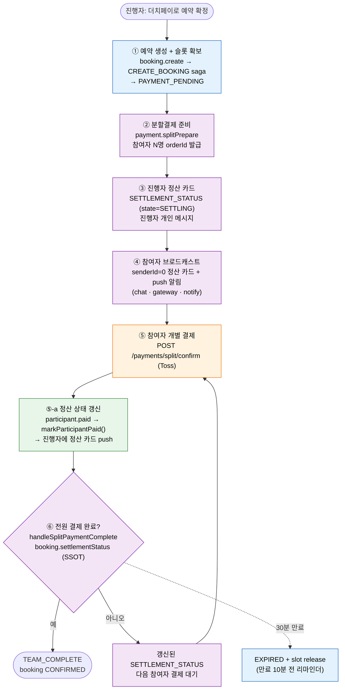

# 더치페이(분할결제) — AGENT × SAGA × BOOKING 통합 워크플로우

> 최종 수정: 2026-05-24
> **연계 문서**: 에이전트 전체 플로우 [`AGENT.md`](./AGENT.md) · 카드 표준 [`AGENT_CARD.md`](./AGENT_CARD.md) · saga 보상/결제실패 [`SAGA.md`](./SAGA.md) · 예약/정산 상태 [`BOOKING.md`](./BOOKING.md)

더치페이는 **팀 부킹 위에 얹힌 가장 복잡한 cross-service 플로우**다. 책임이 agent / saga / booking / payment 네 서비스에 걸쳐 있어, 본 문서가 **end-to-end 단일 진입점(navigator)** 역할을 한다. 각 부분의 상세는 해당 문서로 링크한다.

## 1. 책임 분담 (한눈에)

| 단계 | 처리 주체 | 핵심 동작 | 상세 |
| -- | -- | -- | -- |
| ① 예약 생성 + 슬롯 확보 | **SAGA** (booking-service 경유) | `booking.create` → CREATE_BOOKING saga → `PAYMENT_PENDING` | [SAGA.md §4.2](./SAGA.md) |
| ② 분할결제 준비 | **AGENT → payment** | `payment.splitPrepare` → 참여자 N명분 `orderId` 발급 | [§6](#6-분할결제-준비-paymentsplitprepare) |
| ③ 진행자 정산 카드 | **AGENT** | `SETTLEMENT_STATUS`(state=SETTLING) HTTP 응답 — 진행자 개인 메시지 | [§3](#3-agent-처리-부분) |
| ④ 참여자 브로드캐스트 | **AGENT → chat/gateway/notify** | `senderId=0` + `targetUserIds` 정산 카드 + push 알림 | [§3](#3-agent-처리-부분), [AGENT.md §9](./AGENT.md) |
| ⑤ 참여자 개별 결제 | **payment** | `POST /api/user/payments/split/confirm` (Toss SDK) | [BOOKING.md §3.9](./BOOKING.md) |
| ⑤-a 정산 상태 push | **BOOKING** | `participant.paid` → `markParticipantPaid()` → 진행자에 정산 카드 | [BOOKING.md §3.7](./BOOKING.md) |
| ⑥ 정산 갱신/완료 | **AGENT + BOOKING** | `handleSplitPaymentComplete` → allPaid 확인 → `TEAM_COMPLETE` / booking `CONFIRMED` | [§3](#3-agent-처리-부분), [BOOKING.md §9.6](./BOOKING.md) |
| 만료 | **JOB + BOOKING** | 리마인더 → `EXPIRED` → slot release | [§7](#7-타임라인--만료) |

## 2. End-to-end 워크플로우

처리 주체를 색상으로 구분 — 🟪 **AGENT** · 🟦 **SAGA** · 🟩 **BOOKING** · 🟧 **PAYMENT**. 단계 번호는 [§1 책임 분담표](#1-책임-분담-한눈에)와 일치한다.



## 3. AGENT 처리 부분

에이전트는 **카드 생성·브로드캐스트·정산 완료 판정**을 담당한다. (카드 형태는 [AGENT_CARD.md](./AGENT_CARD.md), 실시간 전달 인프라는 [AGENT.md §9](./AGENT.md))

- **③ 진행자 응답**: `handleDirectBooking`의 더치페이 분기 → `SETTLEMENT_STATUS` 카드를 HTTP 응답으로 반환(진행자 개인, state=`SETTLING`). 진행자 본인 결제분은 정산 카드 broadcast 대상에서 제외.
- **④ 참여자 브로드캐스트**: `senderId=0` + `metadata.targetUserIds`로 chat-service 저장 후 chat-gateway가 서버사이드 타겟팅으로 해당 참여자에게만 전달. 동시에 notify로 push.
- **⑥ 정산 완료 판정**: `handleSplitPaymentComplete`가 `booking.settlementStatus`(SSOT)로 `allPaid` 확인. 전원 완료 시 `completeTeam` → `TEAM_COMPLETE`. groupMode면 다음 팀(`nextTeam`)으로 이어진다.

관련 카드: `SETTLEMENT_STATUS`, `TEAM_COMPLETE` → [AGENT_CARD.md §4](./AGENT_CARD.md)
관련 요청 필드: `splitPaymentComplete`, `splitOrderId`, `sendReminder` → [AGENT_CARD.md §6](./AGENT_CARD.md)

## 4. SAGA 처리 부분

saga-service는 **예약 생성 트랜잭션과 결제 확정/실패 보상**을 담당한다.

- **CREATE_BOOKING**: 슬롯 점유 → `PAYMENT_PENDING` 도달 → [SAGA.md §4.2](./SAGA.md)
- **PAYMENT_CONFIRMED / FAILED / TIMEOUT**: 전원 결제 후 확정, 실패·타임아웃 시 보상(슬롯 release) → [SAGA.md §4.5, §4.6](./SAGA.md)
- **더치페이 예외 처리 / 통합 워크플로우**: 부분 결제·만료 등 엣지 → [SAGA.md §6.5, §6.6](./SAGA.md)

## 5. BOOKING 처리 부분

booking-service는 **분할결제 상태의 SSOT**다.

- **결제 방법별 saga 경로** → [BOOKING.md §3.3](./BOOKING.md)
- **정산 상태(파생 — 조회 시 계산)**: `paidCount` / `allPaid` 산출, `markParticipantPaid()` → [BOOKING.md §3.7](./BOOKING.md)
- **SplitStatus / ParticipantStatus**: 분할결제·참여자 상태 enum → [BOOKING.md §3.8, §3.9](./BOOKING.md)
- **Phase 3 더치페이 + 실시간 알림** → [BOOKING.md §9.6, §9.7](./BOOKING.md)

## 6. 분할결제 준비 (payment.splitPrepare)

```typescript
// agent-service → payment-service
NATS send 'payment.splitPrepare' {
  bookingId: number,
  participants: [
    { userId: number, userName: string, userEmail: string, amount: number }
  ],
  expiredAt: string  // 현재 + 30분
}
// → PaymentSplit 레코드 N개 생성, 각각 고유 orderId 발급
```

참여자 브로드캐스트 메시지(senderId=0) 구조:

```typescript
NATS send 'chat.messages.save' {
  id: uuid, roomId, senderId: 0, senderName: 'AI 예약 도우미',
  messageType: 'AI_ASSISTANT',
  metadata: JSON.stringify({
    state: 'SETTLING',
    actions: [{ type: 'SETTLEMENT_STATUS', data: settlementData }],
    targetUserIds: [2, 3, 4]   // chat-gateway 서버사이드 타겟팅 키
  })
}
```

## 7. 타임라인 & 만료

| 시점 | 동작 | 주체 |
| -- | -- | -- |
| 슬롯 확보 시 | `expiredAt` = 현재 + 30분 | payment (splitPrepare) |
| 만료 10분 전 | 미결제 참여자에게 리마인더 | job-service |
| 만료 시 | PaymentSplit → `EXPIRED`, slot release | saga 보상 ([SAGA.md §6.5](./SAGA.md)) |

## 8. 검증 (e2e)

| 테스트 | 범위 |
| -- | -- |
| `apps/e2e-dev-api/tests/user/ai-agent-scenarios.spec.ts` F2 | agent 경유 2인 더치페이 풀결제 (SETTLING → 토스 우회 승인 → TEAM_COMPLETE) |
| `apps/e2e-dev-api/tests/payment/dutch-happy-path.spec.ts` | 4명 더치페이 풀플로우 → booking CONFIRMED |

토스 결제는 `TOSS_TEST_BYPASS`(dev) 환경에서 `paymentKey="e2e_test_*"`로 실 API 우회 승인한다.
