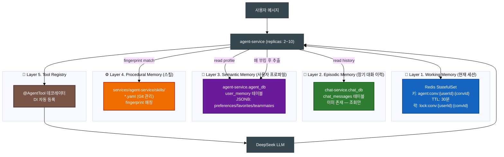
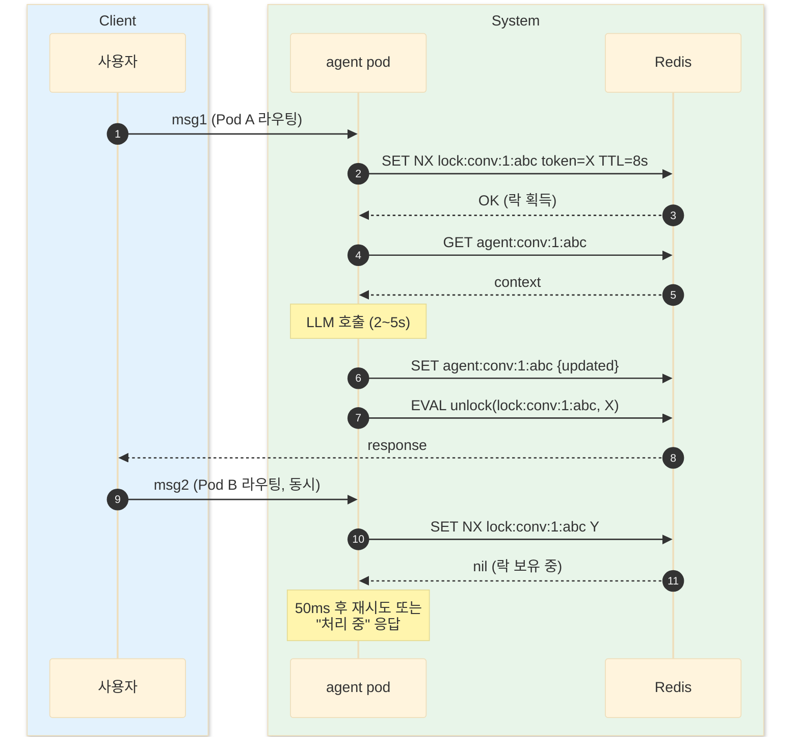
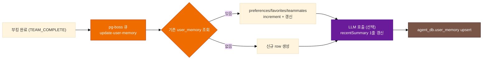
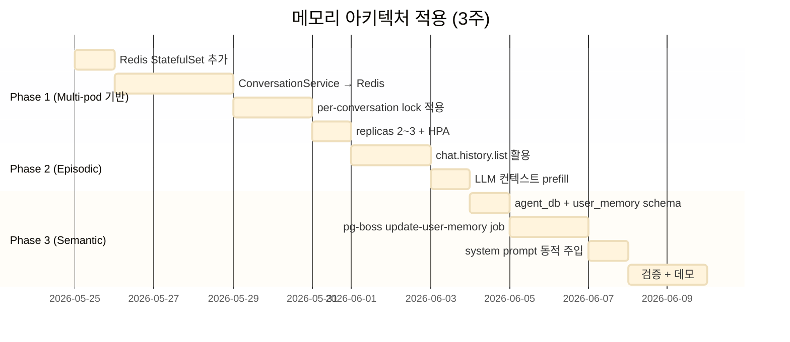

# AI 에이전트 메모리 아키텍처 (Hermes 5-Layer)

> 최종 수정일: 2026-05-22 (v0.1)
>
> **관계**: 본 문서는 `docs/workflow/AGENT.md`(워크플로우)의 **상태 저장/회상 메커니즘**을 담당한다. AGENT.md가 "어떻게 처리하는가"라면, 본 문서는 "무엇을 어디에 기억하고 어떻게 꺼내는가"이다.

---

## 1. 개요

### 1.1 목적

| 목표 | 구현 |
|------|------|
| **Multi-pod 안전성** | Working memory를 pod-local NodeCache → Redis로 |
| **사용자별 이력 활용** | 모든 사용자 메시지가 이미 `chat_db`에 있음 — agent-service가 조회 활용 |
| **개인화된 부킹 비서** | "예약해줘" → 사용자 과거 패턴으로 즉시 추천 |
| **반복 작업 자동화** | 검증된 부킹 절차를 Skill YAML로 저장, fingerprint 매칭 |

### 1.2 배경 — 현재 한계

| 약점 | 영향 |
|------|------|
| `ConversationService`가 NodeCache (in-memory) | 서비스 재시작/multi-pod 시 컨텍스트 소실 |
| 사용자별 과거 부킹 패턴 미활용 | "예약해줘"가 매번 처음부터 정보 수집 |
| Tool 실행이 monolithic switch (1236 lines) | 신규 tool 추가 시 3파일 수정, 유지보수 부담 |
| 동일 사용자 동시 요청 → race condition 위험 | 진행 단계 손상 가능 |

### 1.3 적용 방향 — Hermes Agent 차용

LLM 에이전트 분야의 메모리 계층 패턴(Hermes / MemGPT / Mem0)을 부킹 도메인에 적용. **단일 저장소(Redis 등)에 모두 두지 않고 계층별로 적합한 저장소 선택**.

---

## 2. 전체 아키텍처



### 2.1 Layer 요약

| Layer | 이름 | 저장소 | TTL | 적용 시점 | 비고 |
|:-----:|------|--------|:---:|:--------:|------|
| 1 | Working Memory | Redis | 30분 | **Phase 1** | multi-pod 필수 |
| 2 | Episodic Memory | `chat_db` (기존) | 영구 | **Phase 2** | 인프라 추가 0 |
| 3 | Semantic Memory | `agent_db` (신규) | 영구 | **Phase 3** | 개인화 핵심 |
| 4 | Procedural Memory | Git (`skills/*.yaml`) | 영구 | 미적용 (future) | 반복 사용자 ROI |
| 5 | Tool Registry | 코드 (decorator) | — | 미적용 (future) | 유지보수성 |

---

## 3. Layer 1 — Working Memory (Phase 1)

### 3.1 책임

현재 대화 세션의 휘발성 상태:
- `messages[]` — 최근 N턴 (현재 10턴)
- `slots` — 구조화 정보 (clubId, slotId, currentTeamMembers, completedTeams, paymentMethod 등)
- `state` — FSM (IDLE → ANALYZING → ... → COMPLETED)
- tool history (한 응답 내)

### 3.2 저장 방식 — Redis

```
키 스키마:
  agent:conv:{userId}:{conversationId}    Hash 또는 JSON String
  lock:conv:{userId}:{conversationId}     String (TTL 짧음, distributed lock)

TTL:
  conv: 1800초 (30분) — 기존 CONVERSATION_TTL 동일
  lock: 8초 — LLM 평균 응답 시간 + 마진

크기:
  대화당 평균 5~10KB
  활성 사용자 1만 → ~100MB (작은 Redis로 충분)
```

### 3.3 Multi-pod 동시성 보장 — Per-conversation Lock



### 3.4 NestJS 통합

```typescript
@Injectable()
export class ConversationService {
  // NodeCache → Redis client 교체
  constructor(@InjectRedis() private readonly redis: Redis) {}

  async withLock<T>(userId: number, convId: string, fn: () => Promise<T>): Promise<T> {
    const key = `lock:conv:${userId}:${convId}`;
    const token = randomUUID();
    const ok = await this.redis.set(key, token, 'PX', 8000, 'NX');
    if (!ok) throw new ConversationBusyException();
    try { return await fn(); }
    finally { await this.unlockWithToken(key, token); }   // Lua script
  }
}
```

### 3.5 Redis 인프라

```yaml
# k8s/charts/parkgolf/templates/redis.yaml (신규)
kind: StatefulSet
spec:
  replicas: 1   # 초기 단일 인스턴스 (트래픽 증가 시 Sentinel/Cluster)
  containers:
    - name: redis
      image: redis:7-alpine
      resources:
        requests: { cpu: 50m, memory: 128Mi }
        limits:   { cpu: 250m, memory: 512Mi }
      args: ["--maxmemory", "256mb", "--maxmemory-policy", "allkeys-lru"]
```

---

## 4. Layer 2 — Episodic Memory (Phase 2)

### 4.1 책임

사용자의 **모든 과거 대화 이력**. 단순 메시지 + AI 응답 + 부킹 결과.

### 4.2 저장소 — 기존 `chat-service.chat_db` 재활용

```
이미 chat_messages 테이블에 모두 저장 중:
  - sender_id, sender_name, content
  - type (TEXT | AI_USER | AI_ASSISTANT)
  - metadata (JSON — actions, conversationId, state)
  - created_at
```

→ **agent-service가 신규 인프라 0으로 활용 가능**. chat-service NATS `chat.messages.list({roomId, userId})` 호출 1회 추가.

### 4.3 활용 패턴 — LLM 컨텍스트 prefill

LLM 호출 직전:

```typescript
// llm-orchestrator.service.ts
const recentBookings = await this.toolExecutor.getUserRecentBookings(userId, { limit: 5 });
const summary = formatBookingSummary(recentBookings);
messages.unshift({
  role: 'user',
  content: `[시스템 정보] 최근 부킹 이력: ${summary}. 이 메시지엔 직접 응답하지 마세요.`,
});
```

### 4.4 활용 예시

| 사용자 입력 | Before | After (Layer 2) |
|-------------|--------|----------------|
| "지난번처럼" | "어떤 예약이요?" 추가 질문 | 최근 부킹 정보 system message → 즉시 동일 슬롯 추천 |
| "다음주도 같은 시간에" | 시간 입력 요구 | 직전 부킹 시간 추출 → 자동 채움 |

---

## 5. Layer 3 — Semantic Memory (Phase 3)

### 5.1 책임 — "사용자 프로파일 = 당신 기억"

매 대화/부킹에서 추출된 **개인화된 사실**. Episodic가 raw 데이터라면 Semantic은 요약/추출된 의미.

### 5.2 저장소 — `agent_db.user_memory` (신규)

```prisma
// services/agent-service/prisma/schema.prisma (신규)
model UserMemory {
  userId            Int       @id @map("user_id")
  preferences       Json?     // { preferredTimes: ["weekend_morning"], paymentMethod: "dutchpay", avgGroupSize: 4 }
  favoriteClubs     Json?     // [{ clubId: 1, name: "강남탄천", visitCount: 12 }]
  frequentTeammates Json?     // [{ userId: 5, name: "김민수", count: 8 }]
  recentSummary     String?   // LLM 1줄 요약 (선택)
  updatedAt         DateTime  @updatedAt @map("updated_at")
  createdAt         DateTime  @default(now()) @map("created_at")

  @@map("user_memory")
}
```

### 5.3 업데이트 시점



규칙 기반 우선 (LLM 호출은 비용 절약 위해 주기적):
- preferences.preferredTimes: 부킹 시간대 빈도 분석
- favoriteClubs: clubId 횟수 누적
- frequentTeammates: currentTeamMembers 횟수 누적

### 5.4 활용 — system prompt 동적 주입

```typescript
// llm-orchestrator.service.ts (Phase 3 추가)
const memory = await this.userMemoryService.get(userId);
if (memory) {
  const profile = formatProfile(memory); // "선호: 주말 오전 / 자주: 강남탄천 / 친구: 김민수, 철수"
  systemMessages.push({
    role: 'system',
    content: `[사용자 프로파일] ${profile}. 부킹 추천 시 이를 우선 고려하세요.`,
  });
}
```

### 5.5 활용 예시

| 사용자 입력 | LLM 응답 (Layer 3 적용 후) |
|-------------|--------------------------|
| "예약해줘" | "지난번처럼 강남탄천 토요일 오전 9시로 추천드릴게요. 결제는 더치페이로?" |
| "친구들과" | "자주 함께하시는 김민수, 철수님과 진행할까요?" |
| "결제는 평소대로" | dutchpay 자동 선택 (사용자 추가 입력 없이) |

### 5.6 프라이버시 — 사용자 동의

- 회원가입/설정에 "AI 비서가 부킹 패턴을 기억하도록 허용" 토글
- OFF 시 Layer 3 미활용 (Layer 1, 2만)
- 사용자 요청 시 `DELETE FROM user_memory WHERE user_id = ?` (계정 삭제 정책 §X 참조)

---

## 6. Layer 4 — Procedural Memory (미적용, future)

### 6.1 책임

검증된 부킹 절차를 **재사용 가능한 Skill YAML**로 저장. PARTNER_INTEGRATION.md §16의 `PartnerAdapterSkill` 패턴과 동일 구조.

### 6.2 저장 위치 — Git 관리

```
services/agent-service/skills/
├── weekly-dutchpay.skill.yaml      # 매주 같은 멤버 더치페이
├── group-onsite-weekend.skill.yaml # 주말 그룹 현장결제
└── solo-card-quick.skill.yaml      # 1인 카드결제 빠른 부킹
```

### 6.3 Skill 예시

```yaml
name: weekly-dutchpay
description: 매주 같은 멤버와 같은 시간대 더치페이 예약
fingerprint:
  trigger: ["매주", "지난주처럼", "같은 멤버"]
  requires: [chatRoomId, previousBookingExists]
procedure:
  - tool: get_user_recent_booking
    args: { userId: $ctx.userId }
  - tool: search_clubs_with_slots
    args:
      location: $last.location
      date: $next_same_weekday
  - tool: create_booking
    args:
      slotId: $matched.slotId
      paymentMethod: dutchpay
      teamMembers: $last.teamMembers
validation:
  requireSlotMatch: true
```

### 6.4 작동

```
사용자 자연어 → fingerprint trigger 매칭 → procedure 실행 → LLM 호출 0회 (또는 1회)
```

### 6.5 도입 트리거

- 반복 사용자 30% 이상
- 평균 부킹 단계 수 줄이기 목표

---

## 7. Layer 5 — Tool Registry (미적용, future)

### 7.1 책임

현재 `tool-executor.service.ts` (1236 lines) 의 switch case → 데코레이터 기반 동적 등록.

### 7.2 구조 (예정)

```typescript
@AgentTool({
  name: 'get_nearby_clubs',
  description: '근처 골프장 검색...',
  parameters: { latitude: { type: 'number' }, longitude: { type: 'number' } },
})
@Injectable()
export class GetNearbyClubsTool implements AgentToolHandler {
  constructor(@Inject('LOCATION_SERVICE') private locationClient: ClientProxy) {}

  async execute(args, ctx) {
    return firstValueFrom(this.locationClient.send('location.findNearby', args));
  }
}
```

NestJS DI가 자동 수집 → ToolRegistry가 LLM tools 배열 동적 생성 → 신규 tool 추가 시 **1파일만** 수정.

---

## 8. Multi-pod 운영

### 8.1 권장 설정

| 환경 | replicas | min | max | HPA target |
|------|:--------:|:---:|:---:|:----------:|
| dev | 2 | 2 | 5 | cpu 70% |
| prod | 3 | 2 | 10 | cpu 70% / memory 75% |

### 8.2 NATS queue group 자동 부하 분산

NestJS `@MessagePattern('agent.chat')` 기본 queue group 동작 → 라운드로빈 자동.

### 8.3 동시성 안전망 — 3-Layer Lock 패턴

부킹 도메인 표준 패턴(`docs/workflow/BOOKING.md` 참조):

```
Layer A. Redis Distributed Lock     (per-conversation, 본 §3.3)
       ↓
Layer B. Saga Orchestration         (booking flow — saga-service)
       ↓
Layer C. DB Atomic Update           (Prisma { increment }, version, UNIQUE)
```

→ agent-service는 **Layer A 도입이 핵심** (Layer B/C는 booking-service에서 이미 처리).

### 8.4 Redis 단일 인스턴스 한계 / 확장

| 트래픽 | 권장 구성 |
|--------|----------|
| <1000 활성 사용자 | Redis 단일 인스턴스 |
| 1000~10000 | Redis Sentinel (HA, replica 1~2) |
| 10000+ | Redis Cluster (sharding) |

---

## 9. 적용 Phase 로드맵



### 9.1 Phase별 작업 상세

| Phase | 작업 | 산출물 | 위험 |
|-------|------|--------|:----:|
| **1. Multi-pod 기반** | Redis 도입 + ConversationService 리팩 + lock + replicas | helm chart `redis.yaml`, `ConversationService.ts` 전면 개정, HPA manifest | 낮음 |
| **2. Episodic** | chat-service 조회 + LLM prefill | `tool-executor.getUserRecentBookings`, `llm-orchestrator` 추가 | 낮음 |
| **3. Semantic** | agent_db 신설 + user_memory 추출 + system prompt | `prisma/schema.prisma`, `user-memory.service.ts`, pg-boss worker | 중 (LLM 추출 정확도) |
| 4. Procedural (future) | skills/*.yaml 인프라 + fingerprint 매칭 | `services/agent-service/skills/`, `skill-matcher.service.ts` | 중 |
| 5. Tool Registry (future) | tool-executor 분해 + @AgentTool 데코레이터 | `tools/*.tool.ts` 10+개 | 낮음 |

### 9.2 의사결정 포인트

| 항목 | 옵션 |
|------|------|
| Redis HA | Phase 1엔 단일 인스턴스 / prod 트래픽 본 후 Sentinel |
| user_memory LLM 추출 빈도 | (a) 매 부킹 후 즉시 / (b) 일 1회 batch / **(c) 규칙 기반 + 주 1회 LLM 요약** |
| 프라이버시 토글 | (a) 기본 OFF / **(b) 기본 ON + 설정에서 OFF 가능** |
| Layer 4/5 도입 시점 | (a) 사용자 1만 명 이후 / (b) 반복 사용자 30% 이후 |

---

## 10. 영향 / 의존성

### 10.1 변경되는 파일/리소스

| 영역 | 파일 / 리소스 | Phase |
|------|-------------|:----:|
| Helm chart | `k8s/charts/parkgolf/templates/redis.yaml` (신규) | 1 |
| Helm chart | `values.yaml` services에 replicas: 2 + HPA | 1 |
| agent-service | `conversation.service.ts` (NodeCache → Redis) | 1 |
| agent-service | `llm-orchestrator.service.ts` (Episodic prefill) | 2 |
| agent-service | `prisma/schema.prisma` 신규 (UserMemory) | 3 |
| agent-service | `user-memory.service.ts` (신규) | 3 |
| agent-service | `pg-boss` job: `update-user-memory` | 3 |
| chat-service | `chat.history.list` NATS 추가 (없으면) | 2 |

### 10.2 관련 문서

| 문서 | 관계 |
|------|------|
| `docs/workflow/AGENT.md` | 워크플로우 본문 — 본 문서는 그 메모리 메커니즘 |
| `docs/workflow/SAGA.md` | 부킹 saga 패턴 — Layer B(Saga) 참조 |
| `docs/workflow/PARTNER_INTEGRATION.md` §16 | PartnerAdapterSkill — Layer 4의 형제 패턴 |
| `docs/policy/ACCOUNT_DELETION.md` | 사용자 삭제 시 agent_db.user_memory 정리 정책 |
| `docs/architecture/OBSERVABILITY.md` | Redis / agent-service 모니터링 |

---

## 11. 관련 파일 / 원천 자료

| 파일 | 용도 |
|------|------|
| `services/agent-service/src/booking-agent/service/conversation.service.ts` | Phase 1 전면 개정 대상 |
| `services/agent-service/src/booking-agent/service/llm-orchestrator.service.ts` | Phase 2/3 prefill 주입 위치 |
| `services/agent-service/src/booking-agent/service/tool-executor.service.ts` | Phase 5 분해 대상 (1236 lines) |
| `services/chat-service/src/chat/chat.service.ts` | Phase 2 `chat.history.list` 활용 |
| `services/saga-service/src/saga/engine/saga-engine.service.ts` | 동시성 패턴 reference (이미 multi-pod 안전) |
| `services/booking-service/src/booking/service/booking-saga-step.service.ts` | Layer C(DB Atomic) reference (`{ increment }`) |

---

## 12. 변경 이력

| 날짜 | 버전 | 변경 |
|------|------|------|
| 2026-05-22 | 0.1 | 최초 작성. Hermes 5-Layer 메모리 구조 정의 + Phase 1~3 적용 로드맵 + multi-pod 운영 가이드 |
