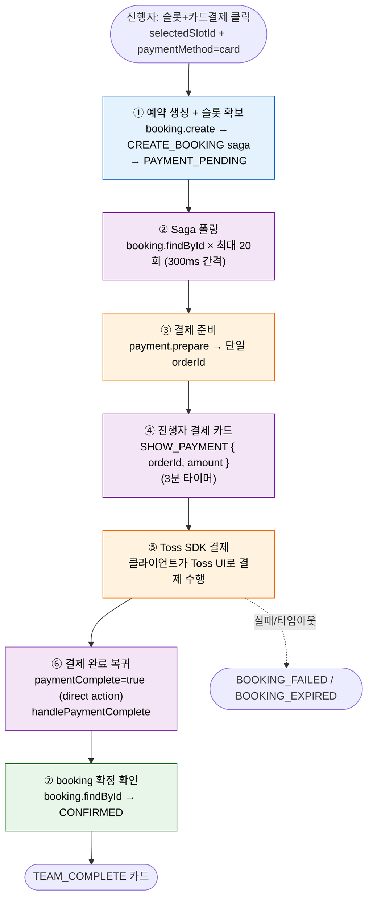
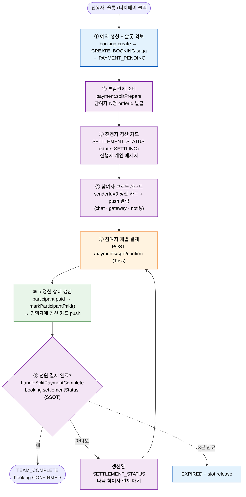
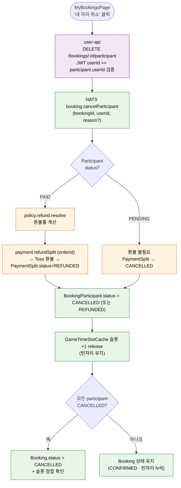

# 결제(현장·카드·더치페이) — AGENT × SAGA × BOOKING × PAYMENT 통합 워크플로우

> 최종 수정: 2026-05-31
> **연계 문서**: 에이전트 전체 플로우 [`AGENT.md`](./AGENT.md) · UI(카드·시각흐름·컴포넌트) [`AGENT_UI.md`](./AGENT_UI.md) · 컨텍스트 조립 [`AGENT_CONTEXT.md`](./AGENT_CONTEXT.md) · saga 보상/결제실패 [`SAGA.md`](./SAGA.md) · 예약/정산 상태 [`BOOKING.md`](./BOOKING.md)

에이전트가 처리하는 **3가지 결제방법(현장·카드·더치페이)의 단일 출처(SSOT)** — 분기·플로우·책임 분담·타임라인·검증.

## 1. 결제방법 분기

결제수단은 **슬롯 카드(`SHOW_SLOTS`)에서 선택**한다(UNI-41). 슬롯 클릭이 `paymentMethod`를 동반해 `handleDirectSlotSelect → handleDirectBooking`으로 직행하며, 모든 경로는 `booking.create` saga 성공 후에 갈라진다. 별도 확인 카드는 없다.

| 결제방법 | `paymentMethod` | 조건 | 동작 |
|---------|-----------------|------|------|
| 현장결제 | `onsite` | 항상 가능 | 예약 생성 → 즉시 `TEAM_COMPLETE` |
| 카드결제 | `card` | 항상 가능 | 예약 생성 → `SHOW_PAYMENT`(참여자명) → Toss 결제 → `TEAM_COMPLETE` |
| 더치페이 | `dutchpay` | 멤버 2명 이상 | 예약 생성 → `SETTLEMENT_STATUS` 진행자/참여자 → 전원 결제 → `TEAM_COMPLETE` |

> 슬롯 카드는 `groupMode`(멤버 2명 이상)일 때만 더치페이 옵션을 노출한다 → [`AGENT_UI.md §5`](./AGENT_UI.md).
>
> 각 단계의 부수효과(saga·prepare·splitPrepare·broadcast·finalize)는 **재개(resume) 계층**(`effect-executor` step-runner + Turn Journal)을 거쳐 멱등하게 처리된다. 중단/재시도 시 COMMITTED 스텝은 재실행 없이 스킵 → [`AGENT.md §14`](./AGENT.md).

## 2. 현장결제

가장 단순한 경로. 슬롯 확정과 동시에 booking이 `CONFIRMED`(결제 미수반)로 들어가며 별도 결제 단계가 없다.

```
[슬롯 + 현장결제 클릭]
   → handleDirectSlotSelect → handleDirectBooking → booking.create (Saga)
   → Saga 폴링(300ms × 20회) 후 CONFIRMED 확인
   → TEAM_COMPLETE 카드
```

후속 처리(체크인·현장 정산)는 운영 영역으로, 에이전트 책임 범위 밖이다.

## 3. 카드결제

진행자 한 명이 전체 금액을 Toss SDK로 결제한다.

처리 주체를 색상으로 구분 — 🟪 **AGENT** · 🟦 **SAGA** · 🟩 **BOOKING** · 🟧 **PAYMENT**.



- `payment.prepare`로 단일 `orderId` 발급 → `SHOW_PAYMENT` 카드(3분 타이머) → 클라이언트가 Toss SDK 호출 → 성공 시 `paymentComplete=true` direct action 으로 복귀.
- `handlePaymentComplete`가 booking을 다시 조회해 `CONFIRMED` 확정 후 `TEAM_COMPLETE`.
- 카드 형태(SHOW_PAYMENT, TEAM_COMPLETE) → [`AGENT_UI.md §4·§5`](./AGENT_UI.md)

## 4. 더치페이 — 책임 분담 (한눈에)

더치페이는 **팀 부킹 위에 얹힌 가장 복잡한 cross-service 플로우**다. 책임이 agent / saga / booking / payment 네 서비스에 걸쳐 있어, 본 절이 **end-to-end 단일 진입점(navigator)** 역할을 한다. 각 부분의 상세는 해당 문서로 링크한다.

| 단계 | 처리 주체 | 핵심 동작 | 상세 |
| -- | -- | -- | -- |
| ① 예약 생성 + 슬롯 확보 | **SAGA** (booking-service 경유) | `booking.create` → CREATE_BOOKING saga → `PAYMENT_PENDING` | [SAGA.md §4.2](./SAGA.md) |
| ② 분할결제 준비 | **AGENT → payment** | `payment.splitPrepare` → 참여자 N명분 `orderId` 발급 | [§9](#9-분할결제-준비-paymentsplitprepare) |
| ③ 진행자 정산 카드 | **AGENT** | `SETTLEMENT_STATUS`(state=SETTLING) HTTP 응답 — 진행자 개인 메시지 | [§6](#6-agent-처리-부분) |
| ④ 참여자 브로드캐스트 | **AGENT → chat/gateway/notify** | `senderId=0` + `targetUserIds` 정산 카드 + push 알림 | [§6](#6-agent-처리-부분), [AGENT.md §9](./AGENT.md) |
| ⑤ 참여자 개별 결제 | **payment** | `POST /api/user/payments/split/confirm` (Toss SDK) | [BOOKING.md §3.9](./BOOKING.md) |
| ⑤-a 정산 상태 push | **BOOKING** | `participant.paid` → `markParticipantPaid()` → 진행자에 정산 카드 | [BOOKING.md §3.7](./BOOKING.md) |
| ⑥ 정산 갱신/완료 | **AGENT + BOOKING** | `handleSplitPaymentComplete` → allPaid 확인 → `TEAM_COMPLETE` / booking `CONFIRMED` | [§6](#6-agent-처리-부분), [BOOKING.md §9.6](./BOOKING.md) |
| 만료 | **JOB + BOOKING** | 리마인더 → `EXPIRED` → slot release | [§10](#10-타임라인--만료) |

## 5. 더치페이 — End-to-end 워크플로우

처리 주체를 색상으로 구분 — 🟪 **AGENT** · 🟦 **SAGA** · 🟩 **BOOKING** · 🟧 **PAYMENT**. 단계 번호는 [§4 책임 분담표](#4-더치페이--책임-분담-한눈에)와 일치한다.



## 6. AGENT 처리 부분

에이전트는 **카드 생성·브로드캐스트·정산 완료 판정**을 담당한다. (카드 형태는 [AGENT_UI.md](./AGENT_UI.md), 실시간 전달 인프라는 [AGENT.md §9](./AGENT.md))

- **③ 진행자 응답**: `handleDirectBooking`의 더치페이 분기 → `SETTLEMENT_STATUS` 카드를 HTTP 응답으로 반환(진행자 개인, state=`SETTLING`). 진행자 본인 결제분은 정산 카드 broadcast 대상에서 제외.
- **④ 참여자 브로드캐스트**: `senderId=0` + `metadata.targetUserIds`로 chat-service 저장 후 chat-gateway가 서버사이드 타겟팅으로 해당 참여자에게만 전달. 동시에 notify로 push.
- **⑥ 정산 완료 판정**: `handleSplitPaymentComplete`가 `booking.settlementStatus`(SSOT)로 `allPaid` 확인. 전원 완료 시 `finalizeBooking` → `TEAM_COMPLETE`(예약 완료, 종료). 1예약=최대4명 단위라 다음 팀 단계는 없다(UNI-36).

관련 카드: `SETTLEMENT_STATUS`, `TEAM_COMPLETE` → [AGENT_UI.md §4](./AGENT_UI.md)
관련 요청 필드: `splitPaymentComplete`, `splitOrderId`, `sendReminder` → [AGENT_UI.md §6](./AGENT_UI.md)

## 7. SAGA 처리 부분

saga-service는 **예약 생성 트랜잭션과 결제 확정/실패 보상**을 담당한다.

- **CREATE_BOOKING**: 슬롯 점유 → `PAYMENT_PENDING` 도달 → [SAGA.md §4.2](./SAGA.md)
- **PAYMENT_CONFIRMED / FAILED / TIMEOUT**: 전원 결제 후 확정, 실패·타임아웃 시 보상(슬롯 release) → [SAGA.md §4.5, §4.6](./SAGA.md)
- **더치페이 예외 처리 / 통합 워크플로우**: 부분 결제·만료 등 엣지 → [SAGA.md §6.5, §6.6](./SAGA.md)

## 8. BOOKING 처리 부분

booking-service는 **분할결제 상태의 SSOT**다.

- **결제 방법별 saga 경로** → [BOOKING.md §3.3](./BOOKING.md)
- **정산 상태(파생 — 조회 시 계산)**: `paidCount` / `allPaid` 산출, `markParticipantPaid()` → [BOOKING.md §3.7](./BOOKING.md)
- **SplitStatus / ParticipantStatus**: 분할결제·참여자 상태 enum → [BOOKING.md §3.8, §3.9](./BOOKING.md)
- **Phase 3 더치페이 + 실시간 알림** → [BOOKING.md §9.6, §9.7](./BOOKING.md)

## 9. 분할결제 준비 (payment.splitPrepare)

```typescript
// agent-service → payment-service
NATS send 'payment.splitPrepare' {
  bookingId: number,
  participants: [
    { userId: number, userName: string, userEmail: string, amount: number }
  ],
  expiredAt: string  // 현재 + 3분 (기본값 — saga payment-timeout과 동기화)
}
// → PaymentSplit 레코드 N개 생성, 각각 고유 orderId 발급
```

참여자 브로드캐스트 메시지(senderId=0) 구조:

```typescript
NATS send 'chat.messages.save' {
  id: uuid, roomId, senderId: 0, senderName: 'AI 예약 도우미',
  messageType: 'AI_ASSISTANT',
  metadata: JSON.stringify({
    state: 'SETTLING',
    actions: [{ type: 'SETTLEMENT_STATUS', data: settlementData }],
    targetUserIds: [2, 3, 4]   // chat-gateway 서버사이드 타겟팅 키
  })
}
```

## 10. 타임라인 & 만료

| 시점 | 동작 | 주체 |
| -- | -- | -- |
| 슬롯 확보 시 | `expiredAt` = 현재 + **3분** (saga `PAYMENT_TIMEOUT_DELAY_SECONDS`와 동기화) | payment (splitPrepare) |
| 만료 전 (수동) | 진행자가 `sendReminder` 버튼 → 미결제자에게 push (스케줄 리마인더 아님) | agent → notify |
| 만료 시 | PaymentSplit → `EXPIRED`, slot release | saga 보상 ([SAGA.md §6.5](./SAGA.md)) |

> 카드결제는 `SHOW_PAYMENT` 카드의 **3분 타이머**(Toss SDK UI) — 슬롯 확보 만료(saga `PAYMENT_TIMEOUT_DELAY_SECONDS`)와 동일 시간이지만 다른 레이어.

## 11. 취소 워크플로우 (마이페이지 단일 진입)

예약/결제 취소는 **마이페이지 예약 내역**(`MyBookingsPage`)이 단일 진입점이다. 챗(에이전트)은 예약 생성·결제만 다루며, 진행 중 흐름의 슬롯 정리(`cancelBooking` direct action — `direct-action-handler.service.ts:399`)는 그대로 유지하되 **확정된 예약의 취소는 챗 책임 밖**이다.

### 11.1 취소 경로 매트릭스

| 경로 | 트리거 | 처리 주체 | 결과 | 구현 상태 |
| -- | -- | -- | -- | -- |
| **A. 자동 보상 (오류·타임아웃)** | 챗 흐름 중 결제 실패·타임아웃 | saga (`PAYMENT_TIMEOUT` / `PAYMENT_FAILED`) | slot release + `BOOKING_FAILED` / `BOOKING_EXPIRED` 카드 | ✅ 기존 |
| **B. 사용자 능동 — 단일 결제** (현장·카드) | 마이페이지 (booker) | saga (`saga.booking.cancel`) | 전체 booking 취소 + 슬롯 전체 release + 환불 | ✅ 기존 |
| **C. 사용자 능동 — 더치페이 본인 자리** | 마이페이지 (각 participant) | `booking.cancelParticipant` (신규) | 본인 PaymentSplit 환불 + 슬롯 1자리 release (빈자리 유지) | ❌ 신규 작업 |

> 본 절은 신규 경로 **C** 만 명세한다. A·B는 [SAGA.md](./SAGA.md), [BOOKING.md](./BOOKING.md) 참조.

### 11.2 데이터 모델 (변경 없음)

| 모델 | 역할 | 비고 |
| -- | -- | -- |
| `Booking` (1건) | 슬롯 점유의 SSOT | `userId`는 진행자(booker) 메타 — 본인 자리 취소해도 유지 |
| `BookingParticipant` (N건) | 자리별 상태·결제 추적 | `status`: PENDING \| PAID \| CANCELLED \| REFUNDED |
| `PaymentSplit` (N건, 더치페이만) | 분할결제 orderId·환불 추적 | `status`: PENDING \| PAID \| EXPIRED \| CANCELLED \| REFUNDED |

### 11.3 마이페이지 노출 — 참여자도 본인 예약 표시

현재 `MyBookingsPage` → `booking.search`는 `Booking.userId = me`만 매칭하므로 더치페이 참여자는 본인 자리를 못 본다. 다음으로 확장:

```
WHERE Booking.userId = :userId
   OR EXISTS (SELECT 1 FROM BookingParticipant
              WHERE bookingId = Booking.id AND userId = :userId)
```

응답 DTO 확장 (기존 호출자 무영향):
- `myRole: 'BOOKER' | 'MEMBER'`
- `myParticipantStatus?: 'PENDING' | 'PAID' | 'CANCELLED' | 'REFUNDED'`
- `myPaymentSplitOrderId?: string` (더치페이 본인 환불 트리거용)

### 11.4 더치페이 본인 자리 취소 흐름



### 11.5 정책 (빈자리 유지)

| 케이스 | 처리 |
| -- | -- |
| 1명 취소 | 슬롯 1자리 release, Booking은 CONFIRMED 유지 |
| booker 본인 자리 취소 | 다른 participant와 동일하게 본인 자리만 취소. `Booking.userId`(메타) 유지 |
| 마지막 participant까지 모두 취소 | `Booking.status = CANCELLED` + 슬롯 정합 확인 |
| 환불 비율 | `policy.refund.resolve(scope, companyId?, clubId?)` — 기존 BOOKING 정책 재사용 |
| 취소 마감 시각 | `policy.cancellation.resolve` 기준 따름 (출발 N시간 전까지) |
| Toss 환불 실패 | **Phase 1**: Participant 상태 보류 + `notify-service` 운영 알림 / **Phase 2**: 운영 데이터 보고 saga 보상으로 승급 검토 |
| 노쇼 | 본 절 범위 밖 (기존 noshow 정책) |

### 11.6 새 NATS 패턴

| 패턴 | NATS Client | 대상 | 용도 |
| -- | -- | -- | -- |
| `booking.cancelParticipant` | BOOKING_SERVICE | booking-service | 개인 자리 취소 + 환불 트리거 + 슬롯 release |
| `payment.refundSplit` | PAYMENT_SERVICE | payment-service | PaymentSplit orderId 단위 Toss 환불 |

### 11.7 UI 분기 (MyBookingsPage / BookingCard / CancelBookingModal)

| 조건 | 노출 액션 | 호출 |
| -- | -- | -- |
| 단일 결제 (현장·카드) & `myRole = BOOKER` | "예약 취소" (기존) | 기존 `cancelBookingMutation` → `saga.booking.cancel` |
| 더치페이 & `myRole = BOOKER` 또는 `MEMBER` | "내 자리 취소" (신규) | 신규 `cancelParticipantMutation` → `booking.cancelParticipant` |
| `myRole = MEMBER` | 예약 카드에 "참여" 배지 | (조회만) |
| `myParticipantStatus = CANCELLED / REFUNDED` | "취소됨" 표기, 액션 없음 | — |

> 챗 UI(`PaymentCard`)의 "취소" 버튼은 흐름 중단 용도라 그대로 유지. (`ConfirmBookingCard`는 UNI-41로 제거됨)

### 11.8 별도 점검 — 타임아웃 시간 코멘트 정합

자동 보상(경로 A)의 타임아웃 코멘트가 코드마다 다름. SSOT는 `PAYMENT_TIMEOUT_DELAY_SECONDS` 환경변수.

| 위치 | 표기 | 비고 |
| -- | -- | -- |
| `saga-pgboss-worker.service.ts:36` | "5분 이상 SLOT_RESERVED" | 코멘트 stale 가능 |
| `payment-failed.saga.ts:12` | "10분 초과" | 코멘트 stale 가능 |
| `AGENT_PAY.md §10` / `AGENT_UI.md SHOW_PAYMENT` | 3분 | 현재 값으로 추정 |

→ 본 작업 마무리 단계에서 실제 환경변수 값 확인 후 코멘트 일괄 정리(별도 task 가능).

---

## 12. 검증 (e2e)

| 테스트 | 범위 |
| -- | -- |
| `apps/e2e-dev-api/tests/user/ai-agent-scenarios.spec.ts` F2 | agent 경유 2인 더치페이 풀결제 (SETTLING → 토스 우회 승인 → TEAM_COMPLETE) |
| `apps/e2e-dev-api/tests/payment/dutch-happy-path.spec.ts` | 4명 더치페이 풀플로우 → booking CONFIRMED |
| `apps/e2e-dev-api/tests/payment/dutch-timeout.spec.ts` | 더치페이 타임아웃 → EXPIRED + slot release |

토스 결제는 `TOSS_TEST_BYPASS`(dev) 환경에서 `paymentKey="e2e_test_*"`로 실 API 우회 승인한다.
