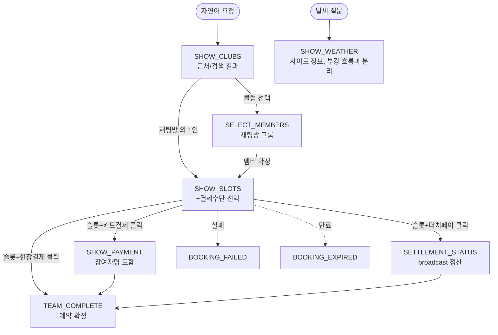

# AI 응답 UI 표준 (카드·흐름·컴포넌트)

> 최종 수정: 2026-05-31
> **연계 문서**: 에이전트 전체 플로우 [`AGENT.md`](./AGENT.md) · 컨텍스트 조립 [`AGENT_CONTEXT.md`](./AGENT_CONTEXT.md) · 결제(현장·카드·더치페이) [`AGENT_PAY.md`](./AGENT_PAY.md) · 부킹 상태/멱등성 [`BOOKING.md`](./BOOKING.md)

AI 응답 UI(카드·시각 흐름·컴포넌트)의 단일 출처(SSOT) — 원칙·흐름·분류·데이터 형태·인터랙션·시각 레이아웃·컴포넌트 props·구현 위치.

## 1. 원칙

> 카드는 (1) 사용자 행동을 유도하거나 (2) 데이터 시각화 가치가 있을 때만 표시한다. **진행 안내는 텍스트로.**

- LLM 텍스트 메시지와 카드 내용이 **중복되지 않도록** 한다.
- 카드가 표시되는 정보(클럽 목록, 슬롯 시간, 날씨 등)는 텍스트로 다시 풀어쓰지 않고 한 줄 안내만 한다.
  - 클럽 카드 → "근처 3곳 찾았어요!" (X: "강남탄천(서울), 잠실(서울)…")
  - 슬롯 카드 → "예약 가능 시간이에요!" (X: "9시 4,000원, 10시 4,000원…")
  - 날씨 카드 → "내일 골프 치기 좋은 날씨예요!" (X: "맑음 22도 습도 50%…")

## 2. 응답 형식

```typescript
{
  message: string
  state: ConversationState
  actions?: Array<{ type: ActionType, data: unknown }>
}
```

## 3. 카드 진행 흐름



부킹 카드 순서는 **골프장 → 멤버(채팅방 그룹) → 슬롯(결제수단 선택 포함)**다. 채팅방 그룹 예약은 멤버 확정 후 인원수 기반으로 슬롯을 조회한다 (UNI-21). 슬롯 카드에서 결제수단(현장/카드/더치)을 고르고 시간을 누르면 **별도 확인 카드 없이** 바로 예약 진행(UNI-41). `SHOW_WEATHER`는 부킹 흐름과 분리된 사이드 정보다.

## 4. 카드 목록 (ActionType)

| ActionType | 분류 | 용도 | 트리거 |
| -- | -- | -- | -- |
| `SHOW_CLUBS` | 정보 결과 | 골프장 목록 | 클릭 → handleDirectClubSelect |
| `SHOW_SLOTS` | 액션 유도 | 타임슬롯 목록 + **결제수단 선택**(현장/카드/더치) | 슬롯+결제수단 클릭 → handleDirectSlotSelect |
| `SHOW_WEATHER` | 정보 결과 | 날씨 (부킹 흐름과 분리) | 정보 표시만 |
| `SELECT_MEMBERS` | 액션 유도 | 팀 멤버 선택 | 클릭 → handleTeamMemberSelect |
| `SHOW_PAYMENT` | 액션 유도 | 카드결제 (Toss SDK, 참여자명 포함) | 3분 타이머 |
| `SETTLEMENT_STATUS` | 결과/상태 | 더치페이 정산 현황 (broadcast) | 리마인더/새로고침 버튼 |
| `TEAM_COMPLETE` | 결과/상태 | 예약 완료 | 종료 (다음 단계 없음) |
| `BOOKING_FAILED` | 결과/상태 | 예약 실패 (사유·대안 안내) | 재시도 |
| `BOOKING_EXPIRED` | 결과/상태 | 결제 타임아웃 안내 | 재시도 |
| `SPLIT_PAYMENT` | (deprecated) | 더치페이 결제 상태 — 현재 `SETTLEMENT_STATUS`로 통합 | — |

> `CONFIRM_BOOKING`(예약정보확인) 카드는 UNI-41로 제거됨 — 결제수단 선택을 `SHOW_SLOTS`로 이동. `TEAM_COMPLETE`의 다음팀/종료 버튼은 UNI-36(팀별순차 제거)으로 제거됨.

> `TASK_PREVIEW`(진행 안내 카드)는 제거됨(UNI-26). 백엔드가 push를 멈추면 전 플랫폼 자동 반영되며, 클라이언트는 알 수 없는 ActionType을 graceful skip한다.

## 5. 카드 데이터

**SHOW_CLUBS**: `{ found, clubs: [{ id, name, address, region }] }`

**SELECT_MEMBERS**:
```json
{
  "clubName": "한밭파크골프장", "date": "2026-02-28",
  "maxPlayers": 4,
  "availableMembers": [
    { "userId": 1, "userName": "김민수", "userEmail": "kim@email.com" },
    { "userId": 2, "userName": "박지영", "userEmail": "park@email.com" }
  ]
}
```
- 진행자(부커)는 자동 선택(🔒). 최대 4명(1예약 단위, UNI-36).

**SHOW_SLOTS**:
```json
{
  "clubName": "한밭파크골프장", "clubAddress": "...", "date": "2026-02-28",
  "groupMode": true,
  "rounds": [{ "gameId": 1, "name": "A코스 오전", "price": 15000,
    "slots": [{ "id": 1, "time": "09:00", "availableSpots": 4, "price": 15000 }]
  }]
}
```
- `groupMode=true`면 슬롯 카드에 더치페이 옵션 노출. 슬롯 클릭 시 선택된 결제수단(현장/카드/더치)을 함께 전송(UNI-41).

**SHOW_PAYMENT**: `{ bookingId, orderId, amount, orderName, clubName, date, time, playerCount, participants: [{ userId, userName }] }`
- `participants`로 결제 카드에 참여자 이름 표시 ("2명 · 김철수, 박영희", UNI-41).

**SETTLEMENT_STATUS**: `{ bookingId, bookerId, clubName, gameName, date, slotTime, totalParticipants, pricePerPerson, totalPrice, paidCount, expiredAt, participants: [{ userId, userName, orderId, amount, status, expiredAt }] }`

**TEAM_COMPLETE**: `{ bookingId, bookingNumber, clubName, date, slotTime, gameName, participants, totalPrice, paymentMethod }`
- 단일 예약 완료(1예약=최대4명, UNI-36). 다음팀/종료·groupSummary는 제거됨.

**BOOKING_FAILED**: `{ reason }` — 예약 실패 사유 안내

**BOOKING_EXPIRED**: 결제 타임아웃 안내

## 6. 카드 인터랙션 (요청 필드)

카드 버튼 클릭은 자연어가 아닌 direct-action 필드로 전송되어 LLM을 우회한다.

| 사용자 액션 | 구조화 요청 필드 |
| -- | -- |
| 골프장 선택 | `selectedClubId`, `selectedClubName` |
| 멤버 확정 | `teamMembers: [{ userId, userName, userEmail }]` |
| 슬롯+결제수단 선택 | `selectedSlotId`, `selectedSlotTime`, `selectedSlotPrice`, `selectedGameName`, `paymentMethod`(onsite\|card\|dutchpay) |
| 예약 취소 | `cancelBooking=true` |
| 결제 완료 | `paymentComplete=true`, `paymentSuccess` |
| 더치페이 결제 완료 | `splitPaymentComplete=true`, `splitOrderId` |
| 리마인더 | `sendReminder=true` |

> 슬롯 클릭이 `paymentMethod`를 동반하면 확인 카드 없이 바로 예약 진행(UNI-41). `confirmBooking`·`nextTeam`·`finishGroup` 요청 필드는 제거됨.

## 7. 카드 시각 흐름 (진행자 화면)

워크플로우 텍스트 요약은 [`AGENT.md §12`](./AGENT.md). 아래는 단계별 카드 UI 레이아웃.

```
진행자 채팅 화면 (AI 모드)
─────────────────────────────────────────

① SHOW_CLUBS 카드
┌──────────────────────────────────────┐
│ 검색 결과 3개의 골프장을 찾았어요      │
│                                      │
│ ┌─────────────────────────────────┐  │
│ │ ⛳ 한밭파크골프장                │  │
│ │ 📍 천안시 동남구...             │  │
│ └─────────────────────────────────┘  │
│ ┌─────────────────────────────────┐  │
│ │ ⛳ 대전파크골프장                │  │
│ │ 📍 대전시 유성구...             │  │
│ └─────────────────────────────────┘  │
└──────────────────────────────────────┘
         ↓ 골프장 카드 클릭

② SELECT_MEMBERS 카드
┌──────────────────────────────────────┐
│ 👥 멤버 선택 (최대 4명)               │
│                                      │
│ ☑ 김민수 (나) 🔒                     │
│ ☑ 박지영                            │
│ ☑ 이준호                            │
│ ☑ 최서연                            │
│ ☐ 정우진                            │
│ ☐ 한소희  ...                       │
│                                      │
│ 선택: 4/4명                          │
│ [취소] [멤버 확정]                    │
└──────────────────────────────────────┘
         ↓ 멤버 확정 클릭

③ SHOW_SLOTS 카드 (결제수단 선택 포함, UNI-41)
┌──────────────────────────────────────┐
│ ⛳ 한밭파크골프장                     │
│ 📍 천안시 ... | 📅 2026-02-28       │
│──────────────────────────────────────│
│ 결제방법 (시간 선택 시 적용)          │
│ [🏪 현장결제] [💳 카드결제] [💰 더치페이] │  ← 더치는 groupMode일 때만
│──────────────────────────────────────│
│ A코스 오전               ₩15,000    │
│ [09:00 4명] [09:30 4명] [10:00 4명] │
│──────────────────────────────────────│
│ B코스 오후               ₩15,000    │
│ [14:00 4명] [14:30 4명]             │
└──────────────────────────────────────┘
         ↓ 결제수단 선택 후 시간 클릭
           (확인 카드 없이 바로 예약 → 결제수단별 분기)

⑤ SETTLEMENT_STATUS 카드 (진행자에게 표시)
┌──────────────────────────────────────┐
│ 💰 더치페이 현황                      │
│ 📍 한밭파크골프장 | 📅 02-28 09:00   │
│ 💳 ₩60,000 (1인당 ₩15,000)         │
│                                      │
│ ✅ 김민수 (나)   ₩15,000  결제완료   │
│ ✅ 박지영        ₩15,000  결제완료   │
│ ⏳ 이준호        ₩15,000  대기중     │
│ ⏳ 최서연        ₩15,000  대기중     │
│                                      │
│ 결제 완료: 2/4명  |  ⏱ 25분 남음    │
│ [리마인더 보내기] [현황 새로고침]      │
└──────────────────────────────────────┘

⑤-1 SETTLEMENT_STATUS 카드 (참여자에게 브로드캐스트)
┌──────────────────────────────────────┐
│ 💳 결제 요청                          │
│ 📍 한밭파크골프장                     │
│ 📅 2026-02-28 (금) 09:00            │
│ 👥 4명                               │
│ 💰 ₩15,000                          │
│ ⏱ 결제 기한: 25분 남음               │
│                                      │
│ [결제하기]                            │
└──────────────────────────────────────┘
  전달 방식: senderId=0 브로드캐스트
  NATS: chat.messages.save + chat.message.room
  타겟팅: chat-gateway가 metadata.targetUserIds로 서버사이드 전달
         ↓ 전원 결제 완료

⑥ TEAM_COMPLETE 카드 (예약 완료 → 종료)
┌──────────────────────────────────────┐
│ ✅ 예약 완료!                         │
│ 📍 한밭파크골프장                     │
│ 📅 2026-02-28 (금) 09:00            │
│ 👥 김민수, 박지영, 이준호, 최서연      │
│ 💳 ₩60,000 (더치페이 완료)           │
│ 🏷️ 예약번호 PG-20260228-001        │
└──────────────────────────────────────┘
```

> 1예약=최대4명(UNI-36). 다음팀/2팀/종료 단계는 제거됨 — TEAM_COMPLETE가 종료 상태다.

## 8. 카드 컴포넌트 (Props)

| 카드 | 컴포넌트 | 비고 |
|------|---------|------|
| SELECT_MEMBERS | `SelectMembersCard` | 멤버 체크박스 (진행자 고정) |
| SHOW_SLOTS | `SlotCard` | 결제수단 선택 UI(현장/카드/더치) + 시간 클릭 시 method 동반 (UNI-41) |
| SHOW_PAYMENT | `PaymentCard` | Toss SDK, 3분 타이머, 참여자명 표시 |
| SETTLEMENT_STATUS | `SettlementStatusCard` | 진행자: 대시보드 + 본인 결제 / 참여자: 결제 |
| TEAM_COMPLETE | `TeamCompleteCard` | 예약 완료 표시 (버튼 없음) |

> `ConfirmBookingCard`는 UNI-41로 제거됨(web/iOS/android 전부).

### SelectMembersCard

```typescript
interface SelectMembersCardProps {
  data: {
    clubName: string;
    date: string;
    maxPlayers: number;
    availableMembers: Array<{
      userId: number;
      userName: string;
      userEmail: string;
    }>;
  };
  onConfirm: (members: Array<{ userId: number; userName: string; userEmail: string }>) => void;
  onCancel: () => void;
}
```

### SettlementStatusCard

진행자(Booker)가 동시에 참여자인 경우(더치페이 대상), **대시보드 + 본인 결제 카드**를 함께 표시한다.

```typescript
// 뷰 분기 로직
if (currentUserId === data.bookerId) {
  // 1. 항상 BookerDashboardView 표시 (리마인더/새로고침)
  // 2. 본인이 참여자이고 PENDING이면 ParticipantPaymentView 추가 표시
  // 3. 본인이 참여자이고 PAID이면 ParticipantPaidView 추가 표시
} else {
  // 일반 참여자: ParticipantPaymentView 또는 ParticipantPaidView
}
```

```typescript
interface SettlementStatusCardProps {
  data: {
    bookerId: number;
    clubName: string;
    date: string;
    slotTime: string;
    totalPrice: number;
    pricePerPerson: number;
    expiredAt: string;
    participants: Array<{
      userId: number;
      userName: string;
      orderId: string;
      amount: number;
      status: 'PENDING' | 'PAID' | 'CANCELLED';
      expiredAt: string;
    }>;
  };
  currentUserId: number;  // 진행자/참여자 뷰 분기용
  onRefresh: () => void;
  onSendReminder: () => void;
  onRequestSplitPayment: (orderId: string, amount: number) => void;
  onSplitPaymentComplete: (success: boolean, orderId: string) => void;
}
```

### TeamCompleteCard

```typescript
interface TeamCompleteCardProps {
  data: {
    bookingId: number;
    bookingNumber: string;
    clubName: string;
    date: string;
    slotTime: string;
    courseName: string;
    participants: Array<{ userId: number; userName: string }>;
    totalPrice: number;
    paymentMethod: string;
  };
  // 예약 완료 표시만 — 액션 버튼 없음 (UNI-36)
}
```

## 9. 구현 위치

### 백엔드 (카드 데이터 생성)

| 영역 | 위치 |
| -- | -- |
| 카드 push (액션 조립) | `agent-service/src/booking-agent/service/booking-agent.service.ts` |
| 카드 데이터 생성 | `agent-service/src/booking-agent/service/ui-card.helper.ts` |
| 텍스트 중복 금지 규칙 | `agent-service/src/booking-agent/service/deepseek.service.ts` (system prompt) |
| ActionType 정의 | `agent-service/src/booking-agent/dto/chat.dto.ts` |

### 프론트엔드 (카드 렌더링)

| 플랫폼 | 경로 |
|--------|------|
| Web 카드 | `apps/user-app-web/src/components/features/chat/cards/*.tsx` |
| Web 버블 | `apps/user-app-web/src/components/features/chat/AiMessageBubble.tsx` |
| Web 페이지 | `apps/user-app-web/src/pages/ChatRoomPage.tsx` |
| Web 훅 | `apps/user-app-web/src/hooks/useAiChat.ts` |
| iOS 카드 | `apps/user-app-ios/Sources/Features/Chat/Components/Cards/*.swift` |
| iOS 버블 | `apps/user-app-ios/Sources/Features/Chat/Components/AiMessageBubble.swift` |
| iOS VM | `apps/user-app-ios/Sources/Features/Chat/AiChatViewModel.swift` |
| Android 카드 | `apps/user-app-android/.../presentation/feature/chat/components/cards/*.kt` |
| Android 버블 | `apps/user-app-android/.../presentation/feature/chat/components/AiMessageBubble.kt` |
| Android VM | `apps/user-app-android/.../chat/ChatViewModel.kt` |

카드는 `metadata` JSON으로 영속화되며, 클라이언트는 히스토리 로드 시 알 수 없는 `ActionType`을 안전하게 스킵한다 (iOS `compactMap`+`init?(rawValue:)`, Android `ActionType.fromValue() ?: continue`). 따라서 백엔드에서 카드를 제거하면 모든 플랫폼에 자동 반영된다.
