# 예약 워크플로우

> 버전: 6.0
> 최종 수정: 2026-03-09

## 목차

1. [개요](#1-개요)
2. [시스템 아키텍처](#2-시스템-아키텍처)
3. [예약 상태 정의](#3-예약-상태-정의)
4. [멱등성 처리](#4-멱등성-처리)
5. [동시성 제어](#5-동시성-제어)
6. [타임아웃 설정](#6-타임아웃-설정)
7. [취소 및 환불 프로세스](#7-취소-및-환불-프로세스)
8. [모니터링 및 디버깅](#8-모니터링-및-디버깅)
9. [그룹 예약 (Group Booking) — 3-Phase 구조](#9-그룹-예약-group-booking--3-phase-구조)
10. [더치페이 (Split Payment)](#10-더치페이-split-payment)
11. [변경 이력](#변경-이력)

---

## 1. 개요

파크골프 예약 시스템의 booking-service 도메인 워크플로우 문서입니다.

> **Saga 트랜잭션 워크플로우**(예약 생성/취소/환불 Saga, 보상, 모니터링)는 [SAGA.md](./SAGA.md)를 참조하세요.
> booking-service는 saga-service의 Step 핸들러(`booking.saga.*` 패턴)로 동작합니다.

### 1.1 주요 구성 요소

| 서비스 | 역할 | 데이터베이스 |
|--------|------|-------------|
| **booking-service** | 예약 도메인, 팀 선정, 그룹 예약, Saga Step 핸들러 | booking_db |
| **saga-service** | Saga 오케스트레이션 (예약 생성/취소/환불) | saga_db |
| **course-service** | 타임슬롯 관리, 슬롯 예약/해제 | course_db |
| **iam-service** | 인증/사용자/CompanyMember 관리 | iam_db |
| **user-api** | BFF, 클라이언트 요청 처리 | - |
| **payment-service** | 결제 준비/승인/취소, 더치페이 분할결제 | payment_db |
| **notify-service** | 알림 발송 | notify_db |
| **agent-service** | AI 예약 에이전트 | - (in-memory) |

> AI 에이전트 예약 워크플로우 상세는 [AGENT.md](./AGENT.md) 참조

### 1.2 사용 기술

- **메시징**: NATS (Request-Reply + Event 패턴)
- **패턴**: Transactional Outbox, Optimistic Locking
- **결제**: 토스페이먼츠 SDK (위젯 결제)
- **ORM**: Prisma
- **인프라**: GKE Autopilot, PostgreSQL (in-cluster)

### 1.3 주요 액터

- **고객(User)**: 예약 생성, 결제, 취소 요청
- **관리자(Admin)**: 예약 확정, 취소 처리, 노쇼 처리
- **시스템(System)**: Saga Step 핸들러, 자동 상태 전이

---

## 2. 시스템 아키텍처

### 2.1 전체 시스템 구조

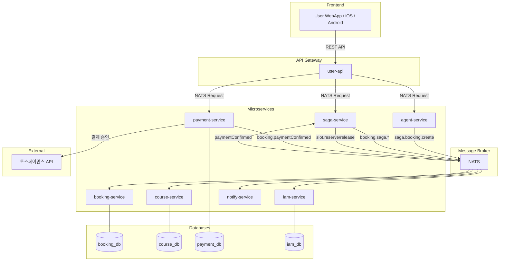

> **Saga 오케스트레이션**: saga-service가 중앙 오케스트레이터로 예약 생성/취소/환불 Saga를 관리합니다.
> booking-service는 `booking.saga.*` Step 핸들러를 노출합니다. 상세는 [SAGA.md](./SAGA.md) 참조.

---

## 3. 예약 상태 정의

### 3.1 BookingStatus (예약 상태)

```
┌───────────────┬──────────────────────────────────────────────────────────┐
│ PENDING       │ 예약 생성됨, Saga 진행 중 (슬롯 예약 대기)                 │
│ SLOT_RESERVED │ 슬롯 예약 완료, 결제 대기 (카드결제 시)                    │
│ CONFIRMED     │ 예약 확정 (현장결제: 슬롯 완료 즉시 / 카드결제: 결제 완료) │
│ COMPLETED     │ 이용 완료                                                  │
│ CANCELLED     │ 취소됨                                                     │
│ NO_SHOW       │ 노쇼 (미방문)                                              │
│ FAILED        │ Saga 실패 (슬롯 예약 실패, 결제 실패, 타임아웃 등)        │
└───────────────┴──────────────────────────────────────────────────────────┘
```

### 3.2 상태 전이 다이어그램

결제 방법에 따라 Saga 경로가 분기됩니다.

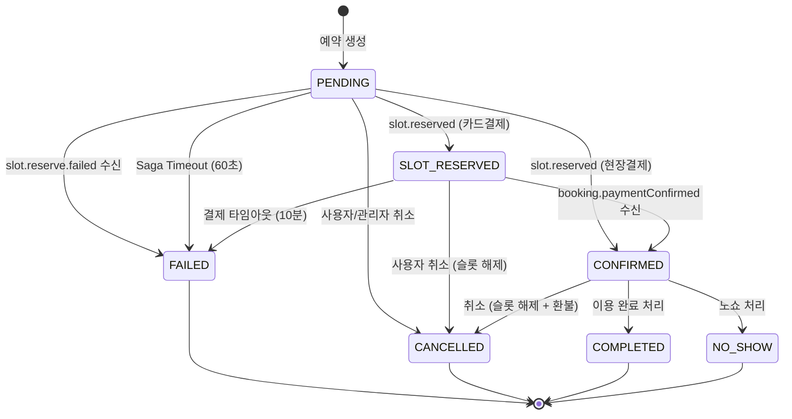

### 3.3 결제 방법별 Saga 경로

| 결제 방법 | Saga 경로 | 설명 |
|----------|-----------|------|
| **현장결제 (onsite)** | `PENDING → CONFIRMED` | 슬롯 예약 완료 시 즉시 확정 (v2.0 동일) |
| **카드결제 (card)** | `PENDING → SLOT_RESERVED → CONFIRMED` | 슬롯 예약 후 결제 완료 시 확정 |

### 3.4 OutboxEvent 상태

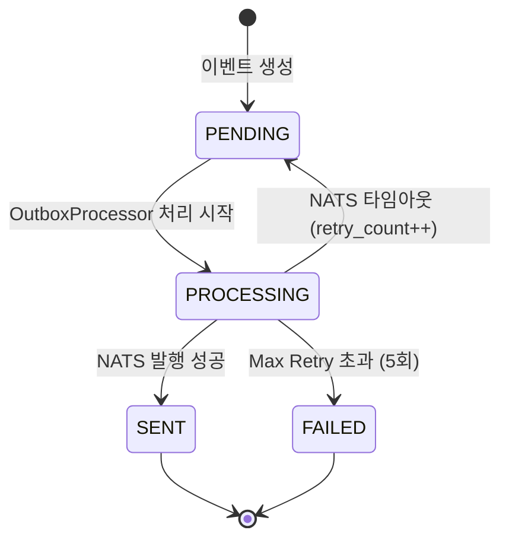

### 3.5 PaymentStatus (결제 상태)

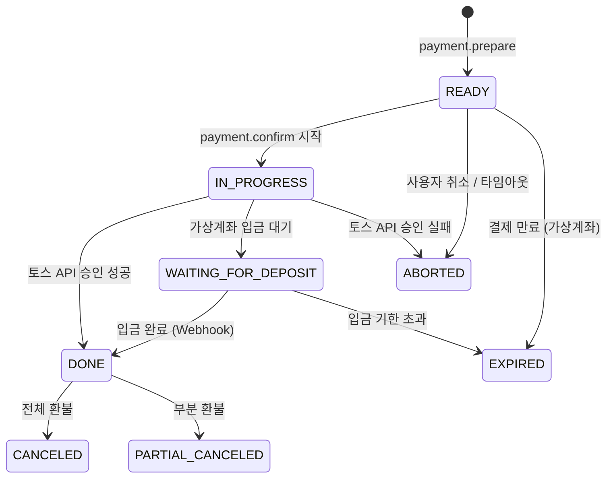

### 3.6 TimeSlotStatus (타임슬롯 상태)

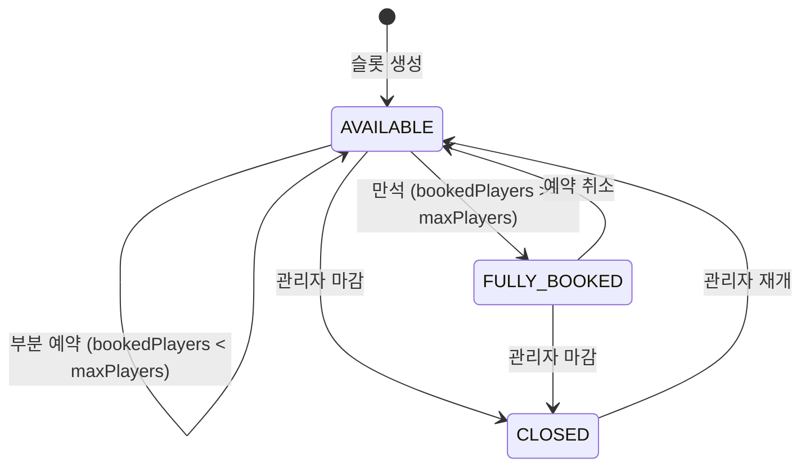

### 3.7 정산 상태 (파생 — 조회 시 계산)

그룹 예약 정산 상태는 별도 컬럼 없이 `BookingParticipant` 상태에서 **조회 시 계산**합니다.

```typescript
// 같은 groupId의 모든 BookingParticipant 조회
const participants = await prisma.bookingParticipant.findMany({
  where: { booking: { groupId } },
});
const paidCount = participants.filter(p => p.status === 'PAID').length;
const totalCount = participants.length;

const allPaid = paidCount === totalCount && totalCount >= booking.playerCount;
const settlementStatus =
  allPaid ? 'COMPLETED' :
  paidCount > 0 ? 'PARTIAL' : 'PENDING';
```

| 파생 상태 | 조건 |
|----------|------|
| `PENDING` | 결제한 참여자 없음 (`paidCount === 0`) |
| `PARTIAL` | 일부 참여자 결제 (`0 < paidCount < totalCount`) |
| `COMPLETED` | 전원 결제 완료 (`paidCount === totalCount && totalCount >= playerCount`) |

> **Single Source of Truth**: `booking.settlementStatus` NATS 패턴으로 정산 상태를 조회합니다. `allPaid` 판단은 booking-service의 `markParticipantPaid()`에서 `paidCount === totalCount && totalCount >= playerCount` 공식으로 통일되며, agent-service는 이 API에 위임합니다.

### 3.7.1 TeamSelectionStatus (팀 선정 상태)

```
┌───────────┬──────────────────────────────────────┐
│ SELECTING │ 멤버 선택 진행 중                       │
│ READY     │ 모든 팀 구성 완료                       │
│ BOOKING   │ 예약(Saga) 진행 중                      │
│ COMPLETED │ 모든 팀 예약 완료                       │
│ CANCELLED │ 취소                                    │
└───────────┴──────────────────────────────────────┘
```

### 3.8 ParticipantStatus (참여자 결제 상태)

```
┌───────────┬──────────────────────────────────────┐
│ PENDING   │ 결제 대기                              │
│ PAID      │ 결제 완료                              │
│ CANCELLED │ 참여 취소                              │
│ REFUNDED  │ 환불 완료                              │
└───────────┴──────────────────────────────────────┘
```

### 3.9 SplitStatus (분할결제 상태)

```
┌───────────┬──────────────────────────────────────┐
│ PENDING   │ 결제 대기                              │
│ PAID      │ 결제 완료                              │
│ EXPIRED   │ 결제 기한 만료                         │
│ CANCELLED │ 취소                                   │
│ REFUNDED  │ 환불                                   │
└───────────┴──────────────────────────────────────┘
```

---

## 4. 멱등성 처리

> **Saga 트랜잭션 흐름** (현장결제/카드결제 시퀀스, Step별 상세, CompanyMember 등록)은 [SAGA.md](./SAGA.md) 섹션 5를 참조하세요.

### 4.1 계층별 멱등성 보장

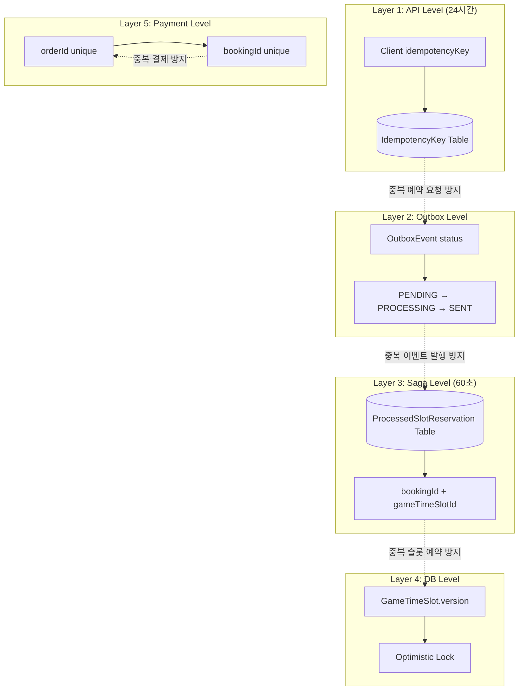

### 4.2 각 계층별 역할

| 계층 | 위치 | 저장소 | TTL | 목적 |
|------|------|--------|-----|------|
| **API Level** | booking-service | PostgreSQL (idempotency_keys) | 24시간 | 클라이언트 중복 요청 방지 |
| **Outbox Level** | booking-service | PostgreSQL (outbox_events) | - | 이벤트 중복 발행 방지 |
| **Saga Level** | course-service | PostgreSQL (processed_slot_reservations) | 60초 | 슬롯 중복 예약 방지 |
| **DB Level** | course-service | PostgreSQL (game_time_slots.version) | - | 동시성 제어 (Optimistic Lock) |
| **Payment Level** | payment-service | PostgreSQL (payments.orderId, payments.bookingId) | - | 중복 결제 방지 |

### 4.3 Saga 레벨 멱등성 (course-service)

```typescript
// game-time-slot.service.ts
const IDEMPOTENCY_TTL_MS = 60000; // 60초 TTL

// 1. 중복 요청 확인
const existingReservation = await this.prisma.processedSlotReservation.findUnique({
  where: {
    bookingId_gameTimeSlotId: { bookingId, gameTimeSlotId: timeSlotId },
  },
});

if (existingReservation) {
  return { success: true }; // 즉시 성공 반환 (슬롯 수정 안 함)
}

// 2. 슬롯 예약 처리 후 레코드 저장
await this.prisma.processedSlotReservation.create({
  data: {
    bookingId,
    gameTimeSlotId: timeSlotId,
    expiresAt: new Date(Date.now() + IDEMPOTENCY_TTL_MS),
  },
});

// 3. 5분마다 만료된 레코드 정리 (Cleanup Job)
```

---

## 5. 동시성 제어

### 5.1 Optimistic Locking

GameTimeSlot 테이블의 `version` 필드를 사용하여 동시성 제어:

```sql
-- 슬롯 예약 시
UPDATE game_time_slots
SET booked_players = booked_players + :playerCount,
    version = version + 1,
    status = CASE WHEN booked_players + :playerCount >= max_players
             THEN 'FULLY_BOOKED' ELSE 'AVAILABLE' END
WHERE id = :slotId AND version = :currentVersion;

-- affected rows = 0 이면 버전 충돌 → 재시도
```

### 5.2 재시도 로직

```typescript
// course-service: 최대 3회 재시도, 지수 백오프
const MAX_RETRIES = 3;
const BASE_DELAY_MS = 50;

for (let attempt = 1; attempt <= MAX_RETRIES; attempt++) {
  try {
    return await this.reserveSlotWithLock(timeSlotId, playerCount);
  } catch (error) {
    if (error instanceof ConflictException && attempt < MAX_RETRIES) {
      await sleep(BASE_DELAY_MS * attempt); // 50ms, 100ms, 150ms
      continue;
    }
    throw error;
  }
}
```

### 5.3 Outbox 동시 처리 방지

```sql
-- FOR UPDATE SKIP LOCKED: 이미 처리 중인 이벤트 건너뛰기
SELECT * FROM outbox_events
WHERE status = 'PENDING'
ORDER BY created_at ASC
LIMIT 10
FOR UPDATE SKIP LOCKED;
```

---

## 6. 타임아웃 설정

### 6.1 현재 설정값

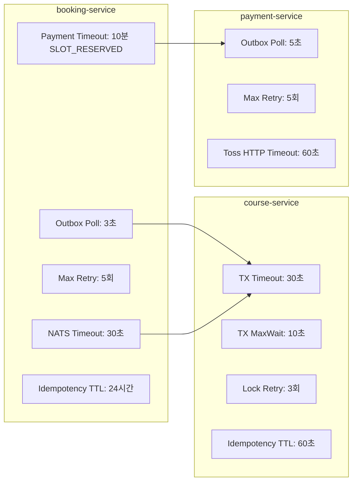

### 6.2 설정 상세

| 설정 | 값 | 서비스 | 용도 |
|------|-----|--------|------|
| `POLL_INTERVAL_MS` | 3,000ms | booking | Outbox 폴링 주기 (안전망) |
| `BATCH_SIZE` | 10 | booking | 한 번에 처리할 이벤트 수 |
| `MAX_RETRY_COUNT` | 5 | booking | Outbox 최대 재시도 |
| `PROCESSING_LOCK_MS` | 30,000ms | booking | Outbox 처리 중 락 시간 |
| `NATS_TIMEOUT` | 30,000ms | booking | NATS 요청 타임아웃 |
| `NATS_RETRY_COUNT` | 2 | booking | 캐시 조회 NATS 재시도 횟수 |
| `PAYMENT_TIMEOUT_MS` | 600,000ms (10분) | booking | SLOT_RESERVED 결제 대기 타임아웃 |
| `IDEMPOTENCY_KEY_TTL` | 24시간 | booking | 멱등성 키 보관 기간 |
| `TX_TIMEOUT` | 30,000ms | course | Prisma 트랜잭션 타임아웃 |
| `TX_MAX_WAIT` | 10,000ms | course | 트랜잭션 대기 최대 시간 |
| `LOCK_RETRY_COUNT` | 3 | course | Optimistic Lock 재시도 |
| `SLOT_IDEMPOTENCY_TTL` | 60,000ms | course | 슬롯 예약 멱등성 TTL |
| `PAYMENT_OUTBOX_POLL` | 5,000ms | payment | 결제 Outbox 폴링 주기 (Cron) |
| `PAYMENT_SEND_TIMEOUT` | 10,000ms | payment | 결제 Outbox NATS 전송 타임아웃 |
| `PAYMENT_MAX_RETRIES` | 5 | payment | 결제 Outbox 최대 재시도 |
| `TOSS_HTTP_TIMEOUT` | 60,000ms | payment | 토스페이먼츠 API HTTP 타임아웃 (공식 권장) |
| `SPLIT_EXPIRATION` | 30분 | payment | 더치페이 결제 기한 (기본값) |

### 6.3 정리 작업 스케줄

| 작업 | 주기 | 대상 | 서비스 |
|------|------|------|--------|
| SLOT_RESERVED 결제 타임아웃 | 1분마다 | 10분 이상 SLOT_RESERVED 예약 → saga.booking.cancel 트리거 | booking |
| 오래된 Outbox 이벤트 삭제 | 매일 자정 | 7일 이상 된 SENT 이벤트 | booking |
| 만료된 슬롯 예약 레코드 삭제 | 5분마다 | TTL 만료된 레코드 | course |

---

## 7. 취소 및 환불 프로세스

> **Saga 취소 트랜잭션 흐름** (CANCEL_BOOKING, ADMIN_REFUND Saga 시퀀스)은 [SAGA.md](./SAGA.md) 섹션 5.3~5.4를 참조하세요.

### 7.1 취소 유형

| 취소 유형 | 요청자 | 시점 제한 | 환불 | 슬롯 해제 |
|----------|--------|----------|------|----------|
| **고객 취소** | 고객 | 정책에 따름 | 정책에 따름 | O |
| **관리자 취소** | 관리자 | 제한 없음 | 전액 | O |
| **시스템 취소** | 시스템 | 자동 | 전액 | O |
| **결제 타임아웃** | 시스템 | SLOT_RESERVED 10분 초과 | - (미결제) | O |
| **Saga 실패** | 시스템 | PENDING 상태 | - | X (미예약) |

### 7.2 취소 프로세스 (현장결제)

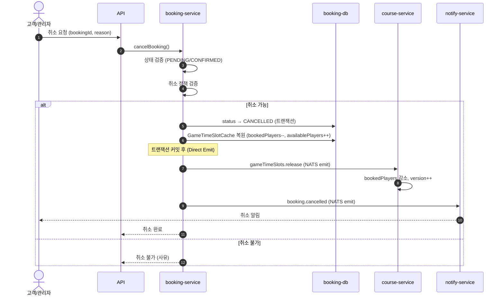

> **참고**: 현장결제 취소는 Outbox를 사용하지 않고 **Direct NATS Emit**으로 처리합니다.
> 로컬 `GameTimeSlotCache`는 트랜잭션 내에서 즉시 복원하고, course-service에는 비동기 emit으로 알립니다.

### 7.3 취소 프로세스 (카드결제 — 환불 포함)

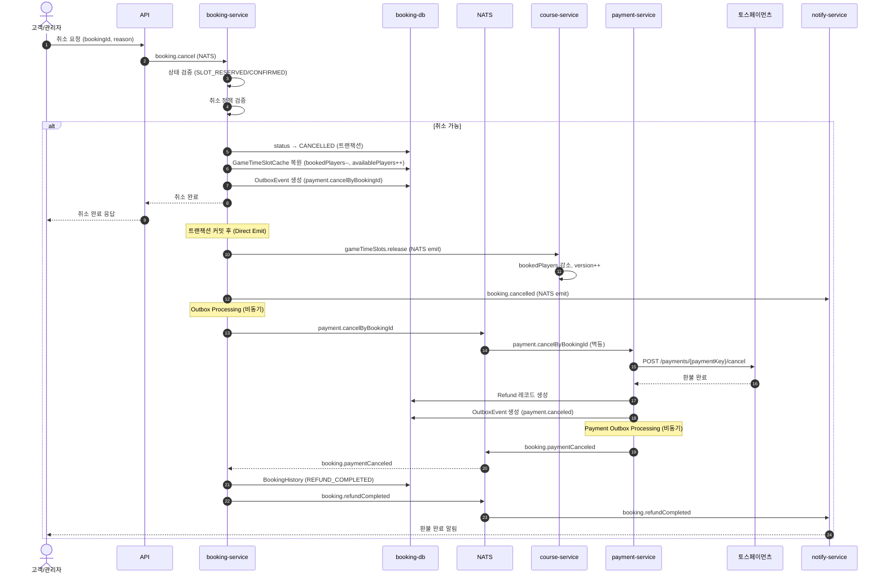

> **참고**: `payment.cancelByBookingId`는 멱등성이 보장됩니다. 결제 내역이 없거나, 이미 취소된 경우, 또는 paymentKey가 없는 경우 `{ skipped: true }` 를 반환합니다.

### 7.4 결제 타임아웃 처리

결제 타임아웃은 saga-service의 `PAYMENT_TIMEOUT` Saga로 처리됩니다. [SAGA.md](./SAGA.md) 섹션 4.6, 5.4 참조.

### 7.5 슬롯 해제 (Compensation)

```typescript
// course-service: releaseSlotForSaga
async releaseSlotForSaga(timeSlotId: number, playerCount: number) {
  return await this.prisma.$transaction(async (tx) => {
    const slot = await tx.gameTimeSlot.findUnique({
      where: { id: timeSlotId },
    });

    const newBookedPlayers = Math.max(0, slot.bookedPlayers - playerCount);
    const newStatus = newBookedPlayers < slot.maxPlayers
      ? TimeSlotStatus.AVAILABLE
      : TimeSlotStatus.FULLY_BOOKED;

    await tx.gameTimeSlot.update({
      where: { id: timeSlotId },
      data: {
        bookedPlayers: newBookedPlayers,
        status: newStatus,
        version: { increment: 1 },
      },
    });
  }, {
    timeout: 30000,
    maxWait: 10000,
  });
}
```

### 7.6 환불 정책 (동적 계층 정책)

환불 정책은 **3-tier 계층 구조**로 관리됩니다. 골프장(Club)별로 다른 환불 규칙을 설정할 수 있으며,
설정이 없으면 상위 스코프(Company → Platform)의 정책으로 자동 폴백합니다.

#### 정책 스코프

```
PLATFORM (플랫폼 기본값)
  └── COMPANY (가맹점별 설정)
        └── CLUB (골프장별 설정)
```

| 스코프 | 설정 주체 | 폴백 |
|--------|----------|------|
| `PLATFORM` | 시스템 관리자 | - (최종 기본값) |
| `COMPANY` | 가맹점 관리자 | → PLATFORM |
| `CLUB` | 골프장 관리자 | → COMPANY → PLATFORM |

#### RefundPolicy 모델

```typescript
interface RefundPolicy {
  scopeLevel: 'PLATFORM' | 'COMPANY' | 'CLUB';
  companyId?: number;
  clubId?: number;
  name: string;                   // "기본 환불 정책"

  adminCancelRefundRate: number;  // 관리자 취소 환불율 (기본: 100%)
  systemCancelRefundRate: number; // 시스템 취소 환불율 (기본: 100%)

  minRefundAmount: number;        // 최소 환불 금액 (기본: 0원)
  refundFee: number;              // 환불 수수료 (정액, KRW)
  refundFeeRate: number;          // 환불 수수료 (정률, %)

  tiers: RefundTier[];            // 시간 기반 환불율 계단
}

interface RefundTier {
  minHoursBefore: number;         // 예약 시작 N시간 전 (하한)
  maxHoursBefore?: number;        // 예약 시작 N시간 전 (상한, null=무한)
  refundRate: number;             // 환불율 (%)
  label?: string;                 // "7일 전", "당일" 등
}
```

#### 기본 환불율 (PLATFORM 기본값 예시)

| 취소 시점 | 환불율 | label |
|----------|--------|-------|
| 예약일 7일 전 (168시간+) | 100% | 7일 전 |
| 예약일 3~7일 전 (72~168시간) | 80% | 3~7일 전 |
| 예약일 1~3일 전 (24~72시간) | 50% | 1~3일 전 |
| 예약일 24시간 이내 | 0% (환불 불가) | 당일 |

| 취소 유형 | 환불율 |
|----------|--------|
| 관리자 취소 (`adminCancelRefundRate`) | 100% |
| 시스템 취소 (`systemCancelRefundRate`) | 100% |
| 결제 타임아웃 | 타임아웃 시점에서는 미결제이므로 환불 불필요. 단, 타임아웃 후 결제 도착 시 자동 환불 (8.4.1) |
| 노쇼 | 0% (별도 NoShowPolicy로 관리) |

#### Resolve 패턴 (policy.refund.resolve)

```typescript
// booking-service에서 환불 정책 조회 시
const policy = await this.natsClient.send('policy.refund.resolve', {
  scopeLevel: 'CLUB',
  companyId: booking.companyId,
  clubId: booking.clubId,
});

// 응답: { ...policy, inherited: boolean, inheritedFrom: 'PLATFORM' | 'COMPANY' | null }
// CLUB에 설정이 없으면 COMPANY → PLATFORM 순으로 폴백
```

#### 취소 유형 (CancellationType)

```
USER_NORMAL      // 일반 고객 취소 (기한 내)
USER_LATE        // 지연 고객 취소 (1~3일 전)
USER_LASTMINUTE  // 긴급 취소 (24시간 이내)
ADMIN            // 관리자 취소
SYSTEM           // 시스템 취소 (Saga 실패 등)
```

---

## 8. 모니터링 및 디버깅

> **Saga 모니터링** (Saga 상태 조회, 수동 개입, saga-service 로그)은 [SAGA.md](./SAGA.md) 섹션 8을 참조하세요.

### 8.1 로그 태그

| 태그 | 서비스 | 용도 |
|------|--------|------|
| `[REQ-xxx]` | booking-service | 요청 추적 ID |
| `[booking.saga.*]` | booking-service | Saga Step 핸들러 처리 |
| `[Saga]` | course-service | 슬롯 예약 처리 |
| `[Payment]` | payment-service | 결제 처리 |

### 8.2 K8s 디버깅

```bash
# booking-service 로그
kubectl logs -l app=booking-service -n parkgolf-{env} --tail=100

# 특정 예약 추적
kubectl logs -l app=booking-service -n parkgolf-{env} | grep "bookingId=15"

# 결제 관련 로그
kubectl logs -l app=payment-service -n parkgolf-{env} --tail=100
```

### 8.3 성능 메트릭

| 단계 | 예상 소요 시간 |
|------|---------------|
| Idempotency Check | 1-5ms |
| Slot Query | 3-10ms |
| Slot Update (with lock) | 5-15ms |
| Total Saga - 현장결제 (booking → confirmed) | 50-200ms |
| Total Saga - 카드결제 (booking → slot_reserved) | 50-200ms |
| Payment Prepare | 10-50ms |
| Payment Confirm (토스 API) | 200-500ms |
| Total Saga - 카드결제 (slot_reserved → confirmed) | 300-600ms |

---

## 9. 그룹 예약 (Group Booking) — 3-Phase 구조

### 9.1 개요

그룹 예약은 **3단계(Phase)** 구조로 진행됩니다:

1. **Phase 1 — 팀 선정 (TeamSelection)**: 채팅방에서 멤버 선택 → DB 영속화
2. **Phase 2 — 팀별 부킹 (기존 Saga)**: `booking.create`로 팀별 독립 Saga 실행
3. **Phase 3 — 더치페이 결제 (기존 그대로)**: 참여자별 분할결제

`BookingGroup` 테이블은 제거되었으며, 그룹 식별은 `Booking.groupId` (GRP-xxx 문자열)로 관리합니다.
정산 상태는 `BookingParticipant` 상태에서 **조회 시 파생** (Section 3.7 참조).

### 9.2 데이터 모델

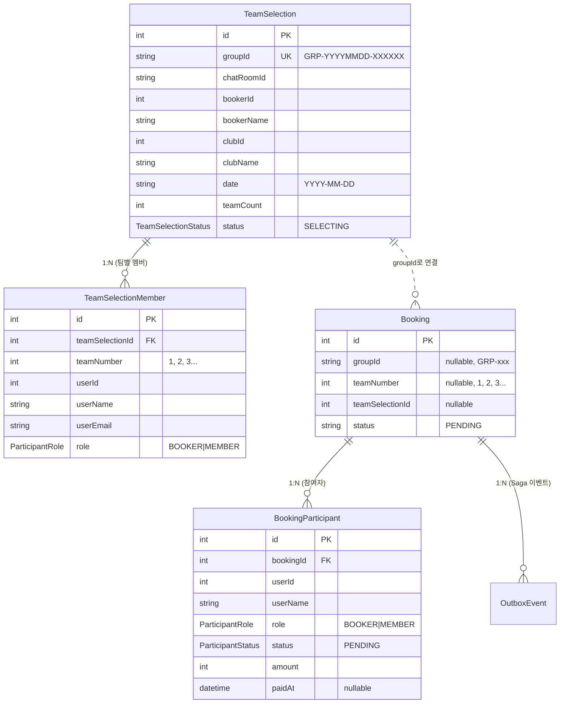

### 9.3 NATS 패턴

| 패턴 | 설명 | 요청 |
|------|------|------|
| `teamSelection.create` | 팀 선정 세션 생성 | `{ chatRoomId, bookerId, bookerName, clubId, clubName, date }` |
| `teamSelection.addMembers` | 팀에 멤버 추가 | `{ teamSelectionId?, groupId?, teamNumber, members[] }` |
| `teamSelection.get` | 팀 선정 조회 | `{ id?, groupId? }` |
| `teamSelection.ready` | 팀 구성 완료 | `{ id?, groupId? }` |
| `teamSelection.cancel` | 팀 선정 취소 | `{ id?, groupId? }` |
| `booking.participant.paid` | 참여자 결제 완료 처리 | `{ bookingId, userId }` |
| `bookingGroup.cancel` | 그룹 예약 전체 취소 | `{ groupId: string }` |

### 9.4 Phase 1: 팀 선정

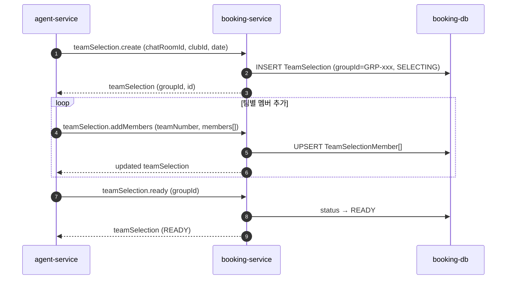

#### TeamSelectionStatus 전이

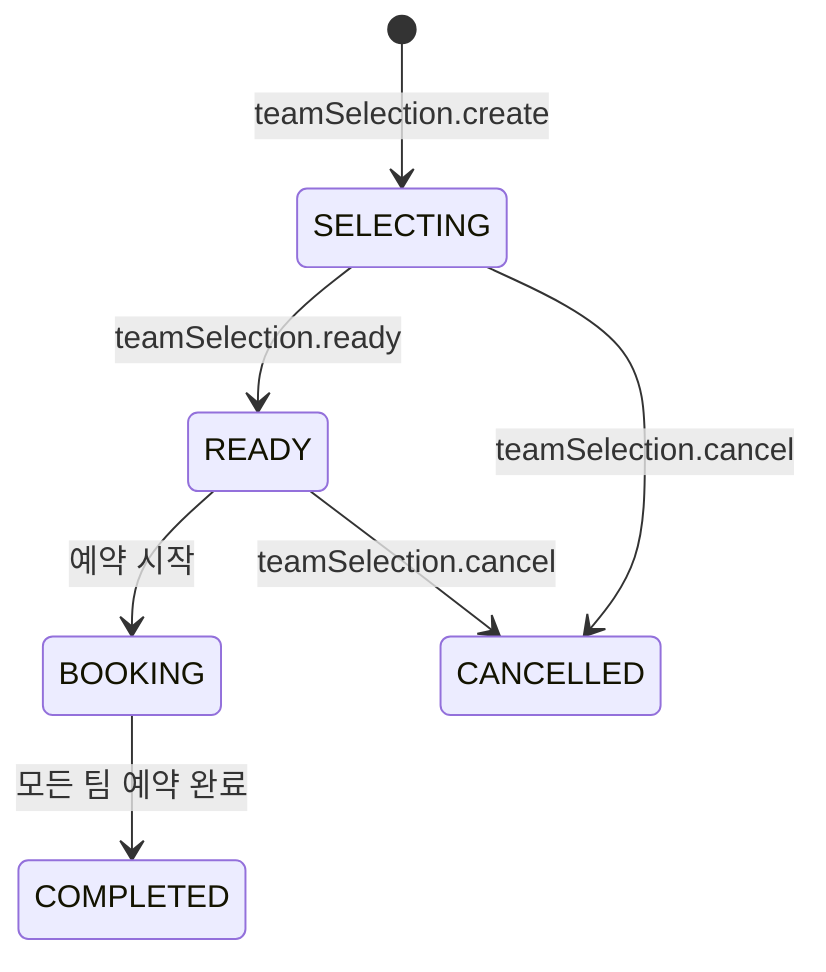

### 9.5 Phase 2: 팀별 부킹

TeamSelection이 READY 상태가 되면, agent-service가 팀별로 `saga.booking.create`를 호출합니다.
각 팀의 Booking은 **독립적인 CREATE_BOOKING Saga**로 실행됩니다.

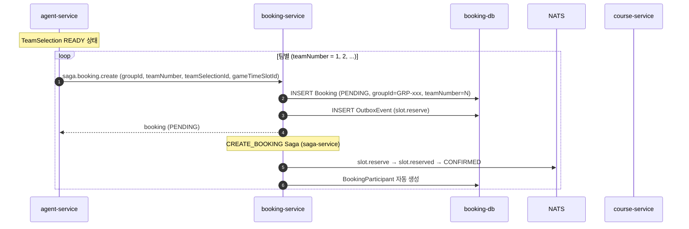

#### BookingParticipant 자동 생성

Booking이 CONFIRMED될 때 (`booking.saga.slotReserved` Step 핸들러), `teamSelectionId`가 있으면 해당 팀의 `TeamSelectionMember`를 조회하여 `BookingParticipant`를 자동 생성합니다:

```typescript
// booking-service: booking.saga.slotReserved Step 핸들러
if (booking.teamSelectionId && booking.teamNumber) {
  const members = await prisma.teamSelectionMember.findMany({
    where: { teamSelectionId: booking.teamSelectionId, teamNumber: booking.teamNumber },
  });

  for (const member of members) {
    await prisma.bookingParticipant.upsert({
      where: { bookingId_userId: { bookingId, userId: member.userId } },
      update: {},
      create: {
        bookingId,
        userId: member.userId,
        userName: member.userName,
        userEmail: member.userEmail,
        role: member.role,
        status: ParticipantStatus.PENDING,
        amount: pricePerPerson,
      },
    });
  }
}
```

### 9.6 Phase 3: 더치페이 결제

Section 10 참조. 기존 `payment.splitPrepare` → `payment.splitConfirm` → `booking.participant.paid` 흐름 그대로입니다.

### 9.7 정산 상태 파생 + 실시간 알림

참여자 결제 완료 시 `groupId` 기반으로 전체 정산 상태를 파생하고, 채팅방에 브로드캐스트합니다.

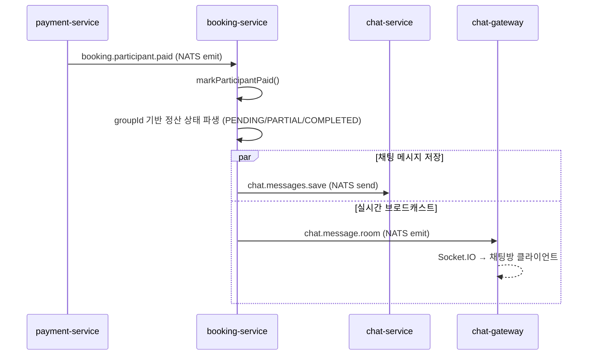

### 9.8 그룹 예약 취소

```typescript
// team-selection.service.ts
async cancelGroupBookings(groupId: string) {
  await this.prisma.$transaction(async (tx) => {
    // 1. 같은 groupId의 모든 Booking → CANCELLED
    const bookings = await tx.booking.findMany({ where: { groupId } });
    for (const booking of bookings) {
      await tx.booking.update({
        where: { id: booking.id },
        data: { status: 'CANCELLED' },
      });

      // 2. 참여자 전체 → CANCELLED
      await tx.bookingParticipant.updateMany({
        where: { bookingId: booking.id },
        data: { status: ParticipantStatus.CANCELLED },
      });
    }

    // 3. TeamSelection도 CANCELLED
    await tx.teamSelection.updateMany({
      where: { groupId },
      data: { status: TeamSelectionStatus.CANCELLED },
    });
  });
}
```

---

## 10. 더치페이 (Split Payment)

### 10.1 개요

그룹 예약의 참여자 각자가 개별적으로 결제하는 분할결제 시스템입니다.
payment-service의 `PaymentSplitService`가 담당합니다.

### 10.2 데이터 모델

```prisma
model PaymentSplit {
  id              Int          @id @default(autoincrement())
  paymentId       Int?         // Toss 결제 완료 후 연결
  groupId         String?      // 그룹 ID (GRP-xxx)
  bookingId       Int          // 연결된 예약
  userId          Int
  userName        String
  userEmail       String
  amount          Int          // 개인 부담 금액 (KRW)
  status          SplitStatus  @default(PENDING)
  orderId         String       @unique  // SPL-{timestamp}-{uuid}
  paidAt          DateTime?
  expiredAt       DateTime?    // 결제 기한

  @@index([groupId, status])
  @@index([bookingId])
  @@index([userId, status])
}
```

### 10.3 NATS 패턴

| 패턴 | 설명 | 요청 |
|------|------|------|
| `payment.splitPrepare` | 분할결제 준비 (참여자별 orderId 발급) | `SplitPrepareDto` |
| `payment.splitConfirm` | 개별 참여자 결제 승인 | `{ orderId, paymentKey, amount }` |
| `payment.splitGet` | 분할결제 현황 조회 | `{ groupId? \| bookingId? \| orderId? }` |

### 10.4 더치페이 전체 흐름

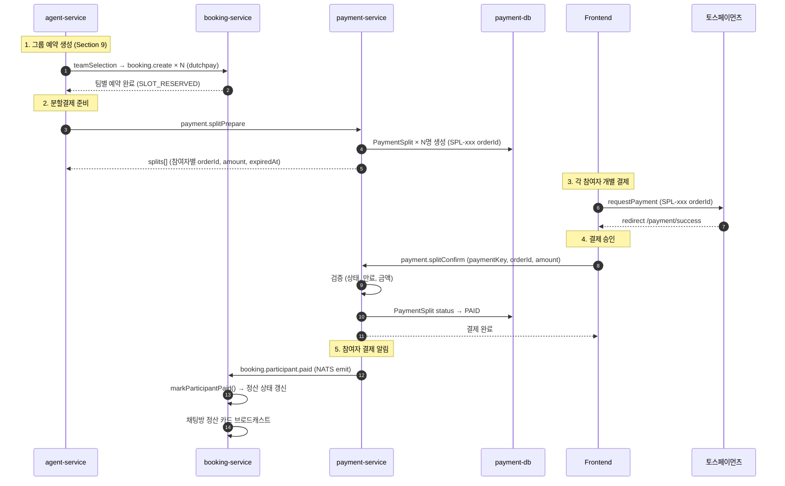

### 10.5 주문 ID 체계

| 서비스 | 접두사 | 형식 | 예시 |
|--------|-------|------|------|
| 일반 결제 | `ORD-` | `ORD-{timestamp}-{uuid8}` | `ORD-1707123456789-a1b2c3d4` |
| 분할결제 | `SPL-` | `SPL-{timestamp}-{uuid8}` | `SPL-1707123456789-e5f6g7h8` |
| 정기결제 | `BILLING-` | `BILLING-{timestamp}-{uuid8}` | `BILLING-1707123456789-i9j0k1l2` |

### 10.6 분할결제 검증

`splitConfirm` 시 다음 순서로 검증합니다:

| 검증 | 실패 시 |
|------|--------|
| Split 존재 여부 (orderId) | `Errors.Split.NOT_FOUND` |
| 이미 결제 완료 | `Errors.Split.ALREADY_PAID` |
| PENDING 상태 확인 | `Errors.Split.INVALID_STATUS` |
| 결제 기한 초과 | `Errors.Split.EXPIRED` |
| 금액 일치 | `Errors.Payment.AMOUNT_MISMATCH` |

### 10.7 만료 처리

```typescript
// payment-split.service.ts
async expirePendingSplits() {
  // PENDING 상태이면서 expiredAt < now인 분할결제 일괄 만료
  await this.prisma.paymentSplit.updateMany({
    where: {
      status: SplitStatus.PENDING,
      expiredAt: { lt: new Date() },
    },
    data: { status: SplitStatus.EXPIRED },
  });
}
```

---

## 변경 이력

| 버전 | 날짜 | 변경 내용 |
|------|------|----------|
| 6.0 | 2026-03-09 | **Saga 분리**: saga-service 독립 마이크로서비스 분리에 따라 Saga 트랜잭션 내용을 [SAGA.md](./SAGA.md)로 이관, booking-service는 Saga Step 핸들러 역할로 재정의, 섹션 재번호 매김 |
| 5.2 | 2026-03-04 | **Saga 아키텍처 변경**: course-service fire-and-forget emit(`slot.reserved`/`slot.reserve.failed`/`slot.released`) 제거 → OutboxProcessor Request-Reply 응답 수신 후 SagaHandler 직접 호출, `booking.settlementStatus` NATS 패턴 추가 (allPaid SSOT), 정산 allPaid 공식 통일 |
| 5.1 | 2026-03-03 | **문서 현행화**: action: CREATED→SAGA_STARTED 수정, Saga 분기 코드 실제 구현 반영(isOnsitePayment 패턴), 취소 프로세스 Outbox→Direct Emit 수정(slot.release는 직접 emit), Section 8.4 파일 참조 saga-handler.service.ts로 수정, 로그 예시 실제 형식 반영, TeamSelectionService 컴포넌트 다이어그램 추가 |
| 5.0 | 2026-03-03 | **그룹 예약 리팩토링**: BookingGroup 테이블 제거 → TeamSelection/TeamSelectionMember로 팀 선정 분리, Booking에 groupId/teamSelectionId 흡수, 정산 상태 파생(조회 시 계산), 3-Phase 구조(팀 선정 → 부킹 → 결제) |
| 4.0 | 2026-03-03 | 그룹 예약(BookingGroup, BookingParticipant) 섹션 추가, 더치페이(PaymentSplit) 분할결제 섹션 추가, Outbox 즉시 트리거·이벤트 라우팅·Request-Reply 패턴 문서화, 누락 상수 추가 (PROCESSING_LOCK_MS, NATS_RETRY_COUNT, PAYMENT_SEND_TIMEOUT, SPLIT_EXPIRATION), 새 상태 enum 추가 (SettlementStatus, ParticipantStatus, SplitStatus) |
| 3.4 | 2026-02-24 | 결제 타임아웃 이후 결제 도착 시 자동 환불 (handlePaymentConfirmed → AUTO_REFUND_REQUESTED) |
| 3.3 | 2026-02-24 | AI 에이전트 Saga 폴링 노트 추가, Toss HTTP Timeout 60초 설정 반영 |
| 3.2 | 2026-02-23 | 결제 관련 보완: PaymentStatus 누락 상태 추가, serviceFee 계산 반영, Outbox 폴링 주기 수정 (1s→3s), 카드결제 취소 시퀀스 Outbox 기반으로 수정, 환불 정책 3-tier 동적 계층 시스템 반영, agent-service 크로스 레퍼런스 추가 |
| 3.1 | 2026-02-15 | 예약 확정 시 CompanyMember 자동 등록 (iam-service 연동) 추가 |
| 3.0 | 2026-02-10 | 토스페이먼츠 결제 연동, SLOT_RESERVED 상태 활성화, 결제 타임아웃 Compensation 추가 |
| 2.0 | 2026-01-21 | BOOKING_SAGA_ARCHITECTURE.md, booking-workflow-design.md 통합 및 소스 코드 반영 |
| 1.0 | 2026-01-12 | booking-workflow-design.md 초안 작성 |
| 1.0 | 2026-01-06 | BOOKING_SAGA_ARCHITECTURE.md 작성 |

---

## 참고 자료

- [Microservices Patterns - Saga Pattern](https://microservices.io/patterns/data/saga.html)
- [Transactional Outbox Pattern](https://microservices.io/patterns/data/transactional-outbox.html)
- [Optimistic Locking - Prisma](https://www.prisma.io/docs/concepts/components/prisma-client/transactions#optimistic-concurrency-control)
- [토스페이먼츠 결제 위젯 연동](https://docs.tosspayments.com/guides/v2/widget/integration)
