# Chat System

Park Golf Platform 채팅 시스템 아키텍처 및 워크플로우 문서입니다.

## 목차

1. [시스템 개요](#1-시스템-개요)
2. [아키텍처](#2-아키텍처)
3. [WebSocket 실시간 통신](#3-websocket-실시간-통신)
4. [REST API](#4-rest-api)
5. [NATS 메시지 패턴](#5-nats-메시지-패턴)
6. [데이터베이스 스키마](#6-데이터베이스-스키마)
7. [클라이언트 구현](#7-클라이언트-구현)
8. [소켓 연결 · 재연결 · 토큰 관리](#8-소켓-연결--재연결--토큰-관리)
9. [에러 처리 및 복구](#9-에러-처리-및-복구)
10. [배포 및 운영](#10-배포-및-운영)

---

## 1. 시스템 개요

### 핵심 기능

| 기능 | 설명 |
|------|------|
| **1:1 채팅 (DIRECT)** | 친구 간 개인 대화 |
| **채널 채팅 (CHANNEL)** | 여러 사용자 참여 채팅방 (동호회/모임) |
| **예약 채팅 (BOOKING)** | 예약 기반 자동 생성 채팅방 |
| **실시간 메시지** | WebSocket 기반 즉시 전달 |
| **타이핑 표시** | 상대방 입력 중 표시 |
| **읽음 처리** | 메시지 읽음 상태 동기화 |
| **실시간 알림** | notification 네임스페이스를 통한 즉시 알림 전달 |
| **REST Fallback** | WebSocket 실패 시 HTTP 전송 |

### 채팅방 타입

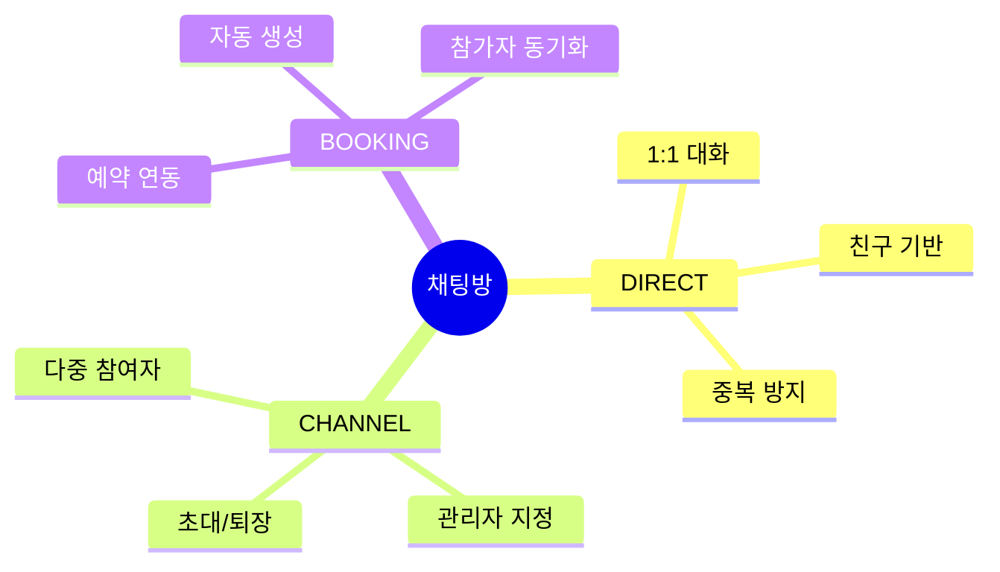
```mermaid
mindmap
  root((채팅방))
    DIRECT
      1:1 대화
      친구 기반
      중복 방지
    CHANNEL
      다중 참여자
      관리자 지정
      초대/퇴장
    BOOKING
      예약 연동
      자동 생성
      참가자 동기화
```

### 메시지 타입

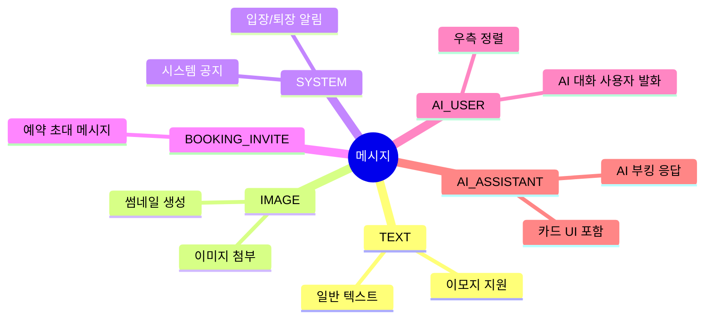
```mermaid
mindmap
  root((메시지))
    TEXT
      일반 텍스트
      이모지 지원
    IMAGE
      이미지 첨부
      썸네일 생성
    SYSTEM
      입장/퇴장 알림
      시스템 공지
    BOOKING_INVITE
      예약 초대 메시지
    AI_USER
      AI 대화 사용자 발화
      우측 정렬
    AI_ASSISTANT
      AI 부킹 응답
      카드 UI 포함
```

---

## 2. 아키텍처

### 전체 시스템 구조

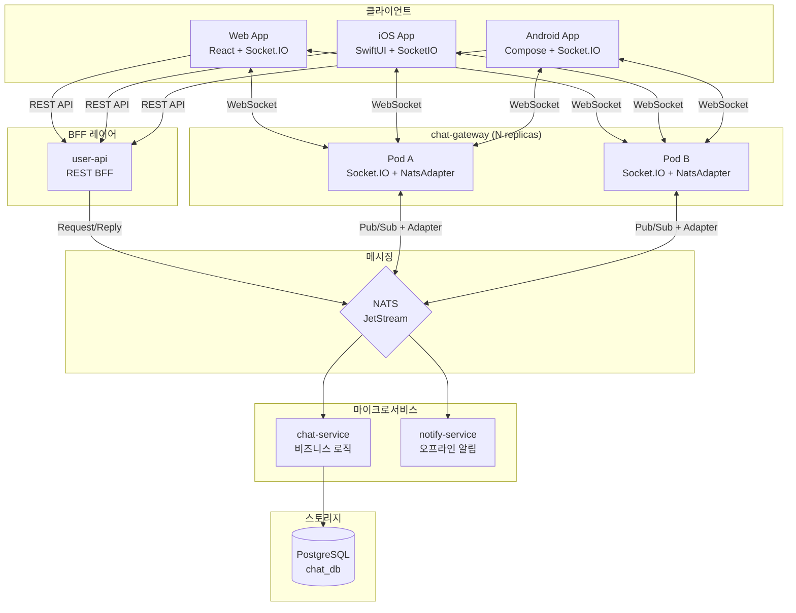
```mermaid
flowchart TB
    subgraph Clients["클라이언트"]
        WEB[Web App<br/>React + Socket.IO]
        IOS[iOS App<br/>SwiftUI + SocketIO]
        AND[Android App<br/>Compose + Socket.IO]
    end

    subgraph Gateway["chat-gateway (N replicas)"]
        POD_A[Pod A<br/>Socket.IO + NatsAdapter]
        POD_B[Pod B<br/>Socket.IO + NatsAdapter]
    end

    subgraph BFF["BFF 레이어"]
        API[user-api<br/>REST BFF]
    end

    subgraph Messaging["메시징"]
        NATS{NATS<br/>JetStream}
    end

    subgraph Services["마이크로서비스"]
        CHAT[chat-service<br/>비즈니스 로직]
        NOTIFY[notify-service<br/>오프라인 알림]
    end

    subgraph Storage["스토리지"]
        DB[(PostgreSQL<br/>chat_db)]
    end

    WEB & IOS & AND -->|REST API| API
    WEB & IOS & AND <-->|WebSocket| POD_A & POD_B

    API -->|Request/Reply| NATS
    POD_A <-->|Pub/Sub + Adapter| NATS
    POD_B <-->|Pub/Sub + Adapter| NATS

    NATS --> CHAT
    NATS --> NOTIFY
    CHAT --> DB
```

### Multi-Replica 데이터 흐름

```
메시지 전송:    Client → chat-gateway Pod (Socket.IO)
Pod 간 전파:    Pod A → NATS Adapter → Pod B, C... → 대상 유저 전달
메시지 저장:    chat-gateway → NATS RPC (async) → chat-service → DB
메시지 영속:    chat-gateway → NATS JetStream (async) → 메시지 복구용
```

### chat-gateway 내부 구조

```mermaid
flowchart LR
    subgraph Gateway["chat-gateway Pod"]
        AUTH[Auth<br/>JWT 검증]
        CHAT_NS[/chat 네임스페이스<br/>ChatGateway]
        NOTI_NS[/notification 네임스페이스<br/>NotificationGateway]
        ADAPTER[NATS Socket.IO<br/>Adapter]
        NATS_SVC[NatsService<br/>JetStream + RPC]
    end

    subgraph State["In-Memory State (Pod-local)"]
        ONLINE[onlineUsers<br/>Map&lt;socketId, user&gt;]
    end

    subgraph Rooms["Socket.IO Rooms (Adapter 관리)"]
        USER_ROOM["user:{userId}<br/>DM + Presence"]
        CHAT_ROOM["roomId<br/>채팅방 broadcast"]
    end

    Client -->|connect| AUTH
    AUTH -->|verified| CHAT_NS & NOTI_NS
    CHAT_NS --> ONLINE
    CHAT_NS --> CHAT_ROOM & USER_ROOM
    ADAPTER <-->|cross-pod broadcast| NATS{NATS}
    NATS_SVC -->|JetStream + RPC| NATS
```

### NATS Adapter 동작 원리

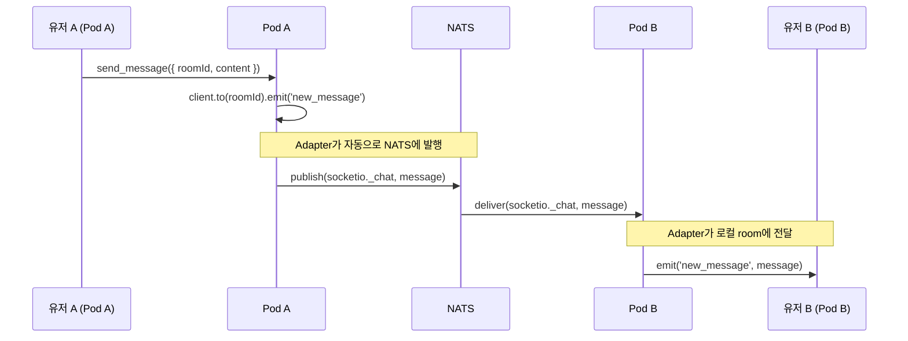
```mermaid
sequenceDiagram
    participant UserA as 유저 A (Pod A)
    participant PodA as Pod A
    participant NATS as NATS
    participant PodB as Pod B
    participant UserB as 유저 B (Pod B)

    UserA->>PodA: send_message({ roomId, content })
    PodA->>PodA: client.to(roomId).emit('new_message')

    Note over PodA,NATS: Adapter가 자동으로 NATS에 발행
    PodA->>NATS: publish(socketio._chat, message)
    NATS->>PodB: deliver(socketio._chat, message)

    Note over PodB,UserB: Adapter가 로컬 room에 전달
    PodB->>UserB: emit('new_message', message)
```

**NATS Adapter Subject 설계:**

| Subject | 용도 | 구독 |
|---------|------|------|
| `socketio.{nsp}` | 모든 Pod에 broadcast (heartbeat, broadcast, join/leave 등) | 모든 Pod |
| `socketio.{nsp}.response.{uid}` | 특정 Pod에 응답 (fetchSockets 결과 등) | 해당 uid Pod만 |

### 두 개의 NATS 연결

| 연결 | 용도 | 생성 위치 |
|------|------|----------|
| **Adapter 연결** | Socket.IO cross-pod broadcast | `main.ts` (bootstrap) |
| **Service 연결** | JetStream, RPC, Pub/Sub | `NatsService` (onModuleInit) |

### 통신 방식 비교

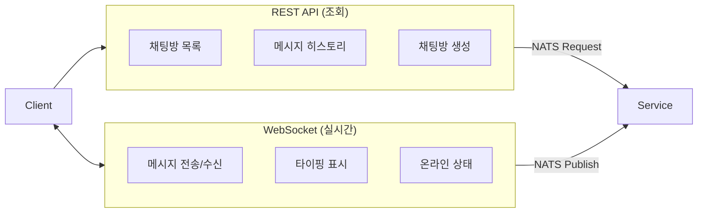
```mermaid
flowchart LR
    subgraph REST["REST API (조회)"]
        R1[채팅방 목록]
        R2[메시지 히스토리]
        R3[채팅방 생성]
    end

    subgraph WebSocket["WebSocket (실시간)"]
        W1[메시지 전송/수신]
        W2[타이핑 표시]
        W3[온라인 상태]
    end

    Client --> REST
    Client <--> WebSocket

    REST -->|NATS Request| Service
    WebSocket -->|NATS Publish| Service
```

---

## 3. WebSocket 실시간 통신

### 3.1 연결 및 인증

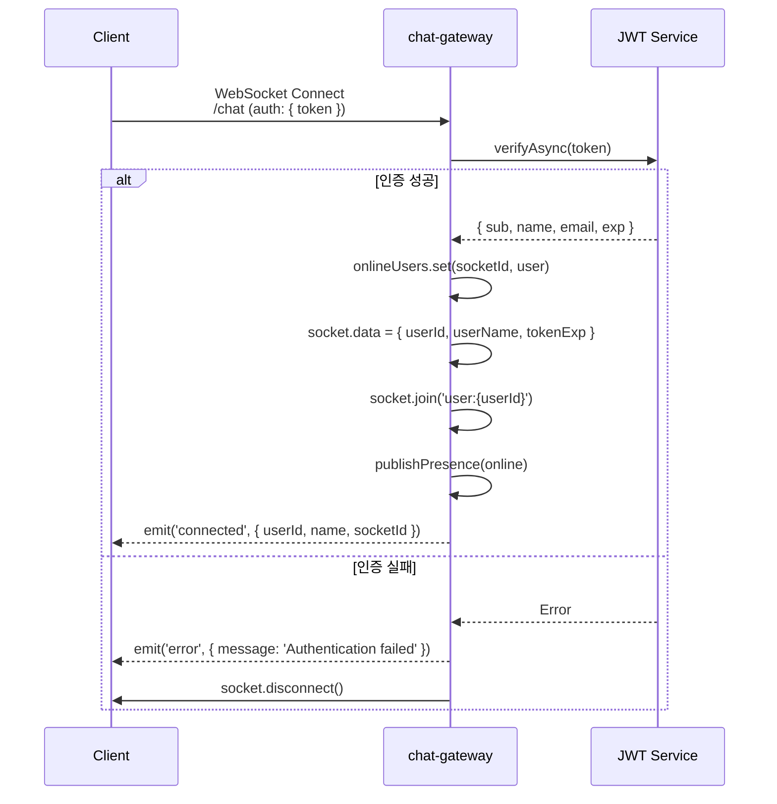
```mermaid
sequenceDiagram
    participant Client
    participant Gateway as chat-gateway
    participant JWT as JWT Service

    Client->>Gateway: WebSocket Connect<br/>/chat (auth: { token })

    Gateway->>JWT: verifyAsync(token)

    alt 인증 성공
        JWT-->>Gateway: { sub, name, email, exp }
        Gateway->>Gateway: onlineUsers.set(socketId, user)
        Gateway->>Gateway: socket.data = { userId, userName, tokenExp }
        Gateway->>Gateway: socket.join('user:{userId}')
        Gateway->>Gateway: publishPresence(online)
        Gateway-->>Client: emit('connected', { userId, name, socketId })
    else 인증 실패
        JWT-->>Gateway: Error
        Gateway-->>Client: emit('error', { message: 'Authentication failed' })
        Gateway->>Client: socket.disconnect()
    end
```

**토큰 전달 방법 (우선순위):**

| 순위 | 방법 | 예시 |
|------|------|------|
| 1 | Socket.IO auth object (권장) | `auth: { token: "jwt..." }` |
| 2 | Authorization header | `Authorization: Bearer <jwt>` |
| 3 | Query parameter (deprecated) | `?token=<jwt>` |

**토큰 만료 모니터링:**
- 60초마다 모든 소켓의 토큰 만료 시간 확인
- 만료 5분 전: `token_expiring` 이벤트 발송
- 만료 후: `token_refresh_needed` 이벤트 발송
- WebSocket 세션은 유지 — 클라이언트가 REST API 토큰만 갱신

### 3.2 채팅방 입장/퇴장

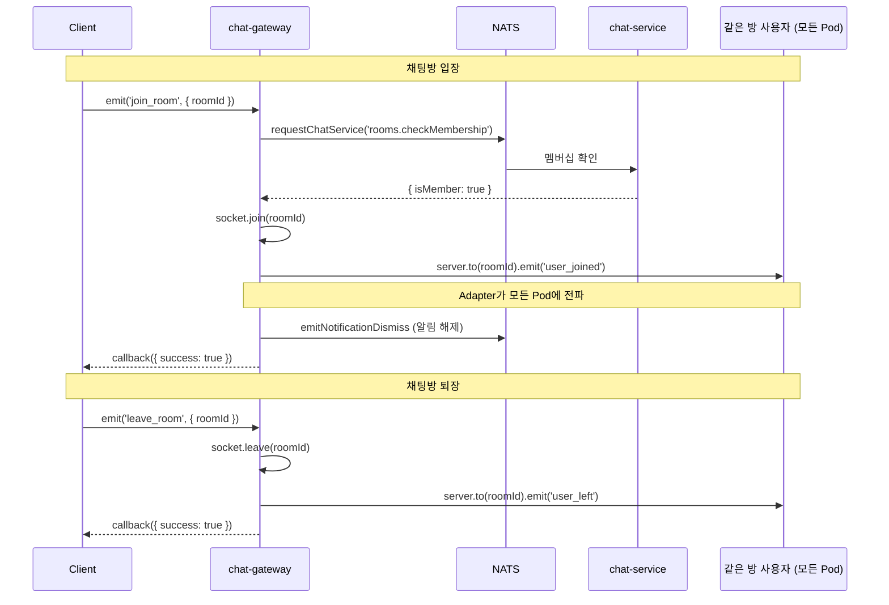
```mermaid
sequenceDiagram
    participant Client
    participant Gateway as chat-gateway
    participant NATS
    participant ChatSvc as chat-service
    participant Others as 같은 방 사용자 (모든 Pod)

    Note over Client,Others: 채팅방 입장
    Client->>Gateway: emit('join_room', { roomId })
    Gateway->>NATS: requestChatService('rooms.checkMembership')
    NATS->>ChatSvc: 멤버십 확인
    ChatSvc-->>Gateway: { isMember: true }
    Gateway->>Gateway: socket.join(roomId)
    Gateway->>Others: server.to(roomId).emit('user_joined')
    Note over Gateway,Others: Adapter가 모든 Pod에 전파
    Gateway->>NATS: emitNotificationDismiss (알림 해제)
    Gateway-->>Client: callback({ success: true })

    Note over Client,Others: 채팅방 퇴장
    Client->>Gateway: emit('leave_room', { roomId })
    Gateway->>Gateway: socket.leave(roomId)
    Gateway->>Others: server.to(roomId).emit('user_left')
    Gateway-->>Client: callback({ success: true })
```

### 3.3 메시지 전송 흐름

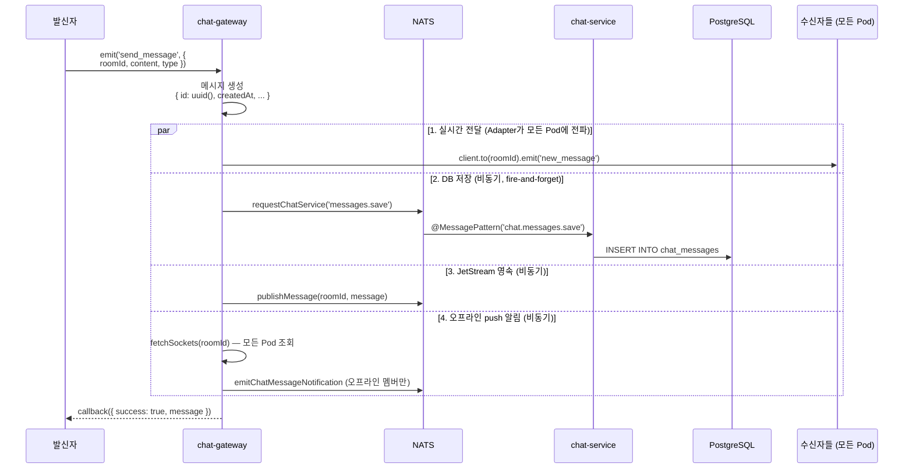
```mermaid
sequenceDiagram
    participant Sender as 발신자
    participant Gateway as chat-gateway
    participant NATS
    participant Service as chat-service
    participant DB as PostgreSQL
    participant Receivers as 수신자들 (모든 Pod)

    Sender->>Gateway: emit('send_message', {<br/>roomId, content, type })

    Gateway->>Gateway: 메시지 생성<br/>{ id: uuid(), createdAt, ... }

    par 1. 실시간 전달 (Adapter가 모든 Pod에 전파)
        Gateway->>Receivers: client.to(roomId).emit('new_message')
    and 2. DB 저장 (비동기, fire-and-forget)
        Gateway->>NATS: requestChatService('messages.save')
        NATS->>Service: @MessagePattern('chat.messages.save')
        Service->>DB: INSERT INTO chat_messages
    and 3. JetStream 영속 (비동기)
        Gateway->>NATS: publishMessage(roomId, message)
    and 4. 오프라인 push 알림 (비동기)
        Gateway->>Gateway: fetchSockets(roomId) — 모든 Pod 조회
        Gateway->>NATS: emitChatMessageNotification (오프라인 멤버만)
    end

    Gateway-->>Sender: callback({ success: true, message })
```

### 3.4 타이핑 표시

타이핑은 순수 Socket.IO broadcast로 처리합니다. NATS/JetStream을 사용하지 않습니다.

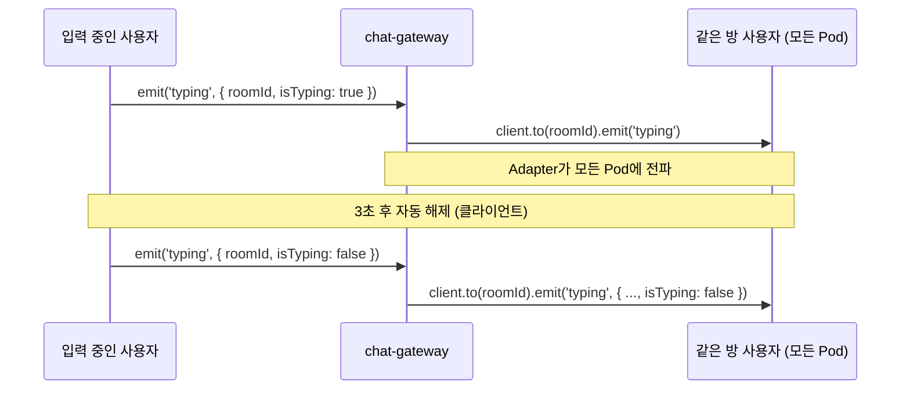
```mermaid
sequenceDiagram
    participant Typer as 입력 중인 사용자
    participant Gateway as chat-gateway
    participant Others as 같은 방 사용자 (모든 Pod)

    Typer->>Gateway: emit('typing', { roomId, isTyping: true })
    Gateway->>Others: client.to(roomId).emit('typing')
    Note over Gateway,Others: Adapter가 모든 Pod에 전파

    Note over Typer,Others: 3초 후 자동 해제 (클라이언트)

    Typer->>Gateway: emit('typing', { roomId, isTyping: false })
    Gateway->>Others: client.to(roomId).emit('typing', { ..., isTyping: false })
```

### 3.5 Heartbeat

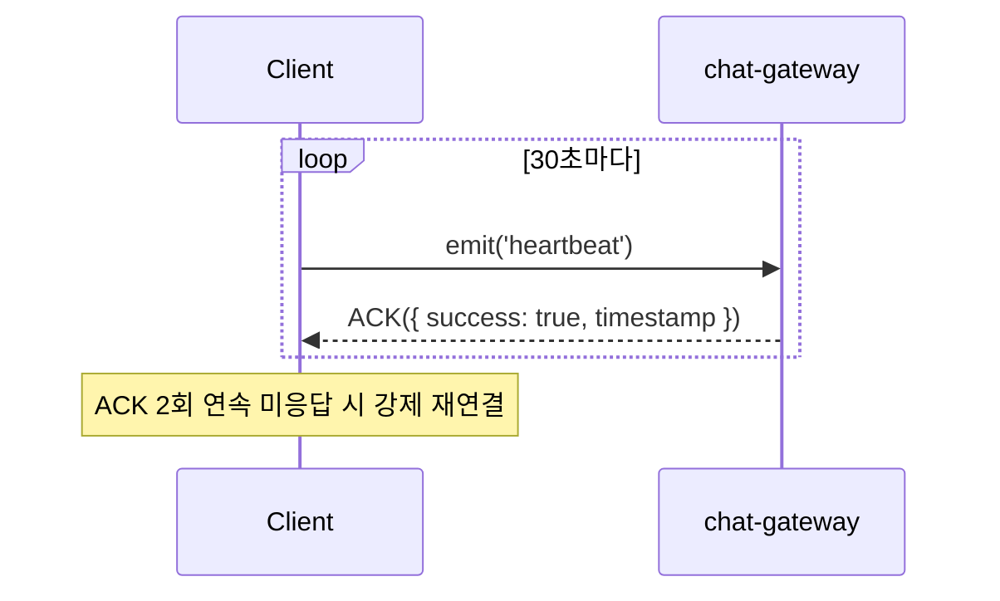
```mermaid
sequenceDiagram
    participant Client
    participant Gateway as chat-gateway

    loop 30초마다
        Client->>Gateway: emit('heartbeat')
        Gateway-->>Client: ACK({ success: true, timestamp })
    end

    Note over Client: ACK 2회 연속 미응답 시 강제 재연결
```

### 3.6 연결 해제 처리

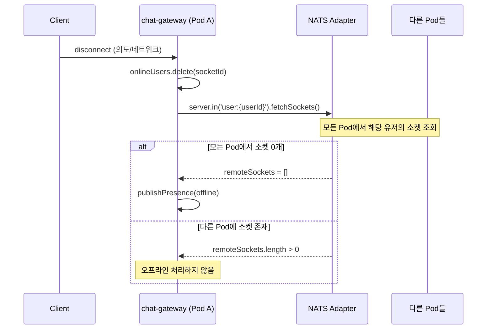
```mermaid
sequenceDiagram
    participant Client
    participant Gateway as chat-gateway (Pod A)
    participant Adapter as NATS Adapter
    participant Others as 다른 Pod들

    Client->>Gateway: disconnect (의도/네트워크)

    Gateway->>Gateway: onlineUsers.delete(socketId)

    Gateway->>Adapter: server.in('user:{userId}').fetchSockets()
    Note over Adapter,Others: 모든 Pod에서 해당 유저의 소켓 조회

    alt 모든 Pod에서 소켓 0개
        Adapter-->>Gateway: remoteSockets = []
        Gateway->>Gateway: publishPresence(offline)
    else 다른 Pod에 소켓 존재
        Adapter-->>Gateway: remoteSockets.length > 0
        Note over Gateway: 오프라인 처리하지 않음
    end
```

### WebSocket 이벤트 요약

#### Chat 네임스페이스 (`/chat`)

| 이벤트 | 방향 | Payload | 설명 |
|--------|------|---------|------|
| `connected` | S→C | `{ userId, name, socketId }` | 연결 성공 |
| `error` | S→C | `{ message }` | 인증/에러 |
| `token_expiring` | S→C | `{ message, expiresIn }` | 토큰 만료 임박 (5분 전) |
| `token_refresh_needed` | S→C | `{ message }` | 토큰 만료됨 |
| `join_room` | C→S | `{ roomId }` | 채팅방 입장 |
| `leave_room` | C→S | `{ roomId }` | 채팅방 퇴장 |
| `send_message` | C→S | `{ roomId, content, type }` | 메시지 전송 |
| `new_message` | S→C | `{ id, roomId, senderId, senderName, content, type, createdAt }` | 새 메시지 수신 |
| `typing` | C↔S | `{ roomId, userId, userName, isTyping }` | 타이핑 상태 |
| `user_joined` | S→C | `{ roomId, userId, userName, timestamp }` | 사용자 입장 |
| `user_left` | S→C | `{ roomId, userId, userName, timestamp }` | 사용자 퇴장 |
| `heartbeat` | C→S | (none) | Keepalive (ACK 반환) |
| `get_online_users` | C→S | (none) | 로컬 Pod 온라인 유저 조회 |

#### Notification 네임스페이스 (`/notification`)

| 이벤트 | 방향 | Payload | 설명 |
|--------|------|---------|------|
| `connected` | S→C | `{ userId, name, socketId }` | 연결 성공 |
| `error` | S→C | `{ message }` | 인증/에러 |
| `notification` | S→C | `{ id, userId, type, title, message, data?, isRead, createdAt }` | 실시간 알림 |

---

## 4. REST API

### 4.1 채팅방 API

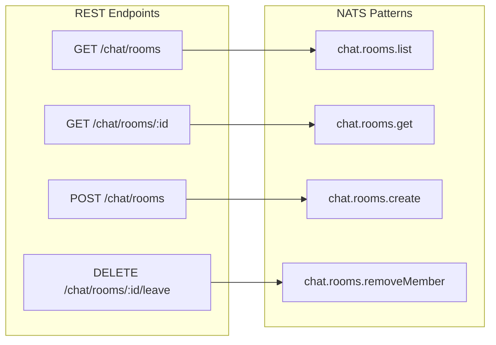
```mermaid
flowchart LR
    subgraph Endpoints["REST Endpoints"]
        E1[GET /chat/rooms]
        E2[GET /chat/rooms/:id]
        E3[POST /chat/rooms]
        E4[DELETE /chat/rooms/:id/leave]
    end

    subgraph NATS["NATS Patterns"]
        N1[chat.rooms.list]
        N2[chat.rooms.get]
        N3[chat.rooms.create]
        N4[chat.rooms.removeMember]
    end

    E1 --> N1
    E2 --> N2
    E3 --> N3
    E4 --> N4
```

#### 채팅방 목록 조회

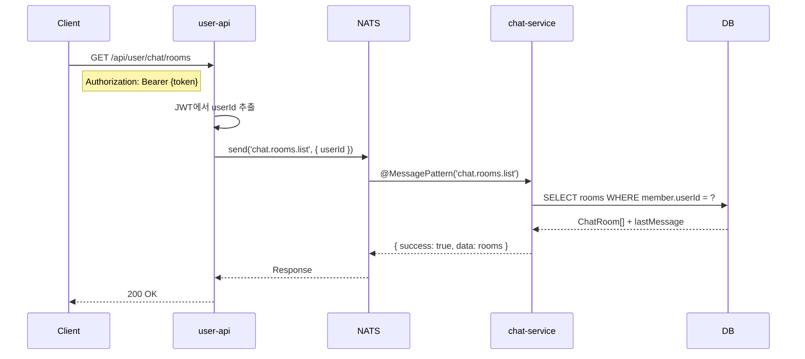
```mermaid
sequenceDiagram
    participant Client
    participant BFF as user-api
    participant NATS
    participant Service as chat-service
    participant DB

    Client->>BFF: GET /api/user/chat/rooms
    Note right of Client: Authorization: Bearer {token}

    BFF->>BFF: JWT에서 userId 추출
    BFF->>NATS: send('chat.rooms.list', { userId })

    NATS->>Service: @MessagePattern('chat.rooms.list')
    Service->>DB: SELECT rooms WHERE member.userId = ?

    DB-->>Service: ChatRoom[] + lastMessage
    Service-->>NATS: { success: true, data: rooms }
    NATS-->>BFF: Response
    BFF-->>Client: 200 OK
```

**응답 예시:**
```json
{
  "success": true,
  "data": [
    {
      "id": "room-uuid",
      "name": null,
      "type": "DIRECT",
      "members": [
        { "userId": 4, "userName": "김철수" }
      ],
      "lastMessage": {
        "content": "안녕하세요!",
        "createdAt": "2024-01-15T10:30:00Z"
      },
      "unreadCount": 3,
      "updatedAt": "2024-01-15T10:30:00Z"
    }
  ]
}
```

#### 채팅방 생성

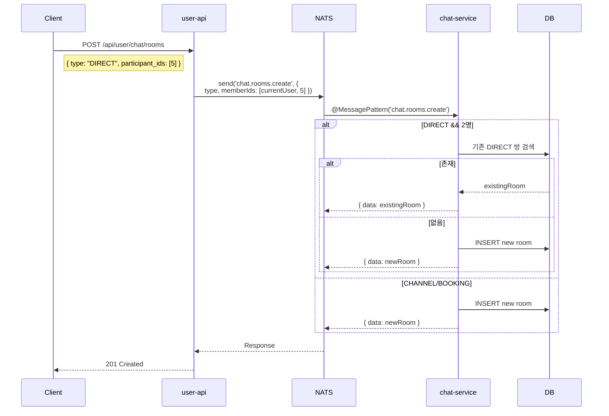
```mermaid
sequenceDiagram
    participant Client
    participant BFF as user-api
    participant NATS
    participant Service as chat-service
    participant DB

    Client->>BFF: POST /api/user/chat/rooms
    Note right of Client: { type: "DIRECT", participant_ids: [5] }

    BFF->>NATS: send('chat.rooms.create', {<br/>type, memberIds: [currentUser, 5] })

    NATS->>Service: @MessagePattern('chat.rooms.create')

    alt DIRECT && 2명
        Service->>DB: 기존 DIRECT 방 검색
        alt 존재
            DB-->>Service: existingRoom
            Service-->>NATS: { data: existingRoom }
        else 없음
            Service->>DB: INSERT new room
            Service-->>NATS: { data: newRoom }
        end
    else CHANNEL/BOOKING
        Service->>DB: INSERT new room
        Service-->>NATS: { data: newRoom }
    end

    NATS-->>BFF: Response
    BFF-->>Client: 201 Created
```

### 4.2 메시지 API

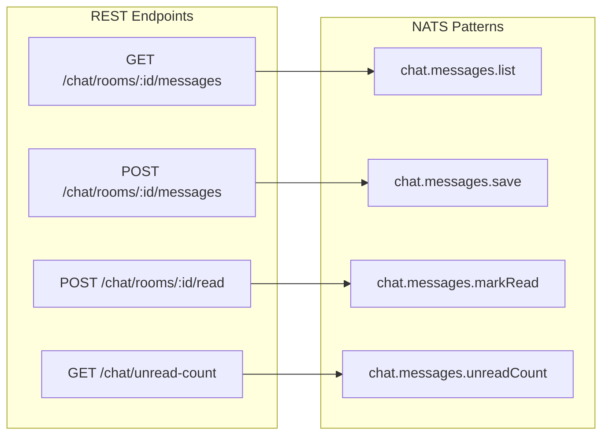
```mermaid
flowchart LR
    subgraph Endpoints["REST Endpoints"]
        E1[GET /chat/rooms/:id/messages]
        E2[POST /chat/rooms/:id/messages]
        E3[POST /chat/rooms/:id/read]
        E4[GET /chat/unread-count]
    end

    subgraph NATS["NATS Patterns"]
        N1[chat.messages.list]
        N2[chat.messages.save]
        N3[chat.messages.markRead]
        N4[chat.messages.unreadCount]
    end

    E1 --> N1
    E2 --> N2
    E3 --> N3
    E4 --> N4
```

#### 메시지 조회 (커서 페이지네이션)

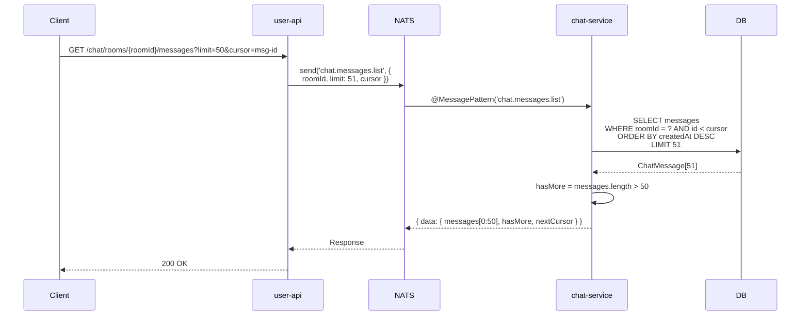
```mermaid
sequenceDiagram
    participant Client
    participant BFF as user-api
    participant NATS
    participant Service as chat-service
    participant DB

    Client->>BFF: GET /chat/rooms/{roomId}/messages?limit=50&cursor=msg-id

    BFF->>NATS: send('chat.messages.list', {<br/>roomId, limit: 51, cursor })

    NATS->>Service: @MessagePattern('chat.messages.list')
    Service->>DB: SELECT messages<br/>WHERE roomId = ? AND id < cursor<br/>ORDER BY createdAt DESC<br/>LIMIT 51

    DB-->>Service: ChatMessage[51]
    Service->>Service: hasMore = messages.length > 50
    Service-->>NATS: { data: { messages[0:50], hasMore, nextCursor } }

    NATS-->>BFF: Response
    BFF-->>Client: 200 OK
```

#### 메시지 전송 (REST Fallback)

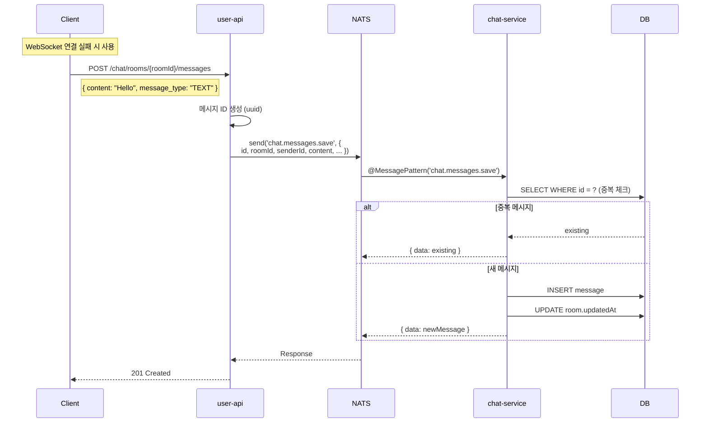
```mermaid
sequenceDiagram
    participant Client
    participant BFF as user-api
    participant NATS
    participant Service as chat-service
    participant DB

    Note over Client: WebSocket 연결 실패 시 사용

    Client->>BFF: POST /chat/rooms/{roomId}/messages
    Note right of Client: { content: "Hello", message_type: "TEXT" }

    BFF->>BFF: 메시지 ID 생성 (uuid)
    BFF->>NATS: send('chat.messages.save', {<br/>id, roomId, senderId, content, ... })

    NATS->>Service: @MessagePattern('chat.messages.save')
    Service->>DB: SELECT WHERE id = ? (중복 체크)

    alt 중복 메시지
        DB-->>Service: existing
        Service-->>NATS: { data: existing }
    else 새 메시지
        Service->>DB: INSERT message
        Service->>DB: UPDATE room.updatedAt
        Service-->>NATS: { data: newMessage }
    end

    NATS-->>BFF: Response
    BFF-->>Client: 201 Created
```

---

## 5. NATS 메시지 패턴

### Request/Reply 패턴 (chat-service)

| 패턴 | 용도 | Payload |
|------|------|---------|
| `chat.rooms.list` | 채팅방 목록 | `{ userId }` |
| `chat.rooms.get` | 채팅방 상세 | `{ roomId, userId }` |
| `chat.rooms.create` | 채팅방 생성 | `{ type, name?, memberIds, memberNames }` |
| `chat.rooms.checkMembership` | 멤버십 확인 | `{ roomId, userId }` |
| `chat.rooms.removeMember` | 채팅방 나가기 | `{ roomId, userId }` |
| `chat.messages.list` | 메시지 목록 | `{ roomId, limit, cursor? }` |
| `chat.messages.save` | 메시지 저장 | `{ id, roomId, senderId, content, type }` |
| `chat.messages.markRead` | 읽음 처리 | `{ roomId, userId, messageId }` |
| `chat.messages.unreadCount` | 안읽은 수 | `{ userId }` |

### Pub/Sub 패턴 (notify-service)

| Subject | 방향 | Payload | 용도 |
|---------|------|---------|------|
| `chat.message` | gateway → notify | `{ chatRoomId, senderId, senderName, recipientId, messagePreview }` | 오프라인 push 알림 |
| `notification.dismiss` | gateway → notify | `{ userId, type, dataFilter }` | 알림 해제 |
| `notification.created` | notify → gateway | `{ id, userId, type, title, message, data? }` | 실시간 알림 전달 |

### JetStream Streams

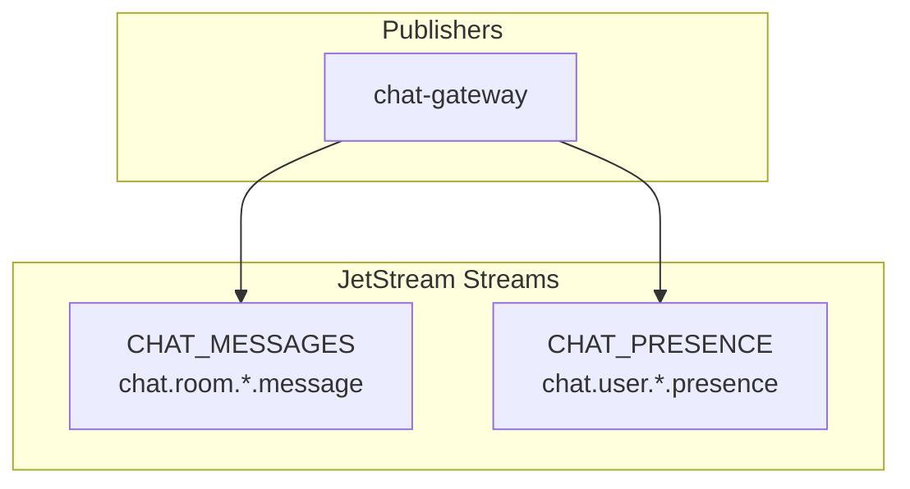
```mermaid
flowchart TB
    subgraph Publishers["Publishers"]
        GW[chat-gateway]
    end

    subgraph Streams["JetStream Streams"]
        S1[CHAT_MESSAGES<br/>chat.room.*.message]
        S2[CHAT_PRESENCE<br/>chat.user.*.presence]
    end

    GW --> S1 & S2
```

| 스트림 | Subject 패턴 | 보존 기간 | 저장소 | 용도 |
|--------|-------------|----------|--------|------|
| `CHAT_MESSAGES` | `chat.room.*.message` | 30일 | File | 메시지 영속성/복구 |
| `CHAT_PRESENCE` | `chat.user.*.presence` | 5분 | Memory | 온라인/오프라인 상태 |

### Socket.IO Adapter 전용 Subject

| Subject | 용도 |
|---------|------|
| `socketio._chat` | `/chat` 네임스페이스 cross-pod broadcast |
| `socketio._chat.response.{uid}` | 특정 Pod 응답 (fetchSockets 등) |
| `socketio._notification` | `/notification` 네임스페이스 cross-pod broadcast |

---

## 6. 데이터베이스 스키마

### ERD

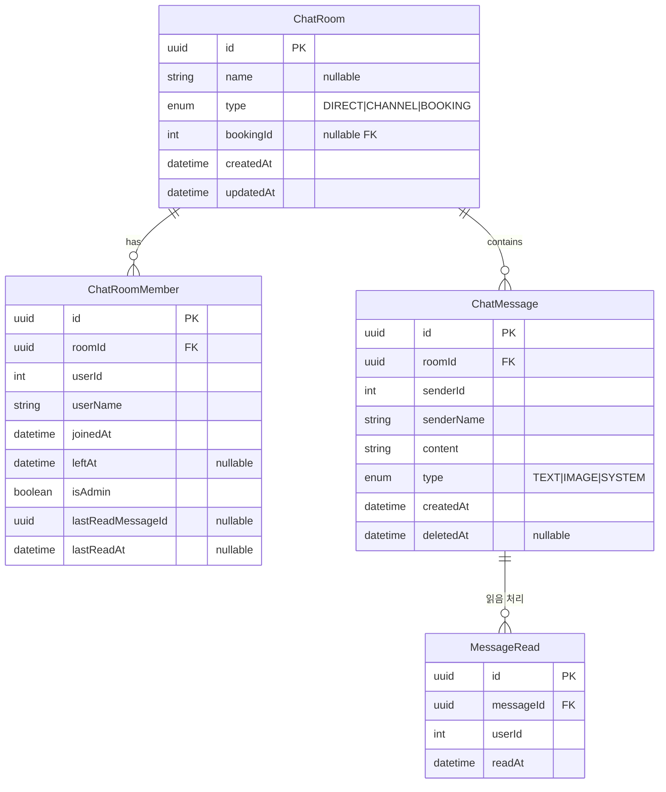
```mermaid
erDiagram
    ChatRoom ||--o{ ChatRoomMember : has
    ChatRoom ||--o{ ChatMessage : contains
    ChatMessage ||--o{ MessageRead : "읽음 처리"

    ChatRoom {
        uuid id PK
        string name "nullable"
        enum type "DIRECT|CHANNEL|BOOKING"
        int bookingId "nullable FK"
        datetime createdAt
        datetime updatedAt
    }

    ChatRoomMember {
        uuid id PK
        uuid roomId FK
        int userId
        string userName
        datetime joinedAt
        datetime leftAt "nullable"
        boolean isAdmin
        uuid lastReadMessageId "nullable"
        datetime lastReadAt "nullable"
    }

    ChatMessage {
        uuid id PK
        uuid roomId FK
        int senderId
        string senderName
        string content
        enum type "TEXT|IMAGE|SYSTEM"
        datetime createdAt
        datetime deletedAt "nullable"
    }

    MessageRead {
        uuid id PK
        uuid messageId FK
        int userId
        datetime readAt
    }
```

### 인덱스 설계

| 테이블 | 인덱스 | 용도 |
|--------|--------|------|
| chat_rooms | `(type, updated_at DESC)` | 타입별 최신순 정렬 |
| chat_room_members | `(user_id, left_at)` | 사용자별 활성 채팅방 |
| chat_room_members | `(room_id, user_id)` | 채팅방 멤버 조회 |
| chat_messages | `(room_id, created_at DESC)` | 채팅방 메시지 목록 |
| chat_messages | `(room_id, id)` | 커서 페이지네이션 |
| message_reads | `(message_id, user_id)` | 읽음 상태 조회 |

---

## 7. 클라이언트 구현

### 7.1 플랫폼별 구현 위치

| 플랫폼 | Socket Manager | Token 저장소 | API Client | UI |
|--------|---------------|-------------|------------|-----|
| Web | `lib/socket/chatSocket.ts` | `localStorage` (`authStorage`) | `lib/api/client.ts` | `pages/ChatRoomPage.tsx` |
| iOS | `ChatSocketManager.swift` | `Keychain` (`KeychainManager`) | `APIClient.swift` (actor) | `ChatRoomView.swift` |
| Android | `ChatSocketManager.kt` | `DataStore` (`AuthPreferences`) | `AuthInterceptor.kt` + `TokenAuthenticator.kt` | `ChatRoomScreen.kt` |

### 7.2 공통 연결 관리 패턴

| 기능 | Web | iOS | Android |
|------|-----|-----|---------|
| Heartbeat 주기 | 30초 | 30초 | 30초 |
| 최대 미응답 횟수 | 2회 | 2회 | 2회 |
| SocketIO auto-reconnect | **활성** (동적 auth 콜백) | **비활성** (자체 관리) | **비활성** (ViewModel 관리) |
| 재연결 전략 | SocketIO 내장 (1→30s) | 지수 백오프 (1→30s) | ViewModel 시그널 (rate limit 3s) |
| 토큰 전달 | `auth` 콜백 (동적) | `connectParams` (생성 시 고정) | `query` + `auth` + `header` |
| 재연결 시 토큰 | `authStorage.getToken()` | `APIClient.getAccessToken()` (Keychain fallback) | ViewModel이 fresh token 제공 |
| 토큰 갱신 | REST API only | REST API only | REST API only |
| 동시 갱신 방지 | Promise mutex | `isRefreshingToken` 플래그 | `synchronized(this)` |

### 7.3 연결 상태 관리

```mermaid
stateDiagram-v2
    [*] --> Disconnected

    Disconnected --> Connecting: connect(token)
    Connecting --> Connected: 인증 성공
    Connecting --> Disconnected: 인증 실패 → handleAuthError

    Connected --> Disconnected: 연결 끊김 / Heartbeat 실패
    Disconnected --> Connecting: scheduleReconnect (fresh token)

    Connected --> Disconnected: disconnect() [의도적]

    note right of Connecting
        매 재연결 시 fresh token 획득
        Web: authStorage.getToken()
        iOS: APIClient → Keychain fallback
        Android: ViewModel → DataStore
    end note
```

### 7.4 DM(1:1 채팅) 흐름

모든 플랫폼에서 DM은 일반 채팅방과 동일한 흐름을 사용합니다:

```
1. REST API로 DIRECT 채팅방 생성/조회 → roomId 획득
2. join_room(roomId)
3. send_message({ roomId, content }) → new_message 수신
```

### 7.5 Web (React + Socket.IO)

```mermaid
flowchart TB
    subgraph Components["React Components"]
        PAGE[ChatPage]
        LIST[ChatRoomList]
        ROOM[ChatRoomPage]
        INPUT[MessageInput]
    end

    subgraph Hooks["Custom Hooks"]
        QUERY[useChatRoomsQuery]
        MSG[useMessagesQuery]
    end

    subgraph Socket["Socket Manager"]
        SM[chatSocket.ts<br/>Singleton]
    end

    PAGE --> LIST & ROOM
    ROOM --> INPUT
    LIST --> QUERY
    ROOM --> MSG
    ROOM --> SM
```

### 7.6 iOS (SwiftUI + SocketIO)

```mermaid
flowchart TB
    subgraph Views["SwiftUI Views"]
        CV[ChatRoomView]
        RLV[ChatListView]
    end

    subgraph ViewModels["ViewModels"]
        CVM[ChatRoomViewModel]
        AVM[AiChatViewModel]
        RVM[ChatListViewModel]
    end

    subgraph Network["Network Layer"]
        SM[ChatSocketManager<br/>@MainActor Singleton]
        API[APIClient<br/>Actor]
        KC[KeychainManager<br/>토큰 영속]
    end

    CV --> CVM & AVM
    RLV --> RVM
    CVM --> SM & API
    AVM --> API
    RVM --> API
    API --> KC
    SM --> API
```

### 7.7 Android (Compose + Socket.IO)

```mermaid
flowchart TB
    subgraph UI["Compose UI"]
        CS[ChatRoomScreen]
        CL[ChatListScreen]
    end

    subgraph ViewModels["ViewModels"]
        CVM[ChatViewModel]
    end

    subgraph Data["Data Layer"]
        SM[ChatSocketManager<br/>@Singleton]
        REPO[ChatRepository]
        AUTH[AuthPreferences<br/>DataStore + AtomicRef]
    end

    subgraph Network["OkHttp"]
        INT[AuthInterceptor]
        TOK[TokenAuthenticator<br/>synchronized mutex]
    end

    CS --> CVM
    CL --> CVM
    CVM --> REPO & SM
    REPO --> INT
    INT --> TOK
    TOK --> AUTH
    CVM --> AUTH
```

---

## 8. 소켓 연결 · 재연결 · 토큰 관리

### 8.1 초기 연결 흐름

```mermaid
sequenceDiagram
    participant View as UI (View/Screen)
    participant VM as ViewModel
    participant SM as SocketManager
    participant API as APIClient
    participant Store as Token Store
    participant GW as chat-gateway

    View->>VM: 채팅방 화면 진입
    VM->>API: getAccessToken()
    API->>Store: in-memory 확인
    alt in-memory 토큰 있음
        Store-->>API: token
    else in-memory nil
        API->>Store: Keychain/DataStore 조회
        Store-->>API: token (fallback)
    end
    API-->>VM: fresh token
    VM->>SM: connect(token)
    SM->>GW: WebSocket /chat (token)
    GW->>GW: JWT 검증
    GW-->>SM: connected / error
    SM-->>VM: isConnected = true
    VM->>SM: joinRoom(roomId)
    SM->>GW: emit('join_room')
    GW-->>SM: ACK(success)
```

### 8.2 재연결 전략 (플랫폼별)

#### Web — SocketIO 내장 + 동적 auth 콜백

```mermaid
flowchart TB
    A[연결 끊김] --> B[SocketIO 내장 auto-reconnect]
    B --> C["auth 콜백 실행<br/>authStorage.getToken()"]
    C --> D{최신 토큰으로 연결}
    D -->|성공| E[방 재참여 + 캐시 무효화]
    D -->|인증 실패| F["handleAuthError()<br/>apiClient.refreshAccessToken()"]
    F --> G{갱신 성공?}
    G -->|성공| H["forceReconnect(newToken)"]
    G -->|실패| I[로그아웃]
```

```typescript
// Web: 동적 auth 콜백 — 재연결마다 최신 토큰 자동 사용
auth: (cb) => {
  cb({ token: authStorage.getToken() || this.token });
}
```

#### iOS — 자체 재연결 (지수 백오프 + fresh token)

```mermaid
flowchart TB
    A[연결 끊김] --> B{의도적 disconnect?}
    B -->|Yes| Z[종료]
    B -->|No| C["scheduleReconnect()<br/>지수 백오프: 1→2→4→8→16→30s"]
    C --> D["APIClient.getAccessToken()<br/>(Keychain fallback)"]
    D --> E["forceReconnect(freshToken)<br/>새 SocketManager 생성"]
    E --> F{연결 성공?}
    F -->|성공| G["reconnected.send()<br/>→ 방 재참여 + 메시지 갱신"]
    F -->|인증 실패| H["handleAuthError()<br/>→ refreshAccessToken()"]
    F -->|기타 오류| C
    H --> I{갱신 성공?}
    I -->|성공| E
    I -->|실패| Z
```

```swift
// iOS: SocketIO auto-reconnect 비활성화, 자체 관리
.reconnects(false)

// 매 재연결 시 fresh token 획득
let token = await APIClient.shared.getAccessToken() ?? self.currentToken
// APIClient.getAccessToken() → in-memory → Keychain fallback
```

#### Android — ViewModel 시그널 기반

```mermaid
flowchart TB
    A[연결 끊김 / 오류] --> B["_reconnectWithNewToken.tryEmit()"]
    B --> C["ViewModel 수신<br/>authRepository.refreshToken()"]
    C --> D["forceReconnect(freshToken)"]
    D --> E{연결 성공?}
    E -->|성공| F[방 재참여 + 메시지 갱신]
    E -->|실패| G["재시그널 (rate limit 3s)"]
```

```kotlin
// Android: SocketIO auto-reconnect 비활성화, ViewModel이 토큰 갱신 후 재연결
reconnection = false  // 우리 코드가 토큰 갱신 후 직접 재연결
```

### 8.3 토큰 갱신 (Token Refresh) 플로우

#### 서버 → 클라이언트 토큰 이벤트

```mermaid
sequenceDiagram
    participant GW as chat-gateway
    participant SM as SocketManager
    participant API as APIClient

    Note over GW: 60초마다 토큰 만료 확인

    GW->>SM: token_expiring (만료 5분 전)
    SM->>API: refreshAccessToken()
    API-->>SM: new token
    SM->>SM: currentToken = newToken

    GW->>SM: token_refresh_needed (만료 후)
    SM->>API: refreshAccessToken()
    API-->>SM: new token
    SM->>SM: currentToken = newToken

    Note over GW,SM: WebSocket 세션은 유지됨<br/>REST API 토큰만 갱신
```

#### REST API 401 → 토큰 갱신 → 소켓 동기화

```mermaid
sequenceDiagram
    participant APP as App (REST 호출)
    participant API as APIClient
    participant Store as Token Store
    participant SM as SocketManager

    APP->>API: API 요청
    API-->>APP: 401 Unauthorized
    API->>API: attemptTokenRefresh()

    alt Web
        API->>Store: refreshAccessToken() [mutex]
        Store-->>API: new tokens
        API->>Store: authStorage.setToken(newToken)
        Note over SM: 다음 reconnect 시 auth 콜백이 최신 토큰 사용
    else iOS
        API->>Store: refreshAccessToken() [actor 직렬화]
        Store-->>API: new tokens
        API->>Store: Keychain.saveTokens()
        Note over SM: 다음 reconnect 시 APIClient.getAccessToken() → Keychain fallback
    else Android
        API->>Store: TokenAuthenticator [synchronized]
        Store-->>API: new tokens
        API->>Store: AuthPreferences.saveTokens()
        Note over SM: ViewModel이 reconnect 시 fresh token 제공
    end
```

#### 동시 갱신 방지 메커니즘

| 플랫폼 | 메커니즘 | 구현 |
|--------|---------|------|
| Web | Promise mutex | `isRefreshing` + `refreshPromise` → 동일 Promise 재사용 |
| iOS | Actor 직렬화 + 플래그 | `APIClient` actor → `refreshTask` 재사용, `isRefreshingToken` 플래그 |
| Android | `synchronized` 블록 | `TokenAuthenticator` → `synchronized(this)` + 이중 체크 패턴 |

### 8.4 인증 오류 → 재연결 플로우

```mermaid
sequenceDiagram
    participant SM as SocketManager
    participant API as APIClient
    participant Store as Token Store
    participant GW as chat-gateway

    GW->>SM: error("Unauthorized")

    SM->>SM: handleAuthError()
    SM->>API: refreshAccessToken()

    alt 갱신 성공
        API-->>SM: true
        SM->>API: getAccessToken()
        API->>Store: Keychain/DataStore
        Store-->>API: fresh token
        API-->>SM: fresh token
        SM->>SM: currentToken = freshToken
        SM->>SM: forceReconnect(freshToken)
        SM->>GW: WebSocket 재연결 (fresh token)
        GW-->>SM: connected
        SM->>SM: reconnected → 방 재참여
    else 갱신 실패 (refresh token 만료)
        API-->>SM: false
        SM->>SM: 연결 포기
        Note over SM: sessionExpired 알림 → 로그인 화면
    end
```

### 8.5 앱 라이프사이클 처리

| 이벤트 | Web | iOS | Android |
|--------|-----|-----|---------|
| **백그라운드 → 포그라운드** | `visibilitychange` | `willEnterForeground` | `onResume` (Lifecycle) |
| 소켓 끊어진 경우 | `forceReconnect(authStorage.getToken())` | `stopReconnectTimer()` → 즉시 `forceReconnect(freshToken)` | `_reconnectWithNewToken.tryEmit()` |
| 소켓 유지 중인 경우 | `joinRoom` + 캐시 무효화 | `reconnected.send()` → 방 재참여 | `joinRoom(currentRoomId)` |
| 메시지 갭 복구 | `invalidateQueries` | `loadMessages()` | `loadMessages()` |

```mermaid
flowchart TB
    A[앱 포그라운드 복귀] --> B{소켓 연결 상태?}
    B -->|끊어짐| C[fresh token 획득]
    C --> D[즉시 forceReconnect]
    D --> E[방 재참여 + 메시지 갱신]
    B -->|유지 중| F[방 재참여 트리거]
    F --> G[메시지 갱신<br/>백그라운드 동안 놓친 메시지 보충]
```

### 8.6 방 재참여 (Room Rejoin) 보장

재연결 후 방 재참여가 누락되면 메시지를 수신할 수 없으므로, 모든 플랫폼에서 다중 안전장치를 적용합니다.

| 트리거 | Web | iOS | Android |
|--------|-----|-----|---------|
| Socket `connect` 이벤트 | `joinRoomWithRetry()` | `reconnected.send()` → VM 구독 | VM이 `connectionState` 관찰 |
| Socket `reconnect` 이벤트 | `joinRoomWithRetry()` + 캐시 무효화 | (`.connect` 에서 통합 처리) | — |
| NATS 복구 (`system:nats_status`) | `joinRoom` + 메시지 재로드 | VM 구독 → `joinRoom` | VM 구독 → `joinRoom` |
| 앱 포그라운드 복귀 | `joinRoom` + 캐시 무효화 | `reconnected.send()` | `joinRoom(currentRoomId)` |

```
iOS 핵심 메커니즘:
  .connect 이벤트 → hasEverConnected 플래그 확인 → true면 reconnected.send()
  ChatRoomViewModel이 reconnected 구독 → joinRoom(roomId) + loadMessages()
```

### 8.7 토큰 저장소 비교

| 항목 | Web (`localStorage`) | iOS (`Keychain`) | Android (`DataStore`) |
|------|---------------------|------------------|-----------------------|
| 영속성 | 탭/브라우저 종료 후에도 유지 | 앱 삭제 전까지 유지 | 앱 삭제 전까지 유지 |
| 보안 | JS에서 접근 가능 (XSS 취약) | 하드웨어 암호화 | 앱 샌드박스 내 암호화 |
| 동기/비동기 | 동기 | 동기 (`@unchecked Sendable`) | 비동기 (Flow) + 동기 캐시 (`AtomicReference`) |
| 메모리 캐시 | 불필요 (동기 접근) | `APIClient` actor 내 `accessToken` | `AtomicReference<String?>` |
| Fallback 체인 | `authStorage.getToken()` | in-memory → Keychain | 캐시 → DataStore |

---

## 9. 에러 처리 및 복구

### 9.1 WebSocket 연결 실패

```mermaid
flowchart TD
    A[메시지 전송] --> B{WebSocket 연결?}
    B -->|연결됨| C[WebSocket 전송]
    B -->|끊김| D[REST API Fallback]

    C --> E{전송 성공?}
    E -->|성공| F[완료]
    E -->|실패| D

    D --> G["POST /chat/rooms/:id/messages"]
    G --> H{API 성공?}
    H -->|성공| F
    H -->|실패| I[에러 표시 + 재시도 버튼]
```

### 9.2 재연결 시나리오별 동작

| 시나리오 | 트리거 | 토큰 처리 | 결과 |
|---------|--------|----------|------|
| 네트워크 끊김 | `.disconnect` 이벤트 | fresh token으로 재연결 | 방 재참여 + 메시지 갭 복구 |
| 서버 재시작 | `.disconnect` 이벤트 | 지수 백오프 + fresh token | 서버 복구 후 자동 연결 |
| 토큰 만료 (소켓) | `.error(Unauthorized)` | `handleAuthError` → refresh → reconnect | 새 토큰으로 재연결 |
| 토큰 만료 (서버 알림) | `token_expiring` / `token_refresh_needed` | REST API 토큰 갱신 (소켓 유지) | 세션 유지, 토큰만 갱신 |
| Heartbeat 타임아웃 | 2회 연속 ACK 미응답 | `socket.disconnect()` → 재연결 | 데드 커넥션 감지 + 복구 |
| 앱 백그라운드 → 포그라운드 | 라이프사이클 이벤트 | fresh token으로 즉시 재연결 | 메시지 갭 복구 |
| Refresh token 만료 | `handleAuthError` 실패 | 연결 포기 | `sessionExpired` → 로그인 화면 |

### 9.3 메시지 중복 방지

```mermaid
sequenceDiagram
    participant Client
    participant Gateway as chat-gateway
    participant Service as chat-service
    participant DB

    Note over Client: 메시지 ID를 서버에서 생성 (UUID)

    Client->>Gateway: send_message({ roomId, content })
    Gateway->>Gateway: id = uuid()
    Gateway->>Service: save({ id: "uuid-123", ... })

    Service->>DB: SELECT WHERE id = "uuid-123"

    alt 이미 존재
        DB-->>Service: existing message
        Service-->>Gateway: { data: existing }
    else 새 메시지
        Service->>DB: INSERT
        Service-->>Gateway: { data: new }
    end
```

JetStream에서도 `msgID`로 1분 내 중복 발행을 자동 차단합니다.

### 9.4 NATS 연결 실패

```mermaid
flowchart TD
    A[NATS 연결] --> B{성공?}
    B -->|성공| C[정상 운영]
    B -->|실패| D{어느 연결?}

    D -->|Adapter 연결| E[Single-instance 모드<br/>cross-pod broadcast 불가]
    D -->|Service 연결| F[JetStream/RPC 불가<br/>메시지 저장 실패]

    E --> G[로그 경고, 서비스 계속]
    F --> H[자동 재연결 시도<br/>무한 재시도]
```

---

## 10. 배포 및 운영

### 9.1 GKE 배포 구성

| 서비스 | Replicas | CPU (req/lim) | Memory (req/lim) | DB |
|--------|----------|---------------|-------------------|----|
| chat-gateway | **2** | 100m / 300m | 128Mi / 384Mi | 없음 |
| chat-service | 1 | 50m / 200m | 96Mi / 256Mi | chat_db |
| notify-service | 1 | 50m / 200m | 96Mi / 256Mi | notify_db |
| user-api | 1 | 50m / 200m | 96Mi / 256Mi | 없음 |

### 9.2 chat-gateway 고가용성 설정

```yaml
# Deployment
spec:
  replicas: 2
  strategy:
    type: RollingUpdate
    rollingUpdate:
      maxSurge: 1
      maxUnavailable: 0    # zero-downtime: 새 Pod Ready 후 기존 Pod 종료

# BackendConfig (GKE Ingress)
spec:
  timeoutSec: 3600          # WebSocket 장기 연결 (1시간)
  sessionAffinity:
    affinityType: "GENERATED_COOKIE"
    affinityCookieTtlSec: 3600
  connectionDraining:
    drainingTimeoutSec: 60

# PodDisruptionBudget
spec:
  maxUnavailable: 1
  selector:
    matchLabels:
      app: chat-gateway
```

**Session Affinity**: 쿠키 기반으로 같은 클라이언트를 같은 Pod에 고정.
Socket.IO 초기 HTTP 핸드셰이크 → WebSocket 업그레이드까지 동일 Pod 보장.
업그레이드 후에는 WebSocket 연결 자체가 Pod에 고정됩니다.

### 9.3 Graceful Shutdown

```mermaid
sequenceDiagram
    participant K8s as Kubernetes
    participant Pod as chat-gateway Pod
    participant NATS as NATS
    participant Clients as 연결된 클라이언트

    K8s->>Pod: SIGTERM
    Pod->>Pod: enableShutdownHooks 트리거
    Pod->>NATS: adapter connection drain()
    Pod->>Clients: 연결 해제 (connectionDraining 60초)
    Pod->>Pod: app.close()
    Pod->>K8s: exit(0)
```

### 9.4 Health Check

```
GET /health → { status: "ok", service: "chat-gateway", timestamp: "..." }
```

- **readinessProbe**: 15초 후 시작, 5초 주기
- **livenessProbe**: 30초 후 시작, 10초 주기

### 9.5 모니터링

```bash
# Pod 상태 확인
kubectl get pods -l app=chat-gateway -n parkgolf-{env}

# 로그 확인
kubectl logs -l app=chat-gateway -n parkgolf-{env} --tail=100

# 실시간 로그
kubectl logs -l app=chat-gateway -n parkgolf-{env} -f
```

### 9.6 문제 해결

| 증상 | 원인 | 해결 방법 |
|------|------|----------|
| CrashLoopBackOff | 모듈 의존성 에러 | `kubectl logs`로 에러 확인, DI 등록 검증 |
| Pod Pending | GKE Autopilot 노드 프로비저닝 | 대기 또는 리소스 request 축소 |
| 메시지 다른 Pod에 안 감 | NATS adapter 연결 실패 | NATS Pod 상태 확인, adapter 로그 확인 |
| "No subscribers" 에러 | chat-service 미시작 | 서비스 상태 확인, health check |
| 메시지 중복 | 재전송 로직 버그 | JetStream duplicate_window 확인 |
| WebSocket 연결 안됨 | BackendConfig 미적용 | Service annotation 확인 |
| 채팅방 목록 안 뜸 | NATS 연결 실패 | NATS Pod 상태 확인 |

### 9.7 파일 구조

```
services/chat-gateway/src/
├── main.ts                          # Bootstrap, ChatIoAdapter, NATS 연결
├── app.module.ts                    # Module imports
├── adapters/
│   └── nats-adapter.ts              # Socket.IO ClusterAdapterWithHeartbeat (NATS)
├── gateway/
│   ├── chat.gateway.ts              # /chat 네임스페이스 (메시지, 타이핑, 입장)
│   └── chat.gateway.module.ts
├── notification/
│   ├── notification.gateway.ts      # /notification 네임스페이스 (실시간 알림)
│   └── notification.module.ts
├── nats/
│   ├── nats.service.ts              # JetStream + RPC + Pub/Sub
│   └── nats.module.ts               # CHAT_SERVICE, NOTIFY_SERVICE ClientProxy
├── auth/
│   ├── ws-auth.guard.ts             # JWT 검증
│   └── auth.module.ts
└── common/
    └── health.controller.ts         # GET /health
```
