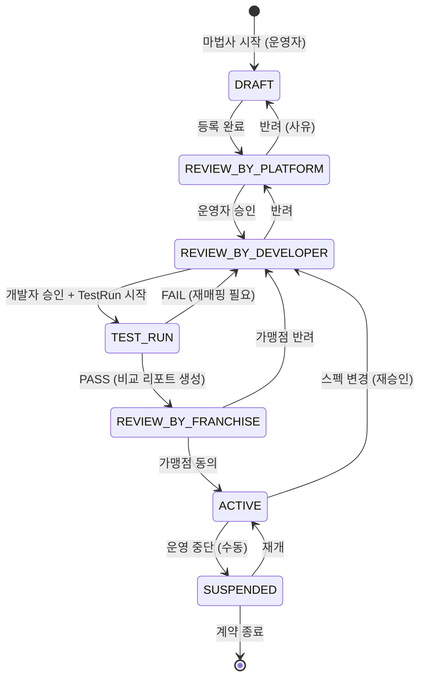
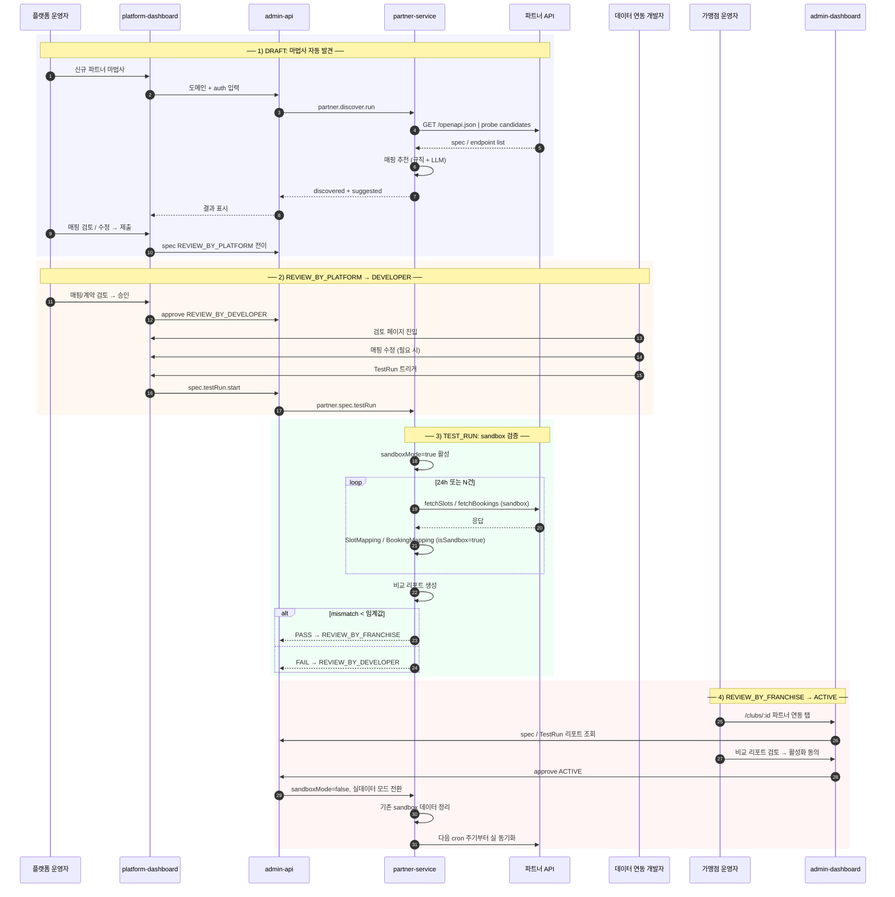
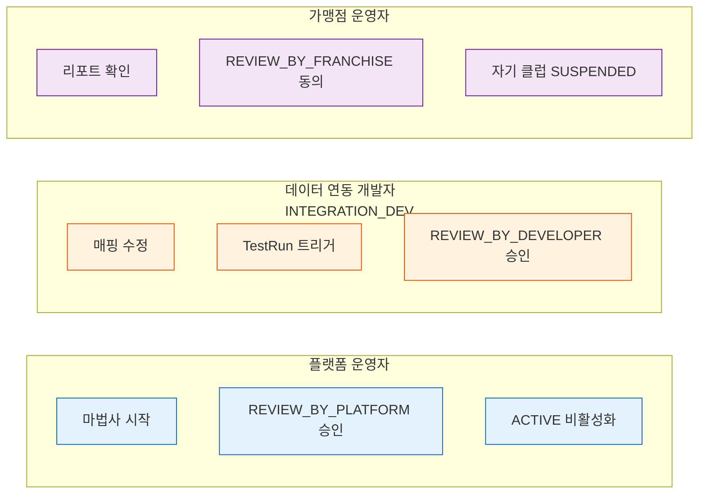
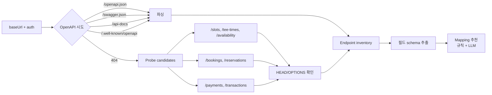
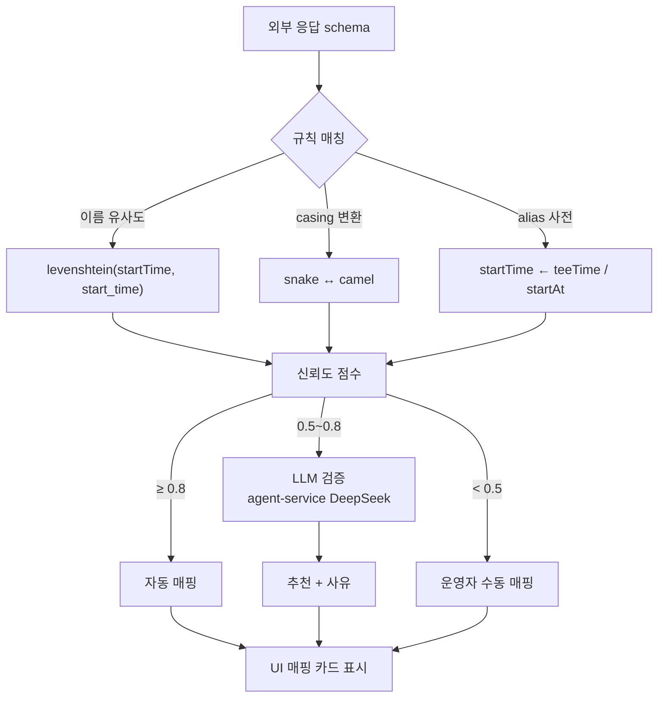
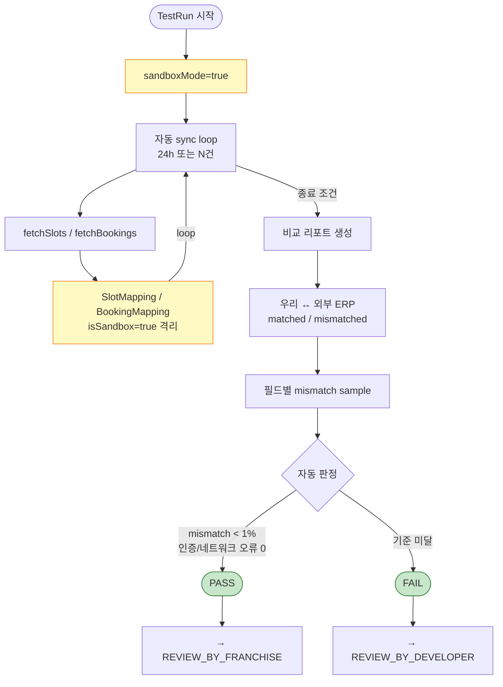
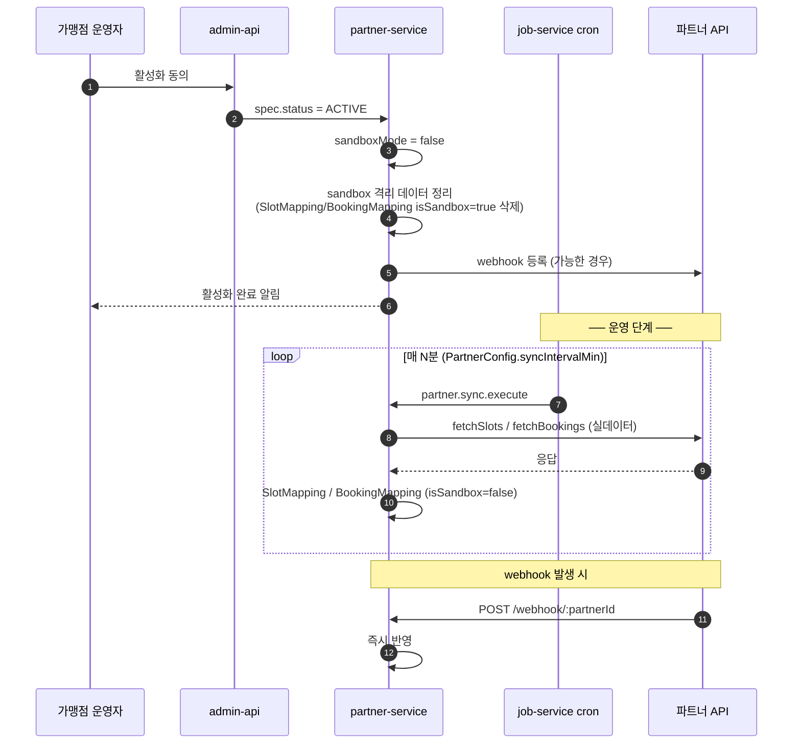
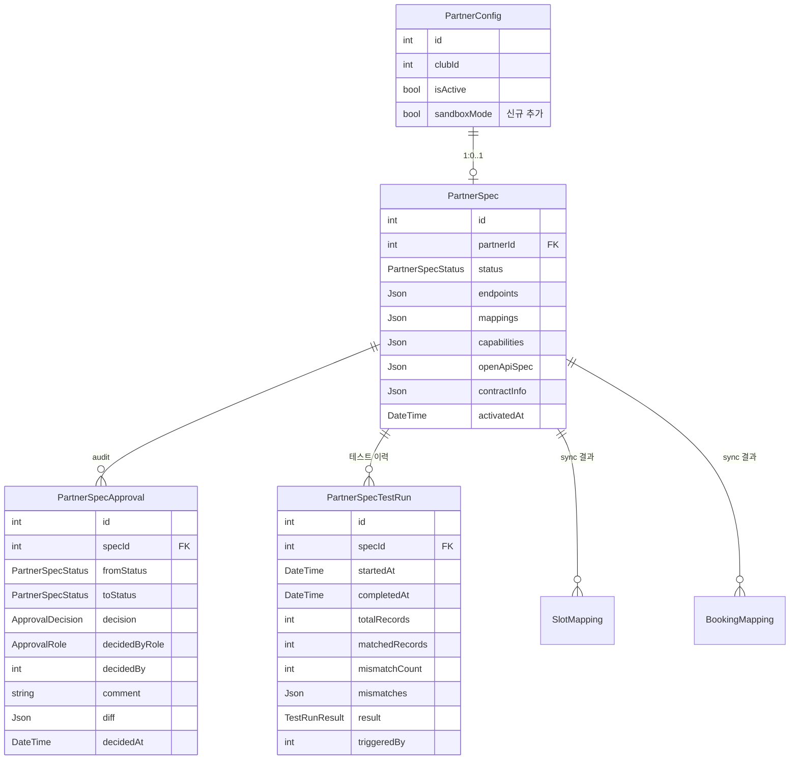
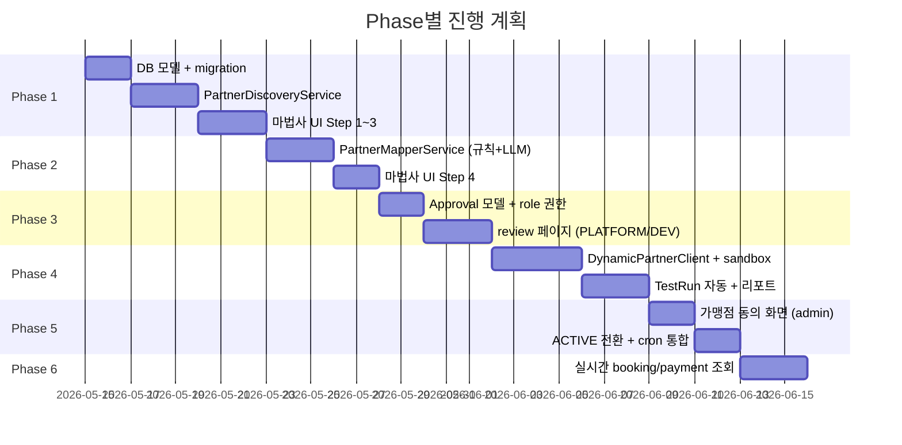

# 파트너(가맹점) 데이터 연동 자동화 워크플로우

> 버전: 0.1 (제안)
> 최종 수정: 2026-05-14
> 상태: design — 합의 후 단계별 구현

## 1. 목적

가맹점 골프장 예약 시스템(외부 ERP)을 우리 플랫폼에 연동할 때,
**개발자 작업 2~3일 → 운영자/개발자 검토 2시간 + 자동 검증 24h**로 단축한다.

핵심 원칙
- 100% 자동화 ✗ — 잘못된 매핑은 데이터 손상
- 80% 자동 + **3-stage 검토 + 실데이터 검증** ○ — 안전성과 효율 동시 확보
- 모든 결정은 감사 추적 (PartnerSpecApproval)

---

## 2. 상태 머신



| 상태 | 의미 | 다음 액션 |
|---|---|---|
| DRAFT | 운영자가 마법사로 작성 중 | 도메인/auth/discovery/mapping 입력 |
| REVIEW_BY_PLATFORM | 플랫폼 운영자 검토 | 매핑/계약 정합성 승인 |
| REVIEW_BY_DEVELOPER | 데이터 연동 개발자 검토 | 기술 안전성 + 매핑 정확도 + TestRun |
| TEST_RUN | sandbox 자동 검증 (24h 또는 N건) | 비교 리포트 자동 생성 |
| REVIEW_BY_FRANCHISE | 가맹점 운영자 최종 동의 | 리포트 확인 + 활성화 동의 |
| ACTIVE | 실 데이터 연동 운영 | cron sync + webhook 활성 |
| SUSPENDED | 운영 중단 | 수동 재개 또는 종료 |

---

## 3. 전체 시퀀스



---

## 4. Role별 권한 매트릭스



| 작업 | PLATFORM | DEV | FRANCHISE |
|------|:---:|:---:|:---:|
| 마법사 시작 (DRAFT 생성) | ✓ | | |
| REVIEW_BY_PLATFORM 승인/반려 | ✓ | | |
| 매핑 수정 | | ✓ | |
| TestRun 트리거 | | ✓ | |
| REVIEW_BY_DEVELOPER 승인/반려 | | ✓ | |
| REVIEW_BY_FRANCHISE 동의/반려 | | | ✓ |
| ACTIVE 비활성화 | ✓ | ✓ | ✓ (본인 클럽) |

---

## 5. UI 흐름 (라우트)

```mermaid
flowchart TD
    Start([파트너 계약 체결]) --> Wizard[platform-dashboard<br/>/partners/wizard]
    Wizard -->|Step 1| Contract[계약 정보 입력]
    Contract --> Domain[Step 2 도메인 + auth]
    Domain --> Discover[Step 3 자동 발견<br/>OpenAPI / probe]
    Discover --> Mapping[Step 4 매핑 추천<br/>운영자 검토]
    Mapping --> Submit[Step 5 제출<br/>→ REVIEW_BY_PLATFORM]

    Submit --> ReviewP[/partners/:id/review<br/>플랫폼 운영자]
    ReviewP -->|승인| ReviewD[/partners/:id/review<br/>개발자]
    ReviewP -->|반려| Wizard

    ReviewD -->|매핑 수정 가능| ReviewD
    ReviewD -->|TestRun 트리거| TestRun[/partners/:id/test-runs<br/>sandbox 24h]
    ReviewD -->|반려| ReviewP

    TestRun -->|PASS| FranchiseConf[admin-dashboard<br/>/clubs/:id 파트너 탭<br/>가맹점 동의 카드]
    TestRun -->|FAIL| ReviewD

    FranchiseConf -->|동의| Active([ACTIVE<br/>실 동기화 시작])
    FranchiseConf -->|반려| ReviewD

    Active -.->|스펙 변경| ReviewD
    Active -.->|운영 중단| Suspended([SUSPENDED])

    classDef stage fill:#E1BEE7,stroke:#6A1B9A,stroke-width:2px
    classDef terminal fill:#C8E6C9,stroke:#2E7D32,stroke-width:2px

    class ReviewP,ReviewD,TestRun,FranchiseConf stage
    class Active,Suspended terminal
```

### 5.1 platform-dashboard 신규 라우트

| 경로 | 화면 | 권한 |
|------|------|------|
| `/partners/wizard` | 등록 마법사 (DRAFT 생성) | PLATFORM |
| `/partners/:id/review` | stage별 검토 화면 | PLATFORM / DEV |
| `/partners/:id/test-runs` | TestRun 이력 + 리포트 | PLATFORM / DEV |
| `/partners/:id/audit` | 승인 이력 (PartnerSpecApproval) | PLATFORM |

### 5.2 admin-dashboard

| 경로 | 화면 | 조건 |
|------|------|------|
| `/clubs/:id` (파트너 연동 탭) | REVIEW_BY_FRANCHISE 단계: 동의 카드 + 비교 리포트 | bookingMode=PARTNER + spec.status=REVIEW_BY_FRANCHISE |
| `/clubs/:id` (파트너 연동 탭) | ACTIVE: 기존 PartnerStatusPanel | bookingMode=PARTNER + spec.status=ACTIVE |

---

## 6. 자동 발견 (PartnerDiscovery)



### 6.1 매핑 추천 알고리즘



---

## 7. 실데이터 검증 (TEST_RUN)



PASS 기준 (정책)
- mismatch 비율 < 1%
- 모든 필수 필드가 빈 응답 아님
- 인증/네트워크 에러 0건
- 24h 또는 N=100건 도달

---

## 8. ACTIVE 전환 + 실 데이터 연동



---

## 9. DB 모델 (신규)



---

## 10. NATS 패턴 (partner-service 신규)

| 패턴 | 트리거 | 응답 |
|------|--------|------|
| `partner.discover.run` | 마법사 Step 3 | DiscoveredEndpoint[] + 신뢰도 |
| `partner.mapping.suggest` | 마법사 Step 4 | 매핑 추천 + 사유 |
| `partner.spec.transition` | 상태 전이 (모든 단계) | 변경된 spec + audit row |
| `partner.spec.testRun` | DEV가 트리거 | TestRun id (진행은 비동기) |
| `partner.spec.testRun.status` | UI 폴링 | progress + matched/mismatched |
| `partner.booking.detail` | admin 예약 상세 실시간 조회 | 외부 ERP 응답 |
| `partner.payment.detail` | admin 결제 실시간 조회 | 외부 ERP 결제 정보 |

---

## 11. 구현 Phase



---

## 12. 미해결 의사결정 사항

- [ ] TestRun PASS 임계값 (mismatch 비율 1% vs 5%)
- [ ] sandboxMode 동안 가맹점에게 어떻게 안내할지 (UI 메시지)
- [ ] LLM 매핑 추천 모델 (DeepSeek 외 대안)
- [ ] webhook 자동 등록 표준 (파트너마다 다를 듯)
- [ ] 스펙 변경 감지 트리거 (수동 vs 자동 schema diff)
- [ ] INTEGRATION_DEV 역할 vs 기존 PLATFORM_ADMIN 통합 여부

---

## 13. 변경 이력

| 날짜 | 버전 | 변경 |
|------|------|------|
| 2026-05-14 | 0.1 | 최초 작성 (design 단계) |
