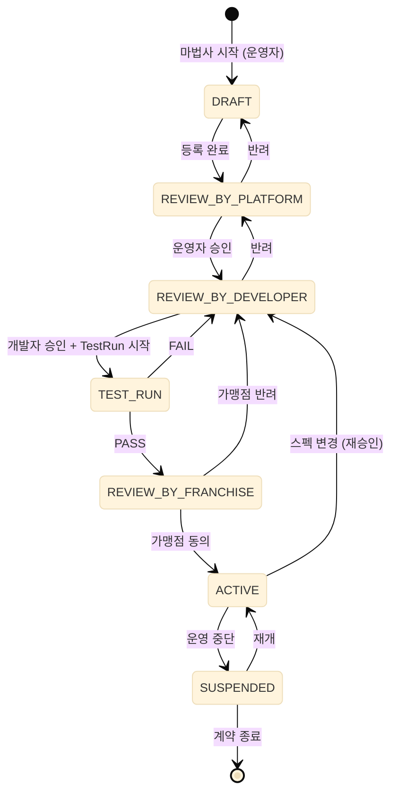
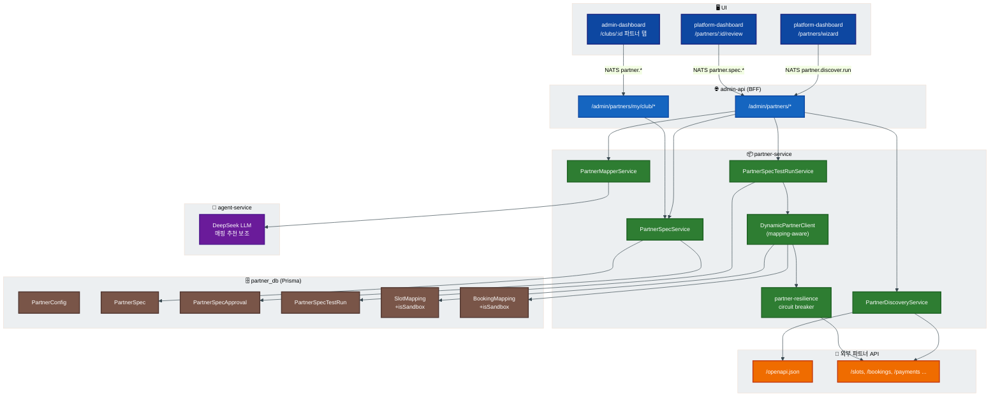
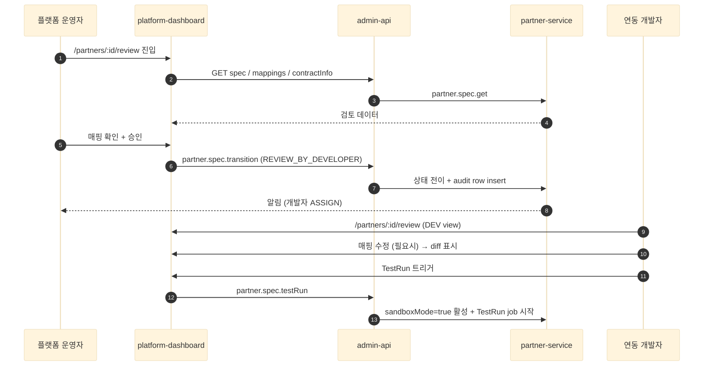
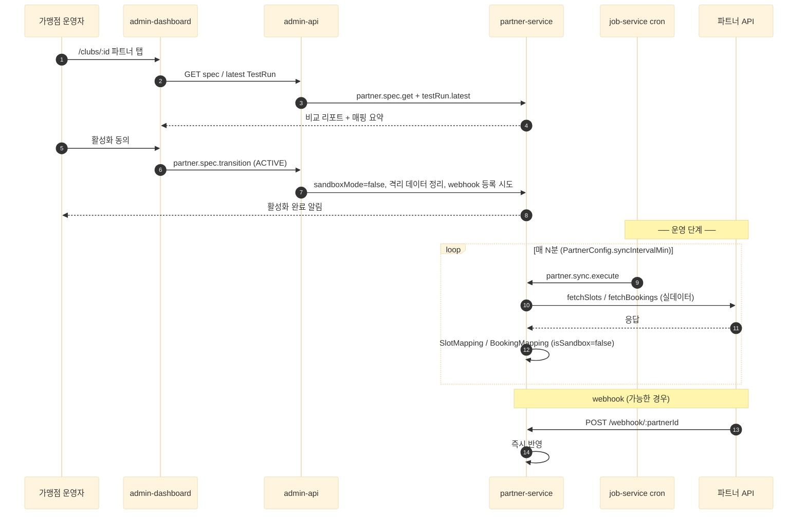
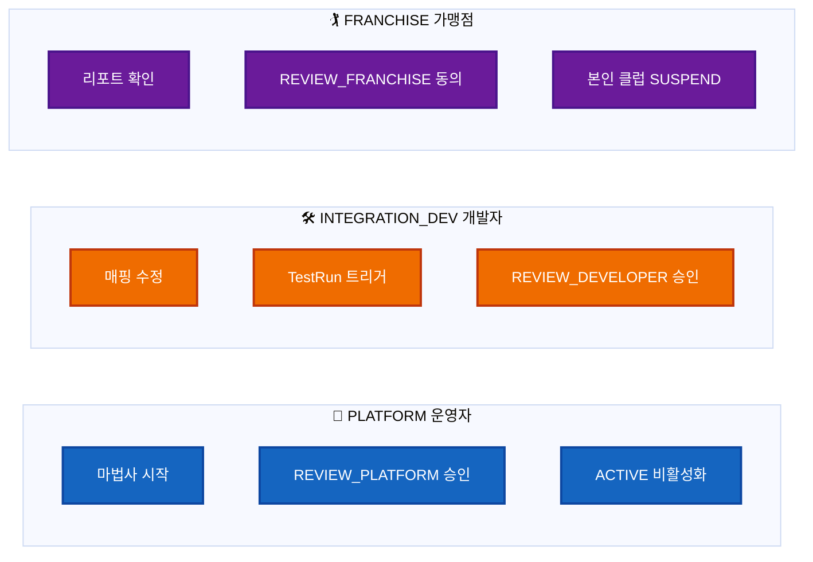
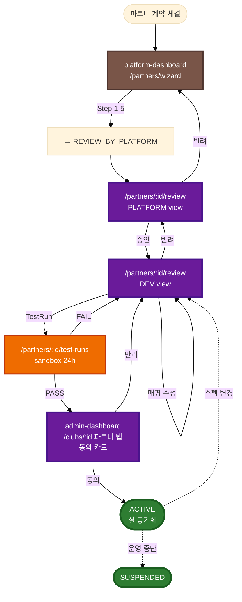
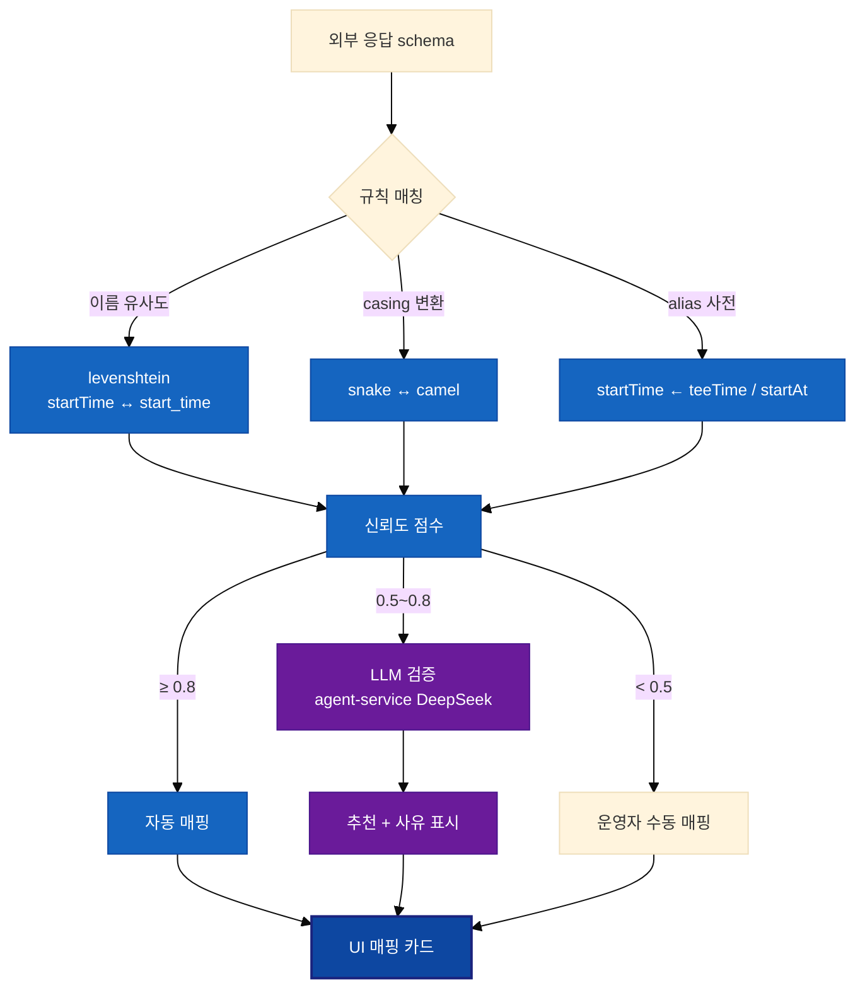
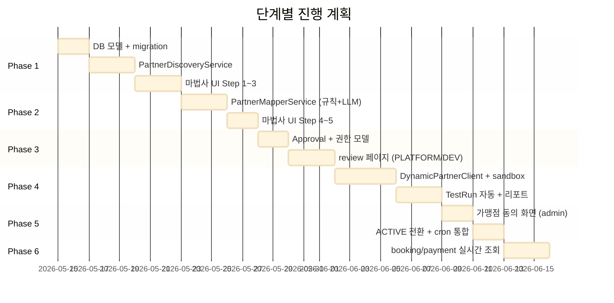
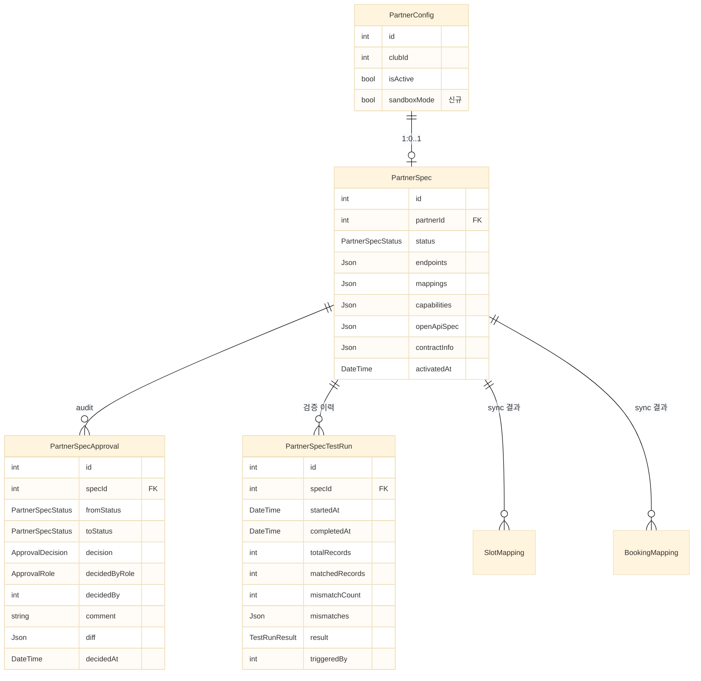

# 파트너 데이터 연동 자동화 — 단계별 추상화 + 3-stage 검토 + 실데이터 검증

가맹점 골프장 예약 시스템(외부 ERP)을 우리 플랫폼에 연결할 때, **개발자 작업 2~3일 → 운영자/개발자 검토 2시간 + 자동 검증 24h**로 단축한다. 100% 자동화는 데이터 손상 위험이 크므로 **80% 자동(발견 + 매핑 추천) + 20% 검토(3-stage approval)** 하이브리드 모델.

> **상태**: design 0.1 (제안). 합의 후 Phase 1부터 단계적 PR.

---

## 1. 비즈니스 가치 요약

> **파트너 어댑터 자동 생성 + Governance**
>
> - 신규 파트너 추가 비용: **개발자 2~3일 → 운영자 30분 + 자동 검증 24h** (~90% 감축)
> - **OpenAPI 자동 파싱 + endpoint probe + LLM 매핑 추천** 으로 어댑터 코드 작성 사실상 0
> - **3-stage 검토 게이트**(플랫폼 운영자 → 데이터 연동 개발자 → 가맹점 운영자) 로 잘못된 매핑 차단
> - **sandbox TestRun 24h** 로 실데이터 손상 위험 차단 — PASS 시에만 ACTIVE
> - 모든 결정 **감사 추적**(PartnerSpecApproval) — 누가 언제 무엇을 승인/반려했는지
> - **booking key 실시간 조회** — 가맹점 클럽 상세에서 외부 ERP의 결제·상태를 즉시 확인

---

## 2. 전체 그림

```mermaid
%%{init: {'theme':'base','themeVariables':{'primaryColor':'#E3F2FD','primaryTextColor':'#000','primaryBorderColor':'#1565C0','lineColor':'#37474F','clusterBkg':'#ECEFF1','fontSize':'13px'}}}%%
flowchart LR
    subgraph SOURCES["🤝 파트너 계약 체결"]
        Contract["계약 체결<br/>가맹점/도메인/연락처"]
    end

    subgraph WIZARD["🪄 등록 마법사 (platform-dashboard)"]
        Discover["PartnerDiscovery<br/>OpenAPI + probe"]
        Mapper["PartnerMapper<br/>규칙 + LLM"]
    end

    subgraph REVIEW["🛡️ 3-stage 검토"]
        RP["REVIEW_BY_PLATFORM<br/>매핑/계약 검토"]
        RD["REVIEW_BY_DEVELOPER<br/>기술/안전성"]
        RF["REVIEW_BY_FRANCHISE<br/>실데이터 확인"]
    end

    subgraph SANDBOX["🧪 TestRun (sandbox)"]
        Test["24h or N건 sync<br/>비교 리포트"]
    end

    subgraph ACTIVE_RUN["⚙️ ACTIVE 운영"]
        Sync["DynamicPartnerClient<br/>매핑 기반 동기화"]
        Real["실데이터 + webhook"]
    end

    Contract --> Discover
    Discover --> Mapper
    Mapper --> RP
    RP --> RD
    RD --> Test
    Test -->|PASS| RF
    Test -->|FAIL| RD
    RF --> Sync
    Sync --> Real

    classDef src fill:#2E7D32,color:#fff,stroke:#1B5E20,stroke-width:2px
    classDef wizard fill:#795548,color:#fff,stroke:#4E342E,stroke-width:2px
    classDef review fill:#6A1B9A,color:#fff,stroke:#4A148C,stroke-width:3px
    classDef test fill:#EF6C00,color:#fff,stroke:#BF360C,stroke-width:2px
    classDef active fill:#1565C0,color:#fff,stroke:#0D47A1,stroke-width:3px

    class Contract src
    class Discover,Mapper wizard
    class RP,RD,RF review
    class Test test
    class Sync,Real active
```



---

## 3. 단계별 추상화 — 상태 머신



| 상태 | 의미 | 다음 액션 | 책임 role |
|------|------|----------|----------|
| `DRAFT` | 운영자가 마법사 작성 중 | 도메인/auth/매핑 입력 후 제출 | PLATFORM |
| `REVIEW_BY_PLATFORM` | 운영자 1차 검토 | 매핑/계약 정합성 승인 또는 반려 | PLATFORM |
| `REVIEW_BY_DEVELOPER` | 데이터 연동 개발자 검토 | 기술 안전성 + 매핑 정확도 + TestRun 트리거 | INTEGRATION_DEV |
| `TEST_RUN` | sandbox 자동 검증 | 24h 또는 N건 동기화 → 비교 리포트 자동 생성 | SYSTEM |
| `REVIEW_BY_FRANCHISE` | 가맹점 운영자 최종 동의 | 비교 리포트 확인 + 활성화 동의 또는 반려 | FRANCHISE |
| `ACTIVE` | 실 데이터 연동 운영 | cron sync + webhook 활성 | SYSTEM |
| `SUSPENDED` | 운영 중단 | 수동 재개 또는 계약 종료 | PLATFORM / FRANCHISE |

---

## 4. 전체 아키텍처



---

## 5. 구성 상세 — 단계별

### 5.1 DRAFT — 마법사 자동 발견


- OpenAPI 시도 경로: `/openapi.json` · `/swagger.json` · `/api-docs` · `/.well-known/openapi`
- Probe: HEAD/OPTIONS로 후보 endpoint 존재 확인
- 매핑 추천 규칙: levenshtein + snake/camel 변환 + alias 사전 + LLM 보조 (DeepSeek)

### 5.2 REVIEW_BY_PLATFORM → REVIEW_BY_DEVELOPER



### 5.3 TEST_RUN — sandbox 검증


**PASS 기준 (정책)**
- `mismatch / total < 1%`
- 필수 필드(`startTime`, `maxPlayers`, `bookingId` 등) 빈 응답 0건
- 인증/네트워크 에러 0건
- 24h 경과 또는 N=100건 도달

### 5.4 REVIEW_BY_FRANCHISE → ACTIVE



---

## 6. Role 권한 매트릭스



| 작업 | PLATFORM | INTEGRATION_DEV | FRANCHISE |
|------|:---:|:---:|:---:|
| 마법사 시작 (DRAFT 생성) | ✓ | | |
| REVIEW_BY_PLATFORM 승인/반려 | ✓ | | |
| 매핑 수정 | | ✓ | |
| TestRun 트리거 | | ✓ | |
| REVIEW_BY_DEVELOPER 승인/반려 | | ✓ | |
| REVIEW_BY_FRANCHISE 동의/반려 | | | ✓ |
| ACTIVE 비활성화 | ✓ | ✓ | ✓ (본인 클럽) |

---

## 7. UI 라우트 맵



### 7.1 platform-dashboard 신규 라우트

| 경로 | 화면 | 권한 |
|------|------|------|
| `/partners/wizard` | 등록 마법사 (DRAFT 생성) | PLATFORM |
| `/partners/:id/review` | stage별 검토 (PLATFORM/DEV view 분기) | PLATFORM / DEV |
| `/partners/:id/test-runs` | TestRun 이력 + 리포트 | PLATFORM / DEV |
| `/partners/:id/audit` | 승인 이력 (PartnerSpecApproval) | PLATFORM |

### 7.2 admin-dashboard

| 경로 | 화면 | 조건 |
|------|------|------|
| `/clubs/:id` (파트너 탭) | REVIEW_BY_FRANCHISE: 동의 카드 + 비교 리포트 | bookingMode=PARTNER + status=REVIEW_BY_FRANCHISE |
| `/clubs/:id` (파트너 탭) | ACTIVE: 기존 PartnerStatusPanel | bookingMode=PARTNER + status=ACTIVE |

---

## 8. 자동 발견 + 매핑 추천



---

## 9. 활용 사례

### 9.1 신규 가맹점 1일 내 연동 시작

```
00:00  계약 체결
10:00  플랫폼 운영자가 마법사로 도메인 입력
10:05  PartnerDiscovery 자동 발견 (OpenAPI 파싱 성공)
10:15  매핑 추천 검토 + 제출 → REVIEW_BY_PLATFORM
10:30  운영자 승인 → REVIEW_BY_DEVELOPER
11:00  연동 개발자 매핑 미세 조정 + TestRun 트리거 → TEST_RUN
다음날 11:00  24h sandbox 검증 PASS → REVIEW_BY_FRANCHISE
12:00  가맹점 운영자가 본인 클럽 비교 리포트 확인 + 동의 → ACTIVE
12:01  cron sync 첫 주기 실행, webhook 등록 시도
```

### 9.2 외부 ERP가 OpenAPI 미노출

```
도메인 입력 → PartnerDiscovery
→ /openapi.json 404
→ probe candidates 자동 실행
  ▶ /api/v1/tee-times    200 OK   schema 추출
  ▶ /api/v1/reservations  200 OK   schema 추출
→ MapperService가 alias 사전으로 추천:
  tee_time → startTime
  reservation_id → externalBookingId
→ 운영자가 수동 조정 → 이후 흐름 동일
```

### 9.3 매핑이 잘못되었을 때 (안전망)

```
TestRun 시작
→ sandbox 24h 동안 데이터 비교
→ mismatch 30% 발견 (시간대 포맷 문제)
→ FAIL → REVIEW_BY_DEVELOPER 회귀
→ 개발자 mapping.startTime에 timezone 변환 추가
→ TestRun 재실행 → PASS
※ 실제 데이터는 손상 없음 (sandbox 격리)
```

### 9.4 booking key 실시간 조회

```
가맹점 운영자: admin-dashboard에서 예약 #135 상세
→ "외부 ERP에서 실시간 조회" 버튼
→ partner.booking.detail NATS
→ DynamicPartnerClient.fetchBooking(externalId)
→ 외부 응답: { status, payment: { amount, paidAt, method }, ... }
→ 화면에 결제 정보 + 상태 즉시 표시
```

---

## 10. 구현 Phase (gantt)



| Phase | 산출물 | 의존성 |
|-------|--------|--------|
| 1 | PartnerSpec 모델 + Discovery + 마법사 step 1~3 | — |
| 2 | Mapper + 마법사 step 4~5 | Phase 1 |
| 3 | Approval + review 페이지 | Phase 1, 2 |
| 4 | DynamicPartnerClient + TestRun sandbox | Phase 1~3 |
| 5 | 가맹점 동의 + ACTIVE 운영 | Phase 4 |
| 6 | 실시간 조회 | Phase 5 (또는 독립 진행 가능) |

---

## 11. DB 모델 (신규)



---

## 12. NATS 패턴 (partner-service 신규)

| 패턴 | 트리거 | 응답 |
|------|--------|------|
| `partner.discover.run` | 마법사 Step 3 | DiscoveredEndpoint[] + 신뢰도 |
| `partner.mapping.suggest` | 마법사 Step 4 | 매핑 추천 + 사유 |
| `partner.spec.transition` | 상태 전이 (모든 단계) | 변경된 spec + audit row |
| `partner.spec.testRun` | DEV가 TestRun 트리거 | TestRun id (진행은 비동기) |
| `partner.spec.testRun.status` | UI 폴링 | progress + matched/mismatched |
| `partner.booking.detail` | admin 예약 상세 실시간 조회 | 외부 ERP 응답 |
| `partner.payment.detail` | admin 결제 실시간 조회 | 외부 ERP 결제 정보 |

---

## 13. 비용 / 외부 노출

| 항목 | dev | prod |
|------|-----|------|
| 외부 API 호출 (sandbox + 실 sync) | 자유 | 가맹점 측 rate limit 협의 |
| LLM 호출 (DeepSeek) | 마법사당 1~2회 | 동일 |
| TestRun 24h 동안 사용 데이터 | 메모리/디스크 미미 | 동일 |
| 외부 노출 endpoint | `/webhook/:partnerId` (기존) | 동일, public TLS |

---

## 14. 미해결 의사결정 사항

- [ ] TestRun PASS 임계값 (mismatch 1% vs 5%)
- [ ] sandboxMode 동안 가맹점에게 어떻게 안내할지 (UI 메시지/배너)
- [ ] LLM 매핑 추천 모델 (DeepSeek 외 대안 / 비용 / 신뢰도)
- [ ] webhook 자동 등록 표준 (파트너마다 다름)
- [ ] 스펙 변경 감지 트리거 (수동 vs 자동 schema diff)
- [ ] INTEGRATION_DEV 역할 vs 기존 PLATFORM_ADMIN 통합 여부

---

## 15. 관련 파일 / 원천 자료

| 파일 | 용도 |
|------|------|
| `services/partner-service/src/partner/service/sync.service.ts` | 현재 동기화 로직 (확장 대상) |
| `services/partner-service/src/client/partner-client.service.ts` | 외부 API 호출 (DynamicClient 대체 예정) |
| `services/partner-service/src/client/partner-resilience.service.ts` | circuit breaker (그대로 활용) |
| `services/partner-service/prisma/schema.prisma` | PartnerSpec / Approval / TestRun 추가 대상 |
| `services/agent-service/src/booking-agent/service/tool-executor.service.ts` | LLM 호출 패턴 참조 |
| `apps/admin-dashboard/src/components/features/club/PartnerStatusPanel.tsx` | ACTIVE 후 가맹점 view 재사용 |
| `apps/platform-dashboard/src/pages/franchise/FranchiseClubsPage.tsx` | 마법사 진입점 통합 위치 |
| `docs/workflow/SAGA.md` §6 결제 흐름 | 매핑된 결제 데이터 사용 위치 |
| `docs/architecture/OBSERVABILITY.md` | Cloud Trace로 외부 API 호출 trace 가능 |

---

## 16. 변경 이력

| 날짜 | 버전 | 변경 |
|------|------|------|
| 2026-05-14 | 0.1 | 최초 design 작성 |
| 2026-05-14 | 0.2 | OBSERVABILITY.md 스타일 반영 (init theme · classDef · 활용 사례 · 비용 / 외부 노출) |
