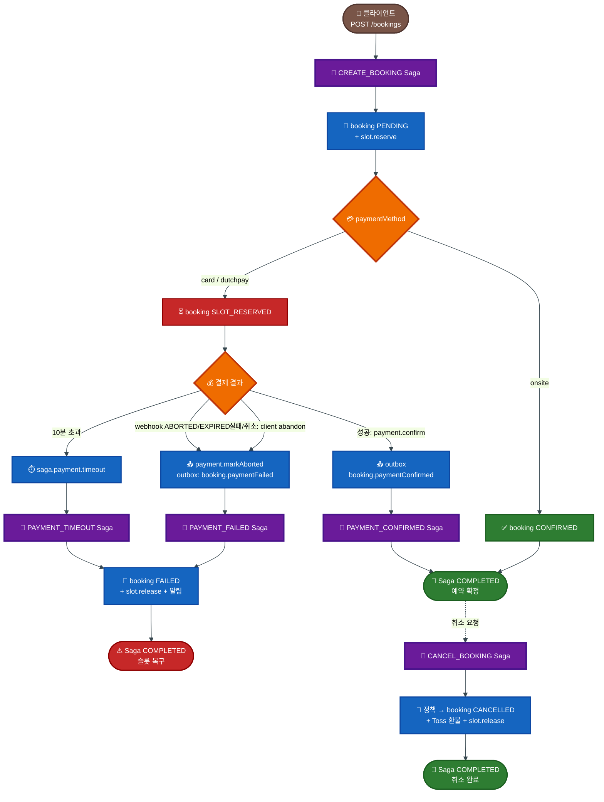

# Saga 오케스트레이션 워크플로우

> 버전: 3.0
> 최종 수정: 2026-04-25

## 목차

1. [개요](#1-개요)
2. [Saga 정의](#2-saga-정의)
3. [라이프사이클](#3-라이프사이클)
4. [결제 실패 처리](#4-결제-실패-처리)
5. [NATS 패턴](#5-nats-패턴)
6. [응답 형식](#6-응답-형식)
7. [알려진 결함 및 작업 계획](#7-알려진-결함-및-작업-계획)

---

## 1. 개요

`saga-service`가 중앙 오케스트레이터로 분산 트랜잭션을 처리하고, 각 마이크로서비스는 Saga Step 핸들러만 노출합니다.

| 서비스 | 역할 |
|--------|------|
| saga-service | Saga 오케스트레이션 / Step 실행 / 보상 / 이력 |
| booking-service | `booking.saga.*` Step 핸들러 |
| course-service | `slot.reserve` / `slot.release` |
| payment-service | `payment.cancelByBookingId` / `payment.markAborted` / outbox 발행 |
| notify-service | `notification.booking.*` |
| iam-service | `iam.companyMembers.addByBooking` |
| partner-service | `partner.config.*` / `partner.booking.*` |
| job-service | 결제 타임아웃 백업 Cron (5분 주기) |

**기술 스택**: NATS (Request-Reply), Saga Orchestration, Transactional Outbox, Compensation, Prisma.

---

## 2. Saga 정의

### 2.1 Saga 목록

| Saga | 트리거 | 설명 |
|------|--------|------|
| `CREATE_BOOKING` | `saga.booking.create` | 예약 생성 → 슬롯 예약 → 상태 갱신 → 알림 |
| `CANCEL_BOOKING` | `saga.booking.cancel` | 취소 정책 → 환불 → 슬롯 복구 → 알림 |
| `ADMIN_REFUND` | `saga.booking.adminRefund` | 환불 정책 → 취소 → 환불 → 슬롯 복구 → 알림 |
| `PAYMENT_CONFIRMED` | `booking.paymentConfirmed` | 결제 승인 후 booking CONFIRMED + 알림 |
| `PAYMENT_FAILED` 신규 | `booking.paymentFailed` | 결제 실패/취소 시 booking FAILED + 슬롯 복구 |
| `PAYMENT_TIMEOUT` | scheduler / job-service | SLOT_RESERVED 10분 초과 시 동일 정리 |

### 2.2 CREATE_BOOKING

| Step | Action | Compensate | Target | 조건 |
|------|--------|-----------|--------|------|
| 1. CREATE_BOOKING_RECORD | `booking.saga.create` | `booking.saga.markFailed` | booking | - |
| 2. CHECK_PARTNER | `partner.config.checkByClub` | - | partner | clubId 존재 |
| 3. VERIFY_EXTERNAL | `partner.slot.verifyAvailability` | - | partner | 파트너 골프장 |
| 4. RESERVE_SLOT | `slot.reserve` | `slot.release` | course | - |
| 5. UPDATE_BOOKING_STATUS | `booking.saga.slotReserved` | - | booking | - |
| 6. NOTIFY_EXTERNAL | `partner.booking.notifyCreated` | `partner.booking.notifyCancelled` | partner | 파트너 + CONFIRMED |
| 7. SEND_CONFIRMATION | `notification.booking.confirmed` | - | notify | CONFIRMED (optional) |
| 8. REGISTER_COMPANY_MEMBER | `iam.companyMembers.addByBooking` | - | iam | CONFIRMED + userId (optional) |

Step 5 결과: `onsite` → CONFIRMED → 6~8 실행. `card`/`dutchpay` → SLOT_RESERVED → 6~8 SKIP, 결제 대기.

### 2.3 CANCEL_BOOKING

| Step | Action | Compensate | Target | 조건 |
|------|--------|-----------|--------|------|
| 1. CHECK_CANCELLATION_POLICY | `policy.cancellation.resolve` | - | booking | - |
| 2. CALCULATE_REFUND | `policy.refund.resolve` | - | booking | - |
| 3. CANCEL_BOOKING_RECORD | `booking.saga.cancel` | `booking.saga.restoreStatus` | booking | - |
| 4. CANCEL_PAYMENT | `payment.cancelByBookingId` | - | payment | non-onsite |
| 5. RELEASE_SLOT | `slot.release` | - | course | - |
| 6. CHECK_PARTNER | `partner.config.checkByClub` | - | partner | clubId 존재 |
| 7. NOTIFY_EXTERNAL_CANCEL | `partner.booking.notifyCancelled` | - | partner | 파트너 (optional) |
| 8. SEND_CANCELLATION_NOTICE | `notification.booking.cancelled` | - | notify | optional |

### 2.4 ADMIN_REFUND

| Step | Action | Compensate | Target |
|------|--------|-----------|--------|
| 1. CHECK_REFUND_POLICY | `policy.refund.resolve` | - | booking |
| 2. CANCEL_BOOKING_RECORD | `booking.saga.adminCancel` | `booking.saga.restoreStatus` | booking |
| 3. PROCESS_REFUND | `payment.cancelByBookingId` | - | payment |
| 4. RELEASE_SLOT | `slot.release` | - | course |
| 5. FINALIZE_BOOKING | `booking.saga.finalizeCancelled` | - | booking |
| 6. CHECK_PARTNER | `partner.config.checkByClub` | - | partner |
| 7. NOTIFY_EXTERNAL_CANCEL | `partner.booking.notifyCancelled` | - | partner |
| 8. SEND_REFUND_NOTICE | `notification.booking.refundCompleted` | - | notify |

### 2.5 PAYMENT_CONFIRMED

| Step | Action | Target |
|------|--------|--------|
| 1. CONFIRM_BOOKING | `booking.saga.confirmPayment` | booking |
| 2. SEND_CONFIRMATION | `notification.booking.confirmed` (optional) | notify |
| 3. REGISTER_COMPANY_MEMBER | `iam.companyMembers.addByBooking` (optional) | iam |

### 2.6 PAYMENT_FAILED / PAYMENT_TIMEOUT

두 saga는 동일 Step 구성을 공유합니다 (트리거 경로만 다름).

| Step | Action | Target |
|------|--------|--------|
| 1. MARK_BOOKING_FAILED | `booking.saga.paymentTimeout` | booking |
| 2. RELEASE_SLOT | `slot.release` | course |
| 3. NOTIFY | `notification.booking.paymentFailed` (FAILED) / `notification.booking.paymentTimeout` (TIMEOUT) | notify (optional) |

| 항목 | PAYMENT_FAILED | PAYMENT_TIMEOUT |
|------|----------------|-----------------|
| 트리거 | outbox 이벤트 (즉시) | scheduler/cron (10분 경과) |
| 트리거 패턴 | `booking.paymentFailed` | `saga.payment.timeout` |

---

## 3. 라이프사이클



`SLOT_RESERVED` → `FAILED` 정리 경로 4종(클라이언트 abandon / Toss webhook / 사용자 취소 / 10분 타임아웃)은 모두 동일한 정리 핸들러(`booking.saga.paymentTimeout` + `slot.release`)를 재사용합니다.

---

## 4. 결제 실패 처리

### 4.1 흐름

```
Client (Web/iOS/Android)
  ↓ POST /api/user/payments/:orderId/abandon
  ↓ Body: { reason: 'failed'|'cancelled', errorCode?, errorMessage? }
user-api (BFF)
  ↓ NATS: payment.markAborted
payment-service (단일 트랜잭션)
  ↓ UPDATE payments SET status='ABORTED'
  ↓ INSERT payment_outbox_events (event_type='booking.paymentFailed', PENDING)
  ↓ 응답 200 OK
outbox processor (payment-service worker)
  ↓ NATS publish: booking.paymentFailed
saga-service
  ↓ PAYMENT_FAILED Saga
booking-service: booking.saga.paymentTimeout → status=FAILED
course-service:  slot.release
notify-service:  notification.booking.paymentFailed (optional)
```

### 4.2 BFF 엔드포인트 (신규)

```
POST /api/user/payments/:orderId/abandon
Authorization: Bearer <token>

Request:
  { reason: 'failed' | 'cancelled', errorCode?: string, errorMessage?: string }

Response:
  { success: true, data: BookingResponseDto, saga: SagaMeta }
```

### 4.3 클라이언트 호출 지점

| 플랫폼 | 호출 트리거 | 위치 |
|--------|------------|------|
| Web | Toss `failUrl` 리다이렉트 (errorCode/message 수신) | `BookingCompletePage.tsx` Scenario 2 |
| iOS | `TossPaymentView.onFail` / `onCancel` | `BookingFormView.handlePaymentResult` |
| Android | `handlePaymentFailure` / `handlePaymentCancelled` | `BookingFormViewModel` |

세 플랫폼 모두 동일한 BFF 엔드포인트(`POST /payments/:orderId/abandon`)를 호출합니다.

### 4.4 멱등성

- `payment.markAborted`는 멱등 (이미 ABORTED면 재발행 없이 성공 응답)
- saga correlationId(`payment-failed:{orderId}`)로 중복 saga 방지
- 클라이언트는 네트워크 재시도 안전

### 4.5 Outbox 재시도

- payment_outbox_events 발행 실패 시 지수 백오프 (1s → 2s → 4s, 최대 5회)
- 최종 실패: `status='FAILED'`, `last_error` 기록 → 운영자 수동 처리

---

## 5. NATS 패턴

### 5.1 Saga 트리거 (saga-service Inbound)

| 패턴 | 발신 | 비고 |
|------|------|------|
| `saga.booking.create` | user-api, agent-service | 동기 응답 |
| `saga.booking.cancel` | user-api, admin-api | 동기 응답 |
| `saga.booking.adminRefund` | admin-api | 동기 응답 |
| `booking.paymentConfirmed` | payment-service (outbox) | 비동기 |
| `booking.paymentFailed` 신규 | payment-service (outbox) | 비동기 |
| `saga.payment.timeout` | saga-scheduler / job-service | 백그라운드 |

### 5.2 결제 실패 보조 패턴

| 패턴 | 발신 | 설명 |
|------|------|------|
| `payment.markAborted` | user-api → payment-service | payment.status=ABORTED + outbox INSERT |

### 5.3 Step 핸들러 (saga-service Outbound)

| 패턴 | 대상 |
|------|------|
| `booking.saga.create` / `markFailed` / `slotReserved` / `confirmPayment` / `cancel` / `adminCancel` / `restoreStatus` / `finalizeCancelled` / `paymentTimeout` | booking-service |
| `slot.reserve` / `slot.release` | course-service |
| `payment.cancelByBookingId` | payment-service |
| `partner.config.checkByClub` / `partner.slot.verifyAvailability` / `partner.booking.notifyCreated` / `partner.booking.notifyCancelled` | partner-service |
| `notification.booking.*` (confirmed / cancelled / refundCompleted / paymentTimeout / paymentFailed) | notify-service |
| `iam.companyMembers.addByBooking` | iam-service |

### 5.4 Saga 관리 (Admin)

| 패턴 | 설명 |
|------|------|
| `saga.list` / `saga.get` / `saga.stats` | 조회 |
| `saga.retry` | 실패 saga 재시도 |
| `saga.resolve` | REQUIRES_MANUAL 수동 해결 |

---

## 6. 응답 형식

BFF가 saga를 경유한 API 응답은 표준 도메인 shape에 `saga` 메타데이터를 부가합니다.

```json
{
  "success": true,
  "data": { /* 표준 BookingResponseDto */ },
  "saga": {
    "executionId": 123,
    "status": "COMPLETED",
    "failReason": null,
    "duplicate": false
  }
}
```

실패 시 (HTTP 400):
```json
{
  "success": false,
  "error": { "code": "SAGA_FAILED", "message": "..." },
  "saga": { "executionId": 123, "status": "FAILED", "failReason": "..." }
}
```

**적용 엔드포인트**: `POST /bookings`, `DELETE /bookings/:id`, `POST /payments/:orderId/abandon`, admin booking/refund.

**클라이언트**: `saga` 필드는 옵셔널이며 진행률 표시·디버깅에 활용. 도메인 파싱은 `data`만 사용.

구현: `services/{user,admin}-api/src/booking/booking.service.ts`의 `resolveSagaResponse()`.

---

## 7. 알려진 결함 및 작업 계획

### 7.1 현재 결함 (2026-04-25 기준)

| # | 결함 | 영향 | 우선순위 |
|---|-----|------|---------|
| 1 | payment.confirm catch가 outbox 미발행 → booking 미동기화 | SLOT_RESERVED 영구 점유 | P0 |
| 2 | 클라이언트 3종 결제 실패 시 백엔드 통지 부재 | 결함 #1 트리거 | P0 |
| 3 | `payment.markAborted` 엔드포인트 미존재 | #2 해결 차단 | P0 |
| 4 | PAYMENT_FAILED Saga 미정의 | #2 해결 차단 | P0 |
| 5 | preparePayment 후 미진행 leak (READY 무한 잔존) | SLOT_RESERVED 영구 | P0 |
| 6 | `expireSlotReservedBookings`가 saga 우회 → `slot.release` 미호출 | course-service 슬롯 미복구 | P1 |
| 7 | saga-scheduler 미구현 (1차 방어 부재) | job-service Cron만 존재 | P1 |
| 8 | CREATE_BOOKING Step 4 compensate 부재 | 실패 시 booking PENDING 잔존 | P1 |
| 9 | Toss webhook(ABORTED/EXPIRED) 라우트 미연동 | 외부 상태 미반영 | P1 |
| 10 | payment-service outbox processor 동작 검증 필요 | confirmed 이벤트 누락 가능 | P1 |
| 11 | split payment에 saga 미적용 | 분할 결제 정합성 부재 | P2 |

### 7.2 작업 계획

| Step | 영역 | 내용 | 상태 |
|------|------|------|------|
| 1 | payment-service | `payment.markAborted` 추가 (트랜잭션 + outbox INSERT), confirmPayment catch에서도 outbox 발행, outbox processor 검증 | 미시작 |
| 2 | saga-service | PAYMENT_FAILED Saga 정의, registry 등록, `booking.paymentFailed` 트리거 | 미시작 |
| 3 | user-api | `POST /api/user/payments/:orderId/abandon` 엔드포인트 + NATS publish | 미시작 |
| 4 | notify-service | `notification.booking.paymentFailed` 핸들러 | 미시작 |
| 5 | Web | `paymentApi.abandon()` + BookingCompletePage Scenario 2 호출 | 미시작 |
| 6 | iOS | `PaymentService.abandonPayment()` + BookingFormView 호출 (orderId 전달 보강) | 미시작 |
| 7 | Android | `PaymentApi.abandonPayment()` + BookingFormViewModel 호출 | 미시작 |
| 8 | P1 보완 | cron→saga 변경, Step 4 compensate, scheduler 구현, webhook, READY 만료 정책 | 미시작 |
| 9 | 검증 | 통합 테스트, 클라이언트 3종 동작, DB 정합성 | 미시작 |

### 7.3 검증 시 확인 항목

- 결제 실패 즉시 `bookings.status=FAILED`
- `game_time_slot_cache` 및 `game_time_slots` 양쪽 `booked_players` 복구
- `payment_outbox_events.status=PROCESSED`
- saga_executions에 PAYMENT_FAILED 1건 COMPLETED
- 사용자 알림 수신

---

**Last Updated**: 2026-04-25
