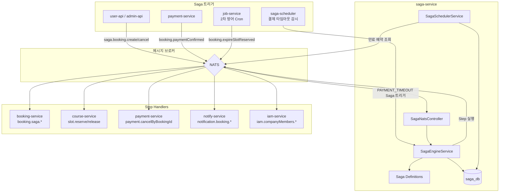
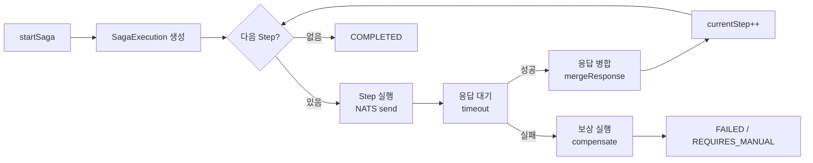
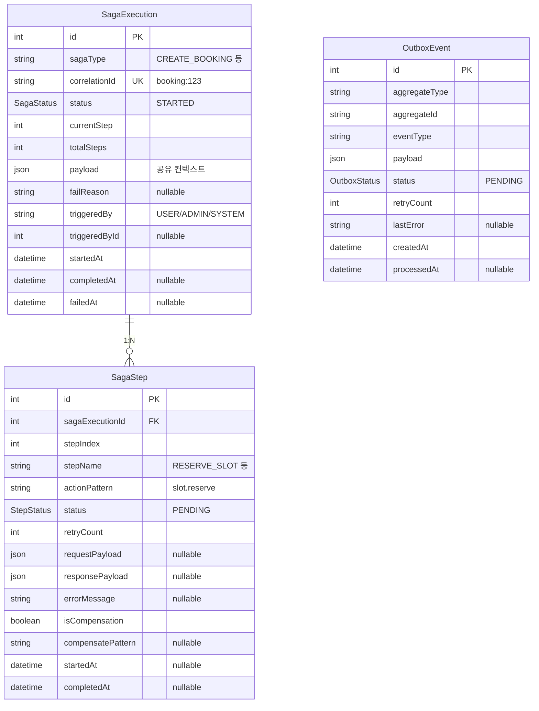
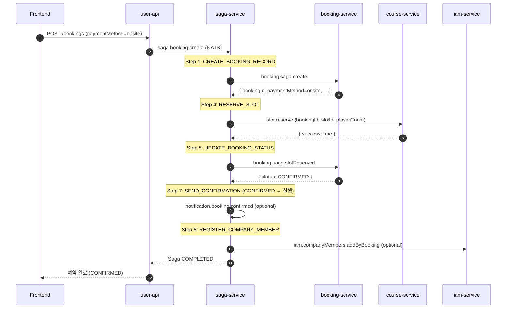
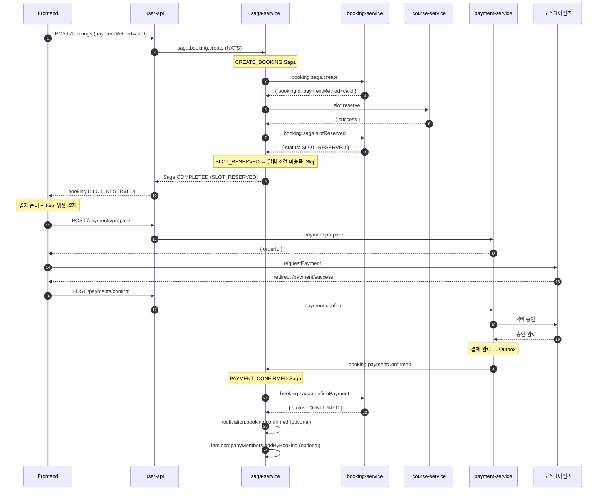
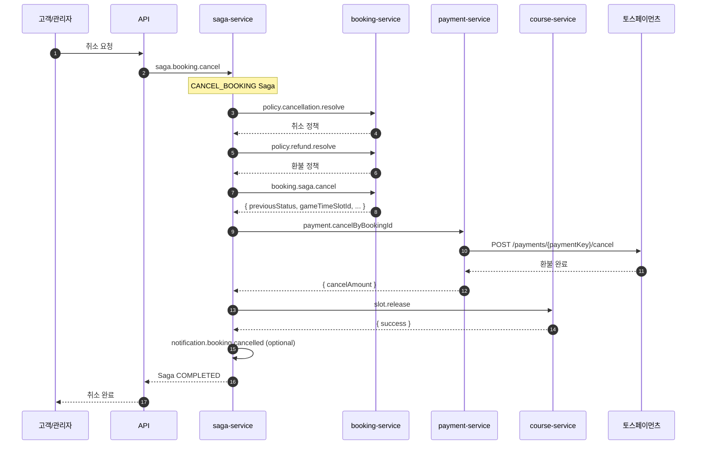
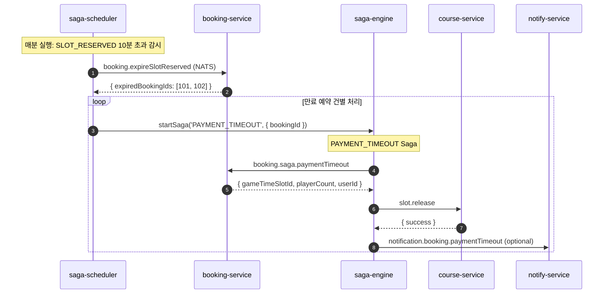
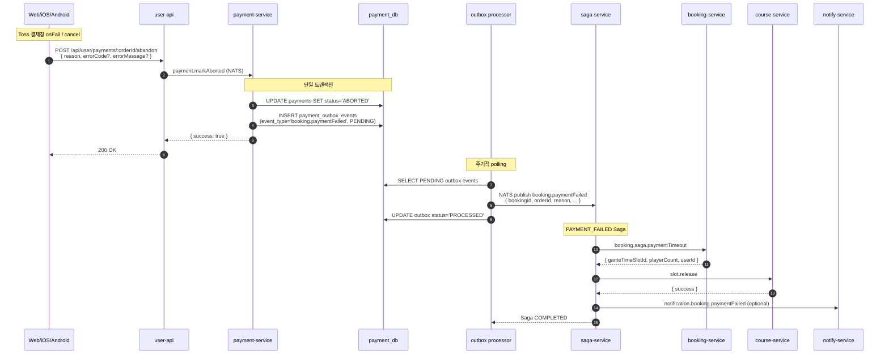
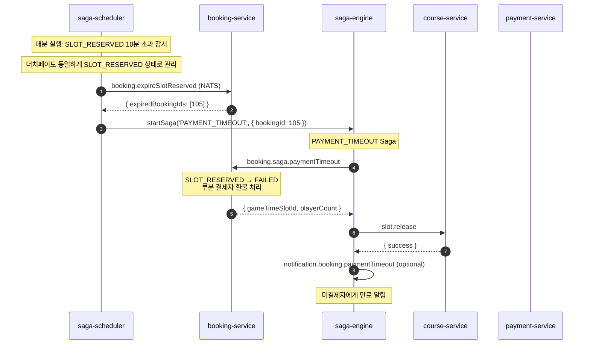
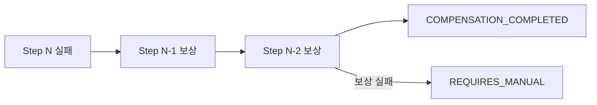

# Saga 오케스트레이션 워크플로우

> 버전: 2.2
> 최종 수정: 2026-04-25

## 목차

1. [개요](#1-개요)
2. [아키텍처](#2-아키텍처)
3. [데이터 모델](#3-데이터-모델)
4. [Saga 정의](#4-saga-정의)
5. [트랜잭션 흐름](#5-트랜잭션-흐름)
6. [결제 타임아웃 관리](#6-결제-타임아웃-관리)
7. [결제 실패/취소 처리](#7-결제-실패취소-처리)
8. [클라이언트 통합 (Web/iOS/Android)](#8-클라이언트-통합-webiosandroid)
9. [보상 및 재시도](#9-보상-및-재시도)
10. [NATS 패턴](#10-nats-패턴)
11. [응답 형식 (saga 메타)](#11-응답-형식-saga-메타)
12. [알려진 결함 및 보완 계획](#12-알려진-결함-및-보완-계획)
13. [모니터링 및 디버깅](#13-모니터링-및-디버깅)

---

## 1. 개요

파크골프 예약 시스템은 **Orchestration 기반 Saga 패턴**으로 분산 트랜잭션을 처리합니다.
`saga-service`가 중앙 오케스트레이터 역할을 하며, 각 마이크로서비스는 Saga Step 핸들러만 노출합니다.

### 1.1 주요 구성 요소

| 서비스 | Saga 역할 | 데이터베이스 |
|--------|----------|-------------|
| **saga-service** | Saga 오케스트레이션, Step 실행/보상, 타임아웃 감시, 이력 관리 | saga_db |
| **booking-service** | Step 핸들러 (`booking.saga.*` 패턴) | booking_db |
| **course-service** | Step 핸들러 (`slot.reserve`, `slot.release`) | course_db |
| **payment-service** | Step 핸들러 (`payment.cancelByBookingId`) | payment_db |
| **notify-service** | Step 핸들러 (`notification.booking.*`) | notify_db |
| **iam-service** | Step 핸들러 (`iam.companyMembers.addByBooking`) | iam_db |
| **job-service** | 2차 방어 Cron (결제 타임아웃 백업) | - |

### 1.2 사용 기술

- **메시징**: NATS (Request-Reply)
- **패턴**: Saga Orchestration, Transactional Outbox, Compensation
- **ORM**: Prisma
- **인프라**: GKE Autopilot, PostgreSQL (in-cluster)

---

## 2. 아키텍처

### 2.1 전체 구조



### 2.2 Saga Engine 처리 흐름



- **Step 실행**: NATS Request-Reply (`send`)로 대상 서비스 호출
- **응답 병합**: Step 응답을 Saga payload에 누적 (`mergeResponse`)
- **조건부 Step**: `condition` 함수로 실행 여부 결정 (예: 현장결제면 알림 Skip)
- **Optional Step**: `optional: true`면 실패해도 Saga 계속 진행

---

## 3. 데이터 모델

### 3.1 ERD



### 3.2 Enum 정의

**SagaStatus**:

| 값 | 의미 |
|----|------|
| `STARTED` | Saga 시작됨 |
| `STEP_EXECUTING` | Step 실행 중 |
| `STEP_COMPLETED` | Step 완료 (다음 Step 대기) |
| `COMPLETED` | 모든 Step 완료 |
| `STEP_FAILED` | Step 실패 |
| `COMPENSATING` | 보상 실행 중 |
| `COMPENSATION_COMPLETED` | 보상 완료 |
| `COMPENSATION_FAILED` | 보상 실패 |
| `FAILED` | Saga 실패 |
| `REQUIRES_MANUAL` | 수동 개입 필요 |

**StepStatus**:

| 값 | 의미 |
|----|------|
| `PENDING` | 실행 대기 |
| `EXECUTING` | 실행 중 |
| `COMPLETED` | 완료 |
| `FAILED` | 실패 |
| `COMPENSATED` | 보상 완료 |
| `SKIPPED` | 조건 미충족으로 건너뜀 |

---

## 4. Saga 정의

### 4.1 Saga 목록

| Saga | 트리거 | 설명 |
|------|--------|------|
| `CREATE_BOOKING` | `saga.booking.create` | 예약 생성 → 슬롯 예약 → 상태 갱신 → 알림 → 회원 등록 |
| `CANCEL_BOOKING` | `saga.booking.cancel` | 취소 정책 → 환불 계산 → 예약 취소 → 결제 환불 → 슬롯 복구 → 알림 |
| `ADMIN_REFUND` | `saga.booking.adminRefund` | 환불 정책 → 예약 취소 → 결제 환불 → 슬롯 복구 → 확정 → 알림 |
| `PAYMENT_CONFIRMED` | `booking.paymentConfirmed` | 예약 확정 → 알림 → 회원 등록 |
| `PAYMENT_FAILED` (신규) | `booking.paymentFailed` | 결제 실패/취소 시 booking FAILED → 슬롯 복구 → 알림 |
| `PAYMENT_TIMEOUT` | saga-scheduler / job-service | 결제 미진행 10분 초과 시 booking FAILED → 슬롯 복구 → 알림 |

### 4.2 CREATE_BOOKING

예약 생성 Saga. 현장결제(`onsite`)는 즉시 CONFIRMED, 카드/더치페이(`card`/`dutchpay`)는 SLOT_RESERVED 상태에서 결제 대기.

| Step | Action | Compensate | Target | 조건 |
|------|--------|-----------|--------|------|
| 1. CREATE_BOOKING_RECORD | `booking.saga.create` | `booking.saga.markFailed` | booking | - |
| 2. CHECK_PARTNER | `partner.config.checkByClub` | - | partner | clubId 존재 시 |
| 3. VERIFY_EXTERNAL | `partner.slot.verifyAvailability` | - | partner | 파트너 골프장일 때 |
| 4. RESERVE_SLOT | `slot.reserve` | `slot.release` | course | - |
| 5. UPDATE_BOOKING_STATUS | `booking.saga.slotReserved` | - | booking | - |
| 6. NOTIFY_EXTERNAL | `partner.booking.notifyCreated` | `partner.booking.notifyCancelled` | partner | 파트너 + CONFIRMED |
| 7. SEND_CONFIRMATION | `notification.booking.confirmed` | - | notify | CONFIRMED일 때 (optional) |
| 8. REGISTER_COMPANY_MEMBER | `iam.companyMembers.addByBooking` | - | iam | CONFIRMED + userId (optional) |

**결제 방법별 분기:**

```
Step 5 (UPDATE_BOOKING_STATUS) 결과:
  ├─ 현장결제 → status: CONFIRMED → Step 6~8 실행 → Saga COMPLETED ✅
  └─ 카드/더치페이 → status: SLOT_RESERVED → Step 6~8 SKIP → Saga COMPLETED
                       ↓
                결제 대기 상태 (saga-scheduler가 감시)
                  ├─ 결제 완료 → PAYMENT_CONFIRMED Saga
                  └─ 10분 초과 → PAYMENT_TIMEOUT Saga
```

### 4.3 CANCEL_BOOKING

사용자/관리자 예약 취소 Saga.

| Step | Action | Compensate | Target | 조건 |
|------|--------|-----------|--------|------|
| 1. CHECK_CANCELLATION_POLICY | `policy.cancellation.resolve` | - | booking | - |
| 2. CALCULATE_REFUND | `policy.refund.resolve` | - | booking | - |
| 3. CANCEL_BOOKING_RECORD | `booking.saga.cancel` | `booking.saga.restoreStatus` | booking | - |
| 4. CANCEL_PAYMENT | `payment.cancelByBookingId` | - | payment | 카드결제일 때만 |
| 5. RELEASE_SLOT | `slot.release` | - | course | - |
| 6. CHECK_PARTNER | `partner.config.checkByClub` | - | partner | clubId 존재 시 |
| 7. NOTIFY_EXTERNAL_CANCEL | `partner.booking.notifyCancelled` | - | partner | 파트너 골프장 (optional) |
| 8. SEND_CANCELLATION_NOTICE | `notification.booking.cancelled` | - | notify | optional |

### 4.4 ADMIN_REFUND

관리자 환불 Saga.

| Step | Action | Compensate | Target | 조건 |
|------|--------|-----------|--------|------|
| 1. CHECK_REFUND_POLICY | `policy.refund.resolve` | - | booking | - |
| 2. CANCEL_BOOKING_RECORD | `booking.saga.adminCancel` | `booking.saga.restoreStatus` | booking | - |
| 3. PROCESS_REFUND | `payment.cancelByBookingId` | - | payment | - |
| 4. RELEASE_SLOT | `slot.release` | - | course | - |
| 5. FINALIZE_BOOKING | `booking.saga.finalizeCancelled` | - | booking | - |
| 6. CHECK_PARTNER | `partner.config.checkByClub` | - | partner | clubId 존재 시 |
| 7. NOTIFY_EXTERNAL_CANCEL | `partner.booking.notifyCancelled` | - | partner | 파트너 골프장 (optional) |
| 8. SEND_REFUND_NOTICE | `notification.booking.refundCompleted` | - | notify | optional |

### 4.5 PAYMENT_CONFIRMED

카드결제/더치페이 완료 후속 Saga. payment-service가 결제 승인 후 `booking.paymentConfirmed` 이벤트를 발행하면 트리거.

| Step | Action | Compensate | Target | 조건 |
|------|--------|-----------|--------|------|
| 1. CONFIRM_BOOKING | `booking.saga.confirmPayment` | - | booking | - |
| 2. SEND_CONFIRMATION | `notification.booking.confirmed` | - | notify | optional |
| 3. REGISTER_COMPANY_MEMBER | `iam.companyMembers.addByBooking` | - | iam | optional |

### 4.6 PAYMENT_TIMEOUT

결제 타임아웃 Saga. **saga-scheduler가 매분 감시**(설계) 또는 **job-service Cron**(현재)이 SLOT_RESERVED 10분 초과 예약을 자동 트리거.

| Step | Action | Compensate | Target | 조건 |
|------|--------|-----------|--------|------|
| 1. MARK_BOOKING_FAILED | `booking.saga.paymentTimeout` | - | booking | - |
| 2. RELEASE_SLOT | `slot.release` | - | course | - |
| 3. NOTIFY_TIMEOUT | `notification.booking.paymentTimeout` | - | notify | optional |

### 4.7 PAYMENT_FAILED (신규)

결제 실패/사용자 취소 Saga. payment-service가 `payment.status=ABORTED`로 변경한 직후 outbox 이벤트 `booking.paymentFailed`로 트리거. **결제 승인 전 실패만 처리** (Toss 환불 API 미호출).

| Step | Action | Compensate | Target | 조건 |
|------|--------|-----------|--------|------|
| 1. MARK_BOOKING_FAILED | `booking.saga.paymentTimeout` | - | booking | - |
| 2. RELEASE_SLOT | `slot.release` | - | course | - |
| 3. NOTIFY_FAILURE | `notification.booking.paymentFailed` | - | notify | optional |

**PAYMENT_TIMEOUT과 차이**:

| 항목 | PAYMENT_TIMEOUT | PAYMENT_FAILED |
|------|-----------------|----------------|
| 트리거 | scheduler/cron (시간 경과) | outbox 이벤트 (즉시) |
| 시점 | SLOT_RESERVED 10분 초과 | 결제 시도 직후 실패 |
| 사용자 인지 | 백엔드 자동 정리 | 클라이언트 즉시 통지 |
| Step 1 핸들러 | `booking.saga.paymentTimeout` 공유 | 동일 핸들러 재사용 |

---

## 5. 트랜잭션 흐름

### 5.1 현장결제 예약 시퀀스



### 5.2 카드결제 예약 시퀀스



### 5.3 예약 취소 시퀀스 (카드결제)



### 5.4 결제 타임아웃 시퀀스



### 5.5 결제 실패/취소 시퀀스 (신규)



**실패 시 재시도**: outbox processor가 NATS publish 실패 시 retry (지수 백오프). 최종 실패는 `payment_outbox_events.status='FAILED'` + `last_error` 기록 → 운영자 수동 처리.

### 5.6 더치페이 결제 타임아웃 시퀀스



---

## 6. 결제 타임아웃 관리

### 6.1 문제 배경

CREATE_BOOKING Saga는 **동기 순차 실행** 엔진으로 동작합니다. 카드결제/더치페이 시 SLOT_RESERVED 상태에서 Saga가 완료되고, 이후 결제 완료/타임아웃은 Saga 외부에서 관리해야 합니다.

```
CREATE_BOOKING Saga 완료 (SLOT_RESERVED)
    ↓
결제 대기 상태 ← Saga 범위 밖
    ├─ 결제 완료 → PAYMENT_CONFIRMED Saga 트리거 ✅
    └─ 결제 미완료 → ??? ← 이 부분을 관리해야 함
```

### 6.2 2단계 방어 전략

| 단계 | 주체 | 주기 | 역할 | 현재 상태 |
|------|------|------|------|----------|
| **1차 방어** | saga-scheduler (saga-service 내부) | 매분 | SLOT_RESERVED 10분 초과 → PAYMENT_TIMEOUT Saga 트리거 | ⚠️ **미구현** |
| **2차 방어** | job-service Cron | 5분 | `booking.expireSlotReserved` 호출 | 코드 존재, 운영 환경 미가동 |
| **즉시 처리** | PAYMENT_FAILED Saga (신규) | 즉시 | 클라이언트 결제 실패 통지 → outbox → 즉시 정리 | 신규 도입 (이 문서 기준) |

> **주의**: 2차 방어의 `expireSlotReservedBookings`는 saga 우회로 `paymentTimeout()` 직접 호출. 결과적으로 booking-service의 캐시는 복구되지만 course-service의 `slot.release`는 호출되지 않음. 보완 계획은 12장 참조.

### 6.3 결제 미완료 시나리오

| # | 상황 | SLOT_RESERVED 유지 | 처리 |
|---|------|-------------------|------|
| 1 | 결제 위젯 열고 앱 종료 | 10분 | saga-scheduler → PAYMENT_TIMEOUT |
| 2 | 결제 위젯에서 뒤로가기 | 10분 | saga-scheduler → PAYMENT_TIMEOUT |
| 3 | 네트워크 끊김 | 10분 | saga-scheduler → PAYMENT_TIMEOUT |
| 4 | 잔액 부족 등 결제 실패 | 재시도 가능, 10분 초과 시 | saga-scheduler → PAYMENT_TIMEOUT |
| 5 | 더치페이 일부만 결제 | 10분 | saga-scheduler → PAYMENT_TIMEOUT (부분 환불) |
| 6 | 더치페이 전원 미결제 | 10분 | saga-scheduler → PAYMENT_TIMEOUT |

### 6.4 saga-scheduler 감시 흐름

```
saga-scheduler (매분 실행):

  1. 진행 중 Saga 타임아웃 (기존)
     → 5분 초과된 STARTED/STEP_EXECUTING Saga → FAILED

  2. SLOT_RESERVED 결제 타임아웃 (신규)
     → booking-service에 만료 예약 조회 (booking.findExpiredSlotReserved)
     → 각 건에 대해 PAYMENT_TIMEOUT Saga 시작
     → FAILED + 슬롯 해제 + 사용자 알림
```

### 6.5 타임라인

```
0분   예약 생성 (PENDING)
      ↓ Saga 실행 (수 초)
0분   SLOT_RESERVED (결제 대기)
      ↓ 사용자 결제 진행
10분  결제 타임아웃 기준선
      ↓
11분  saga-scheduler 감지 (매분 체크)
      ↓ PAYMENT_TIMEOUT Saga 시작
11분  FAILED + 슬롯 해제 + 알림
      ↓
15분  job-service 2차 방어 (미처리 건 잡아냄, 5분 주기)
```

---

## 7. 결제 실패/취소 처리

### 7.1 개요

카드결제(`card`/`dutchpay`) 흐름에서 사용자가 결제창에서 실패/취소하면 booking은 `SLOT_RESERVED` 상태로 남고 슬롯이 점유된 상태가 됩니다. 이를 즉시 정리하기 위해 **클라이언트 → BFF → payment-service → Outbox → Saga** 경로를 사용합니다.

### 7.2 트리거 조건

| 트리거 | 클라이언트 측 이벤트 | API 호출 |
|--------|---------------------|---------|
| 결제 실패 | Toss `onFail` (잔액 부족, 카드 오류 등) | `POST /payments/:orderId/abandon { reason: 'failed', errorCode, errorMessage }` |
| 사용자 취소 | Toss `onCancel` / 결제창 닫기 | `POST /payments/:orderId/abandon { reason: 'cancelled' }` |
| Toss webhook | ABORTED/EXPIRED 수신 | webhook controller가 동일 outbox 이벤트 발행 (server-side) |

### 7.3 BFF 엔드포인트 (신규)

```
POST /api/user/payments/:orderId/abandon
Authorization: Bearer <token>

Request:
{
  "reason": "failed" | "cancelled",
  "errorCode": "string?",
  "errorMessage": "string?"
}

Response:
{
  "success": true,
  "data": { /* 표준 BookingResponseDto (status=FAILED 반영) */ },
  "saga": {
    "executionId": 123,
    "status": "COMPLETED",
    "failReason": null
  }
}
```

> 본 엔드포인트는 saga 결과를 동기 대기하지 않고 즉시 응답할 수도 있음(202 Accepted). 동기/비동기 선택은 구현 시점에 결정.

### 7.4 payment-service 처리

```
@MessagePattern('payment.markAborted')
async markAborted({ orderId, reason, errorCode, errorMessage }) {
  return this.prisma.$transaction(async (tx) => {
    const payment = await tx.payment.update({
      where: { orderId },
      data: { status: 'ABORTED' },
    });
    await tx.paymentOutboxEvent.create({
      data: {
        aggregateType: 'Payment',
        aggregateId: String(payment.id),
        eventType: 'booking.paymentFailed',
        payload: { bookingId: payment.bookingId, orderId, reason, errorCode, errorMessage },
        status: 'PENDING',
      },
    });
    return payment;
  });
}
```

### 7.5 Outbox Processor

payment-service 내부 worker가 주기적(예: 1초)으로 `PENDING` outbox 이벤트를 읽어 NATS로 publish:

```
loop {
  events = SELECT * FROM payment_outbox_events
           WHERE status='PENDING' ORDER BY created_at LIMIT 50;
  for event in events:
    try:
      natsClient.publish(event.eventType, event.payload);
      UPDATE status='PROCESSED', processed_at=NOW();
    catch:
      UPDATE retry_count++, last_error=...;
      if retry_count >= MAX_RETRY: status='FAILED';
}
```

### 7.6 saga-service 처리

```
@MessagePattern('booking.paymentFailed')
async handlePaymentFailed(@Payload() data) {
  return this.sagaEngine.startSaga('PAYMENT_FAILED', data, 'PAYMENT_SERVICE');
}
```

이후 `4.7 PAYMENT_FAILED Saga` 흐름 그대로 실행.

---

## 8. 클라이언트 통합 (Web/iOS/Android)

### 8.1 통일 API

3개 클라이언트는 결제 실패/취소 감지 시 동일한 BFF 엔드포인트 호출:

```
POST /api/user/payments/:orderId/abandon
```

### 8.2 Web (user-app-web)

**위치**: `apps/user-app-web/src/lib/api/paymentApi.ts` + `BookingCompletePage.tsx`

```typescript
// paymentApi.ts (신규 메서드)
abandon: async (
  orderId: string,
  body: { reason: 'failed' | 'cancelled'; errorCode?: string; errorMessage?: string }
): Promise<BookingResponse> => {
  const response = await apiClient.post<BffResponse<BookingResponse>>(
    `/api/user/payments/${orderId}/abandon`, body
  );
  return unwrapResponse(response.data);
}

// BookingCompletePage.tsx — Scenario 2: Card failure
if (errorCode || errorMessage) {
  const orderId = searchParams.get('orderId');
  if (orderId) {
    await paymentApi.abandon(orderId, {
      reason: 'failed',
      errorCode: errorCode ?? undefined,
      errorMessage: errorMessage ?? undefined,
    });
  }
  setPageState({ status: 'error', ... });
}
```

### 8.3 iOS (user-app-ios)

**위치**: `Sources/Core/Network/PaymentService.swift` + `Features/Booking/BookingFormView.swift`

```swift
// PaymentService.swift (신규 메서드)
func abandonPayment(orderId: String, reason: String, errorCode: String?, errorMessage: String?) async throws -> BookingResponse {
    let endpoint = Endpoint(
        path: "/api/user/payments/\(orderId)/abandon",
        method: .post,
        body: AbandonPaymentRequest(reason: reason, errorCode: errorCode, errorMessage: errorMessage)
    )
    return try await apiClient.request(endpoint, responseType: BookingResponse.self)
}

// BookingFormView.swift — handlePaymentResult
case .failure(let errorCode, let errorMessage):
    Task { try? await paymentService.abandonPayment(orderId: orderId, reason: "failed", errorCode: errorCode, errorMessage: errorMessage) }
    self.errorMessage = errorMessage
case .cancelled:
    Task { try? await paymentService.abandonPayment(orderId: orderId, reason: "cancelled", errorCode: nil, errorMessage: nil) }
```

### 8.4 Android (user-app-android)

**위치**: `data/remote/api/PaymentApi.kt` + `presentation/feature/booking/BookingFormViewModel.kt`

```kotlin
// PaymentApi.kt (신규)
@POST("api/user/payments/{orderId}/abandon")
suspend fun abandonPayment(
    @Path("orderId") orderId: String,
    @Body request: AbandonPaymentRequest,
): ApiResponse<BookingDto>

// BookingFormViewModel.kt
fun handlePaymentFailure(errorCode: String?, errorMessage: String?) {
    viewModelScope.launch {
        paymentRepository.abandonPayment(orderId, "failed", errorCode, errorMessage)
        _uiState.update { it.copy(error = errorMessage ?: "결제에 실패했습니다 ($errorCode)") }
    }
}

fun handlePaymentCancelled() {
    viewModelScope.launch {
        paymentRepository.abandonPayment(orderId, "cancelled", null, null)
    }
}
```

### 8.5 멱등성

- `payment.markAborted`는 멱등 (이미 ABORTED인 경우 outbox 재발행 없이 성공 응답)
- 클라이언트가 같은 orderId로 여러 번 abandon 호출 가능 (네트워크 재시도 안전)
- saga-service는 correlationId(`payment-failed:{orderId}`)로 중복 PAYMENT_FAILED Saga 방지

---

## 9. 보상 및 재시도

### 9.1 보상 (Compensation)

Step 실패 시, 이미 완료된 Step의 `compensate` 패턴을 **역순**으로 실행합니다.



**예시: CREATE_BOOKING Step 4 (RESERVE_SLOT) 실패 시**:
1. Step 1 보상: `booking.saga.markFailed` → 예약 FAILED 처리
2. Saga 상태: `COMPENSATION_COMPLETED`

### 9.2 보상 실패

보상 Step도 실패하면 Saga는 `REQUIRES_MANUAL` 상태가 됩니다.
관리자가 `saga.resolve` 패턴으로 수동 해결할 수 있습니다.

### 9.3 재시도

관리자가 `saga.retry` 패턴으로 실패한 Saga를 재시도할 수 있습니다.
마지막 실패한 Step부터 재실행합니다.

### 9.4 Optional Step

`optional: true`인 Step은 실패해도 보상을 트리거하지 않고 다음 Step으로 진행합니다.
알림, CompanyMember 등록 등 부가 기능에 적용됩니다.

---

## 10. NATS 패턴

### 10.1 Saga 트리거 (Inbound)

| 패턴 | 타입 | 발신 | 설명 |
|------|------|------|------|
| `saga.booking.create` | `@MessagePattern` | user-api, agent-service | 예약 생성 Saga |
| `saga.booking.cancel` | `@MessagePattern` | user-api, admin-api | 예약 취소 Saga |
| `saga.booking.adminRefund` | `@MessagePattern` | admin-api | 관리자 환불 Saga |
| `booking.paymentConfirmed` | `@MessagePattern` | payment-service (outbox) | 결제 완료 후속 Saga |
| `booking.paymentFailed` (신규) | `@MessagePattern` | payment-service (outbox) | 결제 실패/취소 후속 Saga |
| `booking.paymentDeposited` | `@MessagePattern` | payment-service | 가상계좌 입금 후속 Saga |
| `saga.booking.paymentTimeout` | saga-scheduler 내부 | saga-scheduler | 결제 타임아웃 Saga |

### 10.2 결제 실패/취소 (신규)

| 패턴 | 타입 | 발신 | 설명 |
|------|------|------|------|
| `payment.markAborted` | `@MessagePattern` | user-api (BFF) | payment.status=ABORTED + outbox INSERT |

### 10.3 결제 타임아웃 관련

| 패턴 | 타입 | 발신 | 설명 |
|------|------|------|------|
| `booking.findExpiredSlotReserved` | `@MessagePattern` | saga-scheduler (미구현) | 만료 SLOT_RESERVED 목록 조회 |
| `booking.expireSlotReserved` | `@MessagePattern` | job-service (2차 방어) | 만료 예약 직접 타임아웃 처리 |

### 10.4 Saga 관리 (Admin)

| 패턴 | 설명 |
|------|------|
| `saga.list` | Saga 실행 목록 조회 (필터: sagaType, status, 페이지네이션) |
| `saga.get` | Saga 실행 상세 (Steps 포함) |
| `saga.retry` | 실패한 Saga 재시도 |
| `saga.resolve` | 수동 해결 (REQUIRES_MANUAL → COMPLETED) |
| `saga.stats` | Saga 통계 (기간별) |

### 10.5 Step 핸들러 (Outbound)

saga-service가 Step 실행 시 호출하는 패턴.

| 패턴 | 대상 서비스 | 용도 |
|------|-----------|------|
| `booking.saga.create` | booking-service | 예약 레코드 생성 (PENDING) |
| `booking.saga.markFailed` | booking-service | 예약 FAILED 처리 (보상) |
| `booking.saga.slotReserved` | booking-service | 슬롯 예약 완료 후 상태 갱신 |
| `booking.saga.confirmPayment` | booking-service | 결제 확인 후 CONFIRMED |
| `booking.saga.cancel` | booking-service | 예약 취소 처리 |
| `booking.saga.adminCancel` | booking-service | 관리자 취소 처리 |
| `booking.saga.restoreStatus` | booking-service | 취소 보상 (상태 복원) |
| `booking.saga.finalizeCancelled` | booking-service | 취소 확정 처리 |
| `booking.saga.paymentTimeout` | booking-service | 결제 타임아웃 FAILED 처리 |
| `slot.reserve` | course-service | 슬롯 예약 |
| `slot.release` | course-service | 슬롯 해제 (보상) |
| `payment.cancelByBookingId` | payment-service | 결제 환불 |
| `partner.config.checkByClub` | partner-service | 파트너 연동 여부 확인 |
| `partner.slot.verifyAvailability` | partner-service | 외부 슬롯 가용 확인 |
| `partner.booking.notifyCreated` | partner-service | 외부 예약 생성 통보 |
| `partner.booking.notifyCancelled` | partner-service | 외부 예약 취소 통보 |
| `notification.booking.confirmed` | notify-service | 예약 확정 알림 |
| `notification.booking.cancelled` | notify-service | 예약 취소 알림 |
| `notification.booking.refundCompleted` | notify-service | 환불 완료 알림 |
| `notification.booking.paymentTimeout` | notify-service | 결제 타임아웃 알림 |
| `notification.booking.paymentFailed` (신규) | notify-service | 결제 실패 알림 |
| `iam.companyMembers.addByBooking` | iam-service | 가맹점 회원 등록 |

### 10.6 NATS Client 구성

saga-service는 6개의 Named NATS Client를 사용:

| Client 이름 | 대상 |
|-------------|------|
| `BOOKING_SERVICE` | booking-service |
| `COURSE_SERVICE` | course-service |
| `PAYMENT_SERVICE` | payment-service |
| `NOTIFICATION_SERVICE` | notify-service |
| `IAM_SERVICE` | iam-service |
| `PARTNER_SERVICE` | partner-service |

---

## 11. 응답 형식 (saga 메타)

BFF가 saga를 경유한 API 응답은 표준 도메인 shape에 `saga` 메타데이터를 부가합니다 (2026-04-25 도입).

```json
{
  "success": true,
  "data": { /* 표준 BookingResponseDto */ },
  "saga": {
    "executionId": 123,
    "status": "COMPLETED",
    "failReason": null,
    "duplicate": false
  }
}
```

**실패 시** (HTTP 400):
```json
{
  "success": false,
  "error": { "code": "SAGA_FAILED", "message": "..." },
  "saga": { "executionId": 123, "status": "FAILED", "failReason": "..." }
}
```

**적용 엔드포인트**:
- `POST /api/user/bookings` (CREATE_BOOKING)
- `DELETE /api/user/bookings/:id` (CANCEL_BOOKING)
- `POST /api/user/payments/:orderId/abandon` (PAYMENT_FAILED)
- `POST /api/admin/bookings`, `DELETE /api/admin/bookings/:id`, `POST /api/admin/bookings/:id/refund`

**클라이언트 처리**:
- 일반 응답과 동일한 도메인 타입(`BookingResponse`)으로 파싱
- `saga` 필드는 옵셔널 — 진행률 표시/디버깅에 활용 가능
- iOS `APIResponse<T>`, Web `BffResponse<T>`, Android `ApiResponse<T>` 모두 `saga?: SagaMeta` 필드 포함

상세 구현은 `services/{user,admin}-api/src/booking/booking.service.ts` 의 `resolveSagaResponse()` 참조.

---

## 12. 알려진 결함 및 보완 계획

### 12.1 현재 결함 (2026-04-25 기준)

| # | 결함 | 영향 | 우선순위 |
|---|-----|------|---------|
| 1 | payment-service `confirmPayment` catch가 outbox 미발행 → booking 미동기화 | SLOT_RESERVED 영구 점유 | **P0** |
| 2 | 클라이언트(Web/iOS/Android) 결제 실패 시 백엔드 통지 부재 | 결함 #1 발현 트리거 | **P0** |
| 3 | `payment.markAborted` 엔드포인트 미존재 | 결함 #2 해결을 막음 | **P0** |
| 4 | PAYMENT_FAILED Saga 미정의 | 결함 #2 해결을 막음 | **P0** |
| 5 | preparePayment 후 미진행 leak (READY 상태 무한 잔존) | 사용자가 결제창 안 띄울 시 SLOT_RESERVED 영구 | **P0** |
| 6 | `expireSlotReservedBookings`가 saga 우회로 직접 호출 → `slot.release` 미호출 | course-service 슬롯 미복구 (캐시만 복구) | **P1** |
| 7 | saga-scheduler 미구현 (1차 방어 부재) | job-service Cron(2차)만 존재 | P1 |
| 8 | CREATE_BOOKING Step 4(UPDATE_BOOKING_STATUS) compensate 부재 | 해당 step 실패 시 booking PENDING 잔존 | P1 |
| 9 | Toss webhook(ABORTED/EXPIRED) 라우트 미연동 (dev 기준 webhook 수신 0건) | 외부 결제 상태 변경 미반영 | P1 |
| 10 | payment-service outbox processor 동작 검증 필요 (`payment_outbox_events` 비어있음) | 결제 confirmed 이벤트 발행 누락 가능 | P1 |
| 11 | split payment에 saga 미적용 | 분할 결제 일부 실패 시 정합성 보장 부재 | P2 |

### 12.2 작업 계획

```
[Step 1] 백엔드 - payment-service
  - payment.markAborted MessagePattern 추가 (트랜잭션: status=ABORTED + outbox INSERT)
  - confirmPayment catch 경로에서도 동일 outbox 발행
  - outbox processor 검증/구현 (이미 있는지 확인 후 보완)

[Step 2] 백엔드 - saga-service
  - PAYMENT_FAILED Saga 정의 추가 (services/saga-service/src/saga/definitions/payment-failed.saga.ts)
  - SagaRegistry에 등록
  - booking.paymentFailed MessagePattern 트리거 추가

[Step 3] 백엔드 - user-api
  - POST /api/user/payments/:orderId/abandon 엔드포인트 추가
  - PaymentService.abandon → payment.markAborted NATS publish

[Step 4] 백엔드 - notify-service
  - notification.booking.paymentFailed 핸들러 추가

[Step 5] 클라이언트 - Web
  - paymentApi.abandon() 메서드 추가
  - BookingCompletePage Scenario 2에서 호출

[Step 6] 클라이언트 - iOS
  - PaymentService.abandonPayment() 메서드 추가
  - BookingFormView.handlePaymentResult의 .failure / .cancelled에서 호출
  - TossPaymentView가 orderId를 BookingFormView로 전달하도록 보완

[Step 7] 클라이언트 - Android
  - PaymentApi.abandonPayment() 메서드 추가
  - BookingFormViewModel.handlePaymentFailure / handlePaymentCancelled에서 호출

[Step 8] 보완 작업 (P1)
  - expireSlotReservedBookings → saga.payment.timeout NATS publish 방식으로 변경 (slot.release 포함)
  - CREATE_BOOKING Step 4에 compensate: 'booking.saga.markFailed' 추가
  - saga-scheduler 구현 (1차 방어)
  - Toss webhook 라우트 등록 + ABORTED/EXPIRED 처리
  - preparePayment의 READY 상태 만료 정책 (cron + saga 트리거)

[Step 9] 검증
  - 결제 실패 → 즉시 booking FAILED + slot 복구 통합 테스트
  - 클라이언트 3종 동작 확인
  - DB 정합성 (bookings, payments, game_time_slots, payment_outbox_events) 확인
```

### 12.3 진행 상황 추적

| Step | 상태 | 담당 | 비고 |
|------|------|------|------|
| 1 | 미시작 | - | - |
| 2 | 미시작 | - | - |
| 3 | 미시작 | - | - |
| 4 | 미시작 | - | - |
| 5 | 미시작 | - | - |
| 6 | 미시작 | - | - |
| 7 | 미시작 | - | - |
| 8 | 미시작 | - | P1, 별도 작업 |
| 9 | 미시작 | - | - |

---

## 13. 모니터링 및 디버깅

### 13.1 로그 태그

| 태그 | 서비스 | 용도 |
|------|--------|------|
| `[SagaEngine]` | saga-service | Saga 시작/완료/실패, Step 실행/보상 |
| `[SagaScheduler]` | saga-service | 타임아웃 감시, PAYMENT_TIMEOUT 트리거 |
| `[booking.saga.*]` | booking-service | Step 핸들러 처리 |
| `[Saga]` | course-service | 슬롯 예약/해제 |
| `[booking-payment-timeout]` | job-service | 2차 방어 Cron 실행 |

### 13.2 Saga 상태 조회

```bash
# NATS 직접 호출 (디버깅용)
# saga.list { sagaType: 'CREATE_BOOKING', status: 'FAILED', page: 1, limit: 10 }
# saga.get { sagaExecutionId: 123 }
# saga.stats { startDate: '2026-03-01', endDate: '2026-03-22' }
```

### 13.3 수동 개입

REQUIRES_MANUAL 상태의 Saga는 관리자가 원인을 분석한 후 처리합니다:

```bash
# 재시도 (마지막 실패 Step부터 재실행)
# saga.retry { sagaExecutionId: 123 }

# 수동 해결 (관리자가 직접 보상 처리 후 완료 처리)
# saga.resolve { sagaExecutionId: 123, adminNote: '수동 슬롯 해제 완료' }
```

### 13.4 K8s 디버깅

```bash
# saga-service 로그
kubectl logs -l app=saga-service -n parkgolf-{env} --tail=100

# 결제 타임아웃 감시 로그
kubectl logs -l app=saga-service -n parkgolf-{env} | grep "SagaScheduler"

# job-service 2차 방어 로그
kubectl logs -l app=job-service -n parkgolf-{env} | grep "booking-payment-timeout"

# saga_db 접속
kubectl exec -it postgres-0 -n parkgolf-{env} -- psql -U parkgolf -d saga_db

# SLOT_RESERVED 방치 예약 확인
kubectl exec -it postgres-0 -n parkgolf-{env} -- psql -U parkgolf -d booking_db \
  -c "SELECT id, booking_number, status, created_at FROM bookings WHERE status = 'SLOT_RESERVED' ORDER BY created_at;"
```

### 13.5 파일 구조

```
services/saga-service/src/
├── main.ts
├── app.module.ts
├── saga/
│   ├── controller/
│   │   └── saga-nats.controller.ts        # NATS 핸들러 (트리거 + 관리)
│   ├── engine/
│   │   ├── saga-engine.service.ts         # Saga 실행 엔진
│   │   ├── step-executor.service.ts       # Step 개별 실행
│   │   └── saga-registry.ts              # Saga 정의 레지스트리
│   ├── scheduler/
│   │   └── saga-scheduler.service.ts      # 타임아웃 감시 + PAYMENT_TIMEOUT 트리거
│   ├── definitions/
│   │   ├── saga-definition.interface.ts
│   │   ├── create-booking.saga.ts         # CREATE_BOOKING 정의
│   │   ├── cancel-booking.saga.ts         # CANCEL_BOOKING 정의
│   │   ├── admin-refund.saga.ts           # ADMIN_REFUND 정의
│   │   ├── payment-confirmed.saga.ts      # PAYMENT_CONFIRMED 정의
│   │   ├── payment-timeout.saga.ts        # PAYMENT_TIMEOUT 정의
│   │   └── index.ts
│   └── saga.module.ts
├── outbox/
│   └── outbox.service.ts                  # Outbox 처리
└── common/
    ├── constants/
    │   └── nats.constants.ts              # NATS 타임아웃, Saga 설정
    └── health.controller.ts

services/job-service/src/job/service/
└── job-scheduler.service.ts               # booking-payment-timeout Cron (2차 방어)
```

---

**Last Updated**: 2026-04-25
