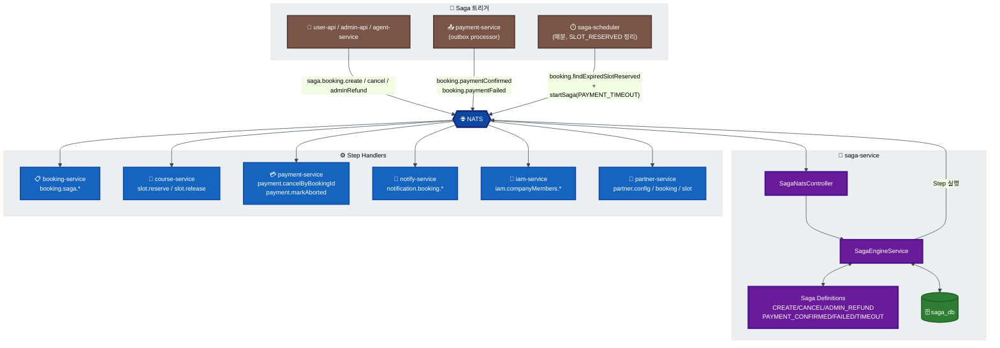
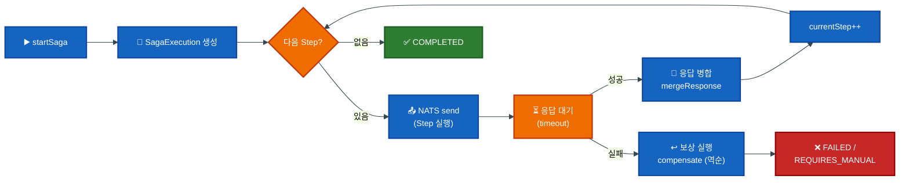
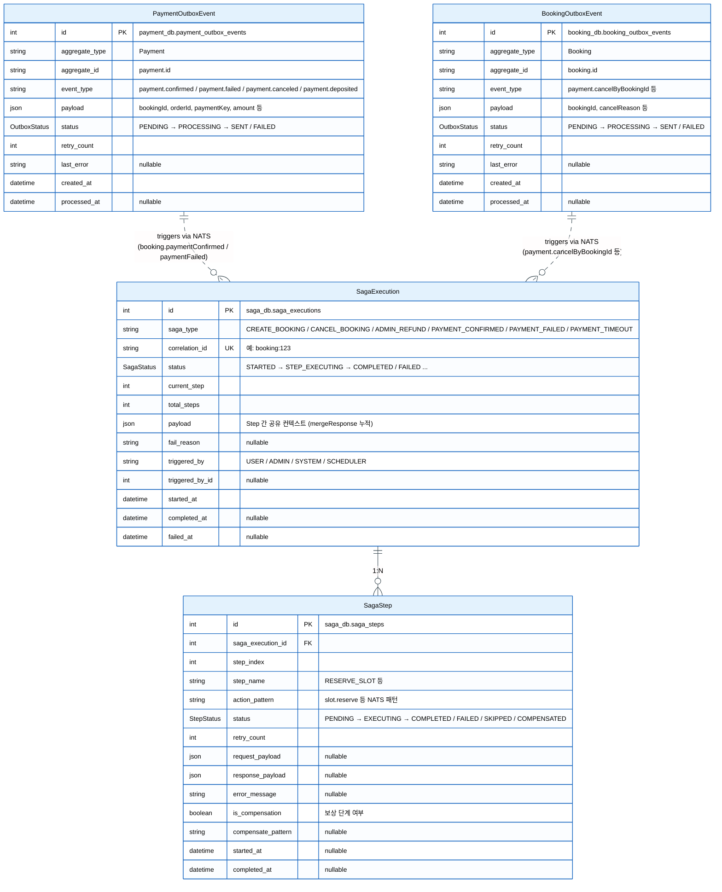
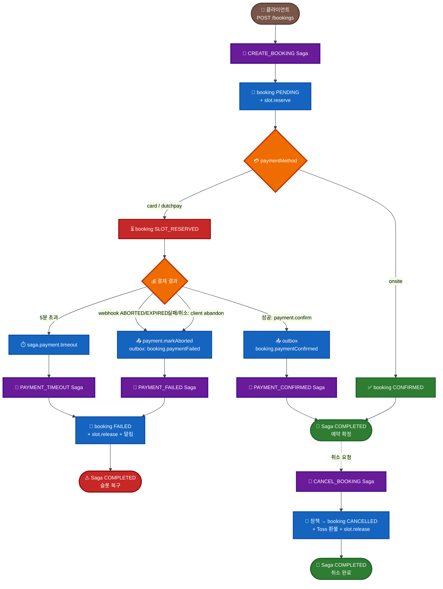
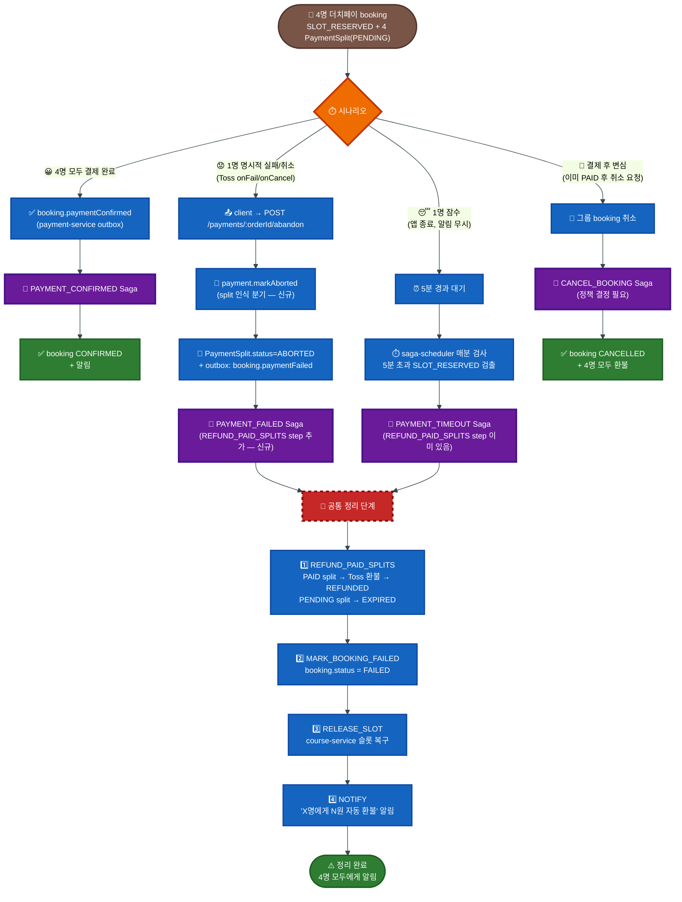

# Saga 오케스트레이션 워크플로우

> 버전: 3.3
> 최종 수정: 2026-05-03

## 목차

1. [개요](#1-개요)
2. [전체 그림](#2-전체-그림)
3. [데이터 모델](#3-데이터-모델)
4. [Saga 정의](#4-saga-정의)
5. [라이프사이클](#5-라이프사이클)
6. [결제 실패 처리](#6-결제-실패-처리)
7. [NATS 패턴](#7-nats-패턴)
8. [응답 형식](#8-응답-형식)
9. [알려진 결함 및 작업 계획](#9-알려진-결함-및-작업-계획)

---

## 1. 개요

`saga-service`가 중앙 오케스트레이터로 분산 트랜잭션을 처리하고, 각 마이크로서비스는 Saga Step 핸들러만 노출합니다.

| 서비스 | 역할 |
|--------|------|
| saga-service | Saga 오케스트레이션 / Step 실행 / 보상 / 이력 |
| booking-service | `booking.saga.*` Step 핸들러 |
| course-service | `slot.reserve` / `slot.release` |
| payment-service | `payment.cancelByBookingId` / `payment.markAborted` / outbox 발행 |
| notify-service | `notification.booking.*` |
| iam-service | `iam.companyMembers.addByBooking` |
| partner-service | `partner.config.*` / `partner.booking.*` |
| job-service | iam(deletion-reminder/executor), partner-sync 등 도메인 Cron (booking-payment-timeout은 saga-scheduler로 이전됨) |

**기술 스택**: NATS (Request-Reply), Saga Orchestration, Transactional Outbox, Compensation, Prisma.

---

## 2. 전체 그림



### 2.1 Saga Engine 처리 흐름



- **Step 실행**: NATS Request-Reply (`send`)로 Step 대상 서비스 호출
- **응답 병합**: Step 응답을 Saga payload에 누적 (`mergeResponse`)
- **조건부 Step**: `condition`으로 실행 여부 결정 (예: onsite는 알림 Skip)
- **Optional Step**: `optional: true`면 실패해도 Saga 계속 진행

---

## 3. 데이터 모델

saga 처리에는 세 DB의 테이블이 관여합니다:

- **`saga_db`** (saga-service 소유): `SagaExecution`, `SagaStep` — saga 실행/이력
- **`payment_db`** (payment-service 소유): `payment_outbox_events` — 결제 이벤트 트리거 소스 (자주 사용)
- **`booking_db`** (booking-service 소유): `booking_outbox_events` — booking 도메인 이벤트 트리거 소스 (그룹 취소 등 희귀 케이스)

직접적인 FK 관계는 없으며, 각 outbox가 NATS로 이벤트를 publish하면 saga-service가 수신하여 새로운 `SagaExecution` 레코드를 생성하는 간접 연결입니다.

### 3.1 ERD



> 점선 관계(`||..o{`)는 직접 FK가 아닌 **NATS 메시지 경유 트리거**를 의미합니다. payment-service의 outbox processor가 5초 주기로 PENDING 이벤트를 NATS publish → saga-service가 수신 → 새 SagaExecution 생성.

### 3.2 SagaExecution

| 컬럼 | 타입 | 설명 |
|------|------|------|
| `id` | Int PK | autoincrement |
| `saga_type` | String | `CREATE_BOOKING` 등 saga 정의 이름 |
| `correlation_id` | String UK | 외부 식별자. 형식 예: `booking:123`, `payment-confirmed:ORD-123`. 중복 saga 방지 |
| `status` | SagaStatus | 진행 상태 (아래 enum) |
| `current_step` | Int | 현재 실행 중/완료 step index (0-base) |
| `total_steps` | Int | 정의의 전체 step 수 |
| `payload` | Json | step 간 공유 컨텍스트. `mergeResponse`로 누적되어 다음 step의 `buildRequest` 입력으로 전달 |
| `fail_reason` | String? | 실패 시 사유 |
| `triggered_by` | String? | `USER` / `ADMIN` / `SYSTEM` (scheduler/outbox) |
| `triggered_by_id` | Int? | userId / adminId 등 |
| `started_at` | DateTime | 자동 (CURRENT_TIMESTAMP) |
| `completed_at` | DateTime? | COMPLETED 전이 시각 |
| `failed_at` | DateTime? | FAILED 전이 시각 |

**Index**: `(saga_type, status)`, `(correlation_id)` UK, `(status, started_at)`

### 3.3 SagaStep

| 컬럼 | 타입 | 설명 |
|------|------|------|
| `id` | Int PK | autoincrement |
| `saga_execution_id` | Int FK | `SagaExecution.id` (cascade delete) |
| `step_index` | Int | 0-base step 위치 |
| `step_name` | String | `RESERVE_SLOT` 등 |
| `action_pattern` | String | `slot.reserve` 등 NATS 패턴 |
| `status` | StepStatus | 진행 상태 (아래 enum) |
| `retry_count` | Int | 재시도 횟수 (default 0) |
| `request_payload` | Json? | step 호출 시 전달한 payload |
| `response_payload` | Json? | step 응답 본문 (mergeResponse 입력) |
| `error_message` | String? | 실패 사유 |
| `is_compensation` | Boolean | true면 보상 단계 |
| `compensate_pattern` | String? | 정의에 등록된 보상 NATS 패턴 |
| `started_at` | DateTime? | step 실행 시작 |
| `completed_at` | DateTime? | step 종료 |

**Index**: `(saga_execution_id, step_index)`, `(status)`

### 3.4 Enums

**SagaStatus**

| 값 | 의미 |
|----|------|
| `STARTED` | Saga 시작됨 |
| `STEP_EXECUTING` | 현재 step 실행 중 |
| `STEP_COMPLETED` | 직전 step 완료, 다음 step 대기 |
| `COMPLETED` | 모든 step 완료 |
| `STEP_FAILED` | 어느 step이 실패함 (보상 시작 직전) |
| `COMPENSATING` | 보상 진행 중 |
| `COMPENSATION_COMPLETED` | 보상 완료 |
| `COMPENSATION_FAILED` | 보상 실패 → REQUIRES_MANUAL로 전이 |
| `FAILED` | 보상 완료된 실패 (정상 종료) |
| `REQUIRES_MANUAL` | 보상도 실패하여 수동 개입 필요 |

**StepStatus**

| 값 | 의미 |
|----|------|
| `PENDING` | 실행 대기 |
| `EXECUTING` | 실행 중 |
| `COMPLETED` | 정상 완료 |
| `FAILED` | 실패 (saga 보상 트리거) |
| `COMPENSATED` | 보상 완료 |
| `SKIPPED` | `condition` 미충족으로 건너뜀 |

**OutboxStatus** (payment_db)

| 값 | 의미 |
|----|------|
| `PENDING` | 발행 대기 |
| `PROCESSING` | 발행 시도 중 |
| `SENT` | NATS publish 성공 |
| `FAILED` | 5회 재시도 모두 실패 → 운영자 수동 처리 (`retryFailedEvents()` API) |

### 3.5 데이터 보존 / 정리

| 작업 | 주체 | 주기 | 동작 | DB |
|------|------|------|------|----|
| 만료 saga FAILED 처리 | saga-scheduler | 매분 | STARTED/STEP_EXECUTING 5분 초과 → FAILED | saga_db |
| 오래된 saga 삭제 | saga-scheduler | 매일 자정 | COMPLETED/FAILED + 30일 경과 행 DELETE | saga_db |
| SLOT_RESERVED 만료 | saga-scheduler | 매분 | 5분 초과 booking에 PAYMENT_TIMEOUT Saga 시작 | booking_db (조회) |
| Outbox 이벤트 발행 | payment-service OutboxProcessor | 5초 | PENDING 이벤트 NATS publish, 최대 5회 재시도 | payment_db |

**설정 위치**:
- `services/saga-service/src/common/constants/nats.constants.ts` — `SAGA_CONFIG.SAGA_TIMEOUT_MS` (5분), `RETENTION_DAYS` (30일)
- `services/payment-service/src/payment/service/outbox-processor.service.ts` — `maxRetries=5`, `batchSize=10`, `sendTimeoutMs=10000`

**원본 스키마**:
- saga 측: `services/saga-service/prisma/schema.prisma`
- payment outbox: `services/payment-service/prisma/schema.prisma` (`PaymentOutboxEvent` 모델 → `payment_outbox_events`)
- booking outbox: `services/booking-service/prisma/schema.prisma` (`OutboxEvent` 모델 → `booking_outbox_events`)

---

## 4. Saga 정의

### 4.1 Saga 목록

| Saga | 트리거 | 설명 |
|------|--------|------|
| `CREATE_BOOKING` | `saga.booking.create` | 예약 생성 → 슬롯 예약 → 상태 갱신 → 알림 |
| `CANCEL_BOOKING` | `saga.booking.cancel` | 취소 정책 → 환불 → 슬롯 복구 → 알림 |
| `ADMIN_REFUND` | `saga.booking.adminRefund` | 환불 정책 → 취소 → 환불 → 슬롯 복구 → 알림 |
| `PAYMENT_CONFIRMED` | `booking.paymentConfirmed` | 결제 승인 후 booking CONFIRMED + 알림 |
| `PAYMENT_FAILED` 신규 | `booking.paymentFailed` | 결제 실패/취소 시 booking FAILED + 슬롯 복구 |
| `PAYMENT_TIMEOUT` | saga-scheduler | SLOT_RESERVED 5분 초과 시 동일 정리 |

### 4.2 CREATE_BOOKING

| Step | Action | Compensate | Target | 조건 |
|------|--------|-----------|--------|------|
| 1. CREATE_BOOKING_RECORD | `booking.saga.create` | `booking.saga.markFailed` | booking | - |
| 2. CHECK_PARTNER | `partner.config.checkByClub` | - | partner | clubId 존재 |
| 3. VERIFY_EXTERNAL | `partner.slot.verifyAvailability` | - | partner | 파트너 골프장 |
| 4. RESERVE_SLOT | `slot.reserve` | `slot.release` | course | - |
| 5. UPDATE_BOOKING_STATUS | `booking.saga.slotReserved` | - | booking | - |
| 6. NOTIFY_EXTERNAL | `partner.booking.notifyCreated` | `partner.booking.notifyCancelled` | partner | 파트너 + CONFIRMED |
| 7. SEND_CONFIRMATION | `notification.booking.confirmed` | - | notify | CONFIRMED (optional) |
| 8. REGISTER_COMPANY_MEMBER | `iam.companyMembers.addByBooking` | - | iam | CONFIRMED + userId (optional) |

Step 5 결과: `onsite` → CONFIRMED → 6~8 실행. `card`/`dutchpay` → SLOT_RESERVED → 6~8 SKIP, 결제 대기.

### 4.3 CANCEL_BOOKING

| Step | Action | Compensate | Target | 조건 |
|------|--------|-----------|--------|------|
| 1. CHECK_CANCELLATION_POLICY | `policy.cancellation.resolve` | - | booking | - |
| 2. CALCULATE_REFUND | `policy.refund.resolve` | - | booking | - |
| 3. CANCEL_BOOKING_RECORD | `booking.saga.cancel` | `booking.saga.restoreStatus` | booking | - |
| 4. CANCEL_PAYMENT | `payment.cancelByBookingId` | - | payment | non-onsite |
| 5. RELEASE_SLOT | `slot.release` | - | course | - |
| 6. CHECK_PARTNER | `partner.config.checkByClub` | - | partner | clubId 존재 |
| 7. NOTIFY_EXTERNAL_CANCEL | `partner.booking.notifyCancelled` | - | partner | 파트너 (optional) |
| 8. SEND_CANCELLATION_NOTICE | `notification.booking.cancelled` | - | notify | optional |

### 4.4 ADMIN_REFUND

| Step | Action | Compensate | Target |
|------|--------|-----------|--------|
| 1. CHECK_REFUND_POLICY | `policy.refund.resolve` | - | booking |
| 2. CANCEL_BOOKING_RECORD | `booking.saga.adminCancel` | `booking.saga.restoreStatus` | booking |
| 3. PROCESS_REFUND | `payment.cancelByBookingId` | - | payment |
| 4. RELEASE_SLOT | `slot.release` | - | course |
| 5. FINALIZE_BOOKING | `booking.saga.finalizeCancelled` | - | booking |
| 6. CHECK_PARTNER | `partner.config.checkByClub` | - | partner |
| 7. NOTIFY_EXTERNAL_CANCEL | `partner.booking.notifyCancelled` | - | partner |
| 8. SEND_REFUND_NOTICE | `notification.booking.refundCompleted` | - | notify |

### 4.5 PAYMENT_CONFIRMED

| Step | Action | Target |
|------|--------|--------|
| 1. CONFIRM_BOOKING | `booking.saga.confirmPayment` | booking |
| 2. SEND_CONFIRMATION | `notification.booking.confirmed` (optional) | notify |
| 3. REGISTER_COMPANY_MEMBER | `iam.companyMembers.addByBooking` (optional) | iam |

### 4.6 PAYMENT_FAILED / PAYMENT_TIMEOUT

| 항목 | PAYMENT_FAILED | PAYMENT_TIMEOUT |
|------|----------------|-----------------|
| 트리거 | outbox 이벤트 (즉시) | saga-scheduler (1분 주기, 5분 초과) |
| 트리거 패턴 | `booking.paymentFailed` | scheduler가 직접 startSaga |

**PAYMENT_FAILED Saga**

| Step | Action | Target | 조건 |
|------|--------|--------|------|
| 1. MARK_BOOKING_FAILED | `booking.saga.paymentTimeout` | booking | - |
| 2. RELEASE_SLOT | `slot.release` | course | - |
| 3. NOTIFY_FAILURE | `notification.booking.paymentFailed` | notify | optional |

**PAYMENT_TIMEOUT Saga** (분할결제 환불 step 포함)

| Step | Action | Target | 조건 |
|------|--------|--------|------|
| 1. REFUND_PAID_SPLITS | `payment.refundPaidSplits` | payment | `paymentMethod === 'dutchpay'` |
| 2. MARK_BOOKING_FAILED | `booking.saga.paymentTimeout` | booking | - |
| 3. RELEASE_SLOT | `slot.release` | course | - |
| 4. NOTIFY_TIMEOUT | `notification.booking.paymentTimeout` | notify | optional |

Step 1은 더치페이일 때만 실행. PAID 상태인 PaymentSplit을 모두 Toss 환불 → REFUNDED, PENDING split은 EXPIRED로 변경. 환불 1건이라도 실패 시 saga가 REQUIRES_MANUAL로 전이되어 운영자 개입.

---

## 5. 라이프사이클



`SLOT_RESERVED` → `FAILED` 정리 경로 4종(클라이언트 abandon / Toss webhook / 사용자 취소 / 5분 타임아웃)은 모두 동일한 정리 핸들러(`booking.saga.paymentTimeout` + `slot.release`)를 재사용합니다.

---

## 6. 결제 실패 처리

### 6.1 흐름

```
Client (Web/iOS/Android)
  ↓ POST /api/user/payments/:orderId/abandon
  ↓ Body: { reason: 'failed'|'cancelled', errorCode?, errorMessage? }
user-api (BFF)
  ↓ NATS: payment.markAborted
payment-service (단일 트랜잭션)
  ↓ UPDATE payments SET status='ABORTED'
  ↓ INSERT payment_outbox_events (event_type='booking.paymentFailed', PENDING)
  ↓ 응답 200 OK
outbox processor (payment-service worker)
  ↓ NATS publish: booking.paymentFailed
saga-service
  ↓ PAYMENT_FAILED Saga
booking-service: booking.saga.paymentTimeout → status=FAILED
course-service:  slot.release
notify-service:  notification.booking.paymentFailed (optional)
```

### 6.2 BFF 엔드포인트 (신규)

```
POST /api/user/payments/:orderId/abandon
Authorization: Bearer <token>

Request:
  { reason: 'failed' | 'cancelled', errorCode?: string, errorMessage?: string }

Response:
  { success: true, data: BookingResponseDto, saga: SagaMeta }
```

### 6.3 클라이언트 호출 지점

| 플랫폼 | 호출 트리거 | 위치 |
|--------|------------|------|
| Web | Toss `failUrl` 리다이렉트 (errorCode/message 수신) | `BookingCompletePage.tsx` Scenario 2 |
| iOS | `TossPaymentView.onFail` / `onCancel` | `BookingFormView.handlePaymentResult` |
| Android | `handlePaymentFailure` / `handlePaymentCancelled` | `BookingFormViewModel` |

세 플랫폼 모두 동일한 BFF 엔드포인트(`POST /payments/:orderId/abandon`)를 호출합니다.

### 6.4 멱등성

- `payment.markAborted`는 멱등 (이미 ABORTED면 재발행 없이 성공 응답)
- saga correlationId(`payment-failed:{orderId}`)로 중복 saga 방지
- 클라이언트는 네트워크 재시도 안전

### 6.5 더치페이(분할결제) 예외 처리 흐름

분할결제는 단일결제보다 시나리오가 다양합니다. 4명 더치페이 기준 전체 흐름:



> **빨간 점선** (`Cleanup`): 공통 정리 4단계. PAYMENT_FAILED와 PAYMENT_TIMEOUT 두 saga가 동일한 step을 공유하여 중복 코드 제거.

#### 시나리오별 처리 시점 비교

| 시나리오 | 트리거 시점 | Saga | 처리 지연 |
|---------|------------|------|----------|
| 1. 명시적 실패/취소 | client abandon API 즉시 | PAYMENT_FAILED | ~3초 (outbox processor) |
| 2. 잠수 (미응답) | saga-scheduler 매분 검사 | PAYMENT_TIMEOUT | 5~6분 |
| 3. 모두 완료 | 마지막 split confirm 즉시 | PAYMENT_CONFIRMED | ~3초 |
| 4. 결제 후 변심 | 사용자 명시적 cancel 요청 | CANCEL_BOOKING | 즉시 |

#### 현재 구현 상태 vs 신규 작업

| 항목 | 현재 상태 | 필요 작업 |
|------|----------|----------|
| PAYMENT_TIMEOUT의 REFUND_PAID_SPLITS | ✅ 구현됨 | - |
| PAYMENT_FAILED의 REFUND_PAID_SPLITS | ❌ 미구현 | **신규 step 추가 필요** |
| payment.markAborted의 split 분기 | ❌ 단일결제만 | **split 인식 로직 추가** |
| notify-service의 split 메시지 | ⚠️ paymentTimeout만 dutchpay 분기 | paymentFailed에도 동일 분기 |
| 시나리오 4 (결제 후 변심) 정책 | ❌ 미정의 | **정책 결정 필요** (UX 측) |
| Toss webhook 자동 동기화 | ❌ 미연동 | webhook 라우트 등록 |

#### 핵심 결정 포인트 (사용자 협의)

```
[Q1] 1명 명시적 실패 시 즉시 booking 정리 vs 5분 대기?
  - 즉시 정리 (제안): UX 명확, 다른 멤버 헛수고 방지
  - 5분 대기: 실패자가 재시도 기회 (단 PaymentSplit이 ABORTED라 새 split 생성 필요)
  → 권장: 즉시 정리 (PAYMENT_FAILED Saga 즉시 실행)

[Q2] 시나리오 4 정책 (이미 PAID 후 그룹 취소)
  - 옵션 a) 환불 거절 (5분 안 모두 결제 정책)
  - 옵션 b) 그룹 취소 허용 (CANCEL_BOOKING saga로 4명 모두 환불)
  → 비즈니스 정책 결정 필요

[Q3] PaymentSplit 재결제 허용?
  - ABORTED/EXPIRED 후 같은 멤버가 다시 결제 시도 가능?
  - 권장: 불허 (booking 자체를 새로 만들도록)
```

---

### 6.6 Outbox 재시도

- payment_outbox_events 발행 실패 시 지수 백오프 (1s → 2s → 4s, 최대 5회)
- 최종 실패: `status='FAILED'`, `last_error` 기록 → 운영자 수동 처리

---

## 7. NATS 패턴

### 7.1 Saga 트리거 (saga-service Inbound)

| 패턴 | 발신 | 비고 |
|------|------|------|
| `saga.booking.create` | user-api, agent-service | 동기 응답 |
| `saga.booking.cancel` | user-api, admin-api | 동기 응답 |
| `saga.booking.adminRefund` | admin-api | 동기 응답 |
| `booking.paymentConfirmed` | payment-service (outbox) | 비동기 |
| `booking.paymentFailed` 신규 | payment-service (outbox) | 비동기 |
| `PAYMENT_TIMEOUT (saga internal)` | saga-scheduler `startSaga` (1분 주기) | 백그라운드 |
| `booking.findExpiredSlotReserved` | saga-scheduler 만료 후보 조회 | 백그라운드 |

### 7.2 결제 실패 보조 패턴

| 패턴 | 발신 | 설명 |
|------|------|------|
| `payment.markAborted` | user-api → payment-service | payment.status=ABORTED + outbox INSERT |

### 7.3 Step 핸들러 (saga-service Outbound)

| 패턴 | 대상 |
|------|------|
| `booking.saga.create` / `markFailed` / `slotReserved` / `confirmPayment` / `cancel` / `adminCancel` / `restoreStatus` / `finalizeCancelled` / `paymentTimeout` | booking-service |
| `slot.reserve` / `slot.release` | course-service |
| `payment.cancelByBookingId` | payment-service |
| `payment.refundPaidSplits` | payment-service (분할결제 일괄 환불) |
| `partner.config.checkByClub` / `partner.slot.verifyAvailability` / `partner.booking.notifyCreated` / `partner.booking.notifyCancelled` | partner-service |
| `notification.booking.*` (confirmed / cancelled / refundCompleted / paymentTimeout / paymentFailed) | notify-service |
| `iam.companyMembers.addByBooking` | iam-service |

### 7.4 Saga 관리 (Admin)

| 패턴 | 설명 |
|------|------|
| `saga.list` / `saga.get` / `saga.stats` | 조회 |
| `saga.retry` | 실패 saga 재시도 |
| `saga.resolve` | REQUIRES_MANUAL 수동 해결 |

---

## 8. 응답 형식

BFF가 saga를 경유한 API 응답은 표준 도메인 shape에 `saga` 메타데이터를 부가합니다.

```json
{
  "success": true,
  "data": { /* 표준 BookingResponseDto */ },
  "saga": {
    "executionId": 123,
    "status": "COMPLETED",
    "failReason": null,
    "duplicate": false
  }
}
```

실패 시 (HTTP 400):
```json
{
  "success": false,
  "error": { "code": "SAGA_FAILED", "message": "..." },
  "saga": { "executionId": 123, "status": "FAILED", "failReason": "..." }
}
```

**적용 엔드포인트**: `POST /bookings`, `DELETE /bookings/:id`, `POST /payments/:orderId/abandon`, admin booking/refund.

**클라이언트**: `saga` 필드는 옵셔널이며 진행률 표시·디버깅에 활용. 도메인 파싱은 `data`만 사용.

구현: `services/{user,admin}-api/src/booking/booking.service.ts`의 `resolveSagaResponse()`.

---

## 9. 알려진 결함 및 작업 계획

### 9.1 결함 및 해결 현황 (2026-04-26 기준)

| # | 결함 | 영향 | 우선순위 | 상태 |
|---|-----|------|---------|------|
| 1 | payment.confirm catch가 outbox 미발행 → booking 미동기화 | SLOT_RESERVED 영구 점유 | P0 | ✅ 해결 (markPaymentAborted) |
| 2 | 클라이언트 3종 결제 실패 시 백엔드 통지 부재 | 결함 #1 트리거 | P0 | ✅ 해결 (Web/iOS/Android) |
| 3 | `payment.markAborted` 엔드포인트 미존재 | #2 해결 차단 | P0 | ✅ 해결 |
| 4 | PAYMENT_FAILED Saga 미정의 | #2 해결 차단 | P0 | ✅ 해결 |
| 5 | preparePayment 후 미진행 leak (READY 무한 잔존) | SLOT_RESERVED 영구 | P0 | 🟡 부분 해결 (saga-scheduler 5분 후 자동 정리) |
| 6 | `expireSlotReservedBookings`가 saga 우회 → `slot.release` 미호출 | course-service 슬롯 미복구 | P1 | ✅ 해결 (job-service `booking-payment-timeout` cron 제거 + booking-service 우회 경로 제거) |
| 7 | saga-scheduler 미구현 (1차 방어 부재) | job-service Cron만 존재 | P1 | ✅ 해결 |
| 8 | CREATE_BOOKING Step 4 compensate 부재 | 실패 시 booking PENDING 잔존 | P1 | ⏳ 미해결 |
| 9 | Toss webhook(ABORTED/EXPIRED) 라우트 미연동 | 외부 상태 미반영 | P1 | ⏳ 미해결 |
| 10 | payment-service outbox processor 동작 검증 필요 | confirmed 이벤트 누락 가능 | P1 | ✅ 검증 (5초 주기, retry 5회 동작 확인) |
| 11 | split payment에 saga 미적용 | 분할 결제 정합성 부재 | P2 | ✅ 해결 (PAYMENT_TIMEOUT Saga에 REFUND_PAID_SPLITS step 추가, 더치페이 일부 결제 시 자동 환불) |

### 9.2 작업 계획

| Step | 영역 | 내용 | 상태 |
|------|------|------|------|
| 1 | payment-service | `payment.markAborted` 추가 (트랜잭션 + outbox INSERT), confirmPayment catch에서도 outbox 발행, outbox processor 매핑 추가 | ✅ 완료 (2026-04-26) |
| 2 | saga-service | PAYMENT_FAILED Saga 정의, registry 등록, `booking.paymentFailed` 트리거 | ✅ 완료 |
| 3 | user-api | `POST /api/user/payments/:orderId/abandon` 엔드포인트 + NATS publish | ✅ 완료 |
| 4 | notify-service | `notification.booking.paymentFailed` 핸들러 (MessagePattern) | ✅ 완료 |
| 5 | Web | `paymentApi.abandon()` + BookingCompletePage Scenario 2 호출 | ✅ 완료 |
| 6 | iOS | `PaymentService.abandonPayment()` + BookingFormView 호출 (paymentPrepareData.orderId 사용) | ✅ 완료 |
| 7 | Android | `PaymentApi.abandonPayment()` + BookingFormViewModel 호출 | ✅ 완료 |
| 8 | P1 | saga-scheduler `expireSlotReservedBookings` 추가 (1분 주기) + `booking.findExpiredSlotReserved` MessagePattern 추가 + job-service `booking-payment-timeout` cron 및 booking-service saga 우회 경로 제거 | ✅ 완료 |
| 9 | 검증 | 통합 테스트, 클라이언트 3종 동작, DB 정합성 | 미시작 (배포 후 진행) |

### 9.3 잔여 P1 작업

P0 완료 후 별도 작업 항목:
- CREATE_BOOKING Step 4 (UPDATE_BOOKING_STATUS)에 `compensate: 'booking.saga.markFailed'` 추가
- Toss webhook 라우트 등록 + ABORTED/EXPIRED 수신 시 `payment.markAborted` 트리거
- preparePayment(READY) 무한 잔존 방지 (별도 만료 정책)

### 9.4 검증 시 확인 항목

- 결제 실패 즉시 `bookings.status=FAILED`
- `game_time_slot_cache` 및 `game_time_slots` 양쪽 `booked_players` 복구
- `payment_outbox_events.status=PROCESSED`
- saga_executions에 PAYMENT_FAILED 1건 COMPLETED
- 사용자 알림 수신

---

**Last Updated**: 2026-05-03
